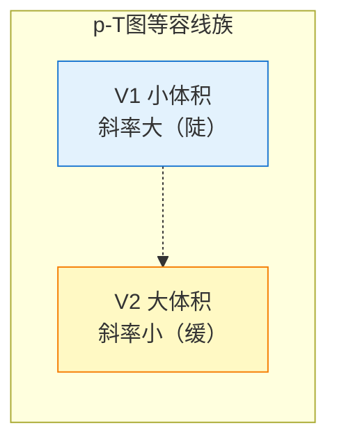

# 查理定律与盖-吕萨克定律

> [!abstract] 概览
> 本节是气体三大实验定律的第二、三条，与 [[02-玻意耳定律]] 共同构成完整体系。==查理定律==描述等容过程中压强与热力学温度成正比 $p/T=C$；==盖-吕萨克定律==描述等压过程中体积与热力学温度成正比 $V/T=C$。本节系统讲解：等容过程与等压过程的概念、两定律的内容与公式、绝对零度的物理意义（$-273.15\,^{\circ}\text{C}$，分子热运动停止）、热力学温标与摄氏温标的关系、查理定律的"摄氏形式" $p=p_0(1+t/273)$、两定律的微观解释（查理：体积不变分子密度不变，温度升高分子平均动能变大碰撞力变大；盖-吕萨克：压强不变碰撞力与密度反比变化，温度升高密度变小体积变大）。==两个定律对比要清楚==，绝对零度是不可达到的极限（热力学第三定律）。本节为 [[04-理想气体状态方程]] 提供另两个特例。

## 核心概念

### 一、等容过程与查理定律

#### 1. 等容过程

**等容过程**：气体在状态变化过程中==体积保持不变==的过程，即 $\Delta V=0$，初末状态 $V_1=V_2$。

实现方式：将气体置于刚性容器中（体积固定），通过加热或冷却改变温度与压强。

#### 2. 查理定律的内容

**查理定律**：==一定质量的某种气体，在体积不变的情况下，压强 $p$ 与热力学温度 $T$ 成正比==。

$$
\boxed{\,p \propto T\;\;\text{或}\;\;\dfrac{p}{T}=C\,}
$$

或用初末状态表达：

$$
\boxed{\,\dfrac{p_1}{T_1}=\dfrac{p_2}{T_2}\,}
$$

> [!warning] 温度必须用热力学温标 $T$（K）
> 查理定律中温度必须代入==热力学温度== $T=t+273.15\,\text{K}$，==不能用摄氏温度== $t$。若用 $t$，则 $p/t$ 在 $t=0$ 时无意义，且 $p$ 与 $t$ 不是正比关系而是线性关系 $p=p_0(1+t/273)$（见下文推导）。这是高考最常考的陷阱之一。

#### 3. 查理定律的"摄氏形式"

由 $p/T=C$，设 $0\,^{\circ}\text{C}$ 时气体压强为 $p_0$（此时 $T_0=273\,\text{K}$），则任意摄氏温度 $t$ 时：

$$
\dfrac{p}{T}=\dfrac{p_0}{T_0}\;\Rightarrow\;p=p_0\cdot\dfrac{T}{T_0}=p_0\cdot\dfrac{t+273}{273}
$$

即：

$$
\boxed{\,p=p_0\left(1+\dfrac{t}{273}\right)\,}
$$

这是查理定律的"摄氏形式"——==压强与摄氏温度成线性关系，而非正比关系==。当 $t=-273\,^{\circ}\text{C}$ 时 $p=0$，对应绝对零度。

> [!note] "推论"的物理意义
> 这一公式历史上由查理（J. Charles）于 1787 年实验发现，盖-吕萨克（J. Gay-Lussac）于 1802 年精确发表。从这一"线性外推"得到"绝对零度"的概念——所有气体在 $-273\,^{\circ}\text{C}$ 时压强为零。但实际气体在到达该温度前已液化甚至固化，故绝对零度是==外推的理论极限==，不可达到。

### 二、等压过程与盖-吕萨克定律

#### 1. 等压过程

**等压过程**：气体在状态变化过程中==压强保持不变==的过程，即 $\Delta p=0$，初末状态 $p_1=p_2$。

实现方式：用自由活塞（无摩擦、可自由移动）封闭气体，活塞上方受恒定大气压作用，气体压强始终等于大气压。

#### 2. 盖-吕萨克定律的内容

**盖-吕萨克定律**：==一定质量的某种气体，在压强不变的情况下，体积 $V$ 与热力学温度 $T$ 成正比==。

$$
\boxed{\,V \propto T\;\;\text{或}\;\;\dfrac{V}{T}=C\,}
$$

或用初末状态表达：

$$
\boxed{\,\dfrac{V_1}{T_1}=\dfrac{V_2}{T_2}\,}
$$

同样，温度必须用==热力学温度== $T$（K）。

#### 3. 盖-吕萨克定律的"摄氏形式"

类比查理定律，设 $0\,^{\circ}\text{C}$ 时气体体积为 $V_0$，则：

$$
\boxed{\,V=V_0\left(1+\dfrac{t}{273}\right)\,}
$$

这是盖-吕萨克定律的"摄氏形式"——体积与摄氏温度成线性关系。

### 三、两定律的对比

| 比较项 | 查理定律 | 盖-吕萨克定律 |
| --- | --- | --- |
| 过程类型 | 等容过程 | 等压过程 |
| 不变量 | 体积 $V$ | 压强 $p$ |
| 正比关系 | $p\propto T$ | $V\propto T$ |
| 公式形式 | $\dfrac{p}{T}=C$ 或 $\dfrac{p_1}{T_1}=\dfrac{p_2}{T_2}$ | $\dfrac{V}{T}=C$ 或 $\dfrac{V_1}{T_1}=\dfrac{V_2}{T_2}$ |
| 摄氏形式 | $p=p_0(1+t/273)$ | $V=V_0(1+t/273)$ |
| 图像（$p$-$T$ 或 $V$-$T$） | 过原点的直线 | 过原点的直线 |
| 微观本质 | $n$ 不变，$\bar{E}_k$ 变 → $p$ 变 | $p$ 不变，$\bar{E}_k$ 与 $n$ 反比变化 → $V$ 变 |
| 实验者 | 查理（1787） | 盖-吕萨克（1802） |

### 四、绝对零度

**绝对零度**：$T=0\,\text{K}$，对应 $t=-273.15\,^{\circ}\text{C}$，是==分子热运动停止==的理论下限。

由查理定律 $p/T=C$ 外推，当 $T\to 0$ 时 $p\to 0$；由盖-吕萨克定律 $V/T=C$ 外推，当 $T\to 0$ 时 $V\to 0$。这两条外推都指向同一温度——绝对零度。

> [!warning] 绝对零度不可达到
> 热力学第三定律指出：==绝对零度不可能通过有限步骤达到==。这是因为：
> 1. 实际气体在到达绝对零度前已液化或固化，气体定律不再适用；
> 2. 任何冷却方法都需要温差驱动热传递，越接近绝对零度温差越小，冷却越困难；
> 3. 量子力学指出，即使绝对零度，粒子仍有"零点能"（测不准原理），完全静止不可能。
>
> 目前实验室已达最低温度约为 $10^{-10}\,\text{K}$（玻色-爱因斯坦凝聚实验），但仍非绝对零度。

## 推导与原理

### 一、查理定律的微观解释

由 [[01-气体的状态参量]] 中压强公式 $p=nkT$：

等容过程 $V$ 不变，气体质量不变即分子总数 $N$ 不变，故分子数密度 $n=N/V$ ==不变==；$k$ 是常数。故：

$$
p = n k T \propto T
$$

#### 物理图景

- 体积不变 → 分子数密度 $n$ 不变 → 单位时间单位面积碰撞==次数==不变；
- 温度升高 → 分子平均动能 $\bar{E}_k=\dfrac{3}{2}kT$ 变大 → 单次碰撞冲量变大 → 单位时间单位面积碰撞==总冲量==变大；
- 综合效果：压强 $p$ 随温度 $T$ 正比增大。

> [!example] 类比：弹珠速度变大
> 容器内弹珠数量不变（密度不变），但每个弹珠速度变大（温度升高）。单位时间内撞到器壁的弹珠数虽然不变，但每次撞击力变大，故器壁承受的总压力变大——这就是 $p\propto T$ 的微观图景。

### 二、盖-吕萨克定律的微观解释

由 $p=nkT$ 与 $n=N/V$：

$$
p = \dfrac{N}{V} k T \;\Rightarrow\; V = \dfrac{N k T}{p}
$$

等压过程 $p$ 不变，气体质量不变即 $N$ 不变，$k$ 是常数，故：

$$
V \propto T
$$

#### 物理图景

压强不变意味着"碰撞频率"与"单次碰撞冲量"的乘积不变。温度升高使分子平均动能变大（单次碰撞冲量变大），为保持压强不变，必须==降低分子数密度==（减少单位时间碰撞次数），而 $n=N/V$，$N$ 不变故 $V$ 必须变大，于是 $V\propto T$。

> [!tip] 两定律微观解释的对称美
> 查理定律：固定 $n$（体积不变），$T$ 变 → $p$ 变（==碰撞力变==导致压强变）；
> 盖-吕萨克定律：固定 $p$（压强不变），$T$ 变 → $n$ 反比变 → $V$ 正比变（==碰撞力与密度反比变化==保持压强不变）。
> 二者形式对称、物理图景互补，是气体微观理论的"双子星"。

### 三、两定律与理想气体状态方程的关系

由 [[04-理想气体状态方程]] $PV=nRT$（$n$ 为摩尔数）：

- **等容过程** $V$ 不变，$nR$ 不变，故 $p/T=nR/V=\text{const}$，即查理定律；
- **等压过程** $p$ 不变，$nR$ 不变，故 $V/T=nR/p=\text{const}$，即盖-吕萨克定律。

可见两定律都是==理想气体状态方程在特定条件下的特例==，与 [[02-玻意耳定律]]（等温特例）共同构成"三特例"体系。

### 四、$p$-$T$ 图与 $V$-$T$ 图

#### 1. $p$-$T$ 图上的等容线

$p/T=C$，故等容线是==过原点==的直线（$T$ 为横轴，$p$ 为纵轴）。直线的斜率：

$$
\text{斜率}=\dfrac{p}{T}=\dfrac{nR}{V}
$$

体积 $V$ 越小，斜率越大（直线越陡）。不同体积的等容线是过原点的直线族。

#### 2. $V$-$T$ 图上的等压线

$V/T=C$，故等压线是==过原点==的直线。直线的斜率：

$$
\text{斜率}=\dfrac{V}{T}=\dfrac{nR}{p}
$$

压强 $p$ 越小，斜率越大（直线越陡）。不同压强的等压线是过原点的直线族。

> [!note] 关键图像记忆
> - $p$-$T$ 图上==等容线==过原点（直线），等温线为竖直线，等压线为水平线；
> - $V$-$T$ 图上==等压线==过原点（直线），等温线为竖直线，等容线为竖直线（$V$ 不变）；
> - 这两种图像在 [[05-气体图像]] 中详细对比。

### 五、热力学温标的引入

查理定律与盖-吕萨克定律的"摄氏形式" $p=p_0(1+t/273)$、$V=V_0(1+t/273)$ 都外推到 $t=-273\,^{\circ}\text{C}$ 时为零。这一温度被开尔文（Lord Kelvin）选为新温标的零点，即==热力学温标==（绝对温标）：

$$
T = t + 273.15\,\text{K}
$$

在热力学温标下，查理定律与盖-吕萨克定律都化为简洁的正比形式 $p\propto T$、$V\propto T$。这就是热力学温标的"自然性"——它使气体定律形式最简洁。详见 [[01-气体的状态参量]]。

## 典型实例与类比

### 实例 1：高压锅限压阀

高压锅限压阀通过自身重力控制锅内压强（等压过程）。加热时锅内气体温度升高，体积不变（锅体刚性）则压强增大（查理定律）；当压强超过限压阀设定值时气体冲出限压阀，压强保持恒定，气体体积（含锅内 + 排出部分）随温度升高而增大（盖-吕萨克定律）。

### 实例 2：轮胎气压与温度

夏天长时间行驶后轮胎温度升高，胎内气体体积近似不变（轮胎刚性），由查理定律 $p/T=C$，压强随温度升高而增大——这是夏天轮胎易爆的原因。冬天温度低则胎压降低，需定期补气。

### 实例 3：热气球

热气球下方燃烧器加热球内空气，温度升高。若视为等压过程（球口开放，球内气压等于大气压），由盖-吕萨克定律 $V/T=C$，气体体积增大，部分气体从球口排出，球内气体密度减小，浮力大于重力，气球升空。

### 类比：两定律的"温度计"类比

把查理定律想象成"压强温度计"——固定体积，测压强反映温度；把盖-吕萨克定律想象成"体积温度计"——固定压强，测体积反映温度。这两种"气体温度计"是历史上最早的精确温度计，现代理想气体温度计仍是温度计量的标准。

> [!tip] 记忆口诀
> ==等容查理压强跟温走，$p$ 比 $T$ 等常数；等压盖吕体积随温变，$V$ 比 $T$ 不动摇；绝对零度负二百七十三，分子停动达不到；摄氏形式 $1+t/273$，热力学温标真奇妙。==

## 例题

### 例 1：基础——查理定律计算

**题目**：一定质量的气体在体积不变条件下，$0\,^{\circ}\text{C}$ 时压强为 $p_0=1.0\times 10^5\,\text{Pa}$。求温度升到 $27\,^{\circ}\text{C}$ 时的压强 $p$。

**分析**：等容过程用查理定律 $\dfrac{p_1}{T_1}=\dfrac{p_2}{T_2}$。注意温度必须化为热力学温标。

**解答**：
$$
T_1=273\,\text{K},\quad T_2=27+273=300\,\text{K}
$$
$$
\dfrac{p_0}{T_1}=\dfrac{p}{T_2}\;\Rightarrow\;p=p_0\cdot\dfrac{T_2}{T_1}=1.0\times 10^5\times\dfrac{300}{273}\approx 1.10\times 10^5\,\text{Pa}
$$

**点评**：本题考查温度单位换算——若用摄氏温度直接算 $p=p_0\cdot\dfrac{27}{0}$ 则荒谬。高考中单位换算错误是常见失分点。

### 例 2：中难——盖-吕萨克定律与气泡

**题目**：一定质量的气体在压强不变条件下，$27\,^{\circ}\text{C}$ 时体积为 $V_1=2.0\,\text{L}$。求温度降到 $-3\,^{\circ}\text{C}$ 时的体积 $V_2$。

**分析**：等压过程用盖-吕萨克定律 $\dfrac{V_1}{T_1}=\dfrac{V_2}{T_2}$。

**解答**：
$$
T_1=27+273=300\,\text{K},\quad T_2=-3+273=270\,\text{K}
$$
$$
\dfrac{V_1}{T_1}=\dfrac{V_2}{T_2}\;\Rightarrow\;V_2=V_1\cdot\dfrac{T_2}{T_1}=2.0\times\dfrac{270}{300}=1.8\,\text{L}
$$

**点评**：注意 $-3\,^{\circ}\text{C}$ 化为热力学温度时是 $T=t+273=270\,\text{K}$（不是 $-270\,\text{K}$）。负摄氏温度的热力学温度仍为正值，因为 $T>0$ 恒成立。

### 例 3：进阶——两定律综合

**题目**：一定质量的理想气体从状态 A（$T_A=300\,\text{K}$，$p_A=1.0\,\text{atm}$，$V_A=2.0\,\text{L}$）经历如下过程：A → B 等容升温到 $T_B=600\,\text{K}$；B → C 等压膨胀到 $V_C=8.0\,\text{L}$。求状态 C 的温度 $T_C$ 与压强 $p_C$。

**分析**：
- A → B：等容过程，用查理定律 $\dfrac{p_A}{T_A}=\dfrac{p_B}{T_B}$ 求 $p_B$；
- B → C：等压过程，$p_C=p_B$；用盖-吕萨克定律 $\dfrac{V_B}{T_B}=\dfrac{V_C}{T_C}$ 求 $T_C$，其中 $V_B=V_A=2.0\,\text{L}$（等容过程体积不变）。

**解答**：

A → B（等容）：
$$
p_B=p_A\cdot\dfrac{T_B}{T_A}=1.0\times\dfrac{600}{300}=2.0\,\text{atm}
$$

B → C（等压，$p_C=p_B=2.0\,\text{atm}$）：
$$
\dfrac{V_B}{T_B}=\dfrac{V_C}{T_C}\;\Rightarrow\;T_C=T_B\cdot\dfrac{V_C}{V_B}=600\times\dfrac{8.0}{2.0}=2400\,\text{K}
$$

故 $p_C=2.0\,\text{atm}$，$T_C=2400\,\text{K}$。

**点评**：多过程问题的关键是==理清每一段过程的类型==（等温/等容/等压）并==衔接好中间状态==（前一段的末态是后一段的初态）。本题中 B 是中间状态，$V_B=V_A$ 是等容过程的隐含条件。这类多过程综合题是 [[04-理想气体状态方程]] 与 [[05-气体图像]] 的核心考点。

## 易错提醒

> [!warning] 易错点
> 1. **温度单位**：查理定律、盖-吕萨克定律中温度==必须用热力学温度 $T$（K）==，不能用摄氏温度 $t$。$T=t+273.15$。
> 2. **正比 vs 线性**：$p\propto T$ 是正比（过原点直线）；$p=p_0(1+t/273)$ 是线性但==不过原点==（截距 $p_0$），不要混用。
> 3. **绝对零度的理解**：绝对零度是外推的理论极限，==实际不可达到==；不要认为"气体在绝对零度时压强真为零"——实际气体在到达绝对零度前已液化。
> 4. **过程类型判断**：题目中"体积不变""刚性容器""等容"对应查理定律；"压强不变""自由活塞""等压"对应盖-吕萨克定律。判断错误则公式全错。
> 5. **摄氏温度负值**：$-27\,^{\circ}\text{C}$ 化为热力学温度是 $246\,\text{K}$（不是 $-246\,\text{K}$）。
> 6. **多过程衔接**：分段过程需明确中间状态，前段末态 = 后段初态，注意哪些量保持不变。

> [!note] 概念辨析
> **查理定律 vs 盖-吕萨克定律**：两定律形式对称（$p/T=C$ vs $V/T=C$），但固定变量不同——前者固定 $V$，后者固定 $p$。微观解释也对称——前者碰撞力变（密度不变），后者碰撞力与密度反比变化（保持压强）。
>
> **绝对零度 vs 0℃**：$0\,^{\circ}\text{C}$ 是水的冰点（摄氏温标零点），$-273.15\,^{\circ}\text{C}$ 是绝对零度（热力学温标零点）。前者是人为规定，后者是气体定律外推的理论极限。
>
> **等容过程 vs 等压过程**：等容过程用刚性容器实现，等压过程用自由活塞实现。前者 $V$ 不变，后者 $p$ 不变。

## 与其他知识关联

- 与 [[01-气体的状态参量]] 的关系：状态参量 $T$、$V$、$p$ 是两定律的变量；热力学温标的引入与两定律的外推直接相关。
- 与 [[02-玻意耳定律]] 的关系：玻意耳定律（等温）+ 查理定律（等容）+ 盖-吕萨克定律（等压）= 三大实验定律完整体系。
- 与 [[04-理想气体状态方程]] 的关系：两定律是 $PV=nRT$ 在 $V$ 不变、$p$ 不变时的两个特例，状态方程统一三定律。
- 与 [[05-气体图像]] 的关系：等容线（$p$-$T$ 图上过原点直线）、等压线（$V$-$T$ 图上过原点直线）是气体图像分析的核心内容。
- 与 [[01-分子动理论/04-内能与分子动能]] 的关系：温度的微观本质 $\bar{E}_k=\dfrac{3}{2}kT$ 是两定律微观解释的基础。
- 与 [[03-热力学定律/02-热力学第一定律]] 的关系：等容过程 $W=0$（体积不变不做功），$\Delta U=Q$；等压过程 $W=-p\Delta V$，$\Delta U=Q-p\Delta V$。两过程是热力学第一定律的典型应用。
- 与 [[01-分子动理论/02-分子热运动与布朗运动]] 的关系：绝对零度对应分子热运动停止的理论极限。
- 大学层面延伸：[[热力学]] 中等容、等压过程对应定容热容 $C_V$、定压热容 $C_P$，二者关系 $C_P-C_V=R$（迈耶公式）；[[统计物理]] 中两定律可由配分函数严格推导。
- 返回 [[00-热学总览]]

## 作者的话

> [!quote] 个人理解
> 查理定律与盖-吕萨克定律是气体定律体系中最具"对称美"的一对——一个固定体积看压强随温度变，一个固定压强看体积随温度变，公式形式、图像特征、微观解释都呈现高度对称。这种对称不是偶然，而是==热力学温标的自然性==的体现：在热力学温标下，温度与压强、体积都成正比，说明热力学温度 $T$ 是描述气体状态最"自然"的变量。
>
> 两定律最深刻的意义在于引出了==绝对零度==的概念。从查理定律"摄氏形式" $p=p_0(1+t/273)$ 外推到 $t=-273\,^{\circ}\text{C}$，得到 $p=0$——这意味着存在一个"温度下限"，低于此温度气体压强为负（无物理意义）。这一外推不仅给出了绝对零度的数值，更揭示了温度的==物理本质==：温度是分子热运动剧烈程度的量度，存在一个"运动停止"的下限。
>
> 但==绝对零度不可达到==——这是热力学第三定律的表述。从微观角度看，即使温度趋于零，量子力学保证粒子仍有"零点能"（测不准原理 $\Delta x\Delta p\geq\hbar/2$），不可能完全静止。从宏观角度看，任何冷却过程都需要温差驱动，越接近绝对零度温差越小，冷却越困难。目前已达最低温度约 $10^{-10}\,\text{K}$（玻色-爱因斯坦凝聚实验），但永远无法到达 $0\,\text{K}$。这种"可无限接近但不可到达"的极限，是物理学最深邃的思想之一。
>
> 学习本节，建议读者把三大实验定律（玻意耳、查理、盖-吕萨克）作为统一体系理解：三者分别固定 $T$、$V$、$p$ 中的一个，研究另两个的关系；而 [[04-理想气体状态方程]] $PV=nRT$ 把三者统一为一个方程——这就是物理学"从特殊到一般"的认识路径。理解这条路径，比记住三个公式更有价值。
>
> 一个常被忽视的细节：查理定律与盖-吕萨克定律的"摄氏形式" $p=p_0(1+t/273)$ 中的"273"应严格写为 273.15，但高中阶段通常取整数 273。这一近似在精确实验中会引入约 $0.05\%$ 的误差，对一般计算可忽略，但在精密测量中需用精确值。这种"近似与精确"的区分，是物理实验素养的体现。

---
*返回 [[00-热学总览]]*
