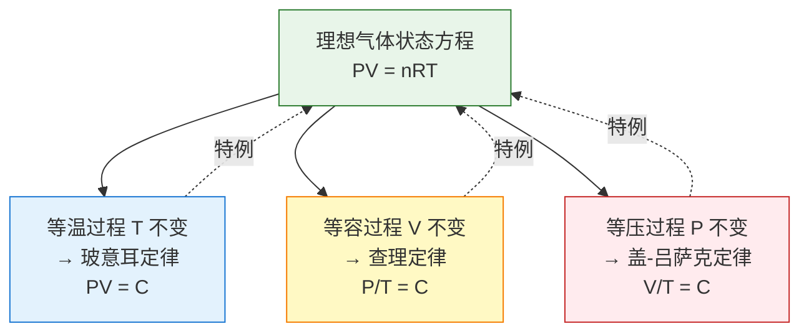
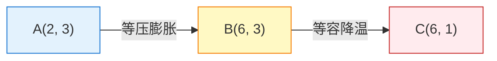

# 理想气体状态方程

> [!abstract] 概览
> 本节是气体版块的"统一理论"——==理想气体状态方程 $PV=nRT$== 把 [[02-玻意耳定律]]、[[03-查理定律与盖-吕萨克定律]] 三大实验定律统一为一个方程，是气体理论的"最高总结"。本节系统讲解：理想气体模型（分子无大小、分子间无作用力、分子为质点）、状态方程 $PV=nRT$（$n$ 为摩尔数）、克拉珀龙方程 $PV=NkT$（$N$ 为分子数）、气体常数 $R=8.31\,\text{J/(mol·K)}$ 与玻尔兹曼常数 $k=R/N_A$、==状态方程与三个实验定律的关系==（特定过程下推导）、适用条件（高温低压）、实际气体偏离与范德瓦尔斯方程简介。==状态方程与三定律的关系推导是本节重点==，体现"从特殊到一般"的物理学方法。本节为 [[05-气体图像]] 中"理想气体在 $p$-$V$、$p$-$T$、$V$-$T$ 图上的几何特征"提供理论基础，与 [[03-热力学定律/02-热力学第一定律]] 共同构成气体过程分析的两条主线（状态方程 + 能量守恒）。

## 核心概念

### 一、理想气体模型

**理想气体**：一种==理想化模型==，满足以下假设：

1. **分子无大小**：分子本身的体积可忽略（视为质点）；
2. **分子间无作用力**：除碰撞瞬间外，分子间无相互作用力（无引力和斥力）；
3. **分子为质点**：分子运动遵循牛顿力学，碰撞为完全弹性碰撞；
4. **分子运动无规则**：大量分子做无规则热运动，统计平均呈现宏观规律。

> [!note] 理想气体模型的本质
> 理想气体模型是==极端稀薄==的实际气体近似——分子间距远大于分子本身大小，分子间作用力远小于分子动能。这种近似在==高温低压==下成立（分子间距大、动能大），在低温高压下失效（分子密集、相互作用显著）。

> [!example] 类比：点电荷与质点
> 理想气体模型之于气体，正如点电荷之于带电体（[[01-静电场/01-电荷与库仑定律]]）、质点之于物体（[[02-牛顿运动定律/06-牛顿第二定律]]）——都是==理想化抽象==。一个气体能否视为理想气体，不在于绝对条件，而在于"温度足够高、压强足够低"使分子大小与作用力可忽略。

### 二、理想气体状态方程 $PV=nRT$

**理想气体状态方程**（==克拉珀龙方程==，1834 年）：

$$
\boxed{\,PV = nRT\,}
$$

其中：
- $P$ 为气体压强（$\text{Pa}$）；
- $V$ 为气体体积（$\text{m}^3$）；
- $n$ 为气体的==摩尔数==（$\text{mol}$），$n=m/M$（$m$ 为质量，$M$ 为摩尔质量）；
- $R$ 为==普适气体常量==，$R=8.314\,\text{J/(mol·K)}$；
- $T$ 为热力学温度（$\text{K}$）。

> [!tip] 单位制要求
> 用 $PV=nRT$ 时务必用==SI 制==：$P$ 用 $\text{Pa}$，$V$ 用 $\text{m}^3$，$T$ 用 $\text{K}$，$n$ 用 $\text{mol}$，$R=8.31\,\text{J/(mol·K)}$。若用其他单位制（如 $P$ 用 $\text{atm}$、$V$ 用 $\text{L}$），$R$ 需换为相应值（$R=0.0821\,\text{atm·L/(mol·K)}$），但高考要求一律用 SI 制。

### 三、克拉珀龙方程的另一种形式 $PV=NkT$

由 $n=N/N_A$（$N$ 为分子总数，$N_A$ 为阿伏伽德罗常数），代入 $PV=nRT$：

$$
PV = \dfrac{N}{N_A} R T = N \cdot \dfrac{R}{N_A} \cdot T
$$

定义==玻尔兹曼常数== $k=\dfrac{R}{N_A}$：

$$
\boxed{\,PV = N k T\,}
$$

其中 $k\approx 1.38\times 10^{-23}\,\text{J/K}$。

两种形式的对比：

| 形式 | 方程 | 适用视角 | 关键常量 |
| --- | --- | --- | --- |
| 摩尔形式 | $PV=nRT$ | 宏观（摩尔数） | $R=8.31\,\text{J/(mol·K)}$ |
| 分子形式 | $PV=NkT$ | 微观（分子数） | $k=1.38\times 10^{-23}\,\text{J/K}$ |

> [!note] 两种形式的物理意义
> $PV=nRT$ 体现"宏观量 $P,V,T$ 与摩尔数 $n$"的关系；$PV=NkT$ 体现"宏观量 $P,V,T$ 与分子数 $N$"的关系。后者更直接揭示分子动理论的本质——压强公式 $p=nkT$（$n$ 为分子数密度，[[01-气体的状态参量]]）正是 $PV=NkT$ 除以 $V$ 得到。两种形式是同一规律的两种表述，体现了"宏观—微观"统一。

### 四、气体常数 $R$ 与玻尔兹曼常数 $k$

#### 1. 普适气体常量 $R$

$$
R = 8.314\,\text{J/(mol·K)} \approx 8.31\,\text{J/(mol·K)}
$$

**物理意义**：1 摩尔理想气体温度升高 1 K 时，气体常数 $R$ 与压强体积乘积变化的关系。从单位看 $\text{J/(mol·K)}=\text{Pa·m}^3/\text{(mol·K)}=\text{N·m/(mol·K)}$，即"每摩尔每开尔文的能量"。

#### 2. 玻尔兹曼常数 $k$

$$
k = \dfrac{R}{N_A} = \dfrac{8.314}{6.022\times 10^{23}} \approx 1.38\times 10^{-23}\,\text{J/K}
$$

**物理意义**：单个分子每开尔文的能量尺度。$k$ 是连接宏观温度 $T$ 与微观动能 $\bar{E}_k=\dfrac{3}{2}kT$ 的"桥梁常数"，是统计物理的核心常量。

> [!tip] 两个常量的关系
> $R$ 是"宏观尺度"的气体常量（每摩尔）；$k$ 是"微观尺度"的气体常量（每分子）。$R=k\cdot N_A$ 揭示二者只是"换个计量单位"——从摩尔换成分子数。这种"宏观—微观"对应是热学的核心思想。

## 推导与原理

### 一、状态方程的实验归纳推导

理想气体状态方程可由三大实验定律归纳推导。基本思路：选定一个标准状态（$P_0,V_0,T_0$），通过两步过程到达任意状态（$P,V,T$），每步用一个实验定律。

#### 推导步骤

**第一步**：等温过程（用玻意耳定律）。从初态 $(P_0,V_0,T_0)$ 等温变化到中间态 $(P_1,V_1,T_0)$，其中 $T_0$ 不变：

$$
P_0 V_0 = P_1 V_1 \quad (\text{玻意耳定律})
$$

**第二步**：等压过程（用盖-吕萨克定律）。从中间态 $(P_1,V_1,T_0)$ 等压变化到末态 $(P_1,V,T)$，其中 $P_1$ 不变：

$$
\dfrac{V_1}{T_0} = \dfrac{V}{T} \quad (\text{盖-吕萨克定律})
$$

由第二步 $V_1 = V\cdot\dfrac{T_0}{T}$，代入第一步：

$$
P_0 V_0 = P_1 \cdot V\cdot\dfrac{T_0}{T}
$$

整理：

$$
\dfrac{P_0 V_0}{T_0} = \dfrac{P_1 V}{T}
$$

注意 $P_1$ 是中间态压强，但末态压强 $P=P_1$（第二步等压），故：

$$
\boxed{\,\dfrac{P_0 V_0}{T_0} = \dfrac{PV}{T}\,}
$$

即 $\dfrac{PV}{T}=\text{const}$。对于 1 摩尔理想气体，标准状态下（$P_0=1.013\times 10^5\,\text{Pa}$，$V_0=22.4\times 10^{-3}\,\text{m}^3/\text{mol}$，$T_0=273.15\,\text{K}$）：

$$
R = \dfrac{P_0 V_0}{T_0} = \dfrac{1.013\times 10^5\times 22.4\times 10^{-3}}{273.15} \approx 8.31\,\text{J/(mol·K)}
$$

对 $n$ 摩尔气体，常数为 $nR$，故 $PV=nRT$。

> [!example] 标准状态的妙用
> 标准状态（STP：$1\,\text{atm}$，$0\,^{\circ}\text{C}$）下 1 摩尔理想气体体积为 $22.4\,\text{L}$（==标准摩尔体积==）。这一数值是推导 $R$ 的关键数据，也是高中物理常用常数。记忆：$V_m=22.4\,\text{L/mol}$。

### 二、状态方程与三大实验定律的关系

由 $PV=nRT$ 出发，固定不同变量得到三大实验定律：

#### 1. 等温过程（$T$ 不变）→ 玻意耳定律

$T$ 不变，$n$ 不变（质量不变），故 $nR/T$... 等等，更直接地：

$$
PV = nRT = \text{const} \;\Rightarrow\; P_1V_1 = P_2V_2
$$

这正是 [[02-玻意耳定律]]。

#### 2. 等容过程（$V$ 不变）→ 查理定律

$$
\dfrac{P}{T} = \dfrac{nR}{V} = \text{const} \;\Rightarrow\; \dfrac{P_1}{T_1}=\dfrac{P_2}{T_2}
$$

这正是 [[03-查理定律与盖-吕萨克定律]] 中的查理定律。

#### 3. 等压过程（$P$ 不变）→ 盖-吕萨克定律

$$
\dfrac{V}{T} = \dfrac{nR}{P} = \text{const} \;\Rightarrow\; \dfrac{V_1}{T_1}=\dfrac{V_2}{T_2}
$$

这正是 [[03-查理定律与盖-吕萨克定律]] 中的盖-吕萨克定律。

#### 4. 三定律统一关系图

> [!tip] 三定律与状态方程的"统一观"
> 三大实验定律都是 $PV=nRT$ 在特定条件下的特例。这种"==从特殊到一般=="的归纳过程，是物理学理论建构的典型路径：
> - 实验（玻意耳 1662、查理 1787、盖-吕萨克 1802）→ 实验定律；
> - 归纳（克拉珀龙 1834）→ 状态方程 $PV=nRT$；
> - 微观解释（玻尔兹曼 19 世纪下半叶）→ 分子动理论 $PV=NkT$。
>
> 理解这条历史与逻辑脉络，胜过死记四个公式。

### 三、理想气体状态方程的适用条件

1. **理想气体**：分子无大小、分子间无作用力。实际气体在==高温低压==下近似为理想气体。
2. **质量不变**：$n$ 不变。若质量变化（如充气、放气、泄漏），需用密度形式 $\dfrac{P}{\rho T}=C$ 或分质量法。
3. **平衡态**：方程描述的是平衡态，状态变化需为准静态过程（缓慢进行）。

> [!warning] 适用条件易错
> - 低温高压下实际气体偏离理想气体（如水蒸气在 100 atm 下偏离显著），不能用 $PV=nRT$ 直接计算。
> - 质量变化时不能直接套用 $PV=nRT$（$n$ 改变），需用 $P_1V_1/T_1=P_2V_2/T_2$（一定质量部分）或密度形式。
> - 状态方程只描述平衡态，不描述过程细节；过程分析需配合 [[03-热力学定律/02-热力学第一定律]]。

### 四、实际气体的偏离与范德瓦尔斯方程

#### 1. 实际气体偏离理想气体的原因

- **分子有体积**：实际分子本身有体积，气体实际可压缩空间小于容器体积 $V$；
- **分子间有作用力**：分子间存在引力和斥力（见 [[01-分子动理论/03-分子力与分子势能]]），分子撞击器壁时受内部分子向内吸引，实际压强小于理想气体压强。

#### 2. 偏离方向

- **高压下**：分子体积效应显著，$PV>nRT$（实际压强高于理想值）；
- **低温下**：分子引力效应显著，$PV<nRT$（实际压强低于理想值）；
- **高温低压下**：分子体积与作用力都可忽略，$PV\approx nRT$（理想气体近似成立）。

#### 3. 范德瓦尔斯方程简介

1873 年荷兰物理学家范德瓦尔斯（J. D. van der Waals）对 $PV=nRT$ 进行修正：

$$
\boxed{\,\left(P + \dfrac{a n^2}{V^2}\right)(V - n b) = nRT\,}
$$

其中：
- $a$ 是==引力修正项==（分子间引力使压强减小，需加修正 $\dfrac{an^2}{V^2}$）；
- $b$ 是==体积修正项==（分子本身占据体积，实际可压缩空间 $V-nb$）；
- $a$、$b$ 是与气体种类有关的常数。

> [!note] 范德瓦尔斯方程的物理意义
> 范德瓦尔斯方程通过引入两个修正项 $a$、$b$，把"分子有体积""分子间有作用力"两个真实因素纳入方程，能更准确描述实际气体。这一工作使范德瓦尔斯获 1910 年诺贝尔物理学奖。在大学 [[热力学]] 与 [[统计物理]] 中，范德瓦尔斯方程是研究==相变==（气液临界点）的重要工具，由此可解释临界温度、临界压强等概念。

## 典型实例与类比

### 实例 1：标准状态与摩尔体积

1 摩尔理想气体在标准状态（$P_0=1.013\times 10^5\,\text{Pa}$，$T_0=273.15\,\text{K}$）下的体积：

$$
V_m = \dfrac{nRT_0}{P_0} = \dfrac{1\times 8.31\times 273.15}{1.013\times 10^5} \approx 2.24\times 10^{-2}\,\text{m}^3 = 22.4\,\text{L}
$$

这就是"标准摩尔体积" $V_m=22.4\,\text{L/mol}$ 的来源。

### 实例 2：气球升空的体积变化

氦气球从地面升到高空，外界压强降低，气球内氦气近似等温膨胀（温度变化相对压强变化可忽略）。由 $PV=nRT$，$T$ 不变，$P$ 减小则 $V$ 增大——气球膨胀。若膨胀过度气球破裂，这就是高空气球需要控制上升速度的原因。

### 实例 3：内燃机气缸压缩

内燃机压缩冲程中，气缸内混合气体被快速压缩。若视为绝热过程（无热交换），温度同时升高，$P$、$V$、$T$ 三个量同时变化——这正是 $PV=nRT$ 描述的"三量联动"场景。这种"压缩升温"是柴油机点火（压燃）的物理基础。

### 类比：状态方程的"三脚凳"模型

把 $PV=nRT$ 想象成一张三脚凳——$P$、$V$、$T$ 三条腿，凳面是 $nR$（气体种类与质量）。三条腿互相牵制：固定一条（如 $T$ 不变），另两条按"反比"调整（$PV=C$）；固定两条（不可能，因为状态确定需两个独立参量），第三条被确定。这种"牵一发动全身"的关系，正是 $PV=nRT$ 的核心物理图景。

> [!tip] 记忆口诀
> ==理想气 $PV=nRT$，摩尔数 $n$ 别搞错；$R$ 是 8.31 焦每摩开，$k$ 是玻尔兹曼常数小；三大定律皆特例，温不变 $PV=C$；容不变 $P/T$ 等，压不变 $V/T$ 同；高温低压近理想，范德瓦尔斯修正高。==

## 例题

### 例 1：基础——状态方程直接计算

**题目**：一容器内装有氧气 $0.5\,\text{mol}$，体积 $V=10\,\text{L}$，温度 $t=27\,^{\circ}\text{C}$。求氧气的压强 $P$（$R=8.31\,\text{J/(mol·K)}$）。

**分析**：直接用 $PV=nRT$。注意单位换算：$V=10\,\text{L}=10\times 10^{-3}\,\text{m}^3$，$T=t+273=300\,\text{K}$。

**解答**：
$$
P = \dfrac{nRT}{V} = \dfrac{0.5\times 8.31\times 300}{10\times 10^{-3}} = \dfrac{1246.5}{0.01} = 1.2465\times 10^5\,\text{Pa}
$$
约 $1.25\times 10^5\,\text{Pa}$，约 $1.23\,\text{atm}$。

**点评**：本题考查 $PV=nRT$ 的直接应用，关键是==单位统一==——$V$ 用 $\text{m}^3$（不是 $\text{L}$），$T$ 用 $\text{K}$（不是 $^{\circ}\text{C}$）。单位错误是常见失分点。

### 例 2：中难——变质量问题（充气）

**题目**：一钢瓶容积 $V_0=40\,\text{L}$，内有压强 $P_0=10\,\text{atm}$、温度 $T_0=300\,\text{K}$ 的氧气。现用钢瓶给气球充气，每次气球膨胀到 $V_1=20\,\text{L}$、压强 $P_1=1\,\text{atm}$、温度 $T_1=300\,\text{K}$。设充气过程温度不变，问钢瓶内气体最多能充几个这样的气球（钢瓶内压强降至 $P_1=1\,\text{atm}$ 时不能再充）？

**分析**：变质量问题用"分质量法"——把钢瓶内初始气体分为"留在钢瓶的"与"充入气球的"两部分。

**初始钢瓶内气体摩尔数**：
$$
n_0 = \dfrac{P_0 V_0}{R T_0} = \dfrac{10\times 40}{R\times 300} = \dfrac{400}{300R}
$$

**末态钢瓶剩余气体摩尔数**（压强降至 $P_1=1\,\text{atm}$）：
$$
n_{\text{剩}} = \dfrac{P_1 V_0}{R T_0} = \dfrac{1\times 40}{R\times 300} = \dfrac{40}{300R}
$$

**可充出气体摩尔数**：
$$
n_{\text{可用}} = n_0 - n_{\text{剩}} = \dfrac{400-40}{300R} = \dfrac{360}{300R}
$$

**每个气球所需摩尔数**：
$$
n_{\text{球}} = \dfrac{P_1 V_1}{R T_1} = \dfrac{1\times 20}{R\times 300} = \dfrac{20}{300R}
$$

**解答**：气球数：
$$
N = \dfrac{n_{\text{可用}}}{n_{\text{球}}} = \dfrac{360/300R}{20/300R} = \dfrac{360}{20} = 18
$$

故最多可充 $18$ 个气球。

**点评**：变质量问题是状态方程的==高级应用==——不能直接用 $P_1V_1/T_1=P_2V_2/T_2$（质量变化），但可对每部分气体分别用状态方程，再用"质量守恒"（摩尔数守恒）建立关联。这一方法在充气、放气、抽气、混合等问题中通用。

### 例 3：进阶——状态方程与图像结合

**题目**：一定质量理想气体从状态 A（$P_A=3\,\text{atm}$，$V_A=2\,\text{L}$，$T_A=300\,\text{K}$）经等压膨胀到状态 B（$V_B=6\,\text{L}$），再经等容降温到状态 C（$T_C=300\,\text{K}$）。求：
（1）状态 B 的温度 $T_B$；
（2）状态 C 的压强 $P_C$ 与体积 $V_C$；
（3）在 $P$-$V$ 图上定性画出过程曲线。

**分析**：
- A → B：等压过程（$P_B=P_A=3\,\text{atm}$），用盖-吕萨克定律 $\dfrac{V_A}{T_A}=\dfrac{V_B}{T_B}$；
- B → C：等容过程（$V_C=V_B=6\,\text{L}$），用查理定律 $\dfrac{P_B}{T_B}=\dfrac{P_C}{T_C}$。

**解答**：

（1）A → B（等压）：
$$
T_B = T_A\cdot\dfrac{V_B}{V_A} = 300\times\dfrac{6}{2} = 900\,\text{K}
$$

（2）B → C（等容）：
$$
V_C = V_B = 6\,\text{L}
$$
$$
P_C = P_B\cdot\dfrac{T_C}{T_B} = 3\times\dfrac{300}{900} = 1\,\text{atm}
$$

（3）$P$-$V$ 图定性曲线：
- A → B：等压线，$P=3\,\text{atm}$，$V$ 从 2 增到 6（水平线段，向右）；
- B → C：等容线，$V=6\,\text{L}$，$P$ 从 3 降到 1（竖直线段，向下）。

**点评**：多过程综合题考查 [[05-气体图像]] 中"等压线水平、等容线竖直、等温线双曲线"的几何特征，同时综合运用 [[03-查理定律与盖-吕萨克定律]] 的两个定律。==多过程分析是高考热学的核心题型==，需熟练掌握。本题 A 与 C 温度相同（$T_A=T_C=300\,\text{K}$），故 A、C 在同一条等温线上——这是循环过程的雏形。

## 易错提醒

> [!warning] 易错点
> 1. **单位不统一**：$PV=nRT$ 必须用 SI 制（$P$ 用 $\text{Pa}$，$V$ 用 $\text{m}^3$，$T$ 用 $\text{K}$）。常见错误：$V$ 用 $\text{L}$ 不化 $\text{m}^3$，$T$ 用 $^{\circ}\text{C}$ 不化 $\text{K}$。
> 2. **摩尔数 $n$ 的计算**：$n=m/M$（质量除以摩尔质量），不要与分子数 $N=mN_A/M$ 混淆。$n$ 单位 $\text{mol}$，$N$ 单位"个"。
> 3. **$R$ 与 $k$ 的关系**：$R=kN_A$，不要写成 $R=k/N_A$。$R$ 是每摩尔的气体常量，$k$ 是每分子的气体常量。
> 4. **质量变化问题**：变质量问题（充气、放气、泄漏）不能直接套 $P_1V_1/T_1=P_2V_2/T_2$（此式要求质量不变），需用"分质量法"或密度形式 $P/\rho T=C$。
> 5. **理想气体适用范围**：低温高压下实际气体偏离 $PV=nRT$，需用范德瓦尔斯方程。高考题一般默认理想气体，但概念辨析题可能考查适用范围。
> 6. **$P$-$V$ 乘积单位**：SI 制下 $PV$ 单位为 $\text{J}$（$\text{Pa}\cdot\text{m}^3=\text{N·m}$），是能量单位；这与 [[03-热力学定律/02-热力学第一定律]] 中"功 = $P\Delta V$"的能量意义一致。

> [!note] 概念辨析
> **理想气体 vs 实际气体**：理想气体是模型（分子无大小、无作用力），实际气体在高温低压下接近理想气体，低温高压下偏离。范德瓦尔斯方程是实际气体的修正形式。
>
> **$n$（摩尔数）vs $N$（分子数）**：$n$ 是宏观量（每摩尔），$N$ 是微观量（每分子），二者关系 $N=nN_A$。$PV=nRT$ 用 $n$，$PV=NkT$ 用 $N$，二者等价。
>
> **$R$ vs $k$**：$R$ 是每摩尔的气体常量（$8.31\,\text{J/(mol·K)}$），$k$ 是每分子的气体常量（$1.38\times 10^{-23}\,\text{J/K}$）。$R=kN_A$。

## 与其他知识关联

- 与 [[01-气体的状态参量]] 的关系：状态参量 $P$、$V$、$T$ 是状态方程的变量；压强公式 $p=nkT$ 是 $PV=NkT$ 除以 $V$ 的微观形式。
- 与 [[02-玻意耳定律]] 的关系：玻意耳定律是 $PV=nRT$ 在 $T$ 不变时的特例。
- 与 [[03-查理定律与盖-吕萨克定律]] 的关系：查理定律、盖-吕萨克定律是 $PV=nRT$ 在 $V$ 不变、$P$ 不变时的两个特例；状态方程统一三定律。
- 与 [[05-气体图像]] 的关系：$PV=nRT$ 在 $P$-$V$、$P$-$T$、$V$-$T$ 图上的几何表现（双曲线、过原点直线等）是图像分析的理论基础。
- 与 [[01-分子动理论/04-内能与分子动能]] 的关系：理想气体内能仅由温度决定（$U=\dfrac{i}{2}nRT$），是状态方程与内能概念的桥梁。
- 与 [[03-热力学定律/02-热力学第一定律]] 的关系：状态方程 + 热力学第一定律是分析气体过程的"两条主线"——状态方程描述 $P$、$V$、$T$ 关系，第一定律描述 $\Delta U$、$Q$、$W$ 关系。
- 与 [[02-牛顿运动定律/06-牛顿第二定律]] 的关系：压强计算（用于确定 $P$）需用牛顿第二定律，是状态方程应用的"前置技能"。
- 与 [[01-静电场/05-带电粒子在电场中的运动]] 的关系（类比）：理想气体分子类比带电粒子，无相互作用类比无电场力，状态方程类比运动方程。
- 与 [[01-分子动理论/03-分子力与分子势能]] 的关系：范德瓦尔斯方程的修正项 $a$、$b$ 对应分子间作用力与分子体积。
- 大学层面延伸：[[热力学]] 中状态方程是热力学基本方程 $dU=TdS-PdV$ 的输入；[[统计物理]] 中 $PV=NkT$ 可由正则系综配分函数严格推导；[[相变与流体]] 中范德瓦尔斯方程描述气液相变与临界点。
- 返回 [[00-热学总览]]

## 作者的话

> [!quote] 个人理解
> 理想气体状态方程 $PV=nRT$ 是高中物理==最优雅的方程之一==——五个量 $P$、$V$、$n$、$R$、$T$ 用一个等号连接，描述了从气球到内燃机、从大气到星际气体的全部稀薄气体行为。它的美在于"统一"——三大实验定律（玻意耳、查理、盖-吕萨克）都是它在特定条件下的特例，这种"从特殊到一般"的归纳过程是物理学理论建构的典范。
>
> 但状态方程的真正深刻之处，在于它揭示了==温度的统计本质==。把 $PV=nRT$ 改写为 $PV=NkT$，再用 $n=N/V$（分子数密度）除以 $V$，得到 $p=nkT$——这就直接给出了 [[01-气体的状态参量]] 中压强的微观公式。$k$ 是玻尔兹曼常数，连接宏观温度 $T$ 与微观动能 $\bar{E}_k=\dfrac{3}{2}kT$。可见 $PV=nRT$ 不仅是宏观唯象规律，更蕴含深刻的微观统计思想——温度 $T$ 是大量分子热运动的统计平均量，离开统计思想无法理解温度。
>
> 状态方程的==适用条件==也是物理学方法的精髓——任何定律都有适用范围。理想气体模型在高温低压下成立，低温高压下需用范德瓦尔斯方程修正。这种"模型 + 适用条件 + 修正"的范式，是物理学处理复杂现象的通用方法。从牛顿力学（宏观低速）→ 相对论（高速修正），从理想气体（高温低压）→ 范德瓦尔斯方程（低温高压修正），从库仑定律（真空中静止点电荷）→ 一般电磁场（介质、运动修正），物理学始终在"理想模型 → 实际修正"的路径上前进。
>
> 学习本节，建议读者重点把握：
> 1. **统一观**：三大实验定律都是状态方程的特例，理解"特例 → 一般"的归纳过程；
> 2. **微观观**：$PV=NkT$ 揭示温度的统计本质，$k$ 是连接宏观与微观的桥梁；
> 3. **适用观**：理想气体是模型，实际气体需修正，"模型 + 适用条件"是物理学方法的核心。
>
> 一个常被忽视的细节：$PV$ 的单位是 $\text{J}$（能量），这不是巧合——$PV$ 实际上是气体的一种"能量"（在热力学中与焓、自由能相关）。这种"压强 × 体积 = 能量"的量纲关系，是热力学中能量转换的基础（如等压过程做功 $W=P\Delta V$）。理解这一点，就能把状态方程与 [[03-热力学定律/02-热力学第一定律]] 自然联系起来——状态方程描述"状态量"关系，第一定律描述"过程量"关系，二者共同构成气体过程分析的完整框架。
>
> 进一步思考：如果分子有体积、有作用力（实际气体），状态方程如何修正？范德瓦尔斯方程给出了一阶修正。但在大学 [[统计物理]] 中，更一般的修正是用"位力展开"（virial expansion）$PV=nRT(1+B/V+C/V^2+\cdots)$，其中 $B$、$C$ 是位力系数，与分子间作用势有关。这种"逐级修正"的方法，是物理学处理"非理想"现象的标准技术——从理想模型出发，逐级加入真实效应的修正，直到精度满足要求。这种"渐进精化"的思路，比一次性追求"完全准确"更具操作性，也是物理学工程应用的核心理念。

---
*返回 [[00-热学总览]]*
