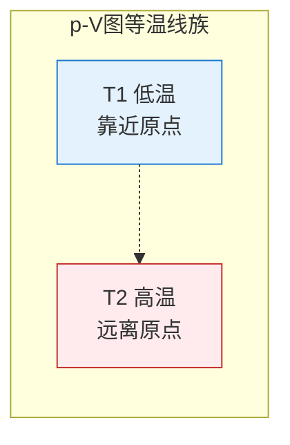
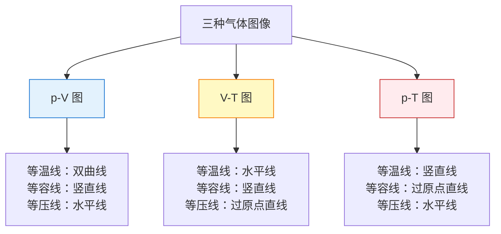
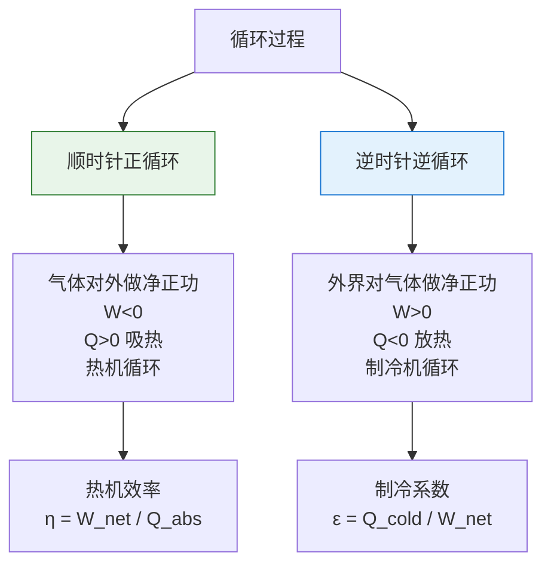
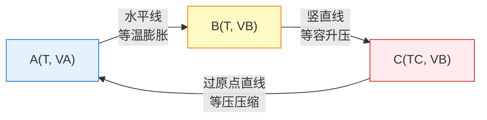

# 气体图像

> [!abstract] 概览
> 本节是气体版块的"几何化总结"——用 $p$-$V$、$V$-$T$、$p$-$T$ 三种图像将 [[02-玻意耳定律]]、[[03-查理定律与盖-吕萨克定律]]、[[04-理想气体状态方程]] 的规律可视化。本节系统讲解：$p$-$V$ 图（等温线为双曲线、等容线为过原点直线、等压线为水平线）、$V$-$T$ 图（等压线为过原点直线、等温线为水平线、等容线为竖直线）、$p$-$T$ 图（等容线为过原点直线、等压线为水平线、等温线为竖直线）、图像转化（$p$-$V$ → $V$-$T$、$p$-$V$ → $p$-$T$ 等）、==循环过程在 $p$-$V$ 图上的表示==（闭合曲线、做功 = 包围面积）、图像分析技巧。==三种图像对比要清晰==，循环过程做功 = 面积是本节重点与高考核心考点。本节为 [[03-热力学定律/02-热力学第一定律]] 中"做功 = $p$-$V$ 图面积"提供几何基础。

## 核心概念

### 一、三种图像总览

气体状态由两个独立参量确定（第三个由 [[04-理想气体状态方程]] $PV=nRT$ 决定），故可用二维平面图像描述状态与过程。三种常用图像：

| 图像 | 横轴 | 纵轴 | 等温线 | 等容线 | 等压线 |
| --- | --- | --- | --- | --- | --- |
| $p$-$V$ 图 | $V$ | $p$ | 双曲线 | 过原点直线 | 水平线 |
| $V$-$T$ 图 | $T$ | $V$ | 水平线 | 竖直线 | 过原点直线 |
| $p$-$T$ 图 | $T$ | $p$ | 竖直线 | 过原点直线 | 水平线 |

> [!tip] 总览口诀
> ==等温双曲线在 $p$-$V$，等容过原直线在 $p$-$T$，等压过原直线在 $V$-$T$；水平竖直看坐标，固定哪个哪个不动。==

### 二、$p$-$V$ 图

#### 1. 等温线（双曲线）

由玻意耳定律 $pV=C$（$T$ 不变），$p$-$V$ 图上等温线为==双曲线==，渐近于两坐标轴。

- 温度越高，常数 $C=nRT$ 越大，双曲线==离原点越远==（向右上方移动）；
- 同一双曲线上各点 $pV$ 乘积相同，温度相同；
- 不同温度对应双曲线族。

#### 2. 等容线（过原点直线）

由 $p=nRT/V$（$V$ 不变），$p\propto T$，但 $p$-$V$ 图上 $V$ 是横轴。$V$ 不变意味着==竖直线==（垂直于 $V$ 轴）。注意：等容线在 $p$-$V$ 图上是竖直线，不是过原点直线——"过原点直线"是 $p$-$T$ 图上的等容线。

> [!warning] 等容线在 $p$-$V$ 图上是竖直线
> 等容过程 $V$ 不变，在 $p$-$V$ 图上对应一条==竖直线段==（$V$ 固定，$p$ 变化）。不同体积的等容线是不同的竖直线。不要与 $p$-$T$ 图上"过原点直线"混淆。

#### 3. 等压线（水平线）

由 $p$ 不变，$p$-$V$ 图上等压线为==水平线==（平行于 $V$ 轴）。不同压强对应不同水平线。

#### 4. 等温线下面积 = 功

等温过程 $pV=C$ 下，气体对外做功：

$$
W = -\int_{V_1}^{V_2} p\,dV = -C\ln\dfrac{V_2}{V_1} = -nRT\ln\dfrac{V_2}{V_1}
$$

==功的数值等于 $p$-$V$ 图上过程曲线下的面积==（带符号）。

### 三、$V$-$T$ 图

#### 1. 等压线（过原点直线）

由盖-吕萨克定律 $V/T=C$（$p$ 不变），$V$-$T$ 图上等压线为==过原点的直线==。

- 压强越小，斜率 $V/T=nR/p$ 越大（直线越陡）；
- 不同压强对应过原点的直线族。

#### 2. 等温线（水平线）

$T$ 不变，$V$-$T$ 图上为==水平线==（平行于 $V$ 轴）。

#### 3. 等容线（竖直线）

$V$ 不变，$V$-$T$ 图上为==竖直线==（垂直于 $T$ 轴）。

### 四、$p$-$T$ 图

#### 1. 等容线（过原点直线）

由查理定律 $p/T=C$（$V$ 不变），$p$-$T$ 图上等容线为==过原点的直线==。

- 体积越小，斜率 $p/T=nR/V$ 越大（直线越陡）；
- 不同体积对应过原点的直线族。

#### 2. 等压线（水平线）

$p$ 不变，$p$-$T$ 图上为==水平线==（平行于 $T$ 轴）。

#### 3. 等温线（竖直线）

$T$ 不变，$p$-$T$ 图上为==竖直线==（垂直于 $T$ 轴）。

### 五、三种图像对比表

| 过程类型 | $p$-$V$ 图 | $V$-$T$ 图 | $p$-$T$ 图 |
| --- | --- | --- | --- |
| 等温过程（$T$ 不变） | 双曲线 | 水平线 | 竖直线 |
| 等容过程（$V$ 不变） | 竖直线 | 竖直线 | 过原点直线 |
| 等压过程（$p$ 不变） | 水平线 | 过原点直线 | 水平线 |

## 推导与原理

### 一、等温线为双曲线的推导

由 [[02-玻意耳定律]] $pV=C$（$T$ 不变，质量不变）：

- 当 $V\to 0$，$p\to\infty$（实际气体在体积极小时偏离）；
- 当 $V\to\infty$，$p\to 0$；
- $p$ 与 $V$ 成反比，图像为双曲线。

温度越高，$C=nRT$ 越大，双曲线"远离原点"。这就是 [[02-玻意耳定律]] 中"等温线族"的来源。

### 二、等容线在 $p$-$T$ 图为过原点直线的推导

由 [[03-查理定律与盖-吕萨克定律]] 中查理定律 $p/T=C$（$V$ 不变）：

$$
p = \dfrac{nR}{V}\cdot T = (\text{斜率})\cdot T
$$

斜率 $nR/V$ 是常数（$V$ 不变），故 $p$ 是 $T$ 的正比函数，图像为==过原点直线==。体积 $V$ 越小，斜率越大。

### 三、等压线在 $V$-$T$ 图为过原点直线的推导

由盖-吕萨克定律 $V/T=C$（$p$ 不变）：

$$
V = \dfrac{nR}{p}\cdot T = (\text{斜率})\cdot T
$$

斜率 $nR/p$ 是常数（$p$ 不变），故 $V$ 是 $T$ 的正比函数，图像为==过原点直线==。压强 $p$ 越小，斜率越大。

### 四、循环过程在 $p$-$V$ 图上的表示

#### 1. 循环过程的定义

**循环过程**：系统从初态出发，经历一系列变化后==回到初态==的过程。在 $p$-$V$ 图上，循环过程对应一条==闭合曲线==。

#### 2. 循环过程的内能变化

由于内能是状态函数（仅由状态决定，与过程无关），循环过程回到初态，内能不变：

$$
\Delta U_{\text{循环}} = 0
$$

由 [[03-热力学定律/02-热力学第一定律]] $\Delta U=Q+W$，循环过程中：

$$
Q_{\text{循环}} = -W_{\text{循环}}
$$

即循环过程中气体吸收的净热量等于气体对外做的净功（反之亦然）。

#### 3. 循环过程做功 = 闭合曲线包围面积

$p$-$V$ 图上，循环过程做的功==等于闭合曲线包围的面积==：

- ==顺时针循环==（正循环）：气体对外做正功，$W<0$，$Q>0$（吸热），是热机循环；
- ==逆时针循环==（逆循环）：外界对气体做正功，$W>0$，$Q<0$（放热），是制冷机循环。

> [!tip] 循环方向的判据
> - ==顺时针==（正循环）：闭合曲线沿顺时针方向 → 气体对外做净功 → 热机（吸热做功）；
> - ==逆时针==（逆循环）：闭合曲线沿逆时针方向 → 外界对气体做净功 → 制冷机（做功吸热）。
>
> 几何上，$p$-$V$ 图上方"扩张"过程（向右，$V$ 增大，$W<0$）做正功，下方"压缩"过程（向左，$V$ 减小，$W>0$）做负功。顺时针时上方扩张大于下方压缩，净功为负（气体对外做正功）。

#### 4. 热机效率与制冷系数

- ==热机效率==：$\eta=\dfrac{|W_{\text{net}}|}{Q_{\text{吸}}}$，即净功与吸收热量的比；
- ==制冷系数==：$\varepsilon=\dfrac{Q_{\text{冷}}}{|W_{\text{net}}|}$，即从冷源吸热与消耗功的比。

> [!note] 卡诺循环
> 卡诺循环是理想热机循环，由两条等温线 + 两条绝热线构成，效率 $\eta=1-\dfrac{T_2}{T_1}$（$T_1$ 高温热源，$T_2$ 低温热源）。这是 [[03-热力学定律/03-热力学第二定律]] 的核心内容，本节仅作铺垫。

### 五、图像转化技巧

不同图像间可相互转化，关键是==理清过程类型==：

#### 1. $p$-$V$ 图 → $V$-$T$ 图

- 等温线（$p$-$V$ 双曲线）→ $V$-$T$ 水平线；
- 等压线（$p$-$V$ 水平线）→ $V$-$T$ 过原点直线；
- 等容线（$p$-$V$ 竖直线）→ $V$-$T$ 竖直线。

#### 2. $p$-$V$ 图 → $p$-$T$ 图

- 等温线（$p$-$V$ 双曲线）→ $p$-$T$ 竖直线；
- 等压线（$p$-$V$ 水平线）→ $p$-$T$ 水平线；
- 等容线（$p$-$V$ 竖直线）→ $p$-$T$ 过原点直线。

#### 3. 转化步骤

1. 在原图上标注每段过程的类型（等温/等容/等压）；
2. 在目标图上画出对应类型的曲线/直线；
3. 关键状态点（端点）的坐标按 [[04-理想气体状态方程]] $PV=nRT$ 转换。

> [!example] 转化举例
> $p$-$V$ 图上一条等温线（双曲线，从 $A$ 到 $B$，$V_A<V_B$），转化为 $V$-$T$ 图：
> - 等温过程 $T$ 不变 → $V$-$T$ 图上为水平线；
> - $A$ 点：$V_A$ 较小，$T_A=T$；
> - $B$ 点：$V_B$ 较大，$T_B=T$；
> - 故 $V$-$T$ 图上为从 $(T, V_A)$ 到 $(T, V_B)$ 的水平线段。

## 典型实例与类比

### 实例 1：等温压缩的 $p$-$V$ 图分析

注射器封闭一定量气体，缓慢推活塞（等温压缩）。$p$-$V$ 图上过程沿等温双曲线从右向左移动（$V$ 减小，$p$ 增大）。曲线下面积 = 外界对气体做的功（正值，因 $V$ 减小）。

### 实例 2：柴油机循环（简化）

柴油机循环简化为：等压吸气 → 绝热压缩 → 等压燃烧膨胀 → 绝热排气。$p$-$V$ 图上构成顺时针闭合曲线，是热机循环。这块面积就是柴油机输出的净功。

### 实例 3：冰箱制冷循环

冰箱制冷循环简化为：等温膨胀吸热（在冷藏室）→ 绝热压缩 → 等温压缩放热（在散热器）→ 绝热膨胀。$p$-$V$ 图上构成逆时针闭合曲线，是制冷机循环。外界对气体做功把热量从冷藏室"搬"到散热器。

### 类比：$p$-$V$ 图像的"地图"类比

把 $p$-$V$ 图想象成一张"地图"：
- 横轴 $V$ 是东西方向（体积变大向右）；
- 纵轴 $p$ 是南北方向（压强变大向上）；
- 等温双曲线是"等高线"（同一温度在同一曲线上）；
- 过程曲线是"行进路线"；
- 闭合循环是"绕一圈又回到起点"——总位移为零（$\Delta U=0$），但走过的"面积"是做功。

> [!tip] 记忆口诀
> ==等温双曲 $p$-$V$，等容过原 $p$-$T$，等压过原 $V$-$T$；水平竖直看坐标，固定哪个哪个不动；循环闭合 $\Delta U$ 零，顺时针热机逆时针冷；功等于曲线包围面积，正负方向看顺逆。==

## 例题

### 例 1：基础——图像识别

**题目**：一定质量理想气体经历如图所示过程（$p$-$V$ 图上从 A 沿双曲线到 B，再沿水平线到 C，再沿竖直线回到 A）。判断各段过程类型，并分析内能变化。

**分析**：
- A → B：$p$-$V$ 图上沿双曲线 → 等温过程（$T$ 不变），$\Delta U=0$；
- B → C：水平线 → 等压过程（$p$ 不变），$V$ 减小，由 $PV=nRT$，$T$ 减小，$\Delta U<0$；
- C → A：竖直线 → 等容过程（$V$ 不变），$p$ 增大，由 $PV=nRT$，$T$ 增大，$\Delta U>0$。

**解答**：
- A → B：等温过程，$\Delta U_{AB}=0$；
- B → C：等压压缩过程，$T$ 降低，$\Delta U_{BC}<0$；
- C → A：等容升温过程，$T$ 升高，$\Delta U_{CA}>0$。

整个循环 $\Delta U_{\text{总}}=0$（回到初态）。

**点评**：图像识别是 [[05-气体图像]] 的基础技能——$p$-$V$ 图上==双曲线 = 等温、水平线 = 等压、竖直线 = 等容==。识别后即可用对应定律分析状态变化与能量变化。

### 例 2：中难——循环做功计算

**题目**：$1\,\text{mol}$ 理想气体经历顺时针矩形循环 ABCDA，其中 A($V_A=2\,\text{L}$, $p_A=1\,\text{atm}$)、B($V_B=4\,\text{L}$, $p_B=1\,\text{atm}$)、C($V_C=4\,\text{L}$, $p_C=2\,\text{atm}$)、D($V_D=2\,\text{L}$, $p_D=2\,\text{atm}$)。求：
（1）循环过程中气体对外做的净功 $W_{\text{net}}$；
（2）循环过程中气体是吸热还是放热，净热量 $Q_{\text{net}}$ 为多少？

**分析**：
- 矩形循环，AB 等压膨胀（$p=1\,\text{atm}$，$V$ 从 2 到 4），BC 等容升压（$V=4\,\text{L}$，$p$ 从 1 到 2），CD 等压压缩（$p=2\,\text{atm}$，$V$ 从 4 到 2），DA 等容降压（$V=2\,\text{L}$，$p$ 从 2 到 1）；
- 净功 = 矩形面积（顺时针为正，气体对外做功）；
- 循环 $\Delta U=0$，故 $Q_{\text{net}}=-W_{\text{net}}$。

**解答**：

（1）矩形循环包围面积：
$$
|W_{\text{net}}| = |\Delta p \cdot \Delta V| = |(2-1)\,\text{atm} \times (4-2)\,\text{L}| = 2\,\text{atm·L}
$$
化为 SI：$2\,\text{atm·L}=2\times 1.013\times 10^5\,\text{Pa}\times 10^{-3}\,\text{m}^3\approx 202.6\,\text{J}$。

顺时针循环，气体对外做正功：
$$
W_{\text{net}} = -202.6\,\text{J}
$$
（按 $W$ 为外界对气体做功的约定，气体对外做功取负。）

（2）由 $\Delta U_{\text{循环}}=0$，故：
$$
Q_{\text{net}} = -W_{\text{net}} = 202.6\,\text{J} > 0
$$
气体==净吸热== $202.6\,\text{J}$，全部转化为对外做功。

**点评**：循环过程做功 = $p$-$V$ 图闭合曲线包围面积是高考核心考点。注意==符号约定==：$W$ 是外界对气体做功（[[03-热力学定律/02-热力学第一定律]] 约定），气体对外做功为负。顺时针循环气体对外做正功（$W_{\text{net}}<0$），净吸热；逆时针反之。本题中矩形面积计算简单，对任意闭合曲线需用积分或分割法。

### 例 3：进阶——图像转化

**题目**：一定质量理想气体经历 $p$-$V$ 图上过程 A → B → C → A（A → B 等温膨胀，B → C 等容升压，C → A 等压压缩），定性画出该循环在 $V$-$T$ 图上的对应曲线。已知 A($V_A$, $p_A$, $T_A$)，且 $T_B=T_A$，$T_C>T_A$。

**分析**：
- A → B：等温过程（$T_A=T_B=T$），$V$ 增大（$V_B>V_A$）→ $V$-$T$ 图上为==水平线段==，从 $(T, V_A)$ 到 $(T, V_B)$；
- B → C：等容过程（$V_B=V_C$），$p$ 增大（$p_C>p_B$），由 $p/T=nR/V$ 不变，$T$ 增大（$T_C>T_B=T$）→ $V$-$T$ 图上为==竖直线段==，从 $(T, V_B)$ 到 $(T_C, V_B)$；
- C → A：等压过程（$p_C=p_A$），$V$ 减小（$V_A<V_C$），由 $V/T=nR/p$ 不变，$T$ 减小（$T_A<T_C$）→ $V$-$T$ 图上为==过原点直线段==（沿 $p_A$ 等压线），从 $(T_C, V_B)$ 到 $(T_A, V_A)$。

**解答**：

$V$-$T$ 图上对应曲线：
- A → B：水平线段（$T$ 不变，$V$ 增大）；
- B → C：竖直线段（$V$ 不变，$T$ 增大）；
- C → A：斜线段（沿过原点等压线，$V$ 与 $T$ 正比减小）。

**点评**：图像转化关键是==逐段判断过程类型==，再在目标图上画出对应几何特征。等温 → 水平线（$V$-$T$ 图）、竖直线（$p$-$T$ 图）；等容 → 竖直线（$V$-$T$ 图）、过原点直线（$p$-$T$ 图）；等压 → 过原点直线（$V$-$T$ 图）、水平线（$p$-$T$ 图）。这是 [[05-气体图像]] 的核心技能。

## 易错提醒

> [!warning] 易错点
> 1. **图像类型混淆**：等温双曲线在 $p$-$V$ 图，等容过原点直线在 $p$-$T$ 图，等压过原点直线在 $V$-$T$ 图——三者不可混淆。
> 2. **等容线在 $p$-$V$ 图是竖直线**：不是过原点直线。"过原点直线"是 $p$-$T$ 图上等容线的特征。
> 3. **循环方向判错**：顺时针循环为正循环（热机，对外做功），逆时针为逆循环（制冷机，外界做功）。方向判错则做功正负全反。
> 4. **功的符号约定**：$W$ 是外界对气体做功（[[03-热力学定律/02-热力学第一定律]] 约定），气体对外做功 $W<0$。循环做功 = 闭合曲线面积带符号。
> 5. **温度必须用热力学温标**：$V$-$T$、$p$-$T$ 图上"过原点直线"的横轴必须是热力学温度 $T$（K），用摄氏温度 $t$ 时直线不过原点（截距非零）。
> 6. **面积单位换算**：$p$-$V$ 图面积单位为 $\text{Pa·m}^3=\text{J}$。若用 $\text{atm·L}$，需化为 $\text{J}$（$1\,\text{atm·L}=101.3\,\text{J}$）。
> 7. **图像转化的端点坐标**：转化时端点坐标需按状态方程计算，不能凭直觉画。

> [!note] 概念辨析
> **正循环 vs 逆循环**：正循环（顺时针）气体对外做净功，是热机；逆循环（逆时针）外界对气体做净功，是制冷机。二者方向相反，做功符号相反。
>
> **过程曲线 vs 状态点**：图像上一个点对应一个状态，一条曲线对应一个过程。识别过程类型是分析图像的基础。
>
> **$p$-$V$ 图面积 vs $p$-$T$、$V$-$T$ 图面积**：只有 $p$-$V$ 图上过程曲线下面积有"功"的物理意义；$p$-$T$、$V$-$T$ 图上面积无直接物理意义。

## 与其他知识关联

- 与 [[01-气体的状态参量]] 的关系：状态参量 $p$、$V$、$T$ 是图像的坐标轴，参量关系是图像几何特征的基础。
- 与 [[02-玻意耳定律]] 的关系：等温线（$p$-$V$ 图双曲线）是玻意耳定律的几何表示。
- 与 [[03-查理定律与盖-吕萨克定律]] 的关系：等容线（$p$-$T$ 图过原点直线）、等压线（$V$-$T$ 图过原点直线）是两定律的几何表示。
- 与 [[04-理想气体状态方程]] 的关系：状态方程 $PV=nRT$ 是图像几何特征的理论基础（如等温线 $pV=C$ 由 $T$ 不变得到）。
- 与 [[03-热力学定律/02-热力学第一定律]] 的关系：$p$-$V$ 图上过程曲线下面积 = 功 $W$，是热力学第一定律 $\Delta U=Q+W$ 的几何表达。
- 与 [[03-热力学定律/03-热力学第二定律]] 的关系：循环过程的方向性（热机 vs 制冷机）联系热力学第二定律；卡诺循环效率 $\eta=1-T_2/T_1$ 是核心应用。
- 与 [[01-分子动理论/04-内能与分子动能]] 的关系：理想气体内能仅由温度决定，等温过程 $\Delta U=0$ 在 $p$-$V$ 图上对应双曲线。
- 大学层面延伸：[[热力学]] 中 $p$-$V$ 图是热力学过程分析的核心工具，卡诺循环、奥托循环、狄塞尔循环都在 $p$-$V$ 图上表示；[[统计物理]] 中 $p$-$V$ 图与配分函数的统计平均对应。
- 返回 [[00-热学总览]]

## 作者的话

> [!quote] 个人理解
> 气体图像是气体版块的"可视化总结"——把 $PV=nRT$ 这一代数方程转化为 $p$-$V$、$V$-$T$、$p$-$T$ 三种几何图像，使气体过程"一目了然"。这种"代数 → 几何"的转化思想，是物理学最强大的方法论之一——牛顿用微积分（代数）描述运动，也用相空间（几何）分析力学；[[02-牛顿运动定律/06-牛顿第二定律]] 中的运动学图像、[[01-静电场/05-带电粒子在电场中的运动]] 中的轨迹图像，都是这一思想的体现。
>
> 气体图像最深刻的物理意义在于"==几何面积 = 物理量=="的对应：
> - $p$-$V$ 图上过程曲线下面积 = 功 $W$；
> - $p$-$V$ 图上闭合曲线包围面积 = 循环净功；
> - 这种"面积即物理量"的对应，把抽象的积分 $\int p\,dV$ 转化为直观的几何面积。
>
> 这一思想在大学 [[热力学]] 中将进一步深化——$T$-$S$ 图上面积 = 热量 $Q$，$p$-$V$ 图上面积 = 功 $W$，二者构成热力学过程分析的"双子图"。卡诺循环在 $T$-$S$ 图上是矩形，效率 $\eta=1-T_2/T_1$ 由矩形比例直接读出——这种几何美感是热力学最迷人的地方。
>
> 循环过程是气体图像的"集大成应用"——闭合曲线把"状态量"（内能 $U$，回到初态 $\Delta U=0$）与"过程量"（功 $W$、热量 $Q$，曲线面积）巧妙统一。这种"状态量循环不变、过程量取决于路径"的对比，是热力学最深刻的思想之一。理解这一点，就能明白为什么内能是状态函数而热量、功是过程量——这是 [[03-热力学定律/02-热力学第一定律]] 的核心概念。
>
> 学习本节，建议读者重点把握：
> 1. **图像识别**：从几何形状（双曲线、过原点直线、水平线、竖直线）判断过程类型；
> 2. **图像转化**：在 $p$-$V$、$V$-$T$、$p$-$T$ 图之间相互转化；
> 3. **循环分析**：循环方向决定热机/制冷机，闭合面积决定净功。
>
> 一个常被忽视的细节：$p$-$V$、$V$-$T$、$p$-$T$ 三种图像并非独立——它们是同一气体过程在不同坐标平面上的"投影"。就像一个三维物体（$p$-$V$-$T$ 空间中的状态曲面）在三个坐标平面上的投影，三个图像互相印证、可相互推导。这种"多维视角看同一对象"的思想，在大学 [[热力学]] 的"热力学曲面"中将更进一步——$U$-$V$-$S$ 空间中的曲面可投影为 $p$-$V$、$T$-$S$、$U$-$V$ 等多种图像，每种图像揭示不同的物理侧面。理解这种"多视角统一"的思想，比记住具体图像更重要。
>
> 至此，气体版块的五大节笔记（[[01-气体的状态参量]]、[[02-玻意耳定律]]、[[03-查理定律与盖-吕萨克定律]]、[[04-理想气体状态方程]]、[[05-气体图像]]）构成完整体系——从状态参量（基础）→ 三大实验定律（特例）→ 状态方程（统一）→ 气体图像（可视化）。这条"基础 → 特例 → 统一 → 可视化"的认知路径，是高中热学的精髓，也通向大学 [[热力学]] 与 [[统计物理]] 的更深图景。

---
*返回 [[00-热学总览]]*
