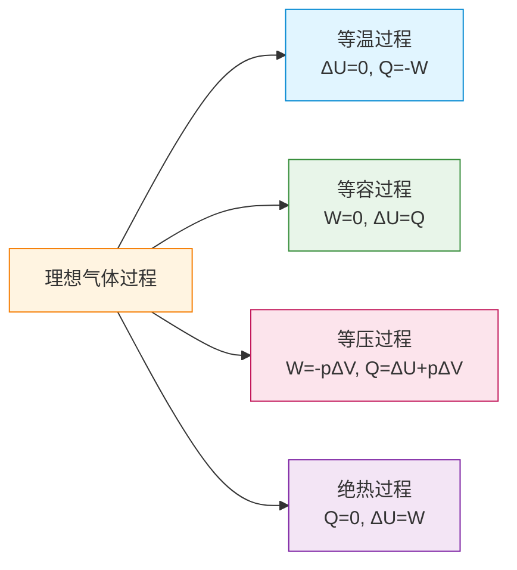

# 热力学第一定律

> [!abstract] 概览
> 热力学第一定律是能量守恒定律在热学领域的具体表达，揭示了内能变化、热量传递、做功三者之间的定量关系：$\Delta U = Q + W$。它表明：**外界对系统做的功与系统吸收的热量，全部用于增加系统的内能**——能量既不能凭空产生，也不能凭空消失，只能从一种形式转化为另一种形式或从一个物体传递到另一个物体。本节是热学版块的核心章节，将系统阐释第一定律的内容、符号法则、与能量守恒定律的关系，并以理想气体的四种典型过程（等温、等容、等压、绝热）为载体进行综合应用。掌握本节是高考热学综合题的基础。

## 核心概念

### 一、热力学第一定律的内容

**内容**：一个热力学系统内能的增量 $\Delta U$ 等于它吸收的热量 $Q$ 与外界对它所做的功 $W$ 之和。

$$
\boxed{\Delta U = Q + W}
$$

**各量物理意义**：
- $\Delta U = U_{\text{末}} - U_{\text{初}}$：系统内能的增量（状态量之差）；
- $Q$：系统吸收的热量（过程量）；
- $W$：外界对系统所做的功（过程量）。

### 二、统一符号法则（重点）

> [!warning] 高考统一符号约定
> 本笔记及高考范围采用以下统一约定：
>
> | 物理量 | 正号 (+) | 负号 (−) |
> | --- | --- | --- |
> | $Q$（热量） | 系统吸热 | 系统放热 |
> | $W$（功） | 外界对系统做功（压缩气体） | 系统对外界做功（气体膨胀） |
> | $\Delta U$（内能变化） | 内能增加（温度升高） | 内能减少（温度降低） |
>
> 简记为：==吸热正、做功正、内能增==。

**等压过程中 $W$ 的计算**：
$$
W = -p\,\Delta V = -p(V_2 - V_1)
$$
（负号源于"气体膨胀对外做功时 $W<0$"的约定。）

> [!tip] 记忆口诀
> **吸热正、做功正、内能增**
> - $Q>0$：吸热（如加热气体）；
> - $W>0$：外界对气体做功（如压缩气体）；
> - $\Delta U>0$：内能增加（温度升高）。

### 三、能量守恒定律（普遍规律）

**内容**：能量既不会凭空产生，也不会凭空消失，只能从一种形式转化为另一种形式，或从一个物体转移到另一个物体，在转化和转移过程中总能量保持不变。

**历史建立**：19 世纪中叶，由迈尔、焦耳、亥姆霍兹等人各自独立提出。其建立基于三类证据：
1. 机械能守恒（力学）；
2. 焦耳热功当量实验（[[01-热传递与功]]）；
3. 电流热效应（[[02-恒定电流/03-电功与电功率]]）。

> [!note] 第一定律 vs 能量守恒定律
> 能量守恒定律是**普遍规律**，适用于一切物理过程；热力学第一定律是其在**热学系统**中的具体形式，仅涉及内能、热量、功三种形式的能量。换言之，第一定律是能量守恒定律的子集。

### 四、第一类永动机不可能

**第一类永动机**：不消耗任何能量却能持续对外做功的机器。

**不可能性证明**：由 $\Delta U = Q+W$，若机器不从外界吸热（$Q=0$）也不消耗自身内能（$\Delta U=0$），则 $W=0$——根本无法对外做功。换言之，能量不能"无中生有"，第一类永动机违反能量守恒定律。

> [!example] 历史案例
> 13 世纪有人设计"魔轮"——认为轮上重锤总会偏一侧产生持续力矩。后被证明力矩平衡无法持续。历史上各种"永动机"设计均以失败告终，最终促成能量守恒定律的建立。

## 推导与原理

### 一、热力学第一定律的建立逻辑

由 [[01-热传递与功]]，改变内能有两种方式：热传递 $Q$ 与做功 $W$。实验证明（焦耳热功当量），两者在改变内能上**完全等价**。因此系统内能变化等于两者之和：

$$
\Delta U = Q + W
$$

这正是能量守恒在热学中的表达：内能增量来自外界输入的热量与功。

### 二、第一定律的微分形式

对于微小过程：
$$
dU = \delta Q + \delta W
$$
（用 $\delta$ 而非 $d$ 表示 $Q$、$W$ 是过程量，与状态量 $U$ 区分。）

### 三、理想气体特殊过程分析

理想气体内能仅取决于温度（[[01-分子动理论/04-内能与分子动能]]）：$U=U(T)$。下面针对四种典型过程进行分析。

#### 1. 等温过程（$T$ 恒定）

由玻意耳定律（[[02-气体/02-玻意耳定律]]）$pV=$ const。温度不变 → 内能不变：

$$
\Delta U = 0 \Rightarrow Q = -W
$$

**物理意义**：气体吸收的热量全部用于对外做功（膨胀）；或外界对气体做功全部以热量形式放出（压缩）。**热量与功完全等价转换**。

**做功计算**（等温过程 $pV=nRT$）：
$$
W_{\text{气对外}} = \int_{V_1}^{V_2} p\,dV = nRT\ln\dfrac{V_2}{V_1}
$$
（高中阶段一般不要求积分，但需理解"等温膨胀吸热、等温压缩放热"。）

#### 2. 等容过程（$V$ 恒定）

体积不变 → 气体不对外做功：
$$
W = 0 \Rightarrow \Delta U = Q
$$

**物理意义**：气体吸收的热量全部用于增加内能（升温）；放出的热量全部来自内能减少（降温）。

由查理定律（[[02-气体/03-查理定律与盖吕萨克定律]]）$p/T=$ const。

#### 3. 等压过程（$p$ 恒定）

气体做功 $W=-p\Delta V$，由第一定律：
$$
\Delta U = Q - p\Delta V \Rightarrow Q = \Delta U + p\Delta V
$$

**物理意义**：气体吸收的热量，一部分增加内能（升温），另一部分用于对外做功（膨胀）。

由盖-吕萨克定律 $V/T=$ const。

#### 4. 绝热过程（$Q=0$）

绝热过程指系统与外界无热交换（如迅速压缩、气缸保温）：
$$
Q = 0 \Rightarrow \Delta U = W
$$

**物理意义**：外界对气体做功全部转化为内能（压缩升温）；气体对外做功全部来自内能减少（膨胀降温）。

绝热过程中 $pV^\gamma=$ const（$\gamma=C_p/C_v$，高中不要求推导，但要知道绝热线比等温线更陡）。

### 四、四种过程系统对比

> [!note] 四种过程对比表
>
> | 过程 | 特征量 | $W$ | $Q$ | $\Delta U$ | 关键关系 |
> | --- | --- | --- | --- | --- | --- |
> | 等温 | $T$ 不变 | $-nRT\ln(V_2/V_1)$ | $-W$ | 0 | $Q=-W$ |
> | 等容 | $V$ 不变 | 0 | $\Delta U$ | $nC_v\Delta T$ | $\Delta U=Q$ |
> | 等压 | $p$ 不变 | $-p\Delta V$ | $\Delta U+p\Delta V$ | $nC_v\Delta T$ | $Q=\Delta U+p\Delta V$ |
> | 绝热 | $Q=0$ | $\Delta U$ | 0 | $nC_v\Delta T$ | $\Delta U=W$ |

## 典型实例与类比

### 类比：内能"账户"

把气体系统比作一个银行账户：
- **内能 $U$**：账户余额（状态量）；
- **热量 $Q$**：存款（吸热 $Q>0$）或取款（放热 $Q<0$）；
- **功 $W$**：外界存入（压缩 $W>0$）或账户支出（膨胀 $W<0$）。

**等温过程**：存取相抵，余额不变（$\Delta U=0$）；
**等容过程**：无存取操作（无做功），只有热量进出，余额变化等于热量；
**等压过程**：存款一部分变余额，一部分被取走做功；
**绝热过程**：无存款（$Q=0$），余额变化只看存取操作（功）。

### 实例 1：压缩空气点火

快速下压活塞压缩气体，由于过程极快，气体来不及与外界热交换（近似绝热），$Q=0$。外界对气体做功 $W>0$，由 $\Delta U=W$，内能增加、温度骤升，达到棉絮燃点即点燃。这是柴油机点火的原理。

### 实例 2：自行车打气筒发热

打气时活塞压缩气体，近似绝热，$W>0\Rightarrow\Delta U>0$，温度升高。同时筒壁与气体有热交换，但主要升温情势与绝热压缩一致。

### 实例 3：开水冷却

开盖的开水慢慢冷却，近似等压（大气压恒定），$Q<0$（放热）。由 $Q=\Delta U+p\Delta V$，水放热使内能减少、温度降低；同时体积收缩（$\Delta V<0$，$p\Delta V<0$），外界对水做正功。但水的体积变化极小，$p\Delta V$ 项通常可忽略。

## 例题

### 例 1：等温过程——气体等温膨胀

**题目**：一定质量的理想气体等温膨胀，体积从 $V_1=2\,\text{L}$ 变为 $V_2=4\,\text{L}$，过程中气体吸热 $Q=300\,\text{J}$。求：
（1）气体内能变化 $\Delta U$；
（2）外界对气体所做的功 $W$；
（3）气体对外所做的功 $W_{\text{对外}}$。

**分析**：等温过程 $\Delta U=0$，由第一定律 $\Delta U=Q+W$ 求 $W$。

**解答**：

（1）等温过程，温度不变，理想气体内能仅是温度的函数，故
$$
\Delta U = 0
$$

（2）由 $\Delta U=Q+W$：
$$
0 = 300 + W \Rightarrow W = -300\,\text{J}
$$

（3）$W_{\text{对外}}=-W=300\,\text{J}$，即气体对外做功 300 J。

**点评**：等温过程中 $Q=-W$ 是核心结论——吸热全部用于对外做功。注意 $W$ 的符号约定，本体系 $W$ 为外界对气体做功。

### 例 2：等容过程——气体等容升温

**题目**：一定质量理想气体在体积不变的情况下，从外界吸热 $Q=500\,\text{J}$，温度升高 100 K。求：
（1）外界对气体所做的功 $W$；
（2）气体内能变化 $\Delta U$。

**分析**：等容过程 $W=0$，由第一定律 $\Delta U=Q$。

**解答**：

（1）等容过程体积不变：
$$
W = -p\Delta V = 0
$$

（2）由 $\Delta U=Q+W$：
$$
\Delta U = 500 + 0 = 500\,\text{J}
$$

**点评**：等容过程吸热全部转化为内能，是热量→内能最直接的转化过程。这一关系在等容摩尔热容 $C_v$ 定义中起核心作用：$C_v=\Delta U/(n\Delta T)$。

### 例 3：等压过程——气体等压膨胀

**题目**：气缸内封闭一定质量的理想气体，压强 $p=1.0\times10^5\,\text{Pa}$ 保持不变，气体体积从 $V_1=3.0\,\text{L}$ 膨胀到 $V_2=5.0\,\text{L}$，过程中吸热 $Q=700\,\text{J}$。求：
（1）外界对气体所做的功 $W$；
（2）气体内能变化 $\Delta U$。

**分析**：等压过程 $W=-p\Delta V$，注意单位换算。

**解答**：

（1）
$$
W = -p(V_2-V_1) = -1.0\times10^5\times(5.0-3.0)\times10^{-3} = -200\,\text{J}
$$

（2）由 $\Delta U=Q+W$：
$$
\Delta U = 700 + (-200) = 500\,\text{J}
$$

**点评**：等压过程吸热 $Q$ 分为两部分——$200\,\text{J}$ 用于对外做功，$500\,\text{J}$ 用于增加内能。这一分配关系是热机循环中能量流向的微观体现。

### 例 4：绝热过程——气体绝热压缩

**题目**：一定质量的理想气体经历绝热压缩过程，外界对气体做功 $W=400\,\text{J}$。求：
（1）气体吸收的热量 $Q$；
（2）气体内能变化 $\Delta U$；
（3）气体温度如何变化？

**分析**：绝热过程 $Q=0$，由第一定律 $\Delta U=W$。

**解答**：

（1）绝热过程，无热交换：
$$
Q = 0
$$

（2）由 $\Delta U=Q+W$：
$$
\Delta U = 0 + 400 = 400\,\text{J}
$$

（3）$\Delta U>0$，理想气体内能仅取决于温度，故==温度升高==。

**点评**：绝热压缩使气体升温——这是柴油机压燃点火、打气筒发热的物理原理。注意与"等温压缩"区分：等温压缩 $\Delta U=0$，必须有 $Q<0$（放热）才能保持温度不变。

## 易错提醒

> [!warning] 易错点
> 1. **符号法则混淆**：高考统一用 $\Delta U=Q+W$（$W$ 为外界对气体做功）。若见到 $\Delta U=Q-W$ 形式，那是大学体系（$W$ 为气体对外做功）。
> 2. **等温过程误判**：等温过程内能变化 $\Delta U=0$，但≠热量和功都为零——恰恰相反，$Q$ 与 $W$ 大小相等符号相反。
> 3. **绝热过程误判**：绝热≠温度不变！绝热过程 $Q=0$，但 $\Delta U=W\ne0$，温度会变化。
> 4. **等压做功符号**：气体膨胀（$\Delta V>0$）时 $W=-p\Delta V<0$，即气体对外做功，外界做负功。
> 5. **温度变化与内能**：对理想气体，温度升高 $\Leftrightarrow$ 内能增加；但温度不变 $\Leftrightarrow$ 内能不变（仅理想气体如此，实际气体还需考虑分子势能）。
> 6. **第一类永动机判断**：违反能量守恒（无中生有能量）的为第一类；违反热力学第二定律（效率超卡诺）的为第二类（详见 [[03-热力学第二定律]]）。

> [!note] 概念辨析
> **内能 vs 热量 vs 功**：
> - 内能 $U$：状态量，与系统所处状态唯一对应；
> - 热量 $Q$、功 $W$：过程量，与具体过程有关，**不能说"物体含有热量/功"**。
>
> **$\Delta U=Q+W$ vs $U=Q+W$**：
> - 前者正确，$U$ 是状态量，变化量才与过程量对应；
> - 后者错误，仅在规定 $U_{\text{初}}=0$ 时才成立。
>
> **可逆过程与实际过程**：高中阶段所讨论的等温、等容、等压、绝热多为理想化的可逆过程，实际过程不可避免地存在耗散（摩擦、湍流等），稍后 [[03-热力学第二定律]] 将深入讨论。

## 与其他知识关联

- 与 [[01-热传递与功]] 的关系：本节 $Q$ 与 $W$ 的物理意义、符号法则均继承自该节。
- 与 [[03-热力学第二定律]] 的关系：第一定律管"能量是否守恒"，第二定律管"过程能否发生"——两者互补。
- 与 [[04-熵与热力学第三定律]] 的关系：熵是过程方向性的量度，与第一定律的"守恒性"形成对比。
- 与 [[01-分子动理论/04-内能与分子动能]] 的关系：理想气体内能仅取决于温度，是分析四个过程的基础。
- 与 [[02-气体/02-玻意耳定律]] 的关系：等温过程 $pV=$ const 是分析 $Q=-W$ 的前提。
- 与 [[02-气体/03-查理定律与盖吕萨克定律]] 的关系：等容、等压过程的实验定律。
- 与 [[02-气体/04-理想气体状态方程]] 的关系：$pV=nRT$ 是分析气体过程的总方程。
- 与 [[02-恒定电流/03-电功与电功率]] 的关系：焦耳定律 $Q=I^2Rt$ 中电能转化为内能，是第一定律的具体实例。
- 与 [[动能与动量]] 的关系：动能定理 $W_{\text{合}}=\Delta E_k$ 是力学版的"第一定律"。
- 与 [[机械振动]] 的关系：简谐运动能量守恒，可与热学第一定律对照理解。
- 高中—大学衔接：[[热力学]]（焓、自由能、吉布斯函数）、[[统计物理]]（配分函数推导内能）。
- 返回 [[00-热学总览]]

## 作者的话

> [!quote] 个人理解
> 热力学第一定律看似简单（$\Delta U=Q+W$），但其蕴含的"能量守恒"思想是物理学的支柱之一。这一定律把"做功"与"热传递"两种改变内能的方式统一到一个等式中，体现了物理学家追求"统一"的美学。同学们做综合题时，常常会被各种过程（等温、等压、绝热……）绕晕——其实只要抓住两点：①温度决定 $\Delta U$（理想气体），②体积变化决定 $W$（等压直接算，其他用图象或积分），剩下的 $Q$ 由 $\Delta U=Q+W$ 自然得到。
>
> 学习建议：建立"过程—特征—公式"对应卡片。等温→$\Delta U=0$→$Q=-W$；等容→$W=0$→$\Delta U=Q$；等压→$W=-p\Delta V$→$Q=\Delta U+p\Delta V$；绝热→$Q=0$→$\Delta U=W$。这四组关系记牢，几乎所有高考热学综合题都能迎刃而解。
>
> 历史感悟：能量守恒定律的建立是 19 世纪物理学的伟大成就，它把力学、热学、电学、化学的"能量"统一在同一个框架下。今天我们知道，能量守恒与"时间平移对称性"对应（诺特定理）——这是物理学最深刻的对称性思想之一。学到这里，不妨抬头望望星空：宇宙总能量守恒，恒星燃烧、超新星爆发，本质都是能量的转化与转移——你正学习的是宇宙最根本的法则之一。

---
*返回 [[00-热学总览]]*
