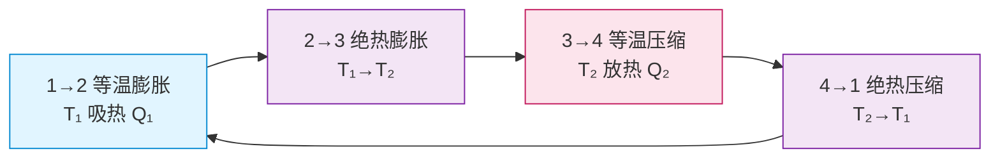
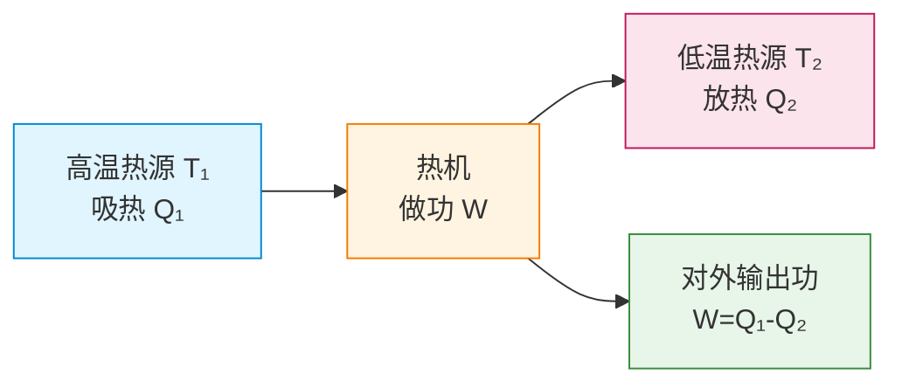
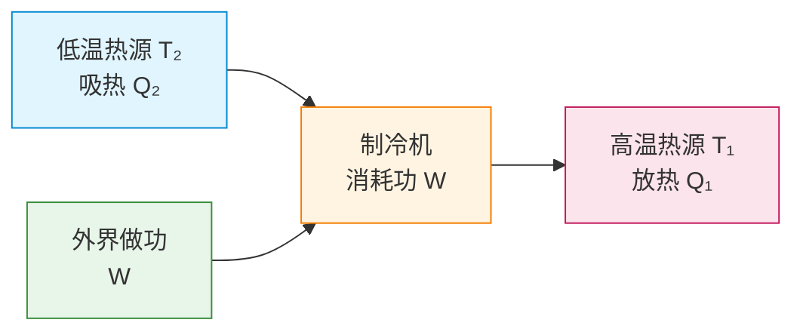

# 热力学第二定律

> [!abstract] 概览
> 热力学第一定律告诉我们"能量守恒"，但只守恒并不意味着过程可以发生——热量不会自发从低温流向高温、洒出的水不会自发收回杯子、摩擦生热不能自发变回机械能。这些"方向性"问题由**热力学第二定律**回答。本节将系统讨论第二定律的两种经典表述（克劳修斯表述、开尔文表述）及其等价性、可逆过程与不可逆过程、第二定律的统计意义（玻尔兹曼熵增）、卡诺循环与卡诺热机效率 $\eta=1-T_2/T_1$、热机与制冷机的基本原理。第二定律不仅是工程热机的核心，更深刻揭示了"时间之箭"——宏观过程的方向性。本节是热学的"思想高度最高"章节，也是与 [[04-熵与热力学第三定律]] 紧密衔接的桥梁。

## 核心概念

### 一、宏观过程的方向性

观察自然现象，我们会发现大量"单向"过程：
- 热量自发由高温传向低温，反向不会发生；
- 气体自由膨胀充满整个容器，不会自发收缩回一角；
- 摩擦生热，但热量不能自发变回机械能；
- 鸡蛋落地破碎，不会自发复原。

这些过程都**不违反能量守恒**（第一定律），但**只能沿一个方向自发进行**——这就是宏观过程的**方向性**。热力学第二定律正是描述这种方向性的普遍规律。

### 二、热力学第二定律的两种经典表述

#### 1. 克劳修斯表述（Clausius Statement, 1850）

> **热量不能自发地从低温物体传到高温物体**，而不引起其他变化。

**关键点**：
- "自发"：不需外界帮助；
- "不引起其他变化"：不能消耗电能、机械能等。
- **制冷机**可以让热量从低温传到高温，但必须消耗外界做功——这不是"自发"。

#### 2. 开尔文表述（Kelvin Statement, 1851）

> **不可能从单一热源吸热，使之完全变为功，而不产生其他影响**。

**关键点**：
- "单一热源"：只有一个温度的热源（无温差）；
- "完全变为功"：热全部转化为功；
- "不产生其他影响"：不能伴随其他变化（如气体膨胀）。
- 等价表述：**第二类永动机不可能**。

> [!note] 两种表述的物理图像
> - **克劳修斯表述**针对热传递的方向性：低温→高温非自发；
> - **开尔文表述**针对热功转化的方向性：热完全变成功非自发。
>
> 二者从不同角度揭示同一条规律——宏观过程的方向性。

### 三、两种表述的等价性

两种表述看似不同，实则等价：**若违反一种表述，则必违反另一种表述**。可以用反证法证明（推导见下文）。

> [!tip] 等价性证明思路
> 假设克劳修斯表述不成立（热量可自发从低温传到高温），构造一台机器让热量 $Q_2$ 从低温热源 $T_2$ "自发"传到高温热源 $T_1$。再让一台热机从 $T_1$ 吸热 $Q_1$、向 $T_2$ 放热 $Q_2$、对外做功 $W=Q_1-Q_2$。两机联合的总效果是：仅从 $T_1$ 吸热 $Q_1-Q_2$ 全部变成功，无其他影响——这正是开尔文表述的反例。故克劳修斯不成立 → 开尔文不成立。反向同理。
>
> 等价性意味着两种表述是同一条规律的不同侧面。

### 四、第二类永动机

**第二类永动机**：从单一热源吸热完全变为功，而无其他影响的机器。

**特点**：
- 不违反能量守恒（第一定律），但违反开尔文表述（第二定律）；
- 设想从海水吸热做功——海水量巨大，可"取之不尽"——但不可能实现。

历史上有人设想"第二类永动机"从海水取热驱动轮船，被证明违反第二定律。两类永动机对比见 [[#与第一类永动机对比]]。

### 五、可逆过程与不可逆过程

**可逆过程**：一个过程若能沿反方向进行，使系统和外界都恢复到初态而不留下任何变化，则称为可逆过程。

**不可逆过程**：无法满足上述条件的过程。

> [!note] 严格定义
> - **可逆过程**必须是**准静态**（无限缓慢进行，每时刻处于平衡态）且**无耗散**（无摩擦、无湍流）的过程——这是理想化过程。
> - 一切实际宏观过程都不可逆，因为总存在摩擦、热传导等耗散因素。

**典型不可逆过程**：
1. 热传导（高温→低温）；
2. 气体自由膨胀（真空膨胀）；
3. 摩擦生热；
4. 扩散过程；
5. 燃烧、生命过程。

> [!warning] 易错点
> "可逆"不等于"可反向操作"。如活塞压缩气体后让气体膨胀回原体积——看似反向，但摩擦做功变为热量散失，外界无法恢复，故仍不可逆。

### 六、热力学第二定律的统计意义（玻尔兹曼熵增）

宏观过程方向性的微观本质是**统计性**：系统总是从概率小的状态向概率大的状态演化，即从"有序"到"无序"。

**例子**：气体自由膨胀——初始分子集中在容器一角（少数微观态），膨胀后均匀分布（大量微观态）。"自发收缩回一角"并非绝对不可能，只是概率极小（$10^{23}$ 个分子同时回到一角的概率近乎零）。

这一思想由玻尔兹曼量化：**孤立系统的熵永不减少**（熵增原理），详见 [[04-熵与热力学第三定律]]。

### 七、卡诺循环（Carnot Cycle, 1824）

卡诺循环是法国工程师卡诺（Sadi Carnot）提出的理想热机循环，由**两个等温过程 + 两个绝热过程**构成，是热机效率的理论上限。

#### 卡诺循环的四个过程

#### p-V 图示意

卡诺循环在 $p\text{-}V$ 图上由两条等温线和两条绝热线围成闭合曲线，构成一个"近似矩形"的封闭图形。

> **过程详解**：
> - **1→2 等温膨胀**（高温 $T_1$）：气体从高温热源吸热 $Q_1$，等温膨胀对外做功 $W_1$。由等温过程 $Q=-W$，气体吸热等于对外做功。
> - **2→3 绝热膨胀**：气体继续膨胀对外做功，但 $Q=0$，由 $\Delta U=W$，内能减少，温度由 $T_1$ 降至 $T_2$。
> - **3→4 等温压缩**（低温 $T_2$）：气体被压缩，向低温热源放热 $Q_2$，外界对气体做功等于气体放热。
> - **4→1 绝热压缩**：气体继续被压缩，$Q=0$，外界做功全部转化为内能，温度由 $T_2$ 升回 $T_1$。

### 八、卡诺热机效率

#### 1. 热机效率定义

$$
\eta = \dfrac{W_{\text{净}}}{Q_1} = \dfrac{Q_1 - Q_2}{Q_1} = 1 - \dfrac{Q_2}{Q_1}
$$

其中 $Q_1$ 为从高温热源吸热，$Q_2$ 为向低温热源放热（取绝对值），$W_{\text{净}}=Q_1-Q_2$ 为净做功。

#### 2. 卡诺循环效率推导

**关键步骤**：在等温过程中，理想气体吸/放热等于做功（由 [[02-热力学第一定律]] 等温 $\Delta U=0$）：

- 1→2 等温膨胀（$T_1$）：$Q_1 = nRT_1\ln(V_2/V_1)$
- 3→4 等温压缩（$T_2$）：$Q_2 = nRT_2\ln(V_3/V_4)$

利用绝热过程关系 $TV^{\gamma-1}=$ const，可证：
$$
\dfrac{V_2}{V_1} = \dfrac{V_3}{V_4}
$$

代入消去对数项：
$$
\dfrac{Q_2}{Q_1} = \dfrac{T_2}{T_1}
$$

故卡诺循环效率为：

$$
\boxed{\eta_{\text{卡诺}} = 1 - \dfrac{T_2}{T_1}}
$$

其中 $T_1$ 为高温热源温度（K），$T_2$ 为低温热源温度（K）。

> [!tip] 关键结论
> 1. 卡诺循环效率仅与两热源温度有关，与工质无关；
> 2. $T_2$ 越低、$T_1$ 越高，效率越高；
> 3. 由于 $T_2>0$ K（绝对零度不可达，见 [[04-熵与热力学第三定律]]），效率永远小于 1；
> 4. 卡诺循环是热机效率的**理论上限**——所有实际热机效率均低于卡诺效率。

### 九、热机与制冷机

#### 热机（Heat Engine）

热机效率：$\eta = \dfrac{W}{Q_1} = 1 - \dfrac{Q_2}{Q_1}$

#### 制冷机（Refrigerator）

制冷系数：$\varepsilon = \dfrac{Q_2}{W} = \dfrac{Q_2}{Q_1 - Q_2}$

对卡诺逆循环（卡诺制冷机）：$\varepsilon_{\text{卡诺}} = \dfrac{T_2}{T_1 - T_2}$

> [!note] 热机 vs 制冷机
> - 热机：从高温吸热、向低温放热、对外做功（目的：做功）；
> - 制冷机：从低温吸热、向高温放热、消耗外界功（目的：制冷）；
> - 空调夏天制冷、冬天取暖（取暖时称"热泵"，效率比电热器高得多）。

## 推导与原理

### 一、卡诺效率 $\eta=1-T_2/T_1$ 的完整推导

设工质为 $n$ mol 理想气体，卡诺循环四步：

**1→2 等温膨胀**（$T_1$ 不变，体积 $V_1\to V_2$）：
- 等温过程 $\Delta U=0$，由第一定律 $Q_1 = -W_{1\to2}$；
- 气体对外做功 $W_{1\to2}^{\text{气}} = nRT_1\ln(V_2/V_1)$，故吸热
$$
Q_1 = nRT_1\ln\dfrac{V_2}{V_1}
$$

**2→3 绝热膨胀**（$Q=0$，$T_1\to T_2$）：
- 由 $\Delta U = W$，气体对外做功等于内能减少；
- 绝热关系 $T_1 V_2^{\gamma-1} = T_2 V_3^{\gamma-1}$，即 $\dfrac{V_2}{V_3} = \left(\dfrac{T_2}{T_1}\right)^{1/(\gamma-1)}$。

**3→4 等温压缩**（$T_2$ 不变，$V_3\to V_4$）：
- 气体放热 $Q_2 = nRT_2\ln(V_3/V_4)$（绝对值）。

**4→1 绝热压缩**（$Q=0$，$T_2\to T_1$）：
- 绝热关系 $T_2 V_4^{\gamma-1} = T_1 V_1^{\gamma-1}$，即 $\dfrac{V_4}{V_1} = \left(\dfrac{T_2}{T_1}\right)^{1/(\gamma-1)}$。

**关键比值**：由两个绝热关系得
$$
\dfrac{V_2}{V_3} = \dfrac{V_1}{V_4} \Rightarrow \dfrac{V_2}{V_1} = \dfrac{V_3}{V_4}
$$

**效率计算**：
$$
\dfrac{Q_2}{Q_1} = \dfrac{nRT_2\ln(V_3/V_4)}{nRT_1\ln(V_2/V_1)} = \dfrac{T_2}{T_1}
$$

故
$$
\eta = 1 - \dfrac{Q_2}{Q_1} = 1 - \dfrac{T_2}{T_1}
$$

证毕。

> [!warning] 温度单位
> 公式 $\eta = 1 - T_2/T_1$ 中 $T$ 必须用**热力学温度（开尔文 K）**，不能直接用摄氏度。如 $T_1=100^\circ\text{C}=373\,\text{K}$，$T_2=20^\circ\text{C}=293\,\text{K}$，效率为 $1-293/373\approx21.4\%$，而非 $1-20/100=80\%$。

### 二、第二类永动机与第一类永动机对比

> [!example] 两类永动机对比
>
> | 类别 | 内容 | 违反规律 | 是否存在 |
> | --- | --- | --- | --- |
> | 第一类永动机 | 不消耗能量持续对外做功 | 能量守恒（第一定律） | 不可能 |
> | 第二类永动机 | 从单一热源吸热完全做功 | 热力学第二定律 | 不可能 |
>
> 区分口诀：第一类"无中生有"，第二类"全变功"。

### 三、第二定律的统计意义

玻尔兹曼用统计方法给出了第二定律的微观解释：孤立系统自发过程是从**微观状态数少**的状态向**微观状态数多**的状态演化。熵 $S=k\ln\Omega$（$\Omega$ 为微观状态数）单调增加。详细推导见 [[04-熵与热力学第三定律]]。

## 典型实例与类比

### 类比一：热机如"水力发电"

把热机类比水力发电：
- **高温热源** = 高水位水库；
- **低温热源** = 低水位水库；
- **热量 $Q_1$** = 流下的水；
- **做功 $W$** = 发出的电；
- **放热 $Q_2$** = 流走的尾水。

只有存在**水位差**才能发电，类似地只有**温差**才能做功——这正对应开尔文表述"单一热源不能完全做功"。

### 类比二：房间整理与熵增

整理好的房间（少数微观态、低熵）会自发变乱（大量微观态、高熵）；要让房间从乱到整，必须消耗外界能量（做功）。这与热量自发从高温流向低温同构——都是熵增过程。

### 实例 1：蒸汽机与汽车发动机

蒸汽机：锅炉（高温 $T_1\approx 500$ K）→ 蒸汽做功 → 冷凝器（低温 $T_2\approx 300$ K）→ 卡诺效率 $1-300/500=40\%$，实际效率约 10%~15%。

汽车发动机：燃烧温度 $T_1\approx 2500$ K，排气温度 $T_2\approx 300$ K，卡诺效率 $1-300/2500=88\%$，实际效率 25%~35%（受摩擦、热损失影响）。

### 实例 2：冰箱的工作原理

冰箱以制冷剂循环：在蒸发器（低温，约 $-10^\circ\text{C}$）吸热 $Q_2$，压缩机做功 $W$ 压缩制冷剂，在冷凝器（高温，约 $40^\circ\text{C}$）放热 $Q_1=Q_2+W$。卡诺制冷系数 $\varepsilon=T_2/(T_1-T_2)$，实际冰箱 $\varepsilon$ 约 2~4，远高于 1——这意味着消耗 1 J 电能可搬运 2~4 J 热量。

### 实例 3：空调冬天取暖效率高

空调制热本质是热泵：从室外冷空气（$T_2$）吸热，向室内（$T_1$）放热。当室外 $T_2=0^\circ\text{C}=273\,\text{K}$，室内 $T_1=20^\circ\text{C}=293\,\text{K}$，卡诺供热系数 $\varepsilon_{\text{热}}=T_1/(T_1-T_2)=293/20\approx14.7$——理论上 1 J 电能可搬运 14.7 J 热量，远比电热器（1 J 电 = 1 J 热）高效。这就是"空调比电暖器省电"的物理本质。

## 例题

### 例 1：热机效率计算

**题目**：一热机从 $T_1=500\,\text{K}$ 的高温热源吸热 $Q_1=2000\,\text{J}$，向 $T_2=300\,\text{K}$ 的低温热源放热 $Q_2=1500\,\text{J}$，对外做功 $W=500\,\text{J}$。求：
（1）该热机的实际效率 $\eta_{\text{实}}$；
（2）在两热源间工作的卡诺热机效率 $\eta_{\text{卡}}$；
（3）该热机是否可能？为什么？

**分析**：实际效率 $\eta_{\text{实}}=W/Q_1$；卡诺效率 $\eta_{\text{卡}}=1-T_2/T_1$；实际效率必须 ≤ 卡诺效率。

**解答**：

（1）
$$
\eta_{\text{实}} = \dfrac{W}{Q_1} = \dfrac{500}{2000} = 25\%
$$

（2）
$$
\eta_{\text{卡}} = 1 - \dfrac{T_2}{T_1} = 1 - \dfrac{300}{500} = 40\%
$$

（3）$\eta_{\text{实}}=25\% < \eta_{\text{卡}}=40\%$，未违反卡诺定理，理论上可能。但需注意效率越接近卡诺效率，对工艺要求越高（接近可逆过程）。

**点评**：判断热机是否可能，关键是与同热源下的卡诺效率比较——超过卡诺效率即不可能。

### 例 2：卡诺热机的热量计算

**题目**：一卡诺热机在 $T_1=600\,\text{K}$ 和 $T_2=300\,\text{K}$ 两热源间工作，每个循环对外做功 $W=1000\,\text{J}$。求：
（1）热机效率 $\eta$；
（2）每个循环从高温热源吸热 $Q_1$；
（3）每个循环向低温热源放热 $Q_2$。

**分析**：卡诺效率 $\eta=1-T_2/T_1$；由 $\eta=W/Q_1$ 求 $Q_1$；由 $W=Q_1-Q_2$ 求 $Q_2$。

**解答**：

（1）
$$
\eta = 1 - \dfrac{T_2}{T_1} = 1 - \dfrac{300}{600} = 50\%
$$

（2）$Q_1 = W/\eta = 1000/0.5 = 2000\,\text{J}$

（3）$Q_2 = Q_1 - W = 2000 - 1000 = 1000\,\text{J}$

**点评**：注意 $T$ 必须用开尔文温度。卡诺循环效率仅由两热源温度决定，与工质、循环量无关。

### 例 3：制冷机计算

**题目**：一卡诺制冷机从 $-10^\circ\text{C}$ 的冷库吸热，向 $30^\circ\text{C}$ 的环境放热，每个循环吸热 $Q_2=500\,\text{J}$。求：
（1）制冷系数 $\varepsilon$；
（2）每个循环消耗的功 $W$；
（3）每个循环向环境放出的热量 $Q_1$。

**分析**：温度化为开尔文；卡诺制冷系数 $\varepsilon=T_2/(T_1-T_2)$；由 $\varepsilon=Q_2/W$ 求 $W$。

**解答**：

冷库温度 $T_2=-10^\circ\text{C}=263\,\text{K}$，环境温度 $T_1=30^\circ\text{C}=303\,\text{K}$。

（1）
$$
\varepsilon = \dfrac{T_2}{T_1-T_2} = \dfrac{263}{303-263} = \dfrac{263}{40} \approx 6.58
$$

（2）$W = Q_2/\varepsilon = 500/6.58 \approx 76\,\text{J}$

（3）$Q_1 = Q_2 + W = 500 + 76 = 576\,\text{J}$

**点评**：制冷系数 $\varepsilon$ 可以大于 1——这与热机效率 $\eta<1$ 不同。原因是制冷机"搬运"热量而非"转化"能量，输入的功只是"差量"。冬天空调制热效率高的物理基础正在于此。

### 例 4：第二定律概念辨析

**题目**：判断下列说法是否正确，并简述理由：
（1）热量可以从低温物体传到高温物体；
（2）效率大于 100% 的热机不可能；
（3）冰融化成水是可逆过程；
（4）气体自由膨胀是不可逆过程。

**分析**：依据第二定律两种表述及可逆/不可逆概念判断。

**解答**：

（1）==正确==。制冷机即可让热量从低温传到高温，但需消耗外界做功。第二定律强调"自发"传热不可，但通过外界做功可以。

（2）==错误==。效率大于 100% 违反的是**第一定律**（能量守恒），不是第二定律。第二定律限制效率不超过卡诺效率（永远 <100%）。

（3）==错误==。冰融化吸热、水凝固放热，看似可逆；但实际过程中必有温度梯度、热量从高温流向低温的耗散，整体不可逆。理想等温相变可视为可逆，但自然界中的相变都不可逆。

（4）==正确==。气体自由膨胀过程中无做功、无热交换（$W=Q=0$，$\Delta U=0$），但分子分布从有序到无序，熵增加，故不可逆。

**点评**：第二定律的辨析题关键在"自发"二字——非自发（消耗外界能量）的过程并不违反第二定律。同时要注意效率 >100% 与 >卡诺效率的区别。

## 易错提醒

> [!warning] 易错点
> 1. **温度单位**：所有热力学公式中的温度必须用开尔文（K），$T=t+273.15\,\text{K}$。
> 2. **第二定律表述**：克劳修斯针对热传递方向，开尔文针对热功转化方向——不可混用。
> 3. **"单一热源"含义**：开尔文表述中"单一热源"指只有一个温度的热源，不是"一个物体"。
> 4. **可逆过程定义**：可逆 ≠ 反向操作；必须是准静态 + 无耗散，自然界实际过程均不可逆。
> 5. **卡诺效率公式**：$\eta=1-T_2/T_1$ 仅适用于卡诺循环，普通热机效率 $\eta=W/Q_1$。
> 6. **效率大于 100% 与大于卡诺效率**：前者违反第一定律，后者违反第二定律——区分清楚。
> 7. **第二类永动机**：不违反第一定律，仅违反第二定律，"从单一热源吸热完全做功"。

> [!note] 概念辨析
> **可逆 vs 不可逆**：
> - 可逆过程是理想化模型（如无摩擦的准静态过程）；
> - 实际过程都不可逆，但有些可近似为可逆（如缓慢等温压缩）。
>
> **热机 vs 制冷机**：
> - 热机：高温→低温做功，输出功为目的；
> - 制冷机：低温→高温放热，制冷为目的，消耗功；
> - 同一台机器可双向工作（空调可制冷也可制热）。
>
> **效率 vs 制冷系数**：
> - 效率 $\eta=W/Q_1<1$（始终）；
> - 制冷系数 $\varepsilon=Q_2/W$ 可大于 1（实际冰箱 $\varepsilon\approx 2\sim4$）。

## 与其他知识关联

- 与 [[01-热传递与功]] 的关系：热传递方向性是克劳修斯表述的基础。
- 与 [[02-热力学第一定律]] 的关系：第一定律管"守恒"，第二定律管"方向"——两者互补。
- 与 [[04-熵与热力学第三定律]] 的关系：第二定律的定量表述即熵增原理，第三定律给出绝对零度不可达。
- 与 [[01-分子动理论/04-内能与分子动能]] 的关系：理想气体过程分析的基础。
- 与 [[02-气体/04-理想气体状态方程]] 的关系：卡诺循环中 $pV=nRT$ 用于等温过程计算。
- 与 [[02-气体/02-玻意耳定律]] 的关系：等温过程 $pV=$ const 是卡诺循环的两条等温线基础。
- 与 [[02-恒定电流/03-电功与电功率]] 的关系：焦耳热完全转化为内能，是第二定律限制"热完全变功"反向的实例。
- 与 [[机械振动]] 的关系：简谐运动是无耗散理想过程，可视为可逆的力学类比。
- 高中—大学衔接：[[热力学]]（卡诺定理、克劳修斯不等式）、[[统计物理]]（玻尔兹曼分布、配分函数）。
- 返回 [[00-热学总览]]

## 作者的话

> [!quote] 个人理解
> 热力学第二定律是物理学中最深刻的定律之一，因为它揭示了**时间的方向**。牛顿力学、麦克斯韦方程组、薛定谔方程都是时间反演对称的——若把时间倒流，方程依然成立。但热力学第二定律告诉我们：实际过程只能沿一个方向进行。鸡蛋碎了不能复原、热量从热到凉不能自发反向——这就是"时间之箭"，由熵增决定。
>
> 卡诺循环的伟大在于揭示了**热机效率的理论上限**。1824 年卡诺在能量守恒定律建立之前就提出了这一思想——他凭直觉意识到"温差是热机的本质"。今天我们知道，任何热机都受 $\eta\le1-T_2/T_1$ 的制约——这是工程的极限，也是物理的真理。
>
> 学习建议：卡诺循环的四个过程要画图记忆——$p\text{-}V$ 图上两条等温线夹两条绝热线的"菱形"图像，每个顶点对应一个状态、每条边对应一个过程，配合能量流向图，效率公式自然浮现。第二定律的概念辨析要紧扣"自发"二字——很多看似违反第二定律的现象（如制冷机），其实都有外界做功作为"补偿"。
>
> 哲学思考：第二定律与生命现象形成有趣的张力——薛定谔在《生命是什么》中提出"生命以负熵为食"。生物体通过摄取低熵（有序）食物、排出高熵（无序）废物，维持自身有序结构。这是否意味着生命"违反"第二定律？不——因为生命体不是孤立系统，它从环境汲取负熵的同时，环境熵增加更多，整体熵仍增。生命的"逆熵"是局部现象，宇宙整体的熵增不可阻挡——这正是"时间之箭"在生命科学中的回响。

---
*返回 [[00-热学总览]]*
