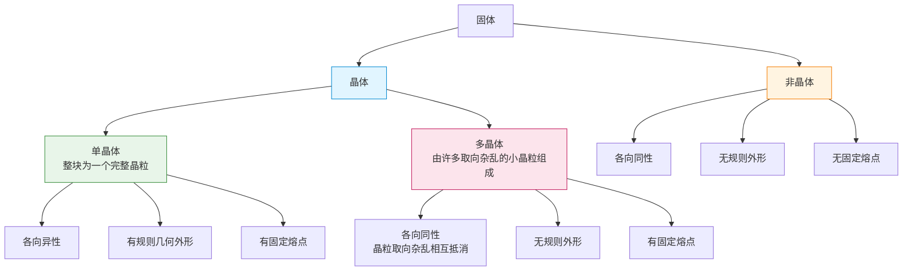

# 固体与晶体

> [!abstract] 概览
> 本节是热学==物态变化==版块的起点，从固体的微观结构入手，建立"晶体—非晶体""单晶体—多晶体"两大分类体系。核心要点有四：晶体内部原子按==空间点阵==规则排列、有固定熔点；非晶体内部原子排列无序、==无固定熔点==；单晶体==各向异性==、多晶体==各向同性==（因晶粒取向杂乱相互抵消）；液晶介于液体与晶体之间，既有流动性又有光学各向异性。本节为后续 [[02-液体与表面张力]]、[[03-物态变化与相变潜热]] 提供凝聚态结构基础，也是大学 [[相变与流体]]、[[固体物理]] 的入门。

## 核心概念

### 一、固体的分类

**固体**：物质在常温下具有一定体积和形状的聚集态。按内部原子（或分子、离子）排列是否具有==长程有序性==，固体可分为两大类：

$$
\boxed{\,\text{固体} \begin{cases} \text{晶体（crystal）——原子规则排列，有固定熔点} \\ \text{非晶体（amorphous）——原子无序排列，无固定熔点} \end{cases}\,}
$$

晶体又可按晶粒尺寸进一步细分：

### 二、晶体与非晶体

#### 1. 晶体（crystal）

**晶体**：内部原子（或分子、离子）按一定规律在空间中==规则排列==形成空间点阵的固体。

晶体的宏观特征：
- ==有固定熔点==——加热到一定温度开始熔化，熔化过程中温度保持不变；
- ==各向异性==（单晶体）——不同方向上物理性质（如导热系数、电阻率、折射率、机械强度等）不同；
- ==有规则的自然几何外形==——如食盐晶体为立方体、石英为六方柱、雪花为六角形。

> [!note] 晶体规则外形的来源
> 晶体的规则外形是其内部==空间点阵==的宏观表现——原子按规律堆叠，外表面自然形成平整的晶面。这是"微观结构决定宏观形态"的典型例证。

#### 2. 非晶体（amorphous）

**非晶体**：内部原子（或分子）排列==无长程规则==，仅有短程有序性的固体。

非晶体的宏观特征：
- ==无固定熔点==——加热时先变软、再变稠、最后变为液体，温度连续上升，存在"软化温度范围"；
- ==各向同性==——各方向物理性质相同；
- ==无规则的自然几何外形==。

> [!example] 常见非晶体
> 玻璃、沥青、松香、石蜡、橡胶、塑料（多数）。其中玻璃是最典型的非晶体，故非晶体有时也叫"==过冷液体=="——其内部结构更接近液体，只是黏度极大表现为固体。

### 三、单晶体与多晶体

晶体按晶粒大小可分为单晶体与多晶体：

| 比较项 | 单晶体（single crystal） | 多晶体（polycrystal） |
| --- | --- | --- |
| 微观结构 | 整块为一个完整晶粒，原子排列整体规则 | 由许多取向杂乱的小晶粒（晶粒间为晶界）组成，每个晶粒内部规则 |
| 各向异性 | ==各向异性==（不同方向物理性质不同） | ==各向同性==（晶粒取向杂乱，宏观上相互抵消） |
| 几何外形 | 有规则的自然几何外形 | 无规则外形 |
| 熔点 | ==有固定熔点== | ==有固定熔点== |
| 典型实例 | 石英单晶、食盐颗粒、单晶硅、蓝宝石、雪花 | 各种金属（铁、铜、铝）、陶瓷、岩石 |

> [!warning] 多晶体为什么各向同性？
> 多晶体中每个晶粒内部仍是各向异性的，但==晶粒取向杂乱无章==，宏观上的物理性质是各晶粒各向异性的==统计平均==，结果表现为各向同性。这与"非晶体各向同性"的原因==不同==——非晶体是结构本身无序，多晶体是结构有序但取向杂乱。

### 四、空间点阵

**空间点阵**（space lattice）：晶体内部原子（或离子、分子）在三维空间中按一定几何规律==周期性排列==形成的网格结构。

空间点阵的基本要素：
- **结点**（lattice point）：原子（或离子、分子）的平衡位置；
- **晶胞**（unit cell）：能通过平移复制铺满整个晶格的最小重复单元；
- **晶格常数**：晶胞的边长与夹角。

常见的晶格类型：
- **简单立方**（如 Po 钋）；
- **体心立方**（如 Fe、Cr、W 钨）；
- **面心立方**（如 Cu、Al、Au）；
- **六方密堆积**（如 Zn、Mg）；
- **离子晶格**（如 NaCl 食盐——Na⁺与 Cl⁺交替排列成立方点阵）。

> [!tip] 空间点阵与各向异性的关系
> 晶体的==各向异性==正是源于空间点阵中==不同方向上原子排列密度不同==。例如立方晶体中沿棱边方向与沿体对角线方向，单位长度上的原子数不同，故导电、导热、折射等性质不同。

### 五、液晶

**液晶**（liquid crystal）：介于液体与晶体之间的一种物态，==既有液体的流动性，又有晶体的光学各向异性==。

液晶分子多为==长棒状==（如芳香族化合物），在某一温度范围内既可流动又保持一定的取向有序性。按分子排列方式分为三类：

| 类型 | 分子排列特征 | 典型实例 |
| --- | --- | --- |
| 近晶相（smectic） | 分子分层排列，层内分子长轴平行 | 肥皂水 |
| 向列相（nematic） | 分子长轴平行但位置无序 | MBBA |
| 胆甾相（cholesteric） | 分子分层排列，相邻层方向略偏转呈螺旋 | 胆甾醇酯 |

> [!example] 液晶显示器（LCD）原理
> LCD 利用的就是向列相液晶在电场作用下分子取向变化的特性。液晶分子夹在两片偏振片之间，无电场时分子扭曲使偏振光通过；加电场时分子沿场方向排列，光被第二片偏振片阻挡，对应像素变暗。这就是 LCD 显示图像的基本原理——液晶本身不发光，只控制光的通过。

### 六、晶体的 X 射线衍射

1912 年，德国物理学家劳厄（M. von Laue）发现 X 射线通过晶体时会产生==衍射斑点==，这一发现一箭双雕：既证明了 X 射线是电磁波，又证明了晶体内部存在规则排列的原子点阵。

英国物理学家布拉格父子（W. H. Bragg & W. L. Bragg）给出衍射条件——==布拉格公式==：

$$
\boxed{\,2d\sin\theta = n\lambda\,}
$$

其中 $d$ 为晶面间距，$\theta$ 为入射 X 射线与晶面的掠射角，$\lambda$ 为 X 射线波长，$n$ 为衍射级次（正整数）。

> [!note] X 射线衍射的意义
> X 射线衍射是研究晶体结构的==最重要实验手段==，可测定晶格常数、原子位置、晶体缺陷等。DNA 双螺旋结构的发现（Watson & Crick, 1953）正是基于 Franklin 的 X 射线衍射照片"Photo 51"。这是物理学方法推动生物学的经典案例。

## 推导与原理

### 一、晶体为什么有固定熔点？

晶体内部的原子按空间点阵规则排列，原子间结合能==处处相同==。加热晶体时，热能逐渐增加原子振动幅度；当热能达到结合能阈值时，原子开始脱离点阵位置——这就是==熔化==。由于所有原子处于等价位置，破坏点阵所需能量一致，故熔化过程中==温度保持不变==，全部吸收的热量用于克服结合能（即==熔化热==，详见 [[03-物态变化与相变潜热]]）。

非晶体原子所处环境各异，结合能连续分布，加热时结合能较弱的原子先脱离，较强的后脱离，故==温度连续上升==，无明确熔点。

### 二、单晶体各向异性的微观解释

以立方晶体为例，沿棱边方向单位长度上的原子数为 $1/a$（$a$ 为晶格常数），沿体对角线方向单位长度上的原子数为 $\sqrt{3}/(a\sqrt{3})=1/a$……实际上不同方向上原子排列密度、相邻原子的距离与角度均不同，导致：
- 沿不同方向==声子传播速度==不同 → 导热系数各向异性；
- 沿不同方向==电子散射截面==不同 → 电阻率各向异性；
- 沿不同方向==极化率==不同 → 折射率各向异性。

> [!tip] 直观类比
> 想象一片方格纸——沿横纵方向数格子与沿对角线方向数格子，单位长度的格点数不同。这就是晶体各向异性的二维直观图。

### 三、多晶体各向同性的统计平均

设某单晶体在方向 $\theta$ 上的某物理量为 $P(\theta)$。多晶体含 $N$ 个取向杂乱的晶粒，取向分布均匀。宏观上测得的物理量：

$$
\bar{P} = \dfrac{1}{N}\sum_{i=1}^{N} P(\theta_i) \xrightarrow{N\to\infty} \dfrac{1}{2\pi}\int_0^{2\pi} P(\theta)\,d\theta = \text{const}
$$

由于 $\theta_i$ 均匀分布，平均后与方向无关，故==多晶体各向同性==。这是"杂乱取向消除各向异性"的统计效应。

### 四、液晶与相变

液晶相是物质在固相与液相之间的==中间相==（mesophase）。升温过程：固态晶体（分子位置有序 + 取向有序）→ 液晶相（位置无序但取向有序）→ 各向同性液体（位置与取向均无序）。这种"位置有序先消失、取向有序后消失"的逐步转变是==连续相变==的典型例子（详见 [[03-物态变化与相变潜热]]）。

## 典型实例与类比

### 实例 1：鉴别晶体与非晶体的"熔点法"

将待测固体研碎放入试管，插入温度计，缓慢加热并记录温度—时间曲线：
- 若温度—时间曲线出现==平台段==（温度不变）→ 晶体；
- 若温度—时间曲线==连续上升==无平台 → 非晶体。

> [!warning] 多晶体也有平台
> 多晶体虽外观无规则、各向同性，但仍==有固定熔点==，加热曲线有平台。鉴别晶体与非晶体要看==是否有固定熔点==，而非外形或各向异性。

### 实例 2：单晶硅与多晶硅的工业应用

- ==单晶硅==：整个硅棒为一个完整晶粒，原子排列高度规则，电子迁移率高，用于制造高性能集成电路芯片（CPU、存储器）。
- ==多晶硅==：由许多小晶粒组成，制备成本低，但晶界处存在缺陷，电子迁移率较低，用于制造太阳能电池板。

> [!example] 为什么单晶硅比多晶硅贵？
> 单晶硅需用"直拉法"（Czochralski 法）缓慢拉制，整个过程保持单一晶种取向，速度慢、能耗高、成品率低；多晶硅可用浇铸法大量生产。这正是"晶体完整性 vs 制备成本"的工程权衡。

### 实例 3：雪花为什么是六角形？

雪花是水的==单晶体==——冰的晶格属于六方晶系，分子沿六个方向等价排列。雪花在云中凝结生长时，沿这六个等价方向==等速生长==，故形成六角对称的雪花。每片雪花的具体花纹因温度、湿度变化而异，但六角对称是晶格结构的必然——"==微观晶格决定宏观对称=="。

### 类比：晶体、多晶体、非晶体的"队列比喻"

- **单晶体**：阅兵方阵——所有人整齐排列、朝向一致，整体规则；
- **多晶体**：广场人群——分若干小团体，每个小团体内部排列整齐，但团体之间朝向各异，整体看无规则；
- **非晶体**：散场后的人群——彼此位置无规律，只是挤在一起。

> [!tip] 记忆口诀
> ==晶体有熔点非晶无，单晶各向异多晶同；空间点阵原子排，规则结构固定熔；液晶流动又有序，电场一加显神通；X 射线衍射法，布拉格公式定晶格。==

## 例题

### 例 1：基础——晶体与非晶体辨识

**题目**：关于晶体和非晶体，下列说法正确的是（　）。
A. 晶体有固定熔点，非晶体没有固定熔点
B. 单晶体各向同性，多晶体各向异性
C. 凡是各向同性的固体一定是非晶体
D. 凡是具有规则几何外形的固体一定是单晶体

**分析**：
- A 正确：这是晶体与非晶体的根本区别；
- B 错误：正好相反——单晶体各向异性，多晶体各向同性；
- C 错误：多晶体各向同性但仍是晶体；
- D 错误：多晶体经人工切割打磨可具有规则外形，但其本质不是单晶体；非晶体（如玻璃）也可被加工成规则外形。

**解答**：==A==。

**点评**：本题考查晶体分类的核心概念。易错点是 C——多晶体各向同性但==仍是晶体==。判断晶体的关键不是各向异性，而是==是否有固定熔点==。

### 例 2：中难——多晶体物理性质分析

**题目**：一块由许多小晶粒组成的金属铜，关于其物理性质，下列判断正确的是（　）。
A. 没有固定的熔点
B. 整体表现为各向异性
C. 各方向上的电阻率相同
D. 内部原子排列完全无序

**分析**：金属铜是典型的==多晶体==：
- A 错误：多晶体仍是晶体，==有固定熔点==；
- B 错误：多晶体各晶粒取向杂乱，宏观上==各向同性==；
- C 正确：因各向同性，各方向电阻率相同；
- D 错误：每个晶粒内部原子排列规则，只是晶粒之间取向不同。

**解答**：==C==。

**点评**：本题核心是理解多晶体"==微观有序、宏观各向同性=="的特点。多晶体的各向同性来自统计平均，而非结构无序——这是与非晶体各向同性的本质区别。

### 例 3：进阶——布拉格公式应用

**题目**：用波长 $\lambda = 0.154\,\text{nm}$ 的 X 射线（Cu K$\alpha$ 线）照射某立方晶体的某一晶面族，在掠射角 $\theta = 17.5^\circ$ 处观察到一级衍射峰（$n=1$）。求该晶面族的晶面间距 $d$。

**分析**：直接套用布拉格公式 $2d\sin\theta=n\lambda$，已知 $n=1$、$\lambda=0.154\,\text{nm}$、$\theta=17.5^\circ$，可解出 $d$。

**解答**：
$$
d = \dfrac{n\lambda}{2\sin\theta} = \dfrac{1\times 0.154\,\text{nm}}{2\sin 17.5^\circ}
$$
$\sin 17.5^\circ \approx 0.301$，故
$$
d \approx \dfrac{0.154}{2\times 0.301}\,\text{nm} \approx 0.256\,\text{nm}
$$

**点评**：布拉格公式是 X 射线衍射分析的==核心工具==——已知波长测角度可定晶格常数（结构分析），已知晶格常数测角度可定波长（光谱分析）。本题属于前者，是大学 [[固体物理]] 与材料科学的基础实验方法。

## 易错提醒

> [!warning] 易错点
> 1. **多晶体不是非晶体**：多晶体有固定熔点，仍是晶体；非晶体无固定熔点。判断晶体与否看熔点，不看各向异性。
> 2. **各向同性 ≠ 非晶体**：多晶体各向同性、非晶体各向同性，但二者微观结构完全不同——多晶体晶粒内部有序，非晶体无序。
> 3. **晶体的规则外形需"自然形成"**：人为切割出的规则外形不能说明晶体性。雪花的六角对称是晶格结构的自然体现。
> 4. **液晶不是液态晶体**：液晶是介于液相与固相之间的独立物态，有特定温度区间，温度过高变液体、过低变固体。
> 5. **空间点阵≠分子结构**：空间点阵描述==原子==的周期性排列，与分子的化学结构（共价键、官能团等）是不同概念。

> [!note] 概念辨析
> **单晶体 vs 多晶体**：
> - 单晶体：整块为单一晶粒，各向异性，有规则外形，如单晶硅、石英；
> - 多晶体：由许多小晶粒组成，各向同性，无规则外形，如铜、铁。
>
> **晶体 vs 非晶体**：
> - 晶体：原子规则排列，有固定熔点（包括单晶体与多晶体）；
> - 非晶体：原子无序排列，无固定熔点，如玻璃、沥青。
>
> **液晶 vs 液体 vs 晶体**：
> - 晶体：位置有序 + 取向有序；
> - 液晶：位置无序 + 取向有序（介于二者之间）；
> - 液体：位置无序 + 取向无序。

## 与其他知识关联

- 与 [[01-固体与晶体]] 的关系：本节即为固体与晶体部分，奠定物态变化的微观结构基础。
- 与 [[02-液体与表面张力]] 的关系：固液界面的浸润性取决于固体与液体分子间作用力，本节的晶体结构知识是理解毛细现象的前提。
- 与 [[03-物态变化与相变潜热]] 的关系：晶体熔化时吸收==熔化热==而温度不变，正是空间点阵结合能的体现；非晶体无固定熔点则因其结合能连续分布。
- 与 [[01-分子动理论/03-分子力与分子势能]] 的关系：晶体空间点阵的稳定性来自分子（原子）力的平衡——原子在势阱底部振动，温度升高振动加剧直至脱离点阵。
- 与 [[03-热力学定律/02-热力学第一定律]] 的关系：熔化过程中 $\Delta U = Q + W$，吸收的熔化热全部用于增加分子势能（脱离点阵），平均动能不变故温度不变。
- 与电学联系：[[03-磁场/04-带电粒子在磁场中的运动]] 中带电粒子在单晶硅中的运动受晶格散射影响；液晶在电场中的应用（LCD）是固体物理与电磁学的交叉。
- 高中—大学衔接：[[相变与流体]] 中一级相变与连续相变；[[固体物理]] 中倒格子、布里渊区、能带理论；[[热力学]] 中相律与相图。
- 与力学联系：晶体中原子的振动（声子）与机械振动密切相关，是 [[机械振动]] 的微观对应。
- 返回 [[00-热学总览]]

## 作者的话

> [!quote] 个人理解
> 固体与晶体这一节看似"科普性"较强，实则蕴含深刻的物理思想——==微观结构决定宏观性质==。同是碳原子，按四面体键合就是金刚石（最硬），按层状排列就是石墨（最软的润滑剂之一），按球形笼状就是富勒烯 $C_{60}$，卷成管状就是碳纳米管。原子的排列方式比原子本身更能决定材料性质，这是材料科学的根本信念。
>
> 液晶的发现史颇具启发意义。1888 年奥地利植物学家 Reinitzer 在研究胆甾醇苯甲酸酯时，发现该物质在 $145.5^\circ\text{C}$ 熔化后呈现"浑浊液体"，到 $178.5^\circ\text{C}$ 才变为透明液体。这种"两次熔化"现象被 Lehmann 命名为"液晶"。==一种物态的发现不是来自理论预言，而是来自一个细心观察的实验家==——这是科学史的常态。
>
> LCD 的发明则展示了基础研究如何转化为颠覆性技术。1960 年代以前，显示器主要靠显像管（CRT），笨重耗电；LCD 利用液晶分子在电场中的取向变化，使显示器变得轻薄省电，从电子表、计算器到笔记本电脑、手机、电视，彻底改变了人机交互。这是物理学推动信息革命的典型案例——==一个看似冷门的物态研究，催生了万亿级产业==。
>
> 学习本节，建议读者重点把握"==微观结构→宏观性质=="的思维链条：空间点阵 → 各向异性 → 固定熔点；晶粒杂乱取向 → 各向同性 → 仍属晶体；长棒状分子 → 流动+取向有序 → 液晶。这种"由微观解释宏观"是凝聚态物理的灵魂，也是后续 [[相变与流体]]、统计物理的研究范式。

---
*返回 [[00-热学总览]]*
