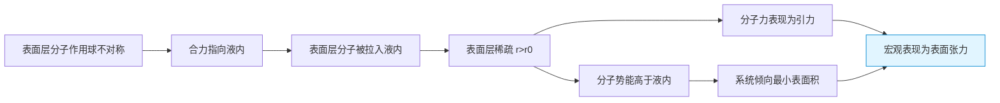

# 液体与表面张力

> [!abstract] 概览
> 本节是热学==物态变化==版块的第二节，研究对象从固体转向液体，核心是液体==表面层==分子受力不平衡所引发的表面现象。重点掌握五大概念：液体分子特点（分子间距介于固气之间、分子力为引力）、==表面张力==（表面层分子稀疏、分子力为引力）、表面张力系数 $\sigma$（与液体种类、温度、杂质有关）、==毛细现象==（浸润液面上升、不浸润液面下降）、弯曲液面附加压强（拉普拉斯公式 $\Delta p = 2\sigma/R$）。本节用分子力与分子势能曲线对表面张力给出微观解释，是 [[01-分子动理论/03-分子力与分子势能]] 的直接应用，并为 [[03-物态变化与相变潜热]] 中饱和蒸汽压、相变潜热作铺垫。

## 核心概念

### 一、液体分子的特点

液体介于固体与气体之间，其分子结构有如下特征：

| 比较项 | 固体 | 液体 | 气体 |
| --- | --- | --- | --- |
| 分子间距 | 最近（约 $r_0$） | 略大于 $r_0$ | 远大于 $r_0$ |
| 分子力 | 强引力（束缚） | 较强引力（束缚但可移动） | 几乎可忽略 |
| 分子排列 | 长程有序（晶体） | 短程有序、长程无序 | 完全无序 |
| 分子运动 | 在平衡位置振动 | 在平衡位置附近振动+迁移 | 自由平动 |

液体分子的关键特征：
- 分子间距 $r$ 略大于平衡距离 $r_0$，==分子力表现为引力==；
- 分子受周围分子（"作用球"内）的束缚，但束缚不如固体强，故可在液体内部==缓慢迁移==（无固定形状但有一定体积）；
- 分子作用球半径约等于分子力有效作用距离 $R \sim 10^{-9}\,\text{m}$。

### 二、液体的表面张力

#### 1. 现象

将一根缝衣针轻轻放在水面上，针会==漂浮==——不是浮力（针密度远大于水），而是水的==表面张力==把它"托住"。雨滴、露珠呈球形，水黾能在水面行走，都是表面张力的体现。

#### 2. 定义

**表面张力**：液体表面层相邻部分之间相互吸引的力，方向==沿液体表面==（切向），使液体表面有==收缩到最小面积==的趋势。

$$
\boxed{\,F = \sigma L\,}
$$

其中：
- $F$ 为表面张力（$\text{N}$）；
- $\sigma$ 为表面张力系数（$\text{N/m}$）；
- $L$ 为液面边界线的长度（$\text{m}$）。

#### 3. 方向

表面张力方向==沿液面切向、垂直于边界线==，指向液面收缩方向。若液面是弯曲的（如液滴球面），则表面张力沿球面切向。

### 三、表面张力系数 $\sigma$

**表面张力系数** $\sigma$：单位长度液面边界上的表面张力，单位 $\text{N/m}$（也等于 $\text{J/m}^2$，表示单位面积的表面能）。

影响 $\sigma$ 的因素：

| 因素 | 影响 | 说明 |
| --- | --- | --- |
| 液体种类 | 不同液体 $\sigma$ 差异大 | 水（$20^\circ\text{C}$）$\sigma\approx 7.28\times 10^{-2}\,\text{N/m}$；水银 $\sigma\approx 0.47\,\text{N/m}$；酒精 $\sigma\approx 2.23\times 10^{-2}\,\text{N/m}$ |
| 温度 | 温度升高 $\sigma$ 减小 | 温度高分子热运动剧烈，分子间引力相对减弱 |
| 杂质 | 表面活性剂使 $\sigma$ 减小 | 肥皂、洗洁精等显著降低水的 $\sigma$；电解质（如 NaCl）使 $\sigma$ 略增 |

> [!example] 表面活性剂的去污原理
> 洗洁精、肥皂含==表面活性剂==分子，一端亲水、一端亲油。它们富集在水表面，使水的表面张力系数显著减小，水更容易==渗入衣物纤维与油污之间==，把油污"拽"入水中。这就是表面活性剂去污的物理本质。

### 四、毛细现象

#### 1. 浸润与不浸润

**浸润**（wetting）：液体与固体接触时，液面==沿固体表面扩展==的接触状态（接触角 $\theta < 90^\circ$）。例如水对玻璃、酒精对玻璃。

**不浸润**（non-wetting）：液体与固体接触时，液面==沿固体表面收缩==的接触状态（接触角 $\theta > 90^\circ$）。例如水银对玻璃、水对石蜡。

> [!note] 接触角
> 接触角 $\theta$ 是液面与固体表面在接触点处的夹角（在液体内部测量）：
> - $\theta = 0^\circ$：完全浸润（液面铺展成膜）；
> - $0^\circ < \theta < 90^\circ$：浸润；
> - $\theta = 90^\circ$：临界；
> - $90^\circ < \theta < 180^\circ$：不浸润；
> - $\theta = 180^\circ$：完全不浸润。
>
> 浸润与否由==液体内聚力==与==液固附着力==的相对大小决定：附着力 > 内聚力 → 浸润；反之 → 不浸润。

#### 2. 毛细现象

**毛细现象**：将毛细管（内径极细的管）插入液体中，浸润液体在管内==上升==、不浸润液体在管内==下降==的现象。

毛细管中液面上升高度公式（浸润液体）：

$$
\boxed{\,h = \dfrac{2\sigma\cos\theta}{\rho g r}\,}
$$

其中：
- $\sigma$ 为液体表面张力系数；
- $\theta$ 为接触角（完全浸润时 $\theta=0^\circ$，$\cos\theta=1$）；
- $\rho$ 为液体密度；
- $g$ 为重力加速度；
- $r$ 为毛细管内半径。

> [!tip] 公式记忆
> 公式可拆解为：表面张力提供上举力 $2\pi r\sigma\cos\theta$，重力提供下拉力 $\pi r^2 h\rho g$，二者平衡：$2\pi r\sigma\cos\theta = \pi r^2 h\rho g$，化简即得 $h = 2\sigma\cos\theta/(\rho g r)$。

#### 3. 毛细现象的应用

- **灯芯吸油**：灯芯由无数细小纤维构成毛细管，靠毛细力将油持续吸到燃烧端；
- **植物水分运输**：植物木质部导管是天然的毛细管，水靠毛细力与蒸腾拉力从根部运到叶端（巨杉可达百米）；
- **土壤保水**：土壤颗粒间形成毛细管，地下水位较高时水沿毛细管上升供植物吸收；
- **毛巾吸水**：毛巾纤维间形成毛细管，水被吸入；
- **焊接**：焊锡浸润金属，毛细力使焊锡渗入缝隙，形成牢固连接。

### 五、弯曲液面的附加压强

#### 1. 现象

弯曲液面（如液滴球面、气泡球面）两侧存在==压强差==，凹侧压强大于凸侧——这就是==附加压强==。例如肥皂泡内部压强大于外部。

#### 2. 拉普拉斯公式

对球形液面（曲率半径 $R$），附加压强为：

$$
\boxed{\,\Delta p = p_{\text{内}} - p_{\text{外}} = \dfrac{2\sigma}{R}\,}
$$

对肥皂泡（有==内外两个==液面），附加压强为：

$$
\Delta p_{\text{皂泡}} = \dfrac{4\sigma}{R}
$$

> [!warning] 液滴 vs 皂泡
> - **液滴**（如水滴）：只有一个液面（外表面），$\Delta p = 2\sigma/R$；
> - **气泡**（水中气泡）：也只有一个液面，$\Delta p = 2\sigma/R$；
> - **皂泡**（空气中肥皂泡）：有内外两个液面，$\Delta p = 4\sigma/R$。
>
> 注意区分"水中气泡"与"空气中皂泡"——前者单层液膜，后者双层。

## 推导与原理

### 一、表面张力的微观解释

#### 1. 表面层分子稀疏

液体内部某分子受周围分子作用球内所有分子的合力为零（对称）。但==表面层==（厚度约等于分子作用半径 $R$）内的分子，作用球只有一部分在液体内（下方），另一部分在液面外（上方，气相分子稀少），受力==不对称==——上方缺少引力，合力==指向液体内部==。

这一向内的合力使得表面层分子倾向于==被拉入液内==，导致表面层分子数密度==小于液内==——表面层==稀疏==，分子间距 $r > r_0$，分子力表现为==引力==。相邻表面层分子之间相互吸引，形成宏观的表面张力。

#### 2. 表面层分子势能高于内层

由 [[01-分子动理论/03-分子力与分子势能]] 的分子势能曲线：当 $r > r_0$ 时分子势能 $E_p > E_{p,\min}$（势阱底）。表面层分子稀疏、$r > r_0$，故表面层分子势能==高于液内==。

> [!note] 表面能与表面张力系数的关系
> 系统倾向于==最低能量状态==（热力学第二定律），故液体倾向于==最小表面积==——这就是表面张力使液面收缩的根源。增加单位液面面积所需做的功，即等于单位面积的表面能，数值上等于 $\sigma$：
> $$\Delta W = \sigma \Delta A$$
> 故 $\sigma$ 的两个单位 $\text{N/m}$ 与 $\text{J/m}^2$ 在物理上等价——前者从"力"角度、后者从"能量"角度描述同一物理量。

#### 3. 微观解释的总结链条

### 二、毛细高度公式的推导

设毛细管内半径 $r$，液体表面张力系数 $\sigma$，接触角 $\theta$。液面沿管壁上升高度 $h$ 后平衡。

**上举力**：液面与管壁接触的边界线长 $2\pi r$，表面张力沿液面切向，其竖直分量为 $\sigma\cos\theta$，故竖直上举力
$$
F_{\text{上}} = 2\pi r \cdot \sigma\cos\theta
$$

**下拉力**：管内高度为 $h$ 的液柱重力
$$
G = \rho \cdot \pi r^2 h \cdot g
$$

**平衡条件**：
$$
2\pi r \sigma\cos\theta = \pi r^2 h \rho g
$$

解得：
$$
\boxed{\,h = \dfrac{2\sigma\cos\theta}{\rho g r}\,}
$$

讨论：
- 浸润液体（$\theta < 90^\circ$，$\cos\theta > 0$）：$h > 0$，==上升==；
- 不浸润液体（$\theta > 90^\circ$，$\cos\theta < 0$）：$h < 0$，==下降==（如水银在玻璃管中下降）；
- 完全浸润（$\theta = 0^\circ$）：$h = 2\sigma/(\rho g r)$，最大上升高度。

### 三、拉普拉斯公式的推导

考虑球形液滴（半径 $R$，表面张力系数 $\sigma$）。设液滴内部压强 $p_{\text{内}}$，外部压强 $p_{\text{外}}$，附加压强 $\Delta p = p_{\text{内}} - p_{\text{外}}$。

设想液滴半径从 $R$ 增加到 $R + dR$，液面面积增加 $dA = 8\pi R\,dR$（球面积 $A=4\pi R^2$，微分得 $dA = 8\pi R\,dR$）。

附加压强做功 $\Delta p \cdot dV = \Delta p \cdot 4\pi R^2\,dR$（球体积 $V=\frac{4}{3}\pi R^3$，$dV = 4\pi R^2\,dR$）。

表面能增加 $\sigma\,dA = \sigma \cdot 8\pi R\,dR$。

平衡时做功等于表面能增加：
$$
\Delta p \cdot 4\pi R^2\,dR = \sigma \cdot 8\pi R\,dR
$$
$$
\boxed{\,\Delta p = \dfrac{2\sigma}{R}\,}
$$

> [!tip] 推导思路的精髓
> 这是一段典型的==能量法推导==——通过虚拟过程（液滴微膨胀）建立能量平衡方程。这是物理学常用的方法：直接分析力可能复杂，转而分析能量则简洁优美。后续 [[03-热力学定律/02-热力学第一定律]] 中"功—能"关系正是此思路的升华。

### 四、为什么温度升高表面张力系数减小？

温度升高时：
1. 液体分子热运动更剧烈，分子间距略增大（液体微膨胀）；
2. 表面层与内部分子势能差减小；
3. 单位面积表面能降低，故 $\sigma$ 减小。

当温度达到==临界温度== $T_c$ 时，气液两相界面消失，$\sigma \to 0$（详见 [[03-物态变化与相变潜热]]）。

## 典型实例与类比

### 实例 1：雨滴为什么是球形？

失重环境下的水滴呈完美球形——这是==表面张力使液面收缩到最小面积==的体现（同样体积下球面积最小）。地球上雨滴因重力略呈扁平椭球，但小露珠（重力影响小）仍接近球形。

### 实例 2：水黾为什么能在水面行走？

水黾足部有疏水（不浸润）的细毛，足压在水面凹陷但不刺破。水的表面张力沿凹陷液面切向==向上==托住水黾。若加入洗洁精降低 $\sigma$，水黾就会下沉。

### 实例 3：灯芯吸油的毛细模型

灯芯由棉纤维组成，纤维间形成无数细小毛细管（半径 $r \sim 10^{-5}\,\text{m}$）。油的表面张力系数 $\sigma \approx 3\times 10^{-2}\,\text{N/m}$，密度 $\rho \approx 800\,\text{kg/m}^3$，完全浸润 $\theta = 0^\circ$。理论上升高度：

$$
h = \dfrac{2\sigma}{\rho g r} = \dfrac{2\times 3\times 10^{-2}}{800 \times 9.8 \times 10^{-5}} \approx 7.7\,\text{cm}
$$

实际灯芯吸油高度数厘米，与估算相符。

### 类比：表面张力的"弹性膜"比喻

把液体表面想象成一层==张紧的弹性薄膜==——
- 表面张力系数 $\sigma$ 类比膜张力（单位长度的张力）；
- 液滴类比气球，内部气压大于外部（拉普拉斯公式）；
- 毛细现象类比"用细吸管喝饮料"——管越细液面升得越高。

但要注意，弹性膜张力来自弹性形变，而表面张力来自分子力——本质不同，只是宏观行为相似。

> [!tip] 记忆口诀
> ==表面层稀疏分子引，张力系数 $\sigma$ 量；温度升高杂加活，$\sigma$ 减小记心上；浸润上升不浸降，毛细高度 $2\sigma/\rho g r$；弯曲液面有压差，拉普拉斯 $2\sigma/R$。==

## 例题

### 例 1：基础——表面张力系数的计算

**题目**：一矩形金属框 $ABCD$，$AB = 10\,\text{cm}$，框上有一可自由滑动的金属丝 $MN$ 与 $AB$ 平行。将框浸入肥皂水后取出，$MN$ 一侧形成肥皂膜。用水平力 $F = 4.0\times 10^{-3}\,\text{N}$ 拉 $MN$ 使其平衡。求肥皂水的表面张力系数（$g$ 取 $10\,\text{m/s}^2$）。

**分析**：肥皂膜有==前后两个==液面，每个液面对 $MN$ 施加拉力 $\sigma L$，总拉力 $2\sigma L$。$MN$ 平衡时 $F = 2\sigma L$。

**解答**：
$$
F = 2\sigma L \;\Rightarrow\; \sigma = \dfrac{F}{2L} = \dfrac{4.0\times 10^{-3}}{2\times 0.10} = 2.0\times 10^{-2}\,\text{N/m}
$$

**点评**：本题关键在"==肥皂膜有两面=="——这是表面张力题的常见陷阱。框上单层液膜只有一面，而皂膜有两面。审题时务必分清"液膜"与"液面"。

### 例 2：中难——毛细高度计算

**题目**：将内径 $r = 0.5\,\text{mm}$ 的玻璃毛细管插入水中（$20^\circ\text{C}$），水在管中上升 $h = 2.98\,\text{cm}$。已知水的密度 $\rho = 1.0\times 10^3\,\text{kg/m}^3$，水对玻璃完全浸润（$\theta = 0^\circ$），$g = 9.8\,\text{m/s}^2$。求水的表面张力系数 $\sigma$。

**分析**：完全浸润 $\theta = 0^\circ$，$\cos\theta = 1$，毛细高度公式退化为 $h = 2\sigma/(\rho g r)$，反解 $\sigma$ 即可。

**解答**：
$$
\sigma = \dfrac{h\rho g r}{2} = \dfrac{2.98\times 10^{-2}\times 1.0\times 10^3\times 9.8\times 0.5\times 10^{-3}}{2}
$$
$$
\sigma \approx \dfrac{0.146}{2} \approx 7.3\times 10^{-2}\,\text{N/m}
$$

与水在 $20^\circ\text{C}$ 的标准值 $7.28\times 10^{-2}\,\text{N/m}$ 高度吻合。

**点评**：==毛细上升法==是实验室测定表面张力系数的常用方法之一。注意单位换算：$r$ 用 $\text{m}$、$h$ 用 $\text{m}$、$\rho$ 用 $\text{kg/m}^3$。

### 例 3：进阶——拉普拉斯公式与气泡

**题目**：在水中深度 $h = 0.5\,\text{m}$ 处有一个直径 $d = 2\,\text{mm}$ 的气泡。水面大气压 $p_0 = 1.01\times 10^5\,\text{Pa}$，水的表面张力系数 $\sigma = 7.3\times 10^{-2}\,\text{N/m}$，水的密度 $\rho = 1.0\times 10^3\,\text{kg/m}^3$，$g=9.8\,\text{m/s}^2$。求气泡内部气体的压强 $p_{\text{内}}$。

**分析**：气泡是水中单层液面，附加压强 $\Delta p = 2\sigma/R$，其中 $R = d/2 = 1\,\text{mm}$。气泡内部压强 = 气泡外部水压 + 附加压强。外部水压 = 大气压 + 水深压强 $\rho g h$。

**解答**：
气泡半径 $R = 1.0\times 10^{-3}\,\text{m}$。

气泡外部水的压强：
$$
p_{\text{外}} = p_0 + \rho g h = 1.01\times 10^5 + 1.0\times 10^3\times 9.8\times 0.5 \approx 1.059\times 10^5\,\text{Pa}
$$

附加压强：
$$
\Delta p = \dfrac{2\sigma}{R} = \dfrac{2\times 7.3\times 10^{-2}}{1.0\times 10^{-3}} = 146\,\text{Pa}
$$

气泡内部气体压强：
$$
p_{\text{内}} = p_{\text{外}} + \Delta p \approx 1.059\times 10^5 + 146 \approx 1.061\times 10^5\,\text{Pa}
$$

**点评**：本题综合了==液体静压强==与==附加压强==两个知识点。注意附加压强仅 $146\,\text{Pa}$，远小于水深压强 $\rho g h \approx 4900\,\text{Pa}$ 与大气压——只有气泡非常小（$R < 1\,\text{mm}$）时附加压强才显著。这就是为什么沸水中气泡上升时体积膨胀（外部压强减小），但小气泡内压强因附加压强较大需更高温度才能生长——这是 [[03-物态变化与相变潜热]] 中==过热现象==的物理根源。

## 易错提醒

> [!warning] 易错点
> 1. **表面张力方向**：沿液面切向，==不垂直于液面==。沿弯曲液面切向 → 有指向凹侧的分量 → 产生附加压强。
> 2. **公式中 $L$ 的取法**：$F = \sigma L$ 中 $L$ 是液面==边界线长度==，不是面积；框上线框被液膜"双面"拉，要乘 2。
> 3. **皂泡 vs 液滴**：皂泡有==两个==液面，$\Delta p = 4\sigma/R$；液滴/水中气泡只有==一个==液面，$\Delta p = 2\sigma/R$。
> 4. **浸润与否由接触角决定**：不是"水一定浸润"——水对玻璃浸润，对石蜡不浸润；水银对玻璃不浸润，对锌浸润。
> 5. **毛细公式中 $\theta$ 影响**：不浸润时 $\cos\theta < 0$，$h < 0$，液面下降而非上升。
> 6. **表面张力系数温度依赖**：温度升高 $\sigma$ 减小，==不是增大==。沸腾时 $\sigma$ 趋于零（接近临界点）。

> [!note] 概念辨析
> **表面张力 vs 浮力**：
> - 表面张力：表面层分子引力造成的沿液面的力，可托住密度大的物体（如水面钢针）；
> - 浮力：物体浸入液体所受的上下压力差，等于排开液体的重力（阿基米德原理）。
>
> 钢针漂浮水面是表面张力而非浮力——若加洗洁精降低 $\sigma$，钢针立即下沉。
>
> **浸润 vs 不浸润**：
> - 浸润：附着力 > 内聚力，液面扩展，$\theta < 90^\circ$，毛细上升；
> - 不浸润：附着力 < 内聚力，液面收缩，$\theta > 90^\circ$，毛细下降。
>
> **液滴 vs 皂泡**：
> - 液滴：单层液面，$\Delta p = 2\sigma/R$；
> - 皂泡：双层液面，$\Delta p = 4\sigma/R$；
> - 水中气泡：单层液面，$\Delta p = 2\sigma/R$（同液滴）。

## 与其他知识关联

- 与 [[01-固体与晶体]] 的关系：固液界面的浸润性取决于固体表面性质（晶体取向、表面能），毛细管材料不同（玻璃 vs 塑料）浸润性不同。
- 与 [[02-液体与表面张力]] 的关系：本节即液体与表面张力部分。
- 与 [[03-物态变化与相变潜热]] 的关系：弯曲液面附加压强是小气泡内饱和蒸汽压修正（开尔文公式）的物理基础，与沸腾过热现象密切相关。
- 与 [[01-分子动理论/03-分子力与分子势能]] 的关系：表面张力的微观解释直接建立于分子力曲线与分子势能曲线——表面层分子势能高于液内是表面张力的能量根源。
- 与 [[01-分子动理论/02-分子热运动与布朗运动]] 的关系：液体分子的迁移与扩散是布朗运动的力学基础；表面层分子的热运动决定 $\sigma$ 的温度依赖。
- 与 [[03-热力学定律/02-热力学第一定律]] 的关系：增大液面面积需做功 $W = \sigma \Delta A$，等于液面表面能的增加——这是热力学第一定律在表面现象中的应用。
- 与力学联系：[[03-综合应用与拓展/03-圆周运动动力学]] 中液滴旋转、毛细平衡等是力学平衡与表面张力的综合应用。
- 与电学联系：[[03-磁场/04-带电粒子在磁场中的运动]] 中带电液滴在电磁场中的平衡是表面张力与电磁力的综合题。
- 高中—大学衔接：[[相变与流体]] 中开尔文公式（弯曲液面饱和蒸汽压）、Young-Laplace 方程（任意曲率液面）；[[统计物理]] 中表面张力的配分函数推导。
- 返回 [[00-热学总览]]

## 作者的话

> [!quote] 个人理解
> 表面张力这一节是高中物理中==微观解释最精彩==的章节之一。一根钢针能浮在水面上、一滴露珠是球形的、植物能把水送到百米高的树冠——这些看似无关的现象，背后竟有统一的物理图景：==表面层分子作用球不对称 → 分子势能高于液内 → 系统倾向最小表面积 → 宏观表面张力==。这种"由微观分子力推出宏观现象"的链条，正是物理学最美的部分。
>
> 拉普拉斯公式 $\Delta p = 2\sigma/R$ 虽然形式简单，却蕴含深刻道理——==弯曲的界面就是压强差==。这一思想在医学（肺泡表面活性物质维持肺泡张开）、化工（乳化、泡沫）、地球科学（毛细水循环）等领域都有重要应用。早产儿呼吸窘迫综合征的病因就是肺表面活性物质不足，肺泡附加压强过大而塌陷——表面张力不仅是个物理公式，更是生命的守护者。
>
> 毛细现象同样深远。植物学家早就发现，单靠毛细力不足以把水送到巨杉百米高的树冠——毛细高度 $h = 2\sigma/(\rho g r)$ 中即使 $r = 10^{-6}\,\text{m}$（细胞级细管），$h$ 也只有十几米。实际上植物水分运输主要靠==蒸腾拉力—内聚力理论==：叶片蒸腾产生负压，水柱在内聚力（分子力！）作用下连续不断裂。这是表面张力的"姊妹现象"——液体内聚强度足以支撑百米水柱。==分子力虽小，但乘以 $N_A$ 数量级的分子数，宏观上成就了生命之树参天==。
>
> 学习本节建议读者重点把握两件事：一是==表面张力的微观解释链条==（作用球不对称 → 稀疏 → 分子力为引力 → 张力），二是==毛细现象与拉普拉斯公式的能量法推导==（虚拟过程 + 能量守恒）。前者训练"微观—宏观"思维，后者训练"能量法"——这两种思维将贯穿整个大学物理学习。

---
*返回 [[00-热学总览]]*
