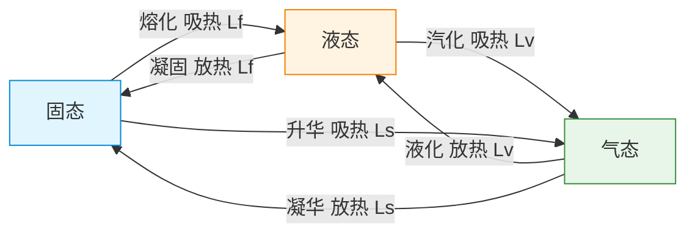
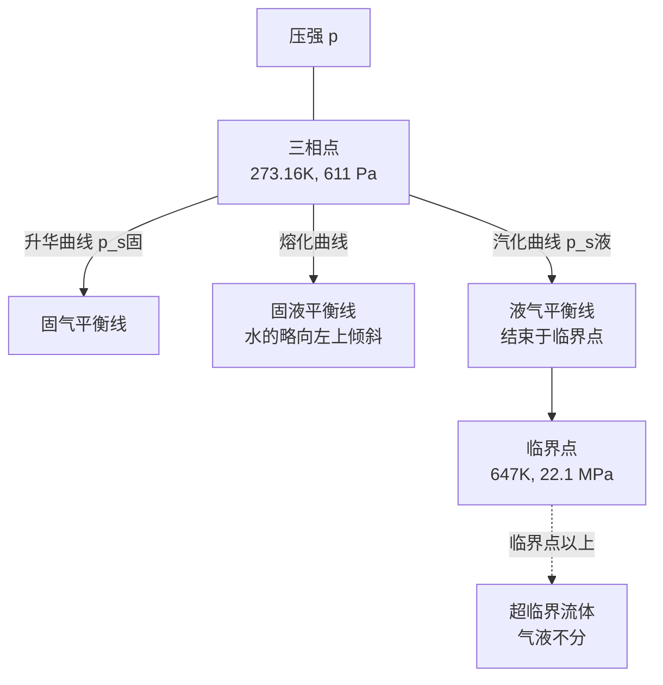

# 物态变化与相变潜热

> [!abstract] 概览
> 本节是热学==物态变化==版块的总结与高潮，统合前两节内容，系统讨论物质==固—液—气三相==之间的相互转化。核心要点：六种物态变化（熔化、凝固、汽化、液化、升华、凝华）及其吸放热规律；==相变潜热== $Q=mL$——物态变化时吸放热而温度不变的根本原因；==熔化热== $L_f$ 与==汽化热== $L_v$ 的物理意义与典型值；==饱和蒸汽压==与温度的关系（与体积无关）；==湿度==（绝对湿度、相对湿度）与==露点==；==三相点==（水三相点 $273.16\,\text{K}=0.01^\circ\text{C}$）与==三相图==；==临界点==与气液不分；==相变分类==（一级相变与连续相变）。本节是 [[01-固体与晶体]] 与 [[02-液体与表面张力]] 的统合，也是 [[03-热力学定律/02-热力学第一定律]] 在相变过程中的具体应用，直接通向大学 [[相变与流体]]、[[热力学]] 与 [[统计物理]]。

## 核心概念

### 一、六种物态变化

物质通常有固、液、气三种聚集态，它们之间的相互转化称为==物态变化==或==相变==：

| 相变 | 名称 | 吸/放热 | 潜热符号 | 典型实例 |
| --- | --- | --- | --- | --- |
| 固→液 | 熔化 | 吸热 | $L_f$（熔化热） | 冰融化 |
| 液→固 | 凝固 | 放热 | $L_f$ | 水结冰 |
| 液→气 | 汽化 | 吸热 | $L_v$（汽化热） | 水蒸发、沸腾 |
| 气→液 | 液化 | 放热 | $L_v$ | 水蒸气凝结 |
| 固→气 | 升华 | 吸热 | $L_s$（升华热） | 干冰升华、樟脑丸变小 |
| 气→固 | 凝华 | 放热 | $L_s$ | 霜的形成、碘蒸气结晶 |

> [!warning] 升华热与熔化热+汽化热的关系
> 由能量守恒：固态 → 气态可直接升华（吸 $L_s$），也可经液态中转（先熔化吸 $L_f$，再汽化吸 $L_v$）。两种路径能量变化相同，故
> $$\boxed{\,L_s = L_f + L_v\,}$$
> 这是热力学第一定律在相变中的直接体现（参见 [[03-热力学定律/02-热力学第一定律]]）。

### 二、相变潜热

#### 1. 定义

**相变潜热**（latent heat）：单位质量物质在==等温等压==相变过程中吸收或放出的热量，符号 $L$，单位 $\text{J/kg}$。

$$
\boxed{\,Q = mL\,}
$$

其中 $m$ 为物质质量，$L$ 为相变潜热。

#### 2. 熔化热 $L_f$ 与汽化热 $L_v$

- **熔化热** $L_f$：单位质量固体==完全熔化==为同温液体所吸收的热量。
- **汽化热** $L_v$：单位质量液体==完全汽化==为同温气体所吸收的热量。

常见物质的标准相变潜热（$1\,\text{atm}$）：

| 物质 | 熔点 $T_m$ (K) | $L_f$ (kJ/kg) | 沸点 $T_b$ (K) | $L_v$ (kJ/kg) |
| --- | --- | --- | --- | --- |
| 水 | 273.15 | 333.5 | 373.15 | 2256 |
| 酒精 | 159 | 108 | 351 | 846 |
| 水银 | 234 | 11.4 | 630 | 295 |
| 铜 | 1358 | 205 | 2835 | 4730 |
| 氮 | 63 | 25.3 | 77 | 199 |

> [!note] 水的潜热为何特别大？
> 水的 $L_v = 2256\,\text{kJ/kg}$ 远大于常见液体，源于水分子的==氢键==——汽化时需断开大量氢键，能量消耗巨大。这就是为什么出汗散热效率高（人体蒸发散热）、沿海气候温和（海水蒸发吸热巨大）。

### 三、饱和蒸汽压

#### 1. 饱和汽与未饱和汽

**饱和汽**（saturated vapor）：与同种物质的液态（或固态）处于==动态平衡==的蒸汽——单位时间内从液体逸出的分子数等于回到液体中的分子数。

**未饱和汽**（unsaturated vapor）：蒸汽压小于饱和蒸汽压的气体，分子密度低于饱和汽，倾向于继续蒸发。

#### 2. 饱和蒸汽压

**饱和蒸汽压**（saturated vapor pressure）：饱和汽所产生的压强，记作 $p_s$。

饱和蒸汽压的==两条关键性质==：
1. ==只与温度有关==，与体积无关（与一般理想气体不同）；
2. ==温度升高，$p_s$ 增大==（且增长比线性快，近似 Clausius-Clapeyron 关系）。

> [!warning] 为什么 $p_s$ 与体积无关？
> 若压缩饱和汽使其体积减小，瞬时压强增大，超出饱和蒸汽压，多余分子凝结回液体，最终恢复 $p_s$；若膨胀体积增大，压强减小，液体继续蒸发补充分子，最终也恢复 $p_s$。==液体的存在使饱和汽压具有"自调节"特性==——温度决定分子逸出速率，体积变化只改变液气比例，不改变压强。

#### 3. Clausius-Clapeyron 方程

饱和蒸汽压随温度的变化遵循==克拉珀龙方程==：

$$
\boxed{\,\dfrac{dp_s}{dT} = \dfrac{L_v}{T(V_m^{\text{气}} - V_m^{\text{液}})}\,}
$$

其中 $L_v$ 为摩尔汽化热，$V_m^{\text{气}}$、$V_m^{\text{液}}$ 为气、液摩尔体积。

近似（$V_m^{\text{气}} \gg V_m^{\text{液}}$，且蒸汽视为理想气体 $V_m^{\text{气}} = RT/p_s$）：

$$
\dfrac{dp_s}{dT} \approx \dfrac{L_v \cdot p_s}{RT^2} \;\Rightarrow\; p_s(T) = p_0\,\exp\!\left(-\dfrac{L_v}{R}\Big(\dfrac{1}{T} - \dfrac{1}{T_0}\Big)\right)
$$

> [!tip] 公式意义
> 这是大学 [[热力学]] 的核心公式之一，定量给出饱和蒸汽压的==指数==温度依赖。在高中阶段不要求定量计算，但需理解"$p_s$ 随 $T$ 升高而增大，且增长快于线性"。

### 四、湿度与露点

#### 1. 绝对湿度

**绝对湿度**：单位体积空气中所含水蒸气的质量，即水蒸气密度 $\rho_v$，单位 $\text{kg/m}^3$（或 $\text{g/m}^3$）。

#### 2. 相对湿度

**相对湿度**（RH）：空气中水蒸气的==实际压强== $p_v$ 与==同温度下==饱和蒸汽压 $p_s(T)$ 之比：

$$
\boxed{\,\text{RH} = \dfrac{p_v}{p_s(T)}\times 100\%\,}
$$

> [!note] 相对湿度的物理意义
> 相对湿度反映空气==距离饱和的程度==。RH=100% 时空气恰好饱和，水蒸气开始凝结。RH=50% 表示空气含水量仅为饱和时的一半。人体舒适湿度约 40%~70%。

#### 3. 露点

**露点**（dew point）：在压强不变条件下，使空气中的水蒸气==刚好达到饱和==所需的温度，记作 $T_d$。

- 若空气温度 $T > T_d$：未饱和，水蒸气不凝结；
- 若空气温度降至 $T = T_d$：刚好饱和；
- 若空气温度降至 $T < T_d$：过饱和，多余水蒸气凝结成露、雾、云。

> [!example] 露点与生活
> 清晨草地上出现露水，是因为夜间地面温度降至露点以下，空气中的水蒸气凝结。冬季眼镜从室外进入室内起雾，是因镜面温度低于室内露点，水蒸气在镜面凝结。空调除湿原理：将空气冷却至露点以下，水蒸气凝结排出。

### 五、三相点与三相图

#### 1. 三相点

**三相点**（triple point）：物质的固、液、气三相==平衡共存==的唯一状态点（特定温度与压强）。

==水的三相点==：
$$
\boxed{\,T_{tp} = 273.16\,\text{K} = 0.01^\circ\text{C},\quad p_{tp} = 611.657\,\text{Pa}\,}
$$

> [!warning] 水的三相点 ≠ 冰点
> - 三相点：纯水三相平衡，$T = 0.01^\circ\text{C}$，$p = 611.657\,\text{Pa}$；
> - 冰点：1 atm 下冰水共存，$T = 0^\circ\text{C}$。
>
> 两者差 $0.01^\circ\text{C}$——冰点压强（1 atm）远高于三相点压强（611 Pa），压强增大使冰点略降（水的反常熔化特性）；此外溶入空气也使冰点略降。==水的三相点是热力学温标的定义固定点==（直到 2019 年 SI 改用玻尔兹曼常量定义开尔文）。

#### 2. 三相图

**三相图**（phase diagram）：以温度 $T$ 为横轴、压强 $p$ 为纵轴，绘出固液气三相平衡曲线的图。

水的三相图示意（注意：水的固液平衡线==左上倾斜==，反常）：

三相图中：
- **固液平衡线**（熔化曲线）：固液共存，斜率由克拉珀龙方程决定；水的此线==略向左上倾斜==（冰熔化时体积收缩，$\Delta V < 0$，斜率 $dp/dT < 0$）；
- **液气平衡线**（汽化曲线）：液气共存，从三相点到临界点；
- **固气平衡线**（升华曲线）：固气共存，从绝对零度延伸到三相点。

> [!tip] 三相图的物理应用
> - 高压下冰的熔点降低（水的反常）——这就是==滑冰==的物理原理：冰刀压强大，冰面熔化形成水膜润滑；
> - 干冰（固态 CO₂）在 1 atm 下直接升华（因三相点压强 $5.2\times 10^5\,\text{Pa}$ 高于 1 atm），不经过液态；
- 高山上气压低，水沸点降低（约每升高 300 m 沸点降 1°C）。

### 六、临界点

**临界点**（critical point）：液气平衡曲线的==终点==，温度高于此点气液两相==不可区分==。

水的临界点：$T_c = 647\,\text{K}$（$374^\circ\text{C}$），$p_c = 22.1\,\text{MPa}$。

临界点以上：
- 增大压强不能使气体液化（无相变）；
- 物质处于==超临界流体==状态，兼具气体扩散性与液体溶解能力；
- 应用：超临界 CO₂ 萃取（咖啡因提取、香料工业）、超临界水氧化（废物处理）。

### 七、相变分类

#### 1. 一级相变

**一级相变**（first-order phase transition）：相变时==有潜热==、==比容突变==、==熵突变==，化学势一阶导数不连续。

所有六种物态变化（熔化、凝固、汽化、液化、升华、凝华）都是一级相变。

特征：
- 相变过程中==温度不变==；
- 两相可平衡共存；
- 存在==过冷==、==过热==等亚稳态。

#### 2. 连续相变（二级相变）

**连续相变**（continuous phase transition）：相变时==无潜热==、==比容连续==、==熵连续==，但二阶导数（如比热容、膨胀系数、压缩系数）发散或突变。

典型例子：
- 铁磁—顺磁相变（居里点）；
- 超流相变（液氦 λ 点）；
- 超导相变；
- 液晶相变（参见 [[01-固体与晶体]]）；
- 临界点处的气液相变。

> [!note] 一级 vs 连续相变的核心区别
> - 一级相变：有潜热，两相共存（如冰融化时冰水共存）；
> - 连续相变：无潜热，单相连续变化（如铁磁体到顺磁体，磁性逐渐消失）。
>
> 连续相变伴随==对称性破缺==与==临界涨落==（关联长度发散），是现代凝聚态物理的核心议题。大学 [[相变与流体]] 中将深入讨论。

## 推导与原理

### 一、为什么相变时温度不变？

以冰的熔化为例。冰是晶体，内部水分子按空间点阵规则排列（参见 [[01-固体与晶体]]），分子间由氢键束缚。加热冰时：
1. $T < 0^\circ\text{C}$：热能增加分子振动，温度上升；
2. $T = 0^\circ\text{C}$：分子振动能足以克服氢键束缚，开始脱离点阵成为液态分子。此时==所有吸收的热量都用于断开氢键==（增加分子势能），分子平均动能不变，故温度不变；
3. 全部冰熔化后，热能才继续增加分子动能，温度上升。

这就是==相变潜热的物理本质==：相变时吸收的热量==全部用于改变分子势能==（破坏/重建分子间结合），不增加分子平均动能，故温度恒定。

由 [[01-分子动理论/04-内能与分子动能]]：温度是分子平均平动动能的量度 $\bar{E}_k = \frac{3}{2}kT$。相变时分子平均动能不变 → 温度不变。但内能 $U = \sum E_k + \sum E_p$ 中 $\sum E_p$ 突变，故==相变时内能突变==——这是 [[03-热力学定律/02-热力学第一定律]] $\Delta U = Q + W$ 在相变中的特殊表现。

### 二、克拉珀龙方程的推导

设 1 摩尔物质在温度 $T$、压强 $p$ 下从 $\alpha$ 相（如液相）转变为 $\beta$ 相（如气相）。两相化学势相等 $\mu_\alpha = \mu_\beta$（平衡条件）。

温度变化 $dT$、压强变化 $dp$ 后仍平衡，则
$$
d\mu_\alpha = d\mu_\beta
$$

由热力学 $d\mu = -S_m\,dT + V_m\,dp$（$S_m$ 为摩尔熵，$V_m$ 为摩尔体积），有

$$
-S_\alpha\,dT + V_\alpha\,dp = -S_\beta\,dT + V_\beta\,dp
$$

整理：
$$
(V_\beta - V_\alpha)\,dp = (S_\beta - S_\alpha)\,dT
$$

可逆相变 $\Delta S = L/T$（$L$ 为摩尔潜热），故

$$
\boxed{\,\dfrac{dp}{dT} = \dfrac{L}{T(V_\beta - V_\alpha)}\,}
$$

这就是==克拉珀龙方程==——给出相平衡曲线斜率与潜热的关系。对汽化曲线（$\beta$ = 气，$V_\beta \gg V_\alpha$）：
$$
\dfrac{dp_s}{dT} \approx \dfrac{L_v}{T V_m^{\text{气}}} = \dfrac{L_v p_s}{RT^2}
$$

> [!tip] 推导的意义
> 克拉珀龙方程==从热力学基本方程导出相平衡曲线==——这是"从普遍原理推导具体规律"的典范。它解释了：
> - 水的固液线为何==左上倾斜==：$L_f > 0$，$V_\beta - V_\alpha = V_\text{液} - V_\text{冰} < 0$（冰密度小于水），故 $dp/dT < 0$；
> - 沸点为何随压强增大而升高：$dp_s/dT > 0$（汽化时 $V_\text{气} > V_\text{液}$，$L_v > 0$）。

### 三、相对湿度与人体舒适度

人体通过==汗液蒸发==散热调节体温。蒸发速率取决于空气中水蒸气==距饱和的程度==，即相对湿度 RH：

$$
v_{\text{蒸发}} \propto 1 - \text{RH}
$$

- RH 过低（<30%）：蒸发过快，皮肤干燥、黏膜不适；
- RH 过高（>80%）：蒸发过慢，散热困难，闷热感；
- RH 适中（40%~70%）：蒸发适度，舒适。

> [!example] "桑拿天"的物理
> 夏季高温（$T$ 高，$p_s(T)$ 大）且湿度大（RH 高），意味着 $p_v = \text{RH}\cdot p_s(T)$ 很大，空气中水蒸气==接近饱和==，汗液难以蒸发，散热受阻，体感闷热。这就是"桑拿天"比干热更难受的物理原因。

### 四、过冷与过热

**过冷**（supercooling）：液体温度降至凝固点以下仍未结晶的亚稳态。原因：结晶需要==凝结核==（杂质、晶种），无凝结核时液态可短暂过冷。投入小晶种或扰动可触发突发结晶，温度回升到凝固点并放出凝固热。

**过热**（superheating）：液体温度升至沸点以上仍未沸腾的亚稳态。原因：沸腾需==汽化核==（气泡、杂质），无核时液体可过热。扰动或投入多孔物可触发突发沸腾（暴沸）。

> [!warning] 暴沸的危险
> 实验室加热纯水时易过热暴沸——温度可达 $110^\circ\text{C}$ 以上仍不沸腾，一旦扰动则瞬时汽化，喷溅伤人。==加沸石==提供汽化核可避免暴沸。这也是 [[02-液体与表面张力]] 中弯曲液面附加压强现象——小气泡内压强因 $\Delta p = 2\sigma/R$ 过大，难以生长。

## 典型实例与类比

### 实例 1：冰水混合物的温度

将 $0^\circ\text{C}$ 的冰与 $0^\circ\text{C}$ 的水混合，温度计读数为==$0^\circ\text{C}$ 不变==。无论冰水比例如何（只要有冰有水），温度恒为 $0^\circ\text{C}$——因冰水处于==固液平衡==，温度被锁定在熔点。这印证了相变潜热的"恒温"特性。

### 实例 2：高压锅原理

高压锅密封加热，锅内水蒸气使压强升高，水的沸点随之升高（克拉珀龙方程 $dp_s/dT > 0$）。一般高压锅压强达 $2\,\text{atm}$，水沸点约 $120^\circ\text{C}$，高温加速食物烹煮。

### 实例 3：霜与雪的区别

- **霜**：空气中的水蒸气==直接凝华==成冰晶（气→固），发生在地面温度低于露点且低于 $0^\circ\text{C}$ 时；
- **雪**：高空云中水蒸气凝华成冰晶后降落；
- **冰雹**：水滴在云中反复升降，逐层冻结而成。

三者都是水变冰，但形成路径不同——霜与雪是==凝华==（直接气→固），冰雹是==凝固==（液→固）。

### 实例 4：干冰升华

干冰（固态 CO₂）在 1 atm 下直接变为气体，不经过液态——因 CO₂ 三相点压强 $5.2\times 10^5\,\text{Pa}$ 远高于 1 atm，1 atm 下固气平衡线直接对应升华。要使液态 CO₂ 存在，需加压至 5.2 atm 以上。

### 类比：相变潜热的"拆墙"比喻

把固体分子间的结合比作"砖墙"，温度比作"工人拆墙的能量"：
- 升温阶段：工人逐渐积累能量（温度上升）；
- 到达熔点：能量足够拆墙，但==拆墙时所有能量都用于拆==（破坏氢键/点阵），不再有能量积累 → 温度不变；
- 墙拆完（熔化完）：能量继续积累 → 温度上升；
- 汽化是更"狠"的拆墙——液态残余氢键全部断开，需更多能量（$L_v \gg L_f$）。

> [!tip] 记忆口诀
> ==六相变化记清楚，固液气间互转化；熔凝汽液升凝华，吸放成对热相反；潜热 $Q=mL$ 温不变，能量全用于拆键；饱和汽压看温度，体积变化压不变；湿度相对 $p_v/p_s$，露点饱和即凝结；三相点是唯一点，水 273.16 K；一级相变有潜热，连续相变对称破。==

## 例题

### 例 1：基础——相变潜热与总吸热

**题目**：将 $m = 20\,\text{g}$、$-10^\circ\text{C}$ 的冰加热变成 $100^\circ\text{C}$ 的水蒸气，至少需要多少热量？已知冰的比热容 $c_{\text{冰}} = 2.1\times 10^3\,\text{J/(kg\cdot K)}$，水的比热容 $c_{\text{水}} = 4.2\times 10^3\,\text{J/(kg\cdot K)}$，冰的熔化热 $L_f = 3.35\times 10^5\,\text{J/kg}$，水的汽化热 $L_v = 2.26\times 10^6\,\text{J/kg}$。

**分析**：整个过程分四段：
1. 冰从 $-10^\circ\text{C}$ 升到 $0^\circ\text{C}$（升热，$Q_1 = m c_{\text{冰}} \Delta T$）；
2. 冰在 $0^\circ\text{C}$ 熔化为水（潜热，$Q_2 = m L_f$，温度不变）；
3. 水从 $0^\circ\text{C}$ 升到 $100^\circ\text{C}$（升热，$Q_3 = m c_{\text{水}} \Delta T$）；
4. 水在 $100^\circ\text{C}$ 汽化为水蒸气（潜热，$Q_4 = m L_v$，温度不变）。

**解答**：
$$
Q_1 = 0.02\times 2.1\times 10^3\times 10 = 420\,\text{J}
$$
$$
Q_2 = 0.02\times 3.35\times 10^5 = 6700\,\text{J}
$$
$$
Q_3 = 0.02\times 4.2\times 10^3\times 100 = 8400\,\text{J}
$$
$$
Q_4 = 0.02\times 2.26\times 10^6 = 45200\,\text{J}
$$
总热量：
$$
Q = Q_1 + Q_2 + Q_3 + Q_4 = 420 + 6700 + 8400 + 45200 = 60720\,\text{J} \approx 6.07\times 10^4\,\text{J}
$$

**点评**：注意==汽化热 $L_v$ 远大于其他三项==（约占总热量的 75%）。这就是为什么烧开水到 100°C 后还需大量热才能完全汽化——$L_v$ 巨大是水的氢键结构所致。这种"分段计算"是相变题的基本套路：升热—潜热—升热—潜热。

### 例 2：中难——相对湿度与露点

**题目**：在 $25^\circ\text{C}$ 时，测得室内空气中水蒸气分压 $p_v = 1.6\times 10^3\,\text{Pa}$。已知 $25^\circ\text{C}$ 时水的饱和蒸汽压 $p_s(25^\circ\text{C}) = 3.17\times 10^3\,\text{Pa}$，$15^\circ\text{C}$ 时 $p_s(15^\circ\text{C}) = 1.71\times 10^3\,\text{Pa}$，$10^\circ\text{C}$ 时 $p_s(10^\circ\text{C}) = 1.23\times 10^3\,\text{Pa}$。求：
（1）$25^\circ\text{C}$ 时室内相对湿度；
（2）室内露点 $T_d$。

**分析**：
（1）相对湿度 $\text{RH} = p_v/p_s(T)\times 100\%$；
（2）露点是使 $p_v$ 达到饱和的温度，即 $p_s(T_d) = p_v = 1.6\times 10^3\,\text{Pa}$。比较给定数据，$1.6\times 10^3\,\text{Pa}$ 介于 $p_s(15^\circ\text{C}) = 1.71\times 10^3\,\text{Pa}$ 与 $p_s(10^\circ\text{C}) = 1.23\times 10^3\,\text{Pa}$ 之间，更接近 $15^\circ\text{C}$，故 $T_d$ 略低于 $15^\circ\text{C}$。

**解答**：
（1）
$$
\text{RH} = \dfrac{p_v}{p_s(25^\circ\text{C})}\times 100\% = \dfrac{1.6\times 10^3}{3.17\times 10^3}\times 100\% \approx 50.5\%
$$

（2）露点是 $p_s(T_d) = 1.6\times 10^3\,\text{Pa}$ 对应的温度。$1.6\times 10^3\,\text{Pa}$ 在 $p_s(10^\circ\text{C}) = 1.23\times 10^3$ 与 $p_s(15^\circ\text{C}) = 1.71\times 10^3$ 之间，更接近 $15^\circ\text{C}$ 一侧。可作线性近似：

$$
T_d \approx 15 - 5\times\dfrac{1.71 - 1.60}{1.71 - 1.23} \approx 15 - 5\times\dfrac{0.11}{0.48} \approx 15 - 1.15 \approx 13.9^\circ\text{C}
$$

室内露点约 $13.9^\circ\text{C}$——若室内温度降至约 $14^\circ\text{C}$ 以下即开始结露。

**点评**：本题考查==相对湿度与露点的计算==。注意露点是==水蒸气实际分压==对应的饱和温度，与饱和蒸汽压表对照即可。线性近似是常用方法，精确计算需用 Clausius-Clapeyron 方程。

### 例 3：进阶——相变中的热力学第一定律

**题目**：$1\,\text{mol}$ 理想水蒸气（视为理想气体，$C_V = 3R$）在 $100^\circ\text{C}$、$1\,\text{atm}$ 下凝结为同温水。已知水的汽化热 $L_v = 40.6\,\text{kJ/mol}$，水摩尔体积 $V_m^{\text{液}} \approx 18\,\text{mL}$，水蒸气摩尔体积可由理想气体状态方程计算，$R = 8.314\,\text{J/(mol\cdot K)}$。求凝结过程中：
（1）外界对系统做的功 $W$；
（2）系统内能的变化 $\Delta U$；
（3）系统放出的热量 $Q$。

**分析**：凝结是等温等压过程，液气体积变化主要由气体贡献。$W = p\Delta V$（外界对系统做功取正），$Q$ 为放热取负，$\Delta U = Q - W$（注意符号约定：热力学第一定律 $\Delta U = Q + W$，$W$ 为外界对系统做功）。

**解答**：

$100^\circ\text{C} = 373.15\,\text{K}$，$p = 1.013\times 10^5\,\text{Pa}$。

水蒸气摩尔体积：
$$
V_m^{\text{气}} = \dfrac{RT}{p} = \dfrac{8.314\times 373.15}{1.013\times 10^5} \approx 3.06\times 10^{-2}\,\text{m}^3 = 30.6\,\text{L}
$$

体积变化（凝结：气→液，体积减小）：
$$
\Delta V = V_m^{\text{液}} - V_m^{\text{气}} \approx 0.018 - 30.6 \approx -30.6\,\text{L} = -3.06\times 10^{-2}\,\text{m}^3
$$

（1）外界对系统做的功（气体被压缩，外界做正功）：
$$
W = -p\Delta V = -1.013\times 10^5\times(-3.06\times 10^{-2}) \approx 3100\,\text{J} = 3.10\,\text{kJ}
$$

> [!note] 符号约定
> 此处采用 $\Delta U = Q + W$，$W$ 为外界对系统做功。气体膨胀 $\Delta V > 0$ 时 $W < 0$（气体对外做功）；气体被压缩 $\Delta V < 0$ 时 $W > 0$（外界对气体做功）。凝结过程气体被压缩，$W > 0$。

（2）放出的热量（凝结为汽化的逆过程，放热）：
$$
Q = -L_v = -40.6\,\text{kJ}
$$

（3）内能变化：
$$
\Delta U = Q + W = -40.6 + 3.10 = -37.5\,\text{kJ}
$$

**点评**：本题是 [[03-热力学定律/02-热力学第一定律]] 在相变中的典型应用。关键点：
- 相变时==温度不变==，但==内能突变==（$\Delta U \ne 0$）——内能含分子势能，相变改变分子势能；
- $|Q| \gg |W|$——汽化热主要用于破坏分子间结合（势能），体积功只占很小一部分；
- 水蒸气凝结放出的 $40.6\,\text{kJ}$ 中，约 $3.1\,\text{kJ}$ 来自外界做功，其余 $37.5\,\text{kJ}$ 来自内能减少。这就是蒸汽烫伤比开水烫伤严重的原因——蒸汽凝结额外释放大量潜热。

## 易错提醒

> [!warning] 易错点
> 1. **相变时温度不变 ≠ 内能不变**：相变时温度不变（动能不变），但==内能突变==（势能突变）。这是热力学第一定律的关键考察点。
> 2. **$Q=mL$ 中的 $L$ 与相变类型对应**：熔化用 $L_f$、汽化用 $L_v$、升华用 $L_s = L_f + L_v$，不可混淆。
> 3. **饱和蒸汽压只与温度有关**：与体积无关，与液体质量无关。这是饱和汽与一般气体的根本区别。
> 4. **相对湿度公式中 $p_s(T)$ 是==同温度下==的饱和蒸汽压**：不同温度 $p_s$ 不同，RH 计算时温度必须一致。
> 5. **水的三相点 ≠ 冰点**：三相点 $273.16\,\text{K}$（$0.01^\circ\text{C}$，$611\,\text{Pa}$）；冰点 $273.15\,\text{K}$（$0^\circ\text{C}$，$1\,\text{atm}$）。
> 6. **临界点 vs 三相点**：临界点是液气线的终点（高温端）；三相点是固液气线的交点（低温端）。
> 7. **升华热 $L_s$ 不是独立量**：$L_s = L_f + L_v$，由能量守恒决定。
> 8. **符号约定**：$\Delta U = Q + W$ 中 $W$ 为外界对系统做功，气体膨胀 $W < 0$，压缩 $W > 0$；部分教材采用 $\Delta U = Q - W$，$W$ 为系统对外做功，二者一致但符号相反。

> [!note] 概念辨析
> **饱和汽 vs 未饱和汽**：
> - 饱和汽：与液体动态平衡，$p = p_s(T)$，与体积无关；
> - 未饱和汽：$p < p_s(T)$，行为近似理想气体，与体积有关（$pV=nRT$）。
>
> **三相点 vs 临界点**：
> - 三相点：固液气==三相==平衡共存的唯一状态点；
> - 临界点：液气==两相==不可区分的状态点（液气线终点）。
>
> **一级相变 vs 连续相变**：
> - 一级相变：有潜热、比容突变、两相共存（如冰熔化）；
> - 连续相变：无潜热、比容连续、单相连续变化（如铁磁相变）。
>
> **绝对湿度 vs 相对湿度**：
> - 绝对湿度：水蒸气密度 $\rho_v$（$\text{kg/m}^3$）；
> - 相对湿度：$\text{RH} = p_v/p_s(T)\times 100\%$（无量纲）。
>
> 相对湿度反映"距饱和的程度"，更具人体感受与气象意义。

## 与其他知识关联

- 与 [[01-固体与晶体]] 的关系：晶体熔化时吸收的熔化热 $L_f$ 正是破坏空间点阵结合能的体现；非晶体无固定熔点因其结合能连续分布。
- 与 [[02-液体与表面张力]] 的关系：液气相变涉及液面分子逸出，表面张力是液面分子受力的体现；弯曲液面附加压强影响小气泡内饱和蒸汽压（开尔文公式）。
- 与 [[03-物态变化与相变潜热]] 的关系：本节即物态变化与相变潜热部分。
- 与 [[01-分子动理论/03-分子力与分子势能]] 的关系：相变潜热的本质是分子势能的突变——熔化破坏点阵（势能增加），汽化破坏液态残余氢键（势能再增加）。
- 与 [[01-分子动理论/04-内能与分子动能]] 的关系：相变时分子平均动能不变（温度不变），但内能突变——内能含势能部分。
- 与 [[03-热力学定律/02-热力学第一定律]] 的关系：相变过程 $\Delta U = Q + W$ 中 $Q = \pm mL$，是热力学第一定律在相变中的直接应用。
- 与 [[03-热力学定律/03-热力学第二定律]] 的关系：相变方向性（如凝结自发 vs 蒸发需条件）由热力学第二定律决定；过冷过热是亚稳态，触发后向稳定态转变是熵增过程。
- 与力学联系：相变过程体积功 $W = p\Delta V$ 与力学中的机械功本质一致；三相图中压强—温度关系是力学平衡条件的统计推广。
- 与电学联系：[[03-磁场/04-带电粒子在磁场中的运动]] 中超导相变（连续相变）使电阻突然消失，是低温物理与电学的交叉点。
- 高中—大学衔接：[[相变与流体]] 中相变分类、临界现象、对称性破缺；[[热力学]] 中克拉珀龙方程的严格推导、热力学势、相律；[[统计物理]] 中配分函数与相变的统计本质、Ising 模型。
- 返回 [[00-热学总览]]

## 作者的话

> [!quote] 个人理解
> 物态变化这一节是热学的==收官之作==，将前面所有内容统合在一起。回顾整个热学脉络：[[01-分子动理论/01-分子的大小与阿伏伽德罗常数]] 给出物质微观组成 → [[01-分子动理论/03-分子力与分子势能]] 给出分子相互作用 → [[02-气体/04-理想气体状态方程]] 描述气态 → [[03-热力学定律/02-热力学第一定律]] 给出能量守恒 → 本节描述相变。整条线索最终汇聚为==分子力 + 能量守恒 = 物态变化==的优美图景。
>
> 相变潜热的物理本质，是==分子势能的突变==。这一点常被高中生忽视——总以为"吸热就升温"。相变时吸热不升温，是因为热量全部用于"拆分子键"（增加势能），而非"加剧分子运动"（增加动能）。理解这一点，就理解了"==显热=="（变温吸热）与"==潜热=="（恒温吸热）的区别，也理解了为什么蒸汽烫伤比开水烫伤更严重——蒸汽凝结额外释放 $L_v$ 的潜热。
>
> 三相图是热学最优雅的图像之一。一张二维图（$T$-$p$ 平面），三条曲线、一个三相点、一个临界点，描述了物质在不同温度压强下的全部聚集态。水的反常（固液线左上倾斜）使其三相图独具特色——正是这一反常使冰能浮在水面上，使湖泊从上而下结冰，==保护了水下生命==。如果水像普通物质一样熔化时膨胀（固液线右上倾斜），冰将沉入水底，地球生态将截然不同。物理学之美，正在于这些"细节决定命运"的深刻关联。
>
> 临界点与连续相变是现代物理的明珠。水的临界点 $T_c = 647\,\text{K}$，$p_c = 22.1\,\text{MPa}$——在此点附近，气液两相密度差突然消失，水的密度涨落发散，==呈现乳光现象==（临界乳光）。这种"连续相变 + 临界涨落"是统计物理最迷人的课题之一，从水的临界点到铁磁体的居里点、超流氦的 λ 点、宇宙早期的相变，都遵循==普适类==的统一规律——不同系统的临界指数竟相同！这是物理学"==多样背后的统一=="的极致体现，建议有兴趣的读者进入大学后研习 [[相变与流体]] 与 [[统计物理]]。
>
> 学习本节建议：第一，掌握 $Q=mL$ 与分段计算思路；第二，理解相变时"温度不变但内能突变"的物理本质；第三，熟记水的三相点与饱和蒸汽压特性；第四，培养读三相图的能力——从图中读出物质在不同 $T$、$p$ 下的状态。这些能力是高考热学的核心考点，也是后续大学物理的思维基础。

---
*返回 [[00-热学总览]]*
