# 高中物理电学总览

> [!abstract] 电学笔记体系总体说明
> 本笔记体系是高中物理三大主干（力学、电学、热学/近代物理）之一，涵盖人教版高中物理必修第三册与选择性必修第二册的核心内容。电学以"场"与"路"两条主线展开：场的研究包括静电场、恒定电场、磁场与变化电磁场；路的研究包括恒定电流电路与交变电流电路。整套笔记按知识逻辑分为六大版块——静电场、恒定电流、磁场、电磁感应、交变电流、电磁波与传感器，由浅入深、由静到动、由稳态到瞬态，最终通向大学层面的 [[电磁学]] 与 [[量子电动力学]]。本文件（MOC）作为电学笔记体系的总入口，统一调度各子模块、提供学习路径与速查资源。

## 电学知识脉络图

```mermaid
graph TD
    ROOT[高中物理电学] --> A[静电场]
    ROOT --> B[恒定电流]
    ROOT --> C[磁场]
    ROOT --> D[电磁感应]
    ROOT --> E[交变电流]
    ROOT --> F[电磁波与传感器]

    A --> A1[01-电荷与库仑定律]
    A --> A2[02-电场与电场强度]
    A --> A3[03-电势与电势能]
    A --> A4[04-电容器与电容]
    A --> A5[05-带电粒子在电场中的运动]

    B --> B1[01-电流与欧姆定律]
    B --> B2[02-电阻与电阻定律]
    B --> B3[03-电功与电功率]
    B --> B4[04-串并联电路]
    B --> B5[05-闭合电路欧姆定律]
    B --> B6[06-电表改装与万用表]
    B --> B7[07-电学实验]

    C --> C1[01-磁场与磁感线]
    C --> C2[02-安培力]
    C --> C3[03-洛伦兹力]
    C --> C4[04-带电粒子在磁场中的运动]

    D --> D1[01-磁通量与电磁感应现象]
    D --> D2[02-法拉第电磁感应定律]
    D --> D3[03-楞次定律]
    D --> D4[04-自感与互感]
    D --> D5[05-电磁感应综合应用]

    E --> E1[01-交流电的产生与描述]
    E --> E2[02-电感电容与交流电]
    E --> E3[03-变压器]
    E --> E4[04-远距离输电]

    F --> F1[01-电磁振荡与电磁波]
    F --> F2[02-电磁波谱]
    F --> F3[03-传感器]

    class A1 internal-link;
    class A2 internal-link;
    class A3 internal-link;
    class A4 internal-link;
    class A5 internal-link;
    class B1 internal-link;
    class B2 internal-link;
    class B3 internal-link;
    class B4 internal-link;
    class B5 internal-link;
    class B6 internal-link;
    class B7 internal-link;
    class C1 internal-link;
    class C2 internal-link;
    class C3 internal-link;
    class C4 internal-link;
    class D1 internal-link;
    class D2 internal-link;
    class D3 internal-link;
    class D4 internal-link;
    class D5 internal-link;
    class E1 internal-link;
    class E2 internal-link;
    class E3 internal-link;
    class E4 internal-link;
    class F1 internal-link;
    class F2 internal-link;
    class F3 internal-link;
```

## 一、静电场

静电场研究静止电荷所产生的场及其相互作用，是整个电学的基石。本版块从电荷的基本性质出发，引入"场"的描述方法（电场强度、电势），最终讨论电容器与带电粒子在电场中的运动。电势能的概念可与力学中 [[动能与动量]] 的重力势能进行类比，便于建立"场—势—能"的统一图景。

- [[01-电荷与库仑定律]]：电荷守恒、电荷量子化与库仑扭秤实验，建立两点电荷相互作用的平方反比律。
- [[02-电场与电场强度]]：引入电场强度 $E$ 的概念，掌握点电荷电场、电场线与叠加原理。
- [[03-电势与电势能]]：从功—能关系出发定义电势 $\varphi$ 与电势能 $W$，理解等势面与电场线垂直的关系。
- [[04-电容器与电容]]：电容的定义、平行板电容器公式、串并联及电场能量储存。
- [[05-带电粒子在电场中的运动]]：带电粒子在匀强电场中的加速与偏转，类比平抛运动模型。

## 二、恒定电流

恒定电流研究稳恒电场驱动下电荷的定向移动规律，是"路"的视角的起点。本版块以欧姆定律为核心，串联电阻定律、电功率、串并联电路、闭合电路欧姆定律、电表改装与典型实验，构成完整的直流电路分析框架。

- [[01-电流与欧姆定律]]：电流定义、电流微观表达式与欧姆定律 $I=U/R$。
- [[02-电阻与电阻定律]]：电阻率、温度系数与电阻定律 $R=\rho l/S$。
- [[03-电功与电功率]]：电功 $W=UIt$、电功率 $P=UI$ 与焦耳定律 $Q=I^2Rt$。
- [[04-串并联电路]]：串并联电流、电压、电阻规律，以及混联电路的化简方法。
- [[05-闭合电路欧姆定律]]：电源电动势、内阻、路端电压与 $I=\varepsilon/(R+r)$。
- [[06-电表改装与万用表]]：电流计改装为电流表/电压表、欧姆表原理与多用电表使用。
- [[07-电学实验]]：测定金属电阻率、描绘小灯泡伏安特性、测定电源电动势与内阻等核心实验。

## 三、磁场

磁场研究运动电荷（电流）所激发的场及其对运动电荷、电流的作用力。本版块以磁感应强度 $B$ 为核心物理量，重点掌握安培力（宏观电流受力）与洛伦兹力（微观电荷受力）两大公式，并讨论带电粒子在匀强磁场中的圆周运动。

- [[01-磁场与磁感线]]：磁现象、磁感线方向约定与毕奥—萨伐尔定律的定性理解。
- [[02-安培力]]：安培力 $F=BIL$ 的方向（左手定则）与大小，及安培力作用下的平衡问题。
- [[03-洛伦兹力]]：洛伦兹力 $f=qvB$ 的方向与大小，洛伦兹力不做功的重要性质。
- [[04-带电粒子在磁场中的运动]]：圆周运动半径 $r=mv/(qB)$、周期 $T=2\pi m/(qB)$，及质谱仪、回旋加速器模型。

## 四、电磁感应

电磁感应是电学的"动态"核心，研究磁通量变化产生感应电动势的规律。本版块以法拉第电磁感应定律定量计算感应电动势，以楞次定律判定方向，进而分析自感、互感及综合应用（如电磁阻尼、电磁炮、磁悬浮等）。

- [[01-磁通量与电磁感应现象]]：磁通量 $\Phi=BS\cos\theta$ 与电磁感应现象的发现史。
- [[02-法拉第电磁感应定律]]：$E=n\Delta\Phi/\Delta t$，含导体切割磁感线 $E=BLv$ 与转动 $E=\frac{1}{2}B\omega L^2$。
- [[03-楞次定律]]：感应电流方向判定的"增反减同"原则与右手定则。
- [[04-自感与互感]]：自感系数 $L$、自感电动势 $E_L=L\Delta I/\Delta t$、互感现象与变压器原理铺垫。
- [[05-电磁感应综合应用]]：含电磁感应的电路分析、能量转化、动量与能量综合问题。

## 五、交变电流

交变电流研究按正弦（余弦）规律变化的电流，是电磁感应规律在发电机中的工程化应用。本版块以交流电的"四值"（峰值、有效值、平均值、瞬时值）为描述主线，延伸到电感/电容对交流电的阻碍作用、变压器原理与远距离输电的损耗分析。

- [[01-交流电的产生与描述]]：交流电的产生（线圈在匀强磁场中匀速转动）、$e=E_m\sin\omega t$ 与有效值定义。
- [[02-电感电容与交流电]]：感抗 $X_L=\omega L$、容抗 $X_C=1/(\omega C)$ 与"通直流阻交流/通交流隔直流"。
- [[03-变压器]]：理想变压器原副线圈电压、电流、功率关系 $\frac{U_1}{U_2}=\frac{n_1}{n_2}$。
- [[04-远距离输电]]：输电线损耗 $P_{\text{损}}=I^2R_{\text{线}}$，提高电压减小损耗的工程意义。

## 六、电磁波与传感器

本版块是电学的"近代化"延伸，从麦克斯韦电磁场理论出发，介绍电磁振荡、电磁波谱与传感器原理，为后续学习大学层面 [[电磁学]]（含麦克斯韦方程组）与 [[量子电动力学]] 奠定基础，同时呼应高中物理实验中传感器的实际应用。

- [[01-电磁振荡与电磁波]]：LC 振荡电路周期 $T=2\pi\sqrt{LC}$、麦克斯韦电磁场理论两条基本假设。
- [[02-电磁波谱]]：无线电波、微波、红外、可见光、紫外、X 射线、γ 射线的波长范围与应用。可见光部分可与 [[物理光学]] 对照学习。
- [[03-传感器]]：光敏电阻、热敏电阻、霍尔元件等常见传感器的工作原理与电路应用。

## 学习路径建议

> [!tip] 学习路径
> **基础路径（按教材顺序）**：静电场 → 恒定电流 → 磁场 → 电磁感应 → 交变电流 → 电磁波与传感器。适合首次系统学习，遵循从"场"到"路"、从"静"到"动"的认知顺序。
>
> **应试路径（高考重点优先）**：静电场（场强+电势） → 恒定电流（闭合电路欧姆定律+实验） → 磁场（洛伦兹力+圆周运动） → 电磁感应（法拉第定律+楞次定律+综合题）。这四块是高考电学的主战场，需优先突破。
>
> **扩展路径（衔接大学物理）**：在掌握高中电学基础上，对照 [[电磁学]] 学习麦克斯韦方程组的积分与微分形式，了解 [[量子电动力学]] 中场量子化的基本思想，并参阅 [[物理光学]] 理解光的电磁本质。

## 与其他知识关联

电学笔记体系并非孤立存在，与笔记库中其他物理模块有紧密联系：

- **大学层面延伸**：高中电学的概念框架直接通向 [[电磁学]]（路径 `物理/物理学大类/光学电学/电磁学.md`），后者以矢量分析与麦克斯韦方程组对电场、磁场进行更严格的描述；进一步可参阅 [[量子电动力学]] 了解电磁相互作用的量子化理论。
- **光学关联**：电磁波谱中的可见光部分与 [[物理光学]]（路径 `物理/物理学大类/光学电学/物理光学.md`）紧密相关，光的干涉、衍射、偏振均可视为电磁波的行为表现。
- **力学类比**：电势能可类比 [[动能与动量]] 中的重力势能——两者均为保守力对应的势能，满足 $W_{\text{保守}}=-\Delta E_p$ 的统一关系；带电粒子在匀强电场中的偏转类比平抛运动；带电粒子在匀强磁场中的圆周运动类比 [[动能与动量]] 中匀速圆周运动受力模型。
- **数学工具**：矢量合成（电场叠加）、微元法（求非均匀场积分）、三角函数（交流电瞬时值）等数学工具贯穿全笔记。

## 电学常用物理量速查表

| 物理量 | 符号 | 单位 | 物理意义 |
| --- | --- | --- | --- |
| 电荷量 | $q$ | 库仑 (C) | 物体带电多少，元电荷 $e=1.6\times10^{-19}\,\text{C}$ |
| 电场强度 | $E$ | 伏每米 (V/m) 或牛每库 (N/C) | 描述电场力的性质，$E=F/q$ |
| 电势 | $\varphi$ | 伏特 (V) | 描述电场能的性质，$\varphi=W_{\text{电}}/q$ |
| 电势差 | $U$ | 伏特 (V) | 两点电势之差 $U_{AB}=\varphi_A-\varphi_B$ |
| 电容 | $C$ | 法拉 (F) | 电容器储存电荷本领，$C=Q/U$ |
| 电流 | $I$ | 安培 (A) | 单位时间通过导体横截面的电荷量，$I=q/t$ |
| 电阻 | $R$ | 欧姆 ($\Omega$) | 导体对电流的阻碍作用，$R=U/I$ |
| 电阻率 | $\rho$ | 欧姆米 ($\Omega\cdot\text{m}$) | 材料本身的导电性质，$R=\rho l/S$ |
| 电动势 | $\varepsilon$ | 伏特 (V) | 电源非静电力做功本领，$\varepsilon=W_{\text{非}}/q$ |
| 磁感应强度 | $B$ | 特斯拉 (T) | 描述磁场力的性质，$B=F/(IL)$ |
| 磁通量 | $\Phi$ | 韦伯 (Wb) | 穿过某面积的磁感线条数，$\Phi=BS\cos\theta$ |
| 感应电动势 | $E$ | 伏特 (V) | 磁通量变化产生的电动势，$E=n\Delta\Phi/\Delta t$ |
| 自感系数 | $L$ | 亨利 (H) | 线圈产生自感电动势的本领 |
| 感抗 | $X_L$ | 欧姆 ($\Omega$) | 电感对交流电的阻碍，$X_L=\omega L=2\pi f L$ |
| 容抗 | $X_C$ | 欧姆 ($\Omega$) | 电容对交流电的阻碍，$X_C=1/(\omega C)=1/(2\pi f C)$ |

## 电学常用公式速查

### 静电场

$$
F = k\frac{q_1 q_2}{r^2}, \quad E = \frac{F}{q} = k\frac{Q}{r^2}, \quad \varphi = \frac{W_{\text{电}}}{q}, \quad W_{AB} = qU_{AB} = q(\varphi_A - \varphi_B)
$$

$$
C = \frac{Q}{U}, \quad C = \frac{\varepsilon_r S}{4\pi k d}, \quad W = \frac{1}{2}QU = \frac{1}{2}CU^2 = \frac{Q^2}{2C}
$$

### 恒定电流

$$
I = \frac{q}{t} = nesv, \quad I = \frac{U}{R}, \quad R = \rho\frac{l}{S}, \quad W = UIt, \quad P = UI, \quad Q = I^2Rt
$$

$$
I = \frac{\varepsilon}{R + r}, \quad U_{\text{端}} = \varepsilon - Ir, \quad P_{\text{出}} = UI = \frac{\varepsilon^2 R}{(R+r)^2}
$$

### 磁场

$$
F_{\text{安}} = BIL\sin\theta, \quad f_{\text{洛}} = qvB\sin\theta, \quad r = \frac{mv}{qB}, \quad T = \frac{2\pi m}{qB}
$$

### 电磁感应

$$
E = n\frac{\Delta\Phi}{\Delta t}, \quad E = BLv\sin\theta, \quad E_{\text{转}} = \frac{1}{2}B\omega L^2, \quad E_L = L\frac{\Delta I}{\Delta t}
$$

### 交变电流

$$
e = E_m\sin\omega t, \quad E_{\text{有}} = \frac{E_m}{\sqrt{2}}, \quad \frac{U_1}{U_2} = \frac{n_1}{n_2}, \quad \frac{I_1}{I_2} = \frac{n_2}{n_1}, \quad P_{\text{损}} = I^2 R_{\text{线}} = \left(\frac{P}{U}\right)^2 R_{\text{线}}
$$

---

> [!quote] 结语
> 电学之美在于"场"与"路"的统一、宏观与微观的呼应。本 MOC 仅作为入口，深入请进入各子笔记，必要时回到此处导航。学习过程中遇到难题可查阅 [[99-电学例题集]]，跨学科衔接请回到上层物理总览。
