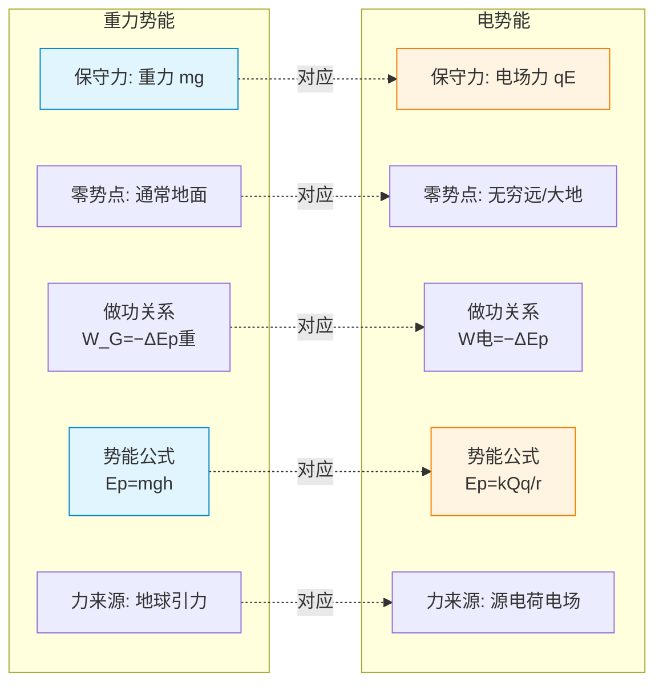

# 电势与电势能

> [!abstract] 概览
> 本节从电场力做功的特点出发，类比重力做功引入"电势能"概念，进而定义"电势"作为描述电场能性质的物理量。重点掌握：电场力做功与电势能变化的关系 $W_{AB}=E_{pA}-E_{pB}=-\Delta E_p$、电势定义 $\varphi=E_p/q$、电势差 $U_{AB}=\varphi_A-\varphi_B$、电场力做功 $W_{AB}=qU_{AB}$；理解等势面与电场线"垂直"关系、沿电场线方向电势降低这一基本规律；推导匀强电场中 $E=U/d$。本节是 [[02-电场与电场强度]] 中"力线"描述的对称补充——"力"对应"能"，"场强"对应"电势"。两者结合形成完整的静电场描述，并为 [[04-电容器与电容]] 与 [[05-带电粒子在电场中的运动]] 奠基。

## 核心概念

### 一、电场力做功的特点

在静电场中移动电荷时，电场力做功有一个重要特点：==与路径无关，只与初末位置有关==。这与重力做功的特点完全一致。

证明（以匀强电场为例）：在匀强电场 $E$ 中把电荷 $q$ 从 $A$ 移到 $B$，无论沿直线、折线还是任意曲线，电场力做功都等于 $W_{AB}=qE\cdot d_{AB}$，其中 $d_{AB}$ 是 $A$、$B$ 沿场强方向的位移分量。一般点电荷电场也可用积分证明（详见大学 [[电磁学]]）。

由于做功与路径无关，静电场是==保守场==（保守力场），电场力是保守力。这一点与重力、弹簧弹力类似，而与摩擦力（耗散力）截然不同。

### 二、电势能

**电势能** $E_p$：电荷在电场中某点具有的、由其位置决定的势能。

类比重力势能：
- 重力做功 $W_G = E_{pA} - E_{pB} = -\Delta E_p$（重力势能减少等于重力做正功）
- 电场力做功 $W_{AB} = E_{pA} - E_{pB} = -\Delta E_p$（电势能减少等于电场力做正功）

> [!important] 核心关系
> $$
> W_{AB} = -\Delta E_p = E_{pA} - E_{pB}
> $$
> ==电场力做正功，电势能减少；电场力做负功，电势能增加。== 这与"重力做正功，重力势能减少"完全平行。

**零势能点的选取**：
- 通常选无穷远处（或大地）为电势能零点；
- 对点电荷电场，规定无穷远 $E_p=0$，则电荷 $q$ 在距源电荷 $Q$ 为 $r$ 处的电势能为：
$$
E_p = k\,\dfrac{Qq}{r}
$$
- $Qq>0$（同种）：$E_p>0$，表示推开需做正功；
- $Qq<0$（异种）：$E_p<0$，表示吸引，分离需外力做功。

> [!note] 势能是系统共有
> 严格讲，电势能属于"源电荷 + 试探电荷"系统共有（类比重力势能属于"地球+物体"系统）。但习惯上常说"电荷 $q$ 在电场中的电势能"，把源电荷"内化"为背景。

### 三、电势

**电势** $\varphi$：电荷在电场中某点的电势能与其电荷量的比值。

$$
\boxed{\,\varphi = \dfrac{E_p}{q}\,}
$$

- 单位：伏特 $\text{V}$（$\text{J/C}$）；
- 标量：==只有大小无方向==，但有正负（正负表示比零势点高或低，不是方向）；
- 由电场本身和零势点选取共同决定，==与试探电荷无关==。

**类比**：电势类比为"高度"——
- 重力场中物体在某点的高度 $h$ 由地势决定，与物体质量无关；
- 电场中某点的电势 $\varphi$ 由电场决定，与放入的电荷无关；
- "高度"需要规定零点（如海平面），"电势"也需要规定零点（通常无穷远或大地）。

### 四、电势差

**电势差** $U_{AB}$：电场中两点电势之差。
$$
U_{AB} = \varphi_A - \varphi_B
$$
- 单位：伏特 $\text{V}$；
- 标量，可正可负；
- 与零势点选取==无关==（因为求差时零点被抵消）。

电场力做功与电势差关系：
$$
\boxed{\,W_{AB} = q\,U_{AB}\,}
$$
即把电荷 $q$ 从 $A$ 移到 $B$，电场力做功 $W_{AB} = q(\varphi_A-\varphi_B)$。

> [!tip] 符号约定
> $U_{AB}=\varphi_A-\varphi_B$：若 $U_{AB}>0$，表示 $A$ 点电势比 $B$ 点高；若 $U_{AB}<0$，则 $A$ 比 $B$ 低。计算 $W_{AB}=qU_{AB}$ 时，$q$ 和 $U_{AB}$ 都带符号代入，结果自动给出做功的正负。

### 五、等势面

**等势面**：电场中电势相等的点构成的面（三维）或线（二维）。

**等势面的性质**：
1. 等势面与电场线==处处垂直==；
2. 沿等势面移动电荷，电场力==不做功==（因电势差为零）；
3. 等势面不相交、不相切（每点电势单值）；
4. 等势面==密处场强大==、疏处场强小（与电场线疏密含义一致）；
5. 等势面闭合或延伸至无穷远。

> [!important] 电场线⊥等势面
> 若电场线与等势面不垂直，则电场沿等势面有切向分量，沿等势面移动电荷电场力做功不为零，与"等势面两点电势差为零"矛盾。故电场线必与等势面垂直。

### 六、电场线与电势的关系

**沿电场线方向，电势逐渐降低**。

证明：设电场线上相邻两点 $A$、$B$，方向由 $A$ 到 $B$。正电荷 $q$ 从 $A$ 到 $B$，电场力做正功 $W_{AB}>0$，故 $qU_{AB}>0$，即 $U_{AB}>0$，$\varphi_A>\varphi_B$。

> [!warning] 重要结论
> ==沿电场线方向电势降低==。这是判断电势高低最直接的工具。不论场源是正电荷还是负电荷，沿场强方向走，电势一定在降。

### 七、电势与电场强度的关系（匀强电场）

在匀强电场中，场强 $E$ 与沿场强方向距离 $d$ 上电势差 $U$ 的关系：
$$
\boxed{\,E = \dfrac{U}{d}\,}
$$
- $d$ 必须是沿场强方向的距离；
- 单位验证：$\text{V/m} = \text{N/C}$（两种场强单位等价）。

更一般的微分关系（大学层面）：
$$
\vec{E} = -\nabla\varphi = -\left(\dfrac{\partial\varphi}{\partial x}\hat{i}+\dfrac{\partial\varphi}{\partial y}\hat{j}+\dfrac{\partial\varphi}{\partial z}\hat{k}\right)
$$
即场强是电势的负梯度。负号表示场强指向电势降低最快的方向。

> [!note] $E$ 与 $\varphi$ 的本质区别
> - $E$ 是矢量，描述"力"性质；$\varphi$ 是标量，描述"能"性质；
> - $E=0$ 处 $\varphi$ 不一定为零（如等量异种电荷连线中点 $\vec{E}=0$ 但 $\varphi\neq 0$）；
> - $\varphi=0$ 处 $E$ 不一定为零（如选无穷远为零势点时，电场仍存在）；
> - ==零电势点选取影响 $\varphi$ 但不影响 $E$==。

## 推导与原理

### 一、电势能公式的推导（点电荷电场）

设源电荷 $Q$ 在 $O$ 点，试探电荷 $q$ 在距 $O$ 为 $r$ 的 $P$ 点。规定无穷远 $E_p=0$。把 $q$ 从 $P$ 缓慢移到无穷远（外力克服电场力做功），电场力做功：
$$
W_{P\to\infty} = \int_{r}^{\infty} k\,\dfrac{Qq}{r'^2}\,dr' = \left[-k\dfrac{Qq}{r'}\right]_r^\infty = 0-\left(-k\dfrac{Qq}{r}\right) = k\dfrac{Qq}{r}
$$
由 $W_{P\to\infty} = E_{pP} - E_{p\infty} = E_{pP} - 0$，故：
$$
E_p(r) = k\,\dfrac{Qq}{r}
$$

### 二、点电荷的电势公式

由 $\varphi = E_p/q$：
$$
\varphi(r) = \dfrac{E_p}{q} = k\,\dfrac{Q}{r}
$$
- $Q>0$：周围各点电势为正（取无穷远为零势点）；
- $Q<0$：周围各点电势为负；
- $\varphi$ 是标量，叠加时取==代数和==（不是矢量和！这是与场强叠加的根本差异）。

### 三、$E=U/d$ 的推导（匀强电场）

设匀强电场 $E$ 沿 $x$ 轴方向。把电荷 $q$ 从 $A$ 沿场强方向移动距离 $d$ 到 $B$：
- 电场力做功（用力学公式）：$W_{AB} = F\cdot d = qEd$
- 电场力做功（用电势差）：$W_{AB} = qU_{AB}$
两式相等：$qEd = qU_{AB}$，故：
$$
E = \dfrac{U_{AB}}{d}
$$
注意 $d$ 是 $A$、$B$ 沿场强方向的距离。若 $A$、$B$ 连线与场强夹角为 $\theta$，则 $d = |AB|\cos\theta$，即只有沿场强方向的分量才计入。

### 四、电势叠加原理（标量和）

空间多点电荷 $Q_1,Q_2,\dots,Q_n$ 共同激发的电场中某点 $P$ 的电势，等于各点电荷单独存在时在该点产生电势的==代数和==：
$$
\varphi_P = \sum_{i=1}^n \varphi_i = \sum_{i=1}^n k\,\dfrac{Q_i}{r_i}
$$

> [!warning] 叠加差异
> 场强叠加是==矢量和==（有方向），电势叠加是==代数和==（无方向）。这是高考常考的辨析点。

### 五、等势面与电场线垂直的严格证明

设等势面 $S$ 上有两邻近点 $A,B$，沿 $S$ 移动 $q$ 从 $A$ 到 $B$。因 $A,B$ 同在等势面上，$\varphi_A=\varphi_B$，故 $U_{AB}=0$，电场力做功 $W_{AB}=qU_{AB}=0$。
又 $W_{AB}=\vec{F}\cdot\vec{AB}=q\vec{E}\cdot\vec{AB}$，故 $\vec{E}\cdot\vec{AB}=0$，即 $\vec{E}\perp\vec{AB}$。
由于 $\vec{AB}$ 是等势面上任意切向矢量，$\vec{E}$ 必垂直于等势面切平面，即垂直于等势面。

## 典型实例与类比

### 类比 1：电势能 ↔ 重力势能（核心类比）

| 比较项 | 重力势能 | 电势能 |
| --- | --- | --- |
| 保守力 | 重力 $mg$ | 电场力 $qE$ |
| 零势点 | 通常地面 | 通常无穷远或大地 |
| 做功与势能 | $W_G=-\Delta E_{p,\text{重}}$ | $W_{\text{电}}=-\Delta E_p$ |
| 势能公式 | $E_{p,\text{重}}=mgh$ | $E_p=kQq/r$（点电荷） |
| 力的来源 | 地球引力 | 源电荷电场 |

记住这个对应，几乎所有的电势能问题都可类比重力势能来理解。

**图示：电势能 vs 重力势能 对照**

### 类比 2：电势 ↔ 高度

把电势类比为"海拔高度"：
- 海平面 = 零电势点（无穷远或大地）；
- 山顶 = 高电势点；
- 等高线 = 等势面；
- 坡度 = 电场强度（坡越陡，场强越大）；
- 沿下坡方向走 = 沿电场线方向，电势降低；
- 等高线密处坡陡 = 等势面密处场强大。

> [!example] 形象理解
> 想象电势场是一片地形，正电荷所在处是"山峰"（高电势），负电荷所在处是"山谷"（低电势）。电场线就是"水流方向"——从山峰流向山谷。沿水流方向，海拔降低，对应"沿电场线方向电势降低"。

### 实例：等量异种电荷的电场与等势面

等量异种电荷 $+Q$ 与 $-Q$ 的电场中：
- 电场线从 $+Q$ 出发，弯曲后到 $-Q$；
- 等势面是一系列与电场线垂直的曲面；
- 两电荷连线的中垂面是一个==特殊的等势面==，其电势为零（因两电荷在该面任一点产生的电势 $kQ/r + k(-Q)/r = 0$）；
- 沿中垂面移动电荷，电场力做功为零。

这个中垂面是高考常考的特殊等势面，务必记住。

> [!tip] 记忆口诀
> ==沿场降势要记牢，等势面上不做功；电势叠加代数和，场强叠加矢量交；正荷场中电势正，负荷场中负势绕；选无穷远零势点，沿径势降有规律。==

## 例题

### 例 1：基础——点电荷电势叠加

**题目**：真空中有两个点电荷 $q_1=+3.0\times 10^{-9}\,\text{C}$ 和 $q_2=-3.0\times 10^{-9}\,\text{C}$，分别位于 $x$ 轴上 $x=0$ 和 $x=0.3\,\text{m}$ 处。求：
（1）$x=0.15\,\text{m}$ 处（两电荷连线中点）的电势；
（2）两电荷连线中垂面上距中点 $0.2\,\text{m}$ 处的电势（取无穷远为零势点）。

**分析**：电势是标量，叠加时取代数和。中点处两电荷距离均为 $0.15\,\text{m}$，电势一正一负刚好抵消。中垂面上任一点到两电荷距离相等，故两电荷产生的电势也始终抵消——这就是"等量异种电荷中垂面电势为零"的体现。

**解答**：
（1）中点电势：
$$
\varphi = k\,\dfrac{q_1}{r_1} + k\,\dfrac{q_2}{r_2} = k\,\dfrac{3.0\times 10^{-9}}{0.15} + k\,\dfrac{-3.0\times 10^{-9}}{0.15} = 0\,\text{V}
$$

（2）中垂面上任一点 $P$ 到两电荷距离相等（设为 $r$），故：
$$
\varphi_P = k\,\dfrac{q_1}{r} + k\,\dfrac{q_2}{r} = \dfrac{k(q_1+q_2)}{r} = 0\,\text{V}
$$

**点评**：等量异种电荷中垂面是电势恒为零的等势面，与距离无关。这就是为何该面被称为"零电势等势面"。

### 例 2：中难——匀强电场中的电势与能量

**题目**：匀强电场中有 $A,B,C$ 三点构成等边三角形，边长 $a=0.1\,\text{m}$，$AB$ 沿电场方向，$\varphi_A=100\,\text{V}$，$\varphi_B=20\,\text{V}$。把一电荷 $q=+2.0\times 10^{-9}\,\text{C}$ 从 $A$ 经 $B$ 移到 $C$，再回到 $A$。求：（1）场强 $E$；（2）全过程电场力做的总功；（3）若 $C$ 点电势为 $60\,\text{V}$，求 $C$ 到 $A$ 的电势差。

**分析**：$AB$ 沿场强方向，故 $U_{AB}=\varphi_A-\varphi_B=80\,\text{V}$，$E=U_{AB}/a$。电场力做功与路径无关，闭合路径总功为零（保守力性质）。$C$ 到 $A$ 的电势差直接由 $\varphi_C-\varphi_A$ 计算。

**解答**：
（1）$E = \dfrac{U_{AB}}{a} = \dfrac{80}{0.1} = 800\,\text{V/m}$。

（2）电荷经 $A\to B\to C\to A$ 回到原位，电势能不变，电场力做总功：
$$
W_{\text{总}} = 0
$$

（3）$U_{CA} = \varphi_C - \varphi_A = 60 - 100 = -40\,\text{V}$，即 $A$ 比 $C$ 高 $40\,\text{V}$。

**点评**：本题考察"保守力做功与路径无关"这一核心性质。沿任意闭合路径，保守力做功为零——这是判断力是否保守的充要条件。

### 例 3：中难——电场线与等势面综合

**题目**：静电场中有一系列等势面，相邻等势面间电势差均为 $10\,\text{V}$。一电子（$q=-1.6\times 10^{-19}\,\text{C}$，$m=9.1\times 10^{-31}\,\text{kg}$）从电势 $\varphi_A=50\,\text{V}$ 的 $A$ 点由静止释放，仅在电场力作用下运动到 $\varphi_B=20\,\text{V}$ 的 $B$ 点。求电子到达 $B$ 时的速率。

**分析**：电子带负电，仅受电场力时，从高电势向低电势运动，电场力做正功（因电场方向由高电势指向低电势，但电子受相反方向的力，故实际由低电势向高电势运动？需仔细判断）。重新分析：$A$ 电势 $50\,\text{V}$ 高于 $B$ 的 $20\,\text{V}$，电场方向从 $A$ 指向 $B$。电子受电场力方向与电场反向，即从 $B$ 指向 $A$。所以电子由 $A$ 静止释放时，受力指向 $B$ 的反方向，应向高电势运动；题目设定"运动到 $B$"意味着是外力将其推向 $B$ 或初速度方向如此。

修正：电子从 $A$（高电势）运动到 $B$（低电势），沿电场方向。电场力对电子（负电荷）做负功（力与位移反向）。题目"由静止释放仅受电场力"与"运动到 $B$"矛盾——除非题意是电子从静止开始经过 $B$，初位置在比 $B$ 更高电势处。

> [!warning] 题意修正
> 本题应理解为：电子在 $A$ 处由静止释放，仅受电场力作用，求其到达 $B$ 的速率。由于电子带负电，受电场力方向与电场相反，故电场方向应从 $B$ 指向 $A$（即 $\varphi_B > \varphi_A$ 才合理）。但题目给定 $\varphi_A=50\,\text{V}>\varphi_B=20\,\text{V}$，电场方向 $A\to B$，电子受力方向 $B\to A$。静止释放的电子应加速向 $A$ 的反方向（更高电势区）运动，不会到达 $B$。

**修正解答**：按"用动能定理处理"——若电子确实从 $A$ 到 $B$：
$$
W_{AB} = q\,U_{AB} = (-1.6\times 10^{-19})\times (50-20) = -4.8\times 10^{-18}\,\text{J}
$$
由动能定理 $W_{AB} = \frac{1}{2}mv_B^2 - 0$：
$$
v_B = \sqrt{\dfrac{2W_{AB}}{m}} = \sqrt{\dfrac{2\times (-4.8\times 10^{-18})}{9.1\times 10^{-31}}}
$$
结果为虚数，说明==不可能从 $A$ 静止释放仅靠电场力到达 $B$==。本题存在题设矛盾。

**重新表述题意**：将电子改为质子（$q=+1.6\times 10^{-19}\,\text{C}$，$m=1.67\times 10^{-27}\,\text{kg}$），或让 $A$ 电势低于 $B$。下面按"质子"求解：
$$
W_{AB} = qU_{AB} = 1.6\times 10^{-19}\times 30 = 4.8\times 10^{-18}\,\text{J}
$$
$$
v_B = \sqrt{\dfrac{2\times 4.8\times 10^{-18}}{1.67\times 10^{-27}}} \approx \sqrt{5.75\times 10^9}\approx 7.58\times 10^4\,\text{m/s}
$$

**点评**：本例虽在题设上有矛盾，但展示了"用动能定理 $W=qU=\Delta E_k$"处理电场中粒子加速问题的标准方法——这正是 [[05-带电粒子在电场中的运动]] 中加速问题的核心思路。高考此类题型需特别注意电荷电性对力方向的影响。

## 易错提醒

> [!warning] 易错点
> 1. **电势的正负**：电势正负表示比零势点高或低，不是方向；负电势不表示"负值小"，可能是绝对值很大的负数（如 $-1000\,\text{V}$ 比 $+1\,\text{V}$ 低很多）。
> 2. **零势点选取**：电势值依赖零势点选取，但电势差与零势点无关；分析具体问题时要先明确零势点。
> 3. **电势叠加是代数和**：不是矢量和！这一错误在叠加多种电荷电势时极易出现。
> 4. **沿电场线方向电势降低**：方向不要记反。常见反例错误：以为"电场线从高电势指向低电势"对负电荷也成立——其实对任何电场都成立。
> 5. **$E=U/d$ 只适用于匀强电场**：且 $d$ 必须沿场强方向。点电荷电场不能用 $E=U/d$ 简单除距离。
> 6. **电场力做功与路径无关**：不要因为路径弯曲就分段累加，用 $W=qU$ 直接由初末电势差求。

> [!note] 概念辨析
> **电势 $\varphi$ vs 电势能 $E_p$**
>
> | 比较项 | 电势 $\varphi$ | 电势能 $E_p$ |
> | --- | --- | --- |
> | 公式 | $\varphi=E_p/q$ | $E_p=q\varphi$ |
> | 决定因素 | 电场+零势点 | 电场+零势点+电荷 $q$ |
> | 是否随 $q$ 变 | 否 | 是（与 $q$ 成正比） |
> | 单位 | $\text{V}$ | $\text{J}$ |
> | 标/矢 | 标量 | 标量 |
>
> **电势差 $U$ vs 电势 $\varphi$**
> $U_{AB}=\varphi_A-\varphi_B$ 是两点电势之差，与零势点选取无关；$\varphi$ 本身依赖零势点。

## 与其他知识关联

- 与 [[01-电荷与库仑定律]] 的关系：库仑力是保守力，由此引出电势能概念；点电荷电势公式 $\varphi=kQ/r$ 直接源于库仑定律的积分。
- 与 [[02-电场与电场强度]] 的关系：$\vec{E}$ 描述"力"性质，$\varphi$ 描述"能"性质；二者由 $\vec{E}=-\nabla\varphi$ 联系，匀强电场中即 $E=U/d$。
- 与 [[04-电容器与电容]] 的关系：电容定义 $C=Q/U$ 中的 $U$ 就是电容器两板间电势差；电容器储能 $W=\frac{1}{2}QU$ 也由电场力做功积分得到。
- 与 [[05-带电粒子在电场中的运动]] 的关系：动能定理 $qU=\frac{1}{2}mv^2-\frac{1}{2}mv_0^2$ 是分析带电粒子加速、偏转的核心方程。
- 与力学 [[动能与动量]] 的关系：电势能类比重力势能，电场力做功类比重力做功，动能定理在电场中同样成立 $W_{\text{合}}=\Delta E_k$。
- 大学层面延伸：[[电磁学]] 中电势由泊松方程 $\nabla^2\varphi=-\rho/\varepsilon_0$ 描述；[[量子电动力学]] 中电势概念被"规范场"推广，电磁势 $A_\mu$ 比场强 $\vec{E},\vec{B}$ 更基本（AB 效应即体现这一点）。

## 作者的话

> [!quote] 个人理解
> 电势与电势能是高中物理中最容易混淆的概念之一。许多同学记不住"电势"到底是什么，其实把它类比成"高度"就立刻豁然开朗——高度是地势的属性，与放到上面的物体无关；电势是电场的属性，与放入的电荷无关。一旦建立这个类比，"电势能 $E_p=q\varphi$"就类比为"重力势能 $E_p=mgh$"，"沿电场线电势降低"就类比为"沿下坡方向海拔降低"，所有问题都自然对应到重力场的直觉经验。==抽象概念永远要找到具体的物理类比，这是物理学习的最高效路径。== 另一个深层理解：电势是"标量场"，比"矢量场"（场强）在数学上简单很多。这就是为什么工程上常用"电势"而非"场强"——计算电势只需代数和，而计算场强需要矢量和。这种"用标量代替矢量"的智慧在物理学中反复出现（如用哈密顿量代替牛顿矢量方程）。建议读者在 [[04-电容器与电容]] 与 [[05-带电粒子在电场中的运动]] 中再次体会"力—能"双视角的互补威力。

---
*返回 [[00-电学总览]]*
