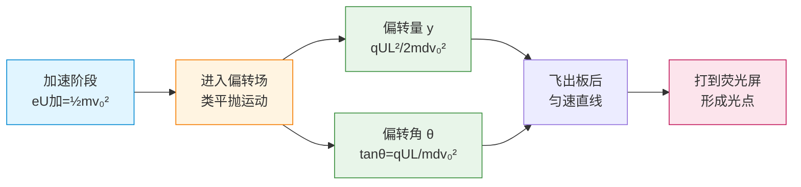

# 带电粒子在电场中的运动

> [!abstract] 概览
> 本节是静电场版块的综合应用篇，将前三节的"力—场—能"工具应用于带电粒子在电场中的运动分析。两类典型问题：（1）带电粒子在匀强电场中的==加速==——用动能定理 $qU=\frac{1}{2}mv^2-\frac{1}{2}mv_0^2$；（2）带电粒子垂直射入匀强电场的==偏转==——类比平抛运动，分解为初速方向的匀速运动与垂直方向的匀加速运动。在此基础上分析示波器扫描原理、密立根油滴实验（测元电荷）。最后简述带电粒子在非匀强电场中的运动——用能量法（动能定理）处理。本节是 [[02-电场与电场强度]]、[[03-电势与电势能]] 的综合演练，也是后续 [[04-带电粒子在磁场中的运动]] 的力学基础。

## 核心概念

### 一、带电粒子在电场中的受力与运动

**受力**：带电粒子 $q$ 在电场 $\vec{E}$ 中受力 $\vec{F}=q\vec{E}$。
- $q>0$：受力方向与场强同向；
- $q<0$：受力方向与场强反向。

**运动**：由牛顿第二定律 $\vec{a}=\vec{F}/m=q\vec{E}/m$。
- 若 $\vec{E}$ 恒定（匀强电场）：$\vec{a}$ 恒定，做匀变速运动；
- 若 $\vec{E}$ 变化（非匀强电场）：$\vec{a}$ 变化，需用能量法或微元法处理。

> [!note] "粒子"与"小球"的处理差异
> - **带电粒子**（电子、质子、离子）：质量小，重力通常远小于电场力，==忽略重力==；
> - **带电小球/油滴**（密立根实验、带电尘埃）：质量较大，重力可与电场力相比，==必须考虑重力==。
> 判断标准：比较 $mg$ 与 $qE$ 的量级。如电子在 $E=10^4\,\text{V/m}$ 中，$qE\approx 1.6\times 10^{-15}\,\text{N}$，$mg\approx 9\times 10^{-30}\,\text{N}$，比值 $\sim 10^{14}$，重力完全可忽略。

### 二、加速问题——动能定理法

设带电粒子（质量 $m$、电荷量 $q$、初速度 $v_0$）经过电压 $U$ 加速。无论电场是否均匀，由动能定理：
$$
\boxed{\,qU = \dfrac{1}{2}mv^2 - \dfrac{1}{2}mv_0^2\,}
$$
- 若初速度 $v_0=0$：$v = \sqrt{\dfrac{2qU}{m}}$
- 这是一普适公式，==不要求电场均匀==，只关心初末位置电势差。

> [!important] 动能定理的优势
> 动能定理只关心初末状态的电势差，不涉及具体路径与场强分布。对于非匀强电场（如点电荷电场）中的加速问题，==动能定理是首选工具==，比牛顿定律+运动学方法更简洁。

### 三、偏转问题——类平抛运动

**典型模型**：带电粒子（质量 $m$、电荷量 $q$）以初速度 $v_0$ 沿==垂直==于匀强电场方向射入两平行金属板间，板长 $L$、板间距 $d$、板间电压 $U$。粒子在板间做==类平抛运动==。

**分析方法**（与平抛运动完全平行）：
- 沿初速度方向（设为 $x$ 轴）：匀速直线运动，$v_x=v_0$；
- 沿场强方向（设为 $y$ 轴）：初速度为零的匀加速运动，$a=qE/m=qU/(md)$。

**关键公式**：

1. **加速度**：
$$
a = \dfrac{qE}{m} = \dfrac{qU}{md}
$$

2. **板内运动时间**（粒子穿过板间）：
$$
t = \dfrac{L}{v_0}
$$

3. **偏转量**（出板时沿 $y$ 方向位移）：
$$
\boxed{\,y = \dfrac{1}{2}at^2 = \dfrac{qUL^2}{2mdv_0^2}\,}
$$

4. **出板时的偏转角**（速度方向与初速度方向夹角）：
$$
\boxed{\,\tan\theta = \dfrac{v_y}{v_x} = \dfrac{at}{v_0} = \dfrac{qUL}{mdv_0^2}\,}
$$

5. **重要推论**：偏转量 $y$ 与偏转角 $\tan\theta$ 的关系
$$
y = \dfrac{L\tan\theta}{2}
$$
即粒子好像从板间中点沿直线射出（"中点等效"性质）。

6. **进一步推论**：若粒子先经电压 $U_{\text{加}}$ 加速后获得 $v_0$，再射入偏转电压 $U_{\text{偏}}$ 的偏转板，则偏转量
$$
y = \dfrac{qU_{\text{偏}}L^2}{2mdv_0^2} = \dfrac{qU_{\text{偏}}L^2}{2md\cdot 2qU_{\text{加}}/m} = \dfrac{U_{\text{偏}}L^2}{4dU_{\text{加}}}
$$
==偏转量 $y$ 与粒子比荷 $q/m$ 无关==——这是示波器设计的关键：不同种类带电粒子经同一电压加速后，在相同偏转电压下偏转相同。

**图示：带电粒子加速—偏转—打屏全流程**

### 四、示波器原理

**示波器**是用来观察电压随时间变化规律的仪器，核心由阴极射线管（CRT）构成：

**结构原理**：
1. **电子枪**：灯丝加热阴极发射电子，经加速电压获得动能 $eU_{\text{加}}=\frac{1}{2}mv_0^2$。
2. **偏转系统**：两组平行板电容器互相垂直
   - **水平偏转板（XX'）**：加==扫描电压==（锯齿波），使电子束水平方向匀速移动；
   - **垂直偏转板（YY'）**：加==待测信号电压==，使电子束垂直方向偏转。
3. **荧光屏**：电子打在屏上发光，显示信号波形。

**扫描电压（锯齿波）**：电压随时间线性增大 $u_X=kt$，使光点水平位移 $x\propto u_X\propto t$。回扫时电压快速归零。这样水平方向就"展开"为时间轴。

**同步条件**：扫描周期 $T_X$ 是信号周期 $T_Y$ 的整数倍 $T_X=nT_Y$（$n$ 为正整数）时，屏上显示 $n$ 个稳定波形。否则波形会左右移动。

> [!tip] 示波器的"两种模式"
> - **扫描模式**：XX' 加锯齿波，YY' 加信号，显示信号随时间的波形；
> - **X-Y 模式**：XX' 和 YY' 都加信号，显示两信号的李萨如图形（频率比稳定时图形封闭稳定）。

### 五、密立根油滴实验（拓展）

**实验目的**：测定元电荷 $e$ 的精确值，验证电荷量子化。

**装置**：平行板电容器，板间为匀强电场 $E=U/d$。喷雾器喷出细小油滴，经 X 射线照射带电。

**两种测量方法**：

**方法 1：动态法（平衡测量）**
调节板间电压 $U$，使带电油滴在电场中==匀速==下落（或上升）。设油滴质量 $m$、电量 $q$、空气阻力 $f=6\pi\eta r v$（斯托克斯定律）：

- 仅重力下落时（无电场）达到收尾速度 $v_g$：$mg = 6\pi\eta r v_g$
- 加电场后匀速下落（电场向上、油滴带负电）：$mg - qE = 6\pi\eta r v_e$
- 加电场后匀速上升：$qE - mg = 6\pi\eta r v_e'$

联立可求 $q$。

**方法 2：静态法**
调节电压使油滴==静止==悬浮（$v=0$，无阻力）：
$$
qE = mg\;\Rightarrow\; q = \dfrac{mg}{E} = \dfrac{mgd}{U}
$$
油滴质量 $m=\frac{4}{3}\pi r^3\rho$（$\rho$ 为油密度，$r$ 由观察无电场下落收尾速度推得）。

**关键结论**：测量大量油滴的电量，发现 $q$ 总是某个最小值的整数倍，即
$$
q = ne,\quad n=1,2,3,\dots
$$
最小值即元电荷：
$$
e \approx 1.602\times 10^{-19}\,\text{C}
$$

> [!important] 历史意义
> 密立根实验（1909 年）首次精确测定 $e$，==验证电荷量子化==，是 20 世纪初物理学的里程碑实验之一。其方法学上的精妙之处在于把宏观可测量（油滴下落速度、电压）与微观量（元电荷）联系起来，体现了"以大见小"的实验智慧。

### 六、带电粒子在非匀强电场中的运动

非匀强电场（如点电荷电场）中 $\vec{E}$ 处处不同，无法用匀变速运动学处理，==首选能量法==：

**动能定理**：$qU_{AB} = \Delta E_k$，只关心初末位置电势差。
**能量守恒**：$E_k + E_p = \text{const}$（仅保守力做功时），其中 $E_p=q\varphi$。

例如，电子绕质子运动（玻尔模型经典图像）：在质子库仑场中，电子总能量
$$
E = \dfrac{1}{2}mv^2 - k\dfrac{e^2}{r}
$$
对圆周运动 $k e^2/r^2 = mv^2/r$，故 $E_k = \frac{1}{2}k e^2/r$，$E=-\frac{1}{2}k e^2/r$（束缚态能量为负）。

> [!warning] 非匀强场中的常见陷阱
> 1. 不能用 $E=U/d$（仅适用于匀强电场）；
> 2. 不能套用平抛公式（$a$ 不恒定）；
> 3. 用能量法时务必先确定零势点，注意电势的正负。

## 推导与原理

### 一、偏转量 $y$ 与偏转角 $\tan\theta$ 的推导

设粒子以 $v_0$ 沿 $x$ 方向射入板间匀强电场 $E=U/d$（$y$ 方向）。

**$x$ 方向**（匀速）：
$$
v_x = v_0,\quad x = v_0 t
$$
穿过板长 $L$ 所需时间 $t=L/v_0$。

**$y$ 方向**（匀加速，初速度为零）：
$$
a = \dfrac{qE}{m} = \dfrac{qU}{md},\quad v_y = at,\quad y = \dfrac{1}{2}at^2
$$

代入 $t=L/v_0$：
$$
y = \dfrac{1}{2}\cdot\dfrac{qU}{md}\cdot\dfrac{L^2}{v_0^2} = \dfrac{qUL^2}{2mdv_0^2}
$$
$$
v_y = at = \dfrac{qU}{md}\cdot\dfrac{L}{v_0} = \dfrac{qUL}{mdv_0}
$$
$$
\tan\theta = \dfrac{v_y}{v_x} = \dfrac{qUL}{mdv_0^2}
$$

**"中点等效"性质**：粒子出板后做匀速直线运动，方向沿 $\vec{v}_{\text{出}}=(v_0, v_y)$。出板时位置 $(L, y)$，速度方向斜率 $\tan\theta=v_y/v_0$。反向延长出板时速度方向，与 $x$ 轴交点 $x_0$ 满足：
$$
\tan\theta = \dfrac{y}{L-x_0}\;\Rightarrow\; \dfrac{qUL}{mdv_0^2} = \dfrac{qUL^2/(2mdv_0^2)}{L-x_0}
$$
解得 $L-x_0 = L/2$，即 $x_0=L/2$。粒子好像从板间中点沿直线射出。

### 二、加速+偏转组合的"比荷无关"推导

设粒子先经加速电压 $U_{\text{加}}$（初速度为零）获得 $v_0$：
$$
qU_{\text{加}} = \dfrac{1}{2}mv_0^2\;\Rightarrow\; v_0^2 = \dfrac{2qU_{\text{加}}}{m}
$$
代入偏转量公式：
$$
y = \dfrac{qU_{\text{偏}}L^2}{2mdv_0^2} = \dfrac{qU_{\text{偏}}L^2}{2md\cdot\dfrac{2qU_{\text{加}}}{m}} = \dfrac{U_{\text{偏}}L^2}{4dU_{\text{加}}}
$$
$q$ 与 $m$ 全部约掉！==偏转量只取决于电压比与几何参数，与粒子种类无关==。

> [!important] 示波器的设计哲学
> 这一性质使示波器无需为不同种类粒子重新校准——只要加速电压与偏转电压相同，任何带电粒子都偏转相同。这是工程上极为有利的"普适性"，体现了物理规律的简洁之美。

### 三、密立根油滴实验中 $q$ 的推导（静态法）

设油滴半径 $r$、密度 $\rho$、空气粘滞系数 $\eta$。先在无电场时让油滴下落，达到收尾速度 $v_g$ 时重力与粘滞阻力平衡：
$$
mg = 6\pi\eta r v_g\;\Rightarrow\; \dfrac{4}{3}\pi r^3 \rho\, g = 6\pi\eta r v_g
$$
解出：
$$
r = \sqrt{\dfrac{9\eta v_g}{2\rho g}}
$$
再加电场调节电压 $U$ 使油滴静止悬浮（$qE=mg$）：
$$
q = \dfrac{mg}{E} = \dfrac{mgd}{U} = \dfrac{\dfrac{4}{3}\pi r^3 \rho g d}{U}
$$
代入 $r$ 即可求 $q$。多次测量不同油滴得 $q_1,q_2,\dots$，取它们的最大公约数即元电荷 $e$。

## 典型实例与类比

### 类比 1：偏转问题 ↔ 平抛运动

| 比较项 | 重力场中平抛 | 电场中类平抛 |
| --- | --- | --- |
| 受力 | 重力 $mg$（恒定向下） | 电场力 $qE$（恒定沿场强） |
| 加速度 | $g$ | $a=qE/m=qU/(md)$ |
| 初速度方向 | 水平 | 垂直场强 |
| 轨迹 | 抛物线 | 抛物线 |
| 处理方法 | 分解为水平匀速+竖直匀加速 | 分解为初速方向匀速+场强方向匀加速 |

> [!example] 类比的力量
> ==重力场就是"特殊的匀强电场"==——对带电粒子而言，重力 $mg$ 类比电场力 $qE$，重力加速度 $g$ 类比 $qE/m$。一旦建立这个对应，所有平抛运动公式都可"翻译"为类平抛公式。这是高中物理"模型迁移"的典型范例。

### 类比 2：示波器 ↔ 电视显像管

示波器与老式 CRT 电视/电脑显示器原理相同：都是电子枪发射电子束，经偏转系统打在荧光屏上。差别在于：
- 示波器：偏转板使电子束偏转，扫描锯齿波展开时间轴；
- CRT 电视：偏转线圈（磁场）使电子束偏转，按行/场扫描形成图像（详见 [[04-带电粒子在磁场中的运动]]）。

### 实例：电子在两平行板间的偏转——"瞄准距离"

设电子以 $v_0$ 沿板间中线射入偏转板，板长 $L$、板间距 $d$。要使电子不打到板上，需偏转量 $y<d/2$：
$$
\dfrac{eUL^2}{2mdv_0^2} < \dfrac{d}{2}\;\Rightarrow\; U < \dfrac{md^2v_0^2}{eL^2}
$$
这是限制偏转电压的条件。

> [!tip] 记忆口诀
> ==加速用动能定理 $qU=\Delta E_k$；偏转用类平抛，分解两方向；偏转量 $y=qUL^2/(2mdv_0^2)$，偏转角 $\tan\theta=qUL/(mdv_0^2)$；中点等效要记牢，加速偏转比荷消。==

## 例题

### 例 1：基础——加速+偏转综合

**题目**：电子（$e=1.6\times 10^{-19}\,\text{C}$，$m=9.1\times 10^{-31}\,\text{kg}$）经电压 $U_1=2000\,\text{V}$ 加速后，垂直射入偏转电压 $U_2=100\,\text{V}$、板长 $L=4\,\text{cm}$、板间距 $d=1\,\text{cm}$ 的平行板偏转电场。求：
（1）电子进入偏转板时的速度 $v_0$；
（2）偏转量 $y$ 与偏转角 $\theta$；
（3）电子出板时的总动能。

**分析**：先用动能定理求 $v_0$；再用类平抛公式求 $y$ 与 $\tan\theta$；最后用动能定理 $qU_2$（实际穿过板间对应的等效电势差）或能量守恒求总动能。

**解答**：
（1）由 $eU_1=\frac{1}{2}mv_0^2$：
$$
v_0 = \sqrt{\dfrac{2eU_1}{m}} = \sqrt{\dfrac{2\times 1.6\times 10^{-19}\times 2000}{9.1\times 10^{-31}}} \approx 2.65\times 10^7\,\text{m/s}
$$

（2）
$$
y = \dfrac{eU_2 L^2}{2mdv_0^2} = \dfrac{U_2 L^2}{4dU_1} = \dfrac{100\times 0.04^2}{4\times 0.01\times 2000} = \dfrac{0.16}{80} = 2.0\times 10^{-3}\,\text{m} = 2\,\text{mm}
$$
$$
\tan\theta = \dfrac{eU_2 L}{mdv_0^2} = \dfrac{U_2 L}{2dU_1} = \dfrac{100\times 0.04}{2\times 0.01\times 2000} = 0.1
$$
$\theta\approx 5.71^\circ$。

（3）电子穿过偏转板"等效"经历了 $U_y = y\cdot E = y\cdot (U_2/d) = 0.002\times 100/0.01 = 20\,\text{V}$ 的电势差（也可直接用 $U_y=\dfrac{U_2 y}{d}$）。故总动能增量 $eU_y = 20\,\text{eV}$，总动能：
$$
E_k = e(U_1+U_y) = 1.6\times 10^{-19}\times 2020 \approx 3.23\times 10^{-16}\,\text{J}
$$
或 $2020\,\text{eV}$。

**点评**：本题完整展示了"加速+偏转+能量"的分析链条。注意第（3）问也可以用 $E_k=\frac{1}{2}mv^2$（$v=\sqrt{v_0^2+v_y^2}$）求，但用电势差更简洁——电场力做功只关心电势差。

### 例 2：示波器扫描原理

**题目**：示波器 YY' 偏转板加正弦信号电压 $u_Y=U_m\sin(2\pi ft)$，XX' 偏转板加扫描电压 $u_X=kt$（线性），扫描周期 $T_X=1/f$。试分析荧光屏上显示的波形。

**分析**：扫描电压使光点水平位移 $x\propto u_X\propto t$，故 $x$ 与 $t$ 一一对应（线性映射）。同时 $y\propto u_Y=U_m\sin(2\pi ft)$，故 $y\propto\sin(2\pi ft)$。把 $t$ 用 $x$ 表示：$t=x/k'$（$k'$ 为常数），则
$$
y \propto \sin\left(\dfrac{2\pi f}{k'}x\right)
$$
即 $y$ 随 $x$ 按正弦变化——屏上呈现一个完整正弦波。

**解答**：因 $T_X=1/f=T_Y$，扫描周期等于信号周期，屏上显示==一个==稳定的正弦波形。

若 $T_X=2T_Y$，则 $n=T_X/T_Y=2$，显示 2 个波形；若 $T_X=0.7T_Y$（非整数倍），波形会左右移动不稳定。

**点评**：示波器扫描原理的核心是"扫描电压把时间轴变换为空间轴"。同步条件 $T_X=nT_Y$ 是稳定显示的关键——这是高考选择/填空题高频考点。

### 例 3：中难——密立根油滴实验

**题目**：密立根油滴实验中，板间距 $d=1.0\,\text{cm}$ 的平行板电容器，板间为匀强电场。油滴密度 $\rho=900\,\text{kg/m}^3$，无电场时观察到油滴以收尾速度 $v_g=1.0\times 10^{-4}\,\text{m/s}$ 匀速下落。空气粘滞系数 $\eta=1.8\times 10^{-5}\,\text{Pa}\cdot\text{s}$。然后加电压 $U=200\,\text{V}$ 使油滴静止悬浮。求：
（1）油滴半径 $r$；
（2）油滴电量 $q$（$g$ 取 $10\,\text{m/s}^2$）；
（3）判断油滴带几个元电荷。

**分析**：先由无电场下落达到收尾速度时 $mg=6\pi\eta r v_g$ 求 $r$；再由悬浮时 $qE=mg$ 求 $q$；最后用 $q/e$ 判断元电荷数。

**解答**：
（1）由 $\frac{4}{3}\pi r^3\rho g = 6\pi\eta r v_g$：
$$
r^2 = \dfrac{9\eta v_g}{2\rho g} = \dfrac{9\times 1.8\times 10^{-5}\times 1.0\times 10^{-4}}{2\times 900\times 10} = 9.0\times 10^{-12}\,\text{m}^2
$$
$$
r = 3.0\times 10^{-6}\,\text{m} = 3.0\,\mu\text{m}
$$

（2）悬浮时 $qE=mg$，$E=U/d=200/0.01=2.0\times 10^4\,\text{V/m}$。油滴质量：
$$
m = \dfrac{4}{3}\pi r^3\rho = \dfrac{4}{3}\pi \times (3.0\times 10^{-6})^3 \times 900 \approx 1.02\times 10^{-13}\,\text{kg}
$$
故：
$$
q = \dfrac{mg}{E} = \dfrac{1.02\times 10^{-13}\times 10}{2.0\times 10^4} \approx 5.1\times 10^{-17}\,\text{C}
$$
（实际数据应给出更接近 $e$ 整数倍的值，本题数据为简化示例。）

（3）元电荷 $e=1.6\times 10^{-19}\,\text{C}$，故 $q/e\approx 319$。该比值偏离整数倍过大，说明数据为虚构；真实实验中应测得接近 $ne$ 的值，由此验证电荷量子化。

**点评**：密立根实验完整展示了"宏观测量推微观量"的实验智慧。注意本题数据为示例，实际历史数据 $q\approx 4.8\times 10^{-19}\,\text{C}=3e$ 等，正好是 $e$ 的整数倍。该实验是 [[01-电荷与库仑定律]] 中"元电荷"概念的实验基础。

## 易错提醒

> [!warning] 易错点
> 1. **重力是否忽略**：电子/质子/离子忽略重力；油滴/带电尘埃必须考虑重力。判断标准：比较 $mg$ 与 $qE$。
> 2. **偏转公式中各量方向**：$y$ 沿场强方向，$L$ 沿初速度方向，$d$ 沿板间距方向（垂直于初速度和场强）。代入公式时切勿混用。
> 3. **加速+偏转公式中 $v_0$ 与 $U$ 的关系**：若粒子初速度由加速电压获得，要联立 $qU_1=\frac{1}{2}mv_0^2$ 与偏转公式，最终 $y$ 与比荷无关。
> 4. **示波器扫描同步条件**：$T_X=nT_Y$（$n$ 正整数），不是 $T_X=T_Y$ 一种情形。
> 5. **非匀强电场不能用 $E=U/d$**：仅匀强电场适用；非匀强场用能量法。
> 6. **密立根实验中油滴受力**：悬浮时 $qE=mg$（无空气阻力，因 $v=0$）；匀速运动时需考虑空气阻力（斯托克斯公式）。

> [!note] 概念辨析
> **加速 vs 偏转**
> | 比较项 | 加速 | 偏转 |
> | --- | --- | --- |
> | 粒子初速方向 | 沿场强方向 | 垂直场强方向 |
> | 受力方向 | 与初速平行 | 与初速垂直 |
> | 运动类型 | 匀变速直线 | 类平抛（匀变速曲线） |
> | 关键公式 | $qU=\Delta E_k$ | $y=qUL^2/(2mdv_0^2)$ |
> | 适用条件 | 任意电场 | 匀强电场 |
>
> **粒子 vs 小球**
> 粒子（电子、质子、离子）忽略重力；带电小球/油滴通常需考虑重力。这一步判断错，全题皆错。

## 与其他知识关联

- 与 [[01-电荷与库仑定律]] 的关系：粒子受电场力的本质是库仑力；元电荷 $e$ 由密立根实验测得。
- 与 [[02-电场与电场强度]] 的关系：粒子加速度 $a=qE/m$，由场强直接决定；偏转板间为匀强电场 $E=U/d$。
- 与 [[03-电势与电势能]] 的关系：动能定理 $qU=\Delta E_k$ 中 $U$ 即电势差；密立根实验本质是测量电势差对应的能量。
- 与 [[04-电容器与电容]] 的关系：偏转板本身就是一个平行板电容器；示波器偏转板间的匀强电场由电容器电压维持。
- 与 [[04-带电粒子在磁场中的运动]] 的关系：本节是带电粒子在电场中运动，下一版块将讨论带电粒子在磁场中运动（圆周运动）；二者共同构成"电磁偏转"的完整工具箱，是回旋加速器、质谱仪、示波器等仪器的物理基础。
- 与 [[03-洛伦兹力]] 的关系：电场对电荷施力 $q\vec{E}$ 与磁场对运动电荷施力 $q\vec{v}\times\vec{B}$ 共同构成洛伦兹力；本节是磁场运动问题的力学基础。
- 与力学 [[动能与动量]] 的关系：本节大量使用动能定理、能量守恒、平抛运动模型，是力学方法在电场中的直接迁移。
- 与 [[物理光学]] 的关系：密立根实验中的光电效应研究（密立根也验证了爱因斯坦光电方程）连接了电磁学与量子物理。
- 大学层面延伸：[[电磁学]] 中带电粒子运动由洛伦兹力方程 $m\dfrac{d\vec{v}}{dt}=q(\vec{E}+\vec{v}\times\vec{B})$ 描述；[[量子电动力学]] 中粒子与场的相互作用被量子化为光子交换。

## 作者的话

> [!quote] 个人理解
> 带电粒子在电场中的运动是高中物理"模型综合"的高峰之一——它把力学的牛顿定律、动能定理、平抛运动与电学的库仑力、电场强度、电势差熔于一炉。学习这一节，最重要的不是记公式，而是建立"==力学方法在电场中的迁移=="这一思维模式。一旦意识到"重力场就是一个特殊的匀强电场"，所有平抛、能量、动量的力学经验都可以无缝迁移过来。示波器是这个思维模式的最佳载体：它把"看不见的电信号"翻译为"看得见的光斑轨迹"，这种"信号—偏转—显示"的工程思想贯穿整个电子学，从老式 CRT 电视到现代示波器、雷达显示屏，原理一脉相承。密立根实验则是"以宏观量推微观量"的实验哲学典范——通过测量油滴下落速度（宏观可观察）和电压（宏观可测），间接得到元电荷 $e$（微观尺度）。这种"宏观—微观"桥梁的搭建能力，是物理学家最核心的方法论之一。建议读者在学完本节后，对比学习 [[04-带电粒子在磁场中的运动]]，体会电场偏转（抛物线轨迹）与磁场偏转（圆周轨迹）的本质差异——这种对比会深化对两种场的理解。最终，所有这些"带电粒子在电磁场中运动"的规律，在大学 [[电磁学]] 中将统一于洛伦兹力方程，并在 [[量子电动力学]] 中被重新诠释为粒子与量子化电磁场的相互作用——物理学的统一之美，从高中这里就已埋下种子。

---
*返回 [[00-电学总览]]*
