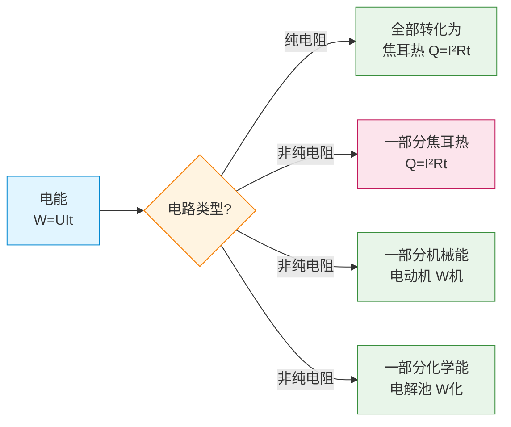

# 电功与电功率

> [!abstract] 概览
> 本节从能量转化的角度审视电路：电流通过电路时，电能转化为其他形式能量。在纯电阻电路中，电能全部转化为热能（$W=Q$）；在非纯电阻电路（如电动机、电解槽）中，电能同时转化为机械能/化学能与热能（$W>Q$）。本节给出电功 $W=UIt$、电功率 $P=UI$、焦耳定律 $Q=I^2Rt$ 三大基本公式，重点辨析纯电阻与非纯电阻电路的能量转化关系，并讨论额定功率、实际功率、电源输出功率与效率。掌握本节是分析闭合电路、电动机电路、家用电器功率问题的基础。

## 核心概念

### 1. 电功

$$
\boxed{W = UIt}
$$

其中 $U$ 为导体两端电压（V），$I$ 为通过导体的电流（A），$t$ 为通电时间（s），$W$ 为电流做的功（J）。

**物理意义**：电功描述电流通过某段电路时电能转化为其他形式能量的总量。

**推导**：电流做功的本质是电场力对电荷做功。设 $t$ 时间内通过导体横截面的电荷量为 $q=It$，电场力做功 $W=qU=UIt$。

> [!note] 注意
> $W=UIt$ 是电功的**普适式**，对任何电路（纯电阻或非纯电阻）都成立，因为它本质是"电场力对电荷做功"，与电路具体性质无关。

### 2. 电功率

$$
\boxed{P = \dfrac{W}{t} = UI}
$$

**物理意义**：电功率描述电流做功的快慢，等于单位时间电流所做的功。单位为瓦特（W），$1\,\text{W}=1\,\text{J/s}$。

### 3. 焦耳定律（焦耳热）

$$
\boxed{Q = I^2 R t}
$$

**物理意义**：电流通过电阻为 $R$ 的导体时，所产生的热量与电流的平方、电阻、通电时间成正比。这是英国物理学家焦耳通过实验总结得出的定律。

**微观解释**：自由电子在电场作用下加速，与晶格碰撞后将动能交给晶格，转化为晶格热振动——宏观表现为温度升高（焦耳热）。

### 4. 纯电阻电路 vs 非纯电阻电路

| 电路类型 | 定义 | 能量转化 | 关键公式 | 典型例子 |
| --- | --- | --- | --- | --- |
| **纯电阻电路** | 只含电阻元件（无电动机、电解槽等） | 电能 → 热能 | $W=Q$，$U=IR$ | 电热毯、白炽灯、电热水壶 |
| **非纯电阻电路** | 含电动机、电解槽等 | 电能 → 其他能 + 热能 | $W>Q$，$U\ne IR$ | 电动机、电解池、充电中的电池 |

> [!warning] 关键辨析
> 在非纯电阻电路中，欧姆定律 $I=U/R$ **不适用**于非纯电阻部分！但 $W=UIt$、$Q=I^2Rt$ 仍分别适用——只是 $W\ne Q$。
>
> - 电动机：电能 = 机械能 + 热能，即 $UIt = W_{\text{机}} + I^2Rt$；
> - 电解池：电能 = 化学能 + 热能，即 $UIt = W_{\text{化}} + I^2Rt$。

**图示：纯电阻 vs 非纯电阻电路能量流向**

### 5. 额定功率与实际功率

- **额定功率** $P_{\text{额}}$：用电器在额定电压下工作时的功率（标称值）。
- **实际功率** $P_{\text{实}}$：用电器在实际电压下工作的功率。

> [!tip] 公式
> 对纯电阻用电器，电阻 $R$ 可视为定值（忽略温度影响），则
> $$
> \dfrac{P_{\text{实}}}{P_{\text{额}}} = \dfrac{U_{\text{实}}^2}{U_{\text{额}}^2}
> $$
> 例：220 V/60 W 灯泡接在 110 V 上，实际功率为 $60\times(110/220)^2=15\,\text{W}$（**不是** 30 W！）。

### 6. 电源功率与输出功率

- **电源总功率**（化学能转化为电能的功率）：$P_{\text{总}}=I\varepsilon$，其中 $\varepsilon$ 为电动势。
- **内阻消耗功率**：$P_{\text{内}}=I^2 r$，转化为内阻的焦耳热。
- **电源输出功率**：$P_{\text{出}}=P_{\text{总}}-P_{\text{内}}=I\varepsilon-I^2 r=I(\varepsilon-Ir)=IU_{\text{端}}$

$$
\boxed{P_{\text{出}} = IU_{\text{端}} = I^2 R_{\text{外}} = \dfrac{\varepsilon^2 R_{\text{外}}}{(R_{\text{外}}+r)^2}}
$$

- **电源效率**：
$$
\eta = \dfrac{P_{\text{出}}}{P_{\text{总}}} = \dfrac{IU_{\text{端}}}{I\varepsilon} = \dfrac{U_{\text{端}}}{\varepsilon} = \dfrac{R_{\text{外}}}{R_{\text{外}}+r}
$$

最大输出功率条件 $R_{\text{外}}=r$ 时（详见 [[05-闭合电路欧姆定律]]），$P_{\text{出},\max}=\dfrac{\varepsilon^2}{4r}$，此时效率 $\eta=50\%$。

## 推导与原理

### 一、$W=UIt$ 的本质推导

设 $t$ 时间内通过导体横截面的电荷量为 $q=It$（电流定义 $I=q/t$ 反推）。

这些电荷从导体一端（高电势 $\varphi_A$）流到另一端（低电势 $\varphi_B$），电场力做功：

$$
W = q\,U_{AB} = q(\varphi_A-\varphi_B) = qU = UIt
$$

**讨论**：电场力做功与路径无关，只与电势差有关——这正是 $W=UIt$ 普适的根源。

### 二、焦耳定律 $Q=I^2Rt$ 在纯电阻电路中的推导

在**纯电阻电路**中，欧姆定律 $U=IR$ 成立，由能量守恒 $W=Q$：

$$
Q = W = UIt = (IR)\cdot I\cdot t = I^2Rt
$$

> [!warning] 注意
> $Q=I^2Rt$ 在任何情况下都成立（含非纯电阻电路中"电阻部分"的焦耳热），但 $Q=UIt$ 或 $Q=U^2t/R$ **只**在纯电阻电路中成立——因为这两种形式已经默认使用了 $U=IR$。

### 三、非纯电阻电路的能量守恒分析

以电动机为例（设其线圈电阻为 $R$，两端电压为 $U$，电流为 $I$）：

$$
\boxed{UIt = W_{\text{机}} + I^2Rt}
$$

即：电能 = 机械能 + 焦耳热。

由此可推出：
- 电动机机械功率：$P_{\text{机}} = UI - I^2R$
- 电动机效率：$\eta = \dfrac{P_{\text{机}}}{P_{\text{电}}} = 1 - \dfrac{IR}{U}$
- **此时 $U \ne IR$**：欧姆定律不适用于含反电动势的电动机整体。

> [!note] 反电动势（拓展）
> 电动机工作时线圈在磁场中转动，产生反向电动势 $\varepsilon_{\text{反}}$，此时实际电流 $I=(U-\varepsilon_{\text{反}})/R$。这一概念在电磁感应章节详述，见 [[02-法拉第电磁感应定律]]。

### 四、电源输出功率与外电阻关系

由 $P_{\text{出}}=\dfrac{\varepsilon^2 R}{(R+r)^2}$，研究 $P_{\text{出}}$ 随 $R$ 的变化：

- 当 $R=0$（短路）：$P_{\text{出}}=0$（端电压为零，无能量输出）。
- 当 $R\to\infty$（断路）：$P_{\text{出}}\to 0$（电流为零）。
- 当 $R=r$：$P_{\text{出},\max}=\dfrac{\varepsilon^2 r}{(r+r)^2}=\dfrac{\varepsilon^2}{4r}$，此时匹配条件 $R=r$。

> [!tip] 匹配条件记忆
> 当外阻等于内阻时，电源输出功率最大——这是"阻抗匹配"原理，高中阶段用求导或基本不等式证明：
> $$
> P_{\text{出}} = \dfrac{\varepsilon^2 R}{(R+r)^2} = \dfrac{\varepsilon^2 R}{(R-r)^2+4Rr} \le \dfrac{\varepsilon^2 R}{4Rr} = \dfrac{\varepsilon^2}{4r}
> $$
> 等号成立当且仅当 $R=r$。

## 典型实例与类比

### 类比：电能"账本"

把电流通过用电器比作"花钱"：
- **电能 $W$**：你给的总金额（电源输出的电功）；
- **焦耳热 $Q$**：必须花掉的"过路费"（电阻消耗）；
- **机械能 / 化学能**：你真正想买的东西（有用功）。

纯电阻电路：所有钱都交过路费（电能全部变热）；
非纯电阻电路：一部分钱买东西，一部分交过路费（电能分为有用功+焦耳热）。

### 实例 1：白炽灯的能量分配

220 V/60 W 白炽灯正常工作时：
- 输入电能 $W=UIt=220\times(60/220)\times t=60t$（J）；
- 约 95% 转化为热（红外辐射+灯丝升温），仅 5% 转化为可见光。

故白炽灯"发光效率"极低，已被 LED 灯（电光效率 30%~50%）取代。

### 实例 2：电动机的"卡死"问题

正常运转的电动机，电流不大（反电动势大）；一旦转子被卡住不转，反电动势消失，电流急剧增大，线圈易烧毁。这也是为何家用搅拌机、电钻严禁长时间堵转。

## 例题

### 例 1：纯电阻电路——电热水壶

**题目**：一只电热水壶标有 "220 V, 1500 W"，[室温 20℃ 大气压下]，将 1 L 水（质量 1 kg）从 20℃ 加热到 100℃，设热损失不计，$c_{\text{水}}=4.2\times10^3\,\text{J/(kg\cdot K)}$。求：
（1）水壶电阻；
（2）加热时间 $t$；
（3）若实际电压降为 198 V，加热所需时间。

**分析**：纯电阻电路，$R=U^2/P$；$Q=cm\Delta t$；由 $W=U^2t/R$ 计算时间。

**解答**：

（1）
$$
R = \dfrac{U^2}{P} = \dfrac{220^2}{1500} \approx 32.3\,\Omega
$$

（2）水吸热 $Q = c_{\text{水}}m\Delta t = 4.2\times10^3\times 1\times 80 = 3.36\times10^5\,\text{J}$。
由 $W=Q$（纯电阻、无热损）：
$$
t = \dfrac{Q}{P} = \dfrac{3.36\times10^5}{1500} \approx 224\,\text{s}\approx 3\,\text{min}\,44\,\text{s}
$$

（3）198 V 时实际功率 $P' = P\times (198/220)^2 = 1500\times 0.81 = 1215\,\text{W}$，时间
$$
t' = \dfrac{Q}{P'} = \dfrac{3.36\times10^5}{1215}\approx 276.5\,\text{s}
$$

**点评**：电压降为 90%，功率降为 81%，时间增为 $1/0.81\approx1.235$ 倍——这是"电压平方影响功率"的典型应用。

### 例 2：非纯电阻电路——电动机

**题目**：一直流电动机线圈电阻 $R=2\,\Omega$，正常工作时两端电压 $U=24\,\text{V}$，电流 $I=2\,\text{A}$。求：
（1）电动机消耗电功率 $P_{\text{电}}$；
（2）线圈发热功率 $P_{\text{热}}$；
（3）电动机机械功率 $P_{\text{机}}$ 与效率 $\eta$；
（4）若转子被卡住不转，求此时电流（设电压仍为 24 V）。

**分析**：电动机为非纯电阻电路，$UIt$ 为电功，$I^2Rt$ 为焦耳热，差值为机械能。

**解答**：

（1）$P_{\text{电}} = UI = 24\times 2 = 48\,\text{W}$

（2）$P_{\text{热}} = I^2R = 2^2\times 2 = 8\,\text{W}$

（3）$P_{\text{机}} = P_{\text{电}} - P_{\text{热}} = 48-8 = 40\,\text{W}$，$\eta = P_{\text{机}}/P_{\text{电}} = 40/48 \approx 83.3\%$

（4）卡住后变为纯电阻电路，$I' = U/R = 24/2 = 12\,\text{A}$，发热功率 $P' = U^2/R = 288\,\text{W}$——远超正常 8 W，必烧毁。

**点评**：本题集中考查"非纯电阻电路 $U\ne IR$"。特别注意卡住后电流变为正常的 6 倍，这正是为何堵转易烧电机。

### 例 3：综合——电源输出功率最大

**题目**：电源电动势 $\varepsilon=6\,\text{V}$，内阻 $r=2\,\Omega$，外接可变电阻 $R$。求：
（1）$R$ 取何值时输出功率最大，最大值为多少？
（2）当 $R=4\,\Omega$ 时，电源效率 $\eta$ 为多少？
（3）当输出功率为最大功率一半时，$R$ 取何值（两种情况）？

**分析**：直接套用 $P_{\text{出}}=\varepsilon^2 R/(R+r)^2$，最大条件 $R=r$；效率 $\eta=R/(R+r)$。

**解答**：

（1）当 $R=r=2\,\Omega$ 时，
$$
P_{\text{出},\max} = \dfrac{\varepsilon^2}{4r} = \dfrac{36}{8} = 4.5\,\text{W}
$$

（2）$R=4\,\Omega$ 时，
$$
\eta = \dfrac{R}{R+r} = \dfrac{4}{6} \approx 66.7\%
$$

（3）由 $\dfrac{\varepsilon^2 R}{(R+r)^2} = \dfrac{P_{\text{出},\max}}{2} = 2.25$，代入 $\varepsilon=6$、$r=2$：
$$
\dfrac{36 R}{(R+2)^2} = 2.25 \Rightarrow 36R = 2.25(R+2)^2 \Rightarrow 2.25R^2-27R+9 = 0
$$
解得 $R=\dfrac{27\pm\sqrt{729-81}}{4.5}=\dfrac{27\pm\sqrt{648}}{4.5}$，即 $R\approx0.35\,\Omega$ 或 $R\approx11.65\,\Omega$。

**点评**：输出功率关于 $R=r$ 对称——同一功率（小于最大值）对应两个 $R$ 值，一个小于 $r$、一个大于 $r$。这是 [[05-闭合电路欧姆定律]] 中的高频考点。

## 易错提醒

> [!warning] 易错点
> 1. **$W=UIt$ vs $Q=I^2Rt$**：前者普适，后者只描述焦耳热；非纯电阻电路中 $W\ne Q$。
> 2. **$P=UI$ vs $P=I^2R$ vs $P=U^2/R$**：第一式普适，后两式仅纯电阻电路适用。
> 3. **$Q=UIt$** 只在纯电阻电路成立，因为默认用了 $U=IR$。
> 4. **额定功率与实际功率**：电压改变时，对纯电阻用电器 $P\propto U^2$，不是 $P\propto U$。
> 5. **电动机卡住后变纯电阻**：此时欧姆定律恢复适用，电流激增——这是"卡住即烧"的根源。
> 6. **最大功率条件**：$R=r$ 时输出功率最大，但效率仅 50%，效率随 $R$ 增大而增大（但功率下降）。

> [!note] 概念辨析
> **额定功率 vs 实际功率 vs 输出功率**：
> - 额定功率：用电器铭牌标称的"设计工作点"；
> - 实际功率：实际电压下的功率，可能大于或小于额定功率；
> - 输出功率：电源对外电路做功的功率，受 $R$ 与 $r$ 共同制约。
>
> **热功率 vs 电功率**：纯电阻电路中两者相等；非纯电阻电路中 $P_{\text{热}}=I^2R<P_{\text{电}}=UI$。

## 与其他知识关联

- 与 [[01-电流与欧姆定律]] 的关系：本节在 $I=U/R$ 基础上引入能量观。
- 与 [[02-电阻与电阻定律]] 的关系：$R$ 的物理意义之一即决定焦耳热大小。
- 与 [[04-串并联电路]] 的关系：串并联电路总功率等于各用电器功率之和（并联）或各分压上功率之和（串联）。
- 与 [[05-闭合电路欧姆定律]] 的关系：电源输出功率、效率、最大功率条件均建立在本节之上。
- 与 [[07-电学实验]] 的关系：测电源电动势与内阻实验需分析电源输出功率。
- 与 [[05-带电粒子在电场中的运动]] 的关系：电场力做功 $W=qU$ 是本节微观版。
- 与 [[02-电容器与电容]] 的关系：电容器储能 $W=\frac12 CU^2$ 与本节 $W=UIt$ 形式不同（前者为储能、后者为耗能）。
- 大学层面延伸：[[电磁学]] 中讨论交流电路有功功率、无功功率、视在功率及功率因数。
- 跨学科：化学原电池中的"电化学反应做功"对应非纯电阻电路（化学能+热能）。

## 作者的话

> [!quote] 个人理解
> 本节最重要的观念转变是：**"电功率" $P=UI$ 不等于"热功率" $P=I^2R$**。前者是"电能消耗速率"，后者是"电能变热速率"。在纯电阻电路中两者恰好相等（因为电能全部变热）；但在电动机、电解槽中，电能还要转化为机械能/化学能，故 $UI>I^2R$——这"差值"恰恰是我们使用这些设备的真正目的。
>
> 这种"差额即有用功"的思维方式在生活中处处可见。比如你交的电费，是按 $W=UIt$ 计费的——冰箱、空调、洗衣机都按总电能计费。但冰箱的"有用功"是制冷（热泵原理），洗衣机的"有用功"是机械搅拌，剩余部分则都变热（线圈发热、摩擦发热）。提高电器的"有用功占比"，即提高效率，正是节能减排的核心目标。
>
> 学习建议：把"电能账本"养成习惯——遇到任何电路，先列出 $W=UIt$（总额）、$Q=I^2Rt$（必耗热）、$W_{\text{有用}}=W-Q$（有用功）三栏。这道"账"算清楚了，纯电阻与非纯电阻的辨析就不再易错。
>
> 思维拓展：电源输出功率最大条件 $R=r$（阻抗匹配）也是电子工程中的核心原理——天线设计、音响阻抗匹配、信号传输都基于此。但需注意：匹配时效率仅 50%，"功率最大"与"效率最高"不可兼得。这是工程中常见的"折中"哲学，物理之美亦在此。

---
*返回 [[00-电学总览]]*
