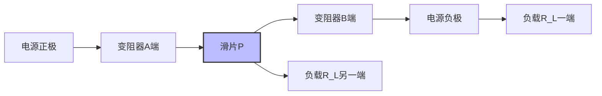

# 串并联电路

> [!abstract] 概览
> 本节将单一电阻拓展到电路网络，建立串联电路与并联电路的基本规律，并讨论混联电路的化简方法（节点法、等效电路法）。本节重点之一是滑动变阻器的两种接法——限流式与分压式，及其在实验电路中的选择原则。掌握串并联规律是分析任何复杂直流电路的基础，也是 [[05-闭合电路欧姆定律]]、[[07-电学实验]] 的逻辑前提。

## 核心概念

### 1. 串联电路

把若干个电阻**首尾相连**，接入电路，称为串联。

**基本特点**：
1. **电流处处相等**：$I_1=I_2=\cdots=I_n=I$
2. **总电压等于各分电压之和**：$U=U_1+U_2+\cdots+U_n$
3. **总电阻等于各分电阻之和**：
$$
\boxed{R_{\text{串}} = R_1+R_2+\cdots+R_n}
$$
4. **各电阻分得电压与其电阻成正比**（分压原理）：$\dfrac{U_i}{R_i}=\dfrac{U_j}{R_j}$
5. **各电阻消耗功率与其电阻成正比**：$P_i=I^2 R_i$

> [!tip] 类比
> 串联像"水流串过若干水管"：流量处处一致，总水压差等于各段水压差之和，长水管（电阻大）分担水压多。

### 2. 并联电路

把若干个电阻**两端分别连在一起**接入电路，称为并联。

**基本特点**：
1. **各支路两端电压相等**：$U_1=U_2=\cdots=U_n=U$
2. **总电流等于各支路电流之和**：$I=I_1+I_2+\cdots+I_n$
3. **总电阻倒数等于各分电阻倒数之和**：
$$
\boxed{\dfrac{1}{R_{\text{并}}} = \dfrac{1}{R_1}+\dfrac{1}{R_2}+\cdots+\dfrac{1}{R_n}}
$$
   特例：两电阻并联 $R_{\text{并}}=\dfrac{R_1 R_2}{R_1+R_2}$
4. **各支路电流与其电阻成反比**（分流原理）：$I_i R_i=I_j R_j$，即 $I_i=\dfrac{R_{\text{并}}}{R_i}\,I$
5. **各支路消耗功率与其电阻成反比**：$P_i=U^2/R_i$

> [!tip] 类比
> 并联像"若干水管并排放置"：两端水压差相同，干路总流量等于各支路流量之和，细水管（电阻大）分担流量少。

### 3. 串并联电阻数量级规律

- **串联越多越大**：$R_{\text{串}}>R_{\max}$；
- **并联越多越小**：$R_{\text{并}}<R_{\min}$；
- **并联越多减小越慢**：将 $R_0$ 与已并联电路再并联，总电阻减小但减小幅度越来越小；
- **短路**：并联 $R=0$ 的支路时，总电阻为零；
- **断路**：串联 $R=\infty$ 的支路时，总电阻为无穷大。

### 4. 滑动变阻器的两种接法

#### 4.1 限流式接法

**接法**：将变阻器的一个接线柱与滑片接线柱接入电路（即变阻器的一部分电阻丝接入电路）。

**特点**：
- 负载 $R_L$ 与变阻器接入部分 $R_x$ 串联，$R_x$ 范围 $[0, R_0]$（$R_0$ 为变阻器总电阻）；
- 负载电压范围：$U_L=\dfrac{R_L}{R_L+R_x}\,\varepsilon\in\left[\dfrac{R_L}{R_L+R_0}\varepsilon,\;\varepsilon\right]$；
- ==限流式无法使负载电压从 0 开始调节==，最小为 $\dfrac{R_L}{R_L+R_0}\varepsilon$；
- 电路简单、耗能少（变阻器与负载共用同一电流）。

#### 4.2 分压式接法

**接法**：变阻器两端接线柱接电源，滑片接线柱与某一端接线柱作为输出接负载。

**特点**：
- 变阻器全部电阻丝接入主电路，负载 $R_L$ 与滑片下方部分 $R_x$ 并联；
- 负载电压范围 $[0, \varepsilon]$，==可从 0 起连续可调==；
- 电路复杂、耗能较多（变阻器始终有电流通过）。

### 5. 限流式 vs 分压式选择原则

| 选择依据 | 限流式 | 分压式 |
| --- | --- | --- |
| 负载电压要求从 0 起 | ❌ 不可用 | ✅ 必用 |
| 负载电压不要求从 0 起 | ✅ 优先（节能、简单） | 可用 |
| 负载电阻 $R_L\gg R_0$（变阻器小） | 限流调节不均，几乎无效 | ✅ 推荐（调节均匀） |
| 负载电阻 $R_L\ll R_0$（变阻器大） | ✅ 可用（调节较均） | 不推荐（变阻器浪费） |
| 实验要求测多组数据、含 0 点 | ❌ | ✅ |
| 限流式最小电流仍超过负载额定值 | ❌ | ✅ 必用 |

> [!tip] 口诀
> **"分压必从零，限流节能简；负载小选大变阻器限流，负载大选小变阻器分压。"**

## 推导与原理

### 一、串联总电阻的推导

由欧姆定律 $U_i=IR_i$，总电压 $U=\sum U_i=I\sum R_i$，又 $U=IR_{\text{串}}$，比较得：
$$
R_{\text{串}}=\sum R_i
$$

### 二、并联总电阻的推导

由欧姆定律 $I_i=U/R_i$，总电流 $I=\sum I_i=U\sum\dfrac{1}{R_i}$，又 $I=U/R_{\text{并}}$，比较得：
$$
\dfrac{1}{R_{\text{并}}}=\sum\dfrac{1}{R_i}
$$

### 三、限流式最小电压的推导

设电源电动势 $\varepsilon$（内阻不计）、变阻器总电阻 $R_0$、负载 $R_L$。限流式中变阻器接入 $R_x\in[0, R_0]$。负载电压：
$$
U_L = \dfrac{R_L}{R_L+R_x}\,\varepsilon
$$
- 当 $R_x=0$：$U_L=\varepsilon$（最大）；
- 当 $R_x=R_0$：$U_L=\dfrac{R_L}{R_L+R_0}\,\varepsilon$（最小）。

故限流式电压调节范围为 $\left[\dfrac{R_L}{R_L+R_0}\,\varepsilon,\;\varepsilon\right]$。当 $R_0\ll R_L$ 时，最小值接近 $\varepsilon$，调节几乎无效；当 $R_0\gg R_L$ 时，最小值接近 0，调节范围大但限流能耗大。

### 四、分压式输出电压的推导（负载为 $R_L$，滑片下方电阻 $R_x$）

主电路电流 $I=\varepsilon/R_0$（变阻器总阻不变），负载端电压即 $R_x$ 与 $R_L$ 并联后的电压：
$$
R_{\text{并}} = \dfrac{R_x R_L}{R_x+R_L},\quad U_L = \dfrac{R_{\text{并}}}{R_0-R_x+R_{\text{并}}}\,\varepsilon
$$

- 当 $R_x=0$：$R_{\text{并}}=0$，$U_L=0$；
- 当 $R_x=R_0$：$R_{\text{并}}=R_L$，$U_L=\dfrac{R_L}{R_L}\,\varepsilon=\varepsilon$；
- 当 $R_L\gg R_0$ 时，$R_{\text{并}}\approx R_x$，$U_L\approx\dfrac{R_x}{R_0}\varepsilon$，调节**线性均匀**——这是分压式选小变阻器的物理原因。

## 典型实例与类比

### 实例 1：家用电器都是并联

家中各用电器（灯、空调、冰箱）都并联在 220 V 火线/零线之间——独立工作互不影响。若改成串联，则一只灯坏全员停电，且电压分配随负载变化。

### 实例 2：电压表串联分压测高电压

普通电压表量程 3 V，要测 12 V 电压，可串联一个分压电阻 $R$ 使 $R$ 分担 9 V、电压表分担 3 V。设电压表内阻 $R_g=3\,\text{k}\Omega$，则由分压：
$$
\dfrac{R}{R_g} = \dfrac{9}{3}=3\;\Rightarrow\;R=9\,\text{k}\Omega
$$
这就是电压表改装原理，详见 [[06-电表改装与万用表]]。

### 实例 3：电流表并联分流测大电流

普通电流计量程 1 mA，要测 1 A 电流，并联一个分流电阻 $R$ 使其分走 999 mA，表头仅流过 1 mA。这是电流表改装原理。

## 例题

### 例 1：串联分压计算

**题目**：三个电阻 $R_1=2\,\Omega$、$R_2=3\,\Omega$、$R_3=5\,\Omega$ 串联接入 20 V 电源（不计内阻）。求：
（1）总电阻、电路电流；
（2）$R_2$ 两端电压；
（3）$R_3$ 消耗功率。

**分析**：直接套用串联规律。

**解答**：

（1）$R_{\text{串}}=2+3+5=10\,\Omega$，$I=U/R=20/10=2\,\text{A}$。

（2）$U_2=IR_2=2\times 3=6\,\text{V}$。

（3）$P_3=I^2 R_3=4\times 5=20\,\text{W}$。

**点评**：串联各量按电阻正比分压、按电阻正比分功率。

### 例 2：并联分流计算

**题目**：$R_1=6\,\Omega$、$R_2=3\,\Omega$ 并联接入 12 V 电源。求：
（1）总电阻、干路电流；
（2）各支路电流；
（3）两电阻消耗功率比。

**分析**：并联规律直接套用。

**解答**：

（1）$R_{\text{并}}=\dfrac{6\times 3}{6+3}=2\,\Omega$，$I=12/2=6\,\text{A}$。

（2）$I_1=U/R_1=12/6=2\,\text{A}$，$I_2=U/R_2=12/3=4\,\text{A}$（验证 $I_1+I_2=6$）。

（3）$P_1=U^2/R_1=144/6=24\,\text{W}$，$P_2=144/3=48\,\text{W}$，比 $P_1:P_2=1:2$（即与电阻成反比）。

**点评**：并联时小电阻分大电流、消耗大功率——这与"电阻大者分压大"的串联规律正好相反。

### 例 3：限流式与分压式判断

**题目**：用电动势 4 V、内阻不计的电源给 "3 V, 0.3 A" 的小灯泡供电，现有规格为 $10\,\Omega$、$100\,\Omega$、$1000\,\Omega$ 三个滑动变阻器。要求电压能从 0 起连续可调，并选择合适的变阻器。

**分析**：
- 灯泡电阻 $R_L=3/0.3=10\,\Omega$；
- 要求从 0 起调——必用分压式；
- 分压式变阻器与负载同数量级时调节最均匀。

**解答**：

必用分压式接法。选择 $R_0=10\,\Omega$ 的变阻器：
- 若选 $1000\,\Omega$：变阻器远大于负载，滑片移动时输出几乎不变（调节不均）；
- 若选 $100\,\Omega$：仍偏大，调节范围小；
- 选 $10\,\Omega$：与负载匹配，调节均匀。

电路连接：变阻器两端 $A$、$B$ 接电源，$A$ 与滑片 $P$ 作为输出接灯泡两端。

**点评**：分压式变阻器选型口诀"分压选小不选大"，本质是输出电阻匹配。

## 易错提醒

> [!warning] 易错点
> 1. **并联总电阻不是"和"**：并联总电阻**小于**任一分电阻，不是"相加"。
> 2. **两电阻并联公式**：$R_{\text{并}}=\dfrac{R_1 R_2}{R_1+R_2}$（注意只对两个有效，三个及以上要用倒数和）。
> 3. **限流式无法从 0 起调**：高考实验题经常考这一点，特别是测小灯泡伏安特性时**必须**用分压式。
> 4. **分压式选大变阻器会失灵**：变阻器远大于负载时，分压调节几乎无效。
> 5. **混联电路化简顺序**：应由"内部"逐步向外化简，先并后串或先串后并，视具体结构。
> 6. **短路 vs 断路**：并联支路短路使总电阻为零；串联支路断路使总电阻为无穷大。

> [!note] 概念辨析
> **串联 vs 并联的"大者多分"原则**：
> - 串联：电阻大者分得**电压多**、消耗**功率多**；
> - 并联：电阻小者分得**电流多**、消耗**功率多**。
> 这是因前者电流相同（$P=I^2R$ 与 $R$ 正比），后者电压相同（$P=U^2/R$ 与 $R$ 反比）。

## 与其他知识关联

- 与 [[01-电流与欧姆定律]] 的关系：本节将欧姆定律应用于多电阻网络。
- 与 [[02-电阻与电阻定律]] 的关系：电阻 $R$ 是串并联分析的基本元件。
- 与 [[03-电功与电功率]] 的关系：串并联总功率等于各电阻功率之和（无论串或并）。
- 与 [[05-闭合电路欧姆定律]] 的关系：外电路通常是混联电路，需先化简再分析。
- 与 [[06-电表改装与万用表]] 的关系：电压表串联分压电阻、电流表并联分流电阻——典型串并联应用。
- 与 [[07-电学实验]] 的关系：实验电路设计中限流/分压选择是核心环节。
- 大学层面延伸：[[电磁学]] 中复杂电路用基尔霍夫定律（节点电压法、回路电流法）求解。
- 跨学科：电路分析思维与计算机科学中"图论"节点/边分析类似；与化学中"并联反应路径"概念相通。

## 作者的话

> [!quote] 个人理解
> 学习串并联最大的收获，是建立"等效电路"的思想：复杂的电阻网络，可以一步一步"折叠"成一个等效电阻——只要外特性相同，就可以"以一替多"。这种"黑箱等效"思想是物理学方法论的重要一环，在 [[04-电容器与电容]] 中"等效电容"同样适用，在大学物理中"戴维南定理"更进一步：任何含源二端网络都可等效为一个电源+一个内阻。
>
> 限流式 vs 分压式的选择是高考实验题的"必考考点"。我建议你从能量观和欧姆定律两个角度都推导一遍两种接法的电压范围——这种"两种视角看同一问题"的训练，能极大提升你对电路的直觉把握。当你看到"从 0 起调"或"测多组数据"时，应立刻条件反射到"分压式"；看到"节能、电路简单"时则倾向"限流式"。
>
> 学习建议：把"串/并电压电流规律""功率分配规律""限流/分压公式"列成一张速查表，反复翻看。结合 [[07-电学实验]] 的具体实验电路分析限流/分压选择，效果最佳。
>
> 另外值得一提的是：在电路化简中，"节点法"是普适的方法——把所有电势相同的点合并为同一节点，再分析节点之间的电阻。这种方法对复杂桥式电路（如惠斯通电桥）尤其有效，是衔接大学电路分析的入门。

---
*返回 [[00-电学总览]]*
