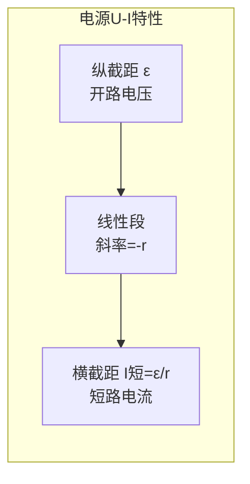
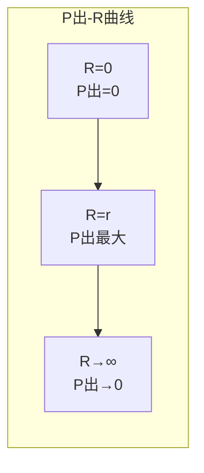

# 闭合电路欧姆定律

> [!abstract] 概览
> 本节是恒定电流版块的"高潮章节"，将单一电阻电路推广到含电源的完整闭合电路。引入电动势 $\varepsilon$、内阻 $r$ 两个核心概念，建立闭合电路欧姆定律 $I=\varepsilon/(R+r)$ 与路端电压公式 $U=\varepsilon-Ir$。重点分析电源的 U-I 特性曲线——其截距、斜率分别对应电动势与内阻，是高考高频考点。进一步讨论电源输出功率 $P_{\text{出}}$ 与外电阻 $R$ 的关系曲线，导出最大输出功率条件 $R=r$。最后给出电源效率 $\eta=R/(R+r)$。掌握本节是分析含源电路、设计电学实验的关键。

## 核心概念

### 1. 电源的作用

**电源**：能够将其他形式能量（化学能、机械能、光能等）转化为电能的装置。

**作用**：
1. **维持电势差**：通过非静电力做功，在电源内部将正电荷从负极搬运到正极，维持两极间的电势差；
2. **驱动电流**：闭合电路时，电源在电路中建立电场，驱动自由电荷定向移动形成电流。

> [!tip] 类比
> 电源好比水泵：
> - 水泵将水从低处（低水位）压到高处（高水位），维持水位差；
> - 电源将正电荷从低电势（负极）"泵"到高电势（正极），维持电势差；
> - 水泵消耗机械能，电源消耗化学能/机械能；
> - 水管中水流由水位差驱动，电路中电流由电势差驱动。

### 2. 电动势 $\varepsilon$

**定义**：电源的电动势在数值上等于非静电力把单位正电荷从电源负极经内部搬运到正极所做的功。

$$
\boxed{\varepsilon = \dfrac{W_{\text{非}}}{q}}
$$

**物理意义**：电动势描述电源将其他形式能量转化为电能的本领。单位为伏特（V）。

**关键性质**：
- $\varepsilon$ 由电源本身决定，与外电路无关；
- 干电池 $\varepsilon\approx 1.5\,\text{V}$，铅蓄电池 $\varepsilon\approx 2.0\,\text{V}$，市电（有效值）$\varepsilon\approx 220\,\text{V}$。

> [!note] 概念辨析
> **电动势 $\varepsilon$ vs 电压 $U$**：
> - $\varepsilon$ 是电源属性，描述非静电力做功能力；
> - $U$ 是电路属性，描述电场力在两点间做功能力；
> - 在开路时 $U_{\text{端}}=\varepsilon$；闭合电路时 $U_{\text{端}}=\varepsilon-Ir<\varepsilon$；
> - $\varepsilon$ 可大于、等于或小于任一电压值，没有"电压一定不超过电动势"的强约束（实际电路中部分位置可超过 $\varepsilon$，例如含反电动势时）。

### 3. 内阻 $r$

**定义**：电源内部也存在电阻，称为内阻。

**特点**：
- 内阻是电源的固有属性，与外电路无关；
- 干电池内阻通常约 $0.1\text{—}1\,\Omega$，新电池内阻小，旧电池内阻大；
- 内阻会消耗部分电能（产生焦耳热 $I^2 r$），导致路端电压低于电动势；
- 内阻随电池老化而增大——这是电池"老化"的物理根源。

### 4. 闭合电路欧姆定律

$$
\boxed{I = \dfrac{\varepsilon}{R+r}}
$$

其中 $\varepsilon$ 为电源电动势，$R$ 为外电路总电阻，$r$ 为内阻，$I$ 为电路总电流。

**推导**：由能量守恒——电源化学能转化为电能 = 内阻热能 + 外电路消耗电能：

$$
I\varepsilon\, t = I^2 r\, t + I^2 R\, t \;\Rightarrow\; \varepsilon = I(r+R) \;\Rightarrow\; I=\dfrac{\varepsilon}{R+r}
$$

### 5. 路端电压公式

$$
\boxed{U_{\text{端}} = \varepsilon - Ir = IR}
$$

**物理意义**：路端电压 = 电动势 − 内阻电压降。

**两种极端**：
- **断路**（$R\to\infty$，$I=0$）：$U_{\text{端}}=\varepsilon$，即开路电压等于电动势；
- **短路**（$R=0$）：$I_{\text{短}}=\varepsilon/r$，$U_{\text{端}}=0$——短路电流由 $\varepsilon$ 与 $r$ 共同决定，常远大于额定电流。

> [!warning] 短路危害
> 干电池短路电流虽大但不致命（数安培）；市电（220 V，内阻极小）短路电流可达数百安培，足以引起火灾、烧毁电源。电路中必须装保险丝、断路器以防短路。

## 推导与原理

### 一、闭合电路欧姆定律的能量推导

设 $t$ 时间内通过电路的电荷量为 $q=It$。
- 电源非静电力做功（化学能 → 电能）：$W_{\text{非}}=q\varepsilon=I\varepsilon t$；
- 内阻消耗（电能 → 热能）：$Q_{\text{内}}=I^2 r t$；
- 外电路消耗（电能 → 其他能）：$W_{\text{外}}=I^2 R t$（纯电阻情况）。

由能量守恒 $W_{\text{非}}=Q_{\text{内}}+W_{\text{外}}$：

$$
I\varepsilon t = I^2 r t + I^2 R t\;\Rightarrow\;\varepsilon=I(r+R)\;\Rightarrow\;I=\dfrac{\varepsilon}{R+r}
$$

### 二、路端电压 $U=\varepsilon-Ir$ 的推导

外电路两端电压 $U=IR$，代入 $I=\varepsilon/(R+r)$：

$$
U = \dfrac{\varepsilon R}{R+r} = \dfrac{\varepsilon(R+r) - \varepsilon r}{R+r} = \varepsilon - \dfrac{\varepsilon}{R+r}\,r = \varepsilon - Ir
$$

### 三、U-I 图像（电源特性曲线）分析

以电流 $I$ 为横轴、路端电压 $U$ 为纵轴，绘制 $U=\varepsilon-Ir$ 关系：

**关键参数**：
- **纵截距**（$I=0$ 时 $U$ 值）：$U=\varepsilon$——开路电压等于电动势；
- **横截距**（$U=0$ 时 $I$ 值）：$I=\varepsilon/r$——短路电流；
- **斜率**：$k=\Delta U/\Delta I=-r$——斜率的绝对值等于内阻；
- **直线性**：在 $r$ 不变的前提下 $U$-$I$ 为直线，斜率为负。

> [!tip] U-I 图像速读
> - 截距 $\varepsilon$——纵轴交点；
> - 内阻 $r$——斜率绝对值；
> - 短路电流——横轴交点。
> 测电源 $\varepsilon$ 与 $r$ 实验即基于此图像（详见 [[07-电学实验]]）。

### 四、电源输出功率 $P_{\text{出}}=\dfrac{\varepsilon^2 R}{(R+r)^2}$ 的推导

输出功率 $P_{\text{出}}=I^2 R$，代入 $I=\varepsilon/(R+r)$：

$$
P_{\text{出}} = \dfrac{\varepsilon^2 R}{(R+r)^2}
$$

研究其随 $R$ 变化：

$$
P_{\text{出}} = \dfrac{\varepsilon^2 R}{(R+r)^2} = \dfrac{\varepsilon^2 R}{(R-r)^2+4Rr}
$$

由基本不等式 $(R-r)^2\ge 0$，当且仅当 $R=r$ 时取等：

$$
P_{\text{出}} \le \dfrac{\varepsilon^2 R}{4Rr} = \dfrac{\varepsilon^2}{4r}
$$

$$
\boxed{P_{\text{出},\max} = \dfrac{\varepsilon^2}{4r}\;\;\text{当}\;R=r\text{ 时取得}}
$$

### 五、电源效率 $\eta$

$$
\eta = \dfrac{P_{\text{出}}}{P_{\text{总}}} = \dfrac{I^2 R}{I^2(R+r)} = \dfrac{R}{R+r} = \dfrac{U_{\text{端}}}{\varepsilon}
$$

- $R=0$（短路）：$\eta=0$（无输出）；
- $R=r$（匹配）：$\eta=50\%$（功率最大但效率仅一半）；
- $R\to\infty$（断路）：$\eta\to 100\%$（但 $P_{\text{出}}\to 0$，效率"虚高"）。

### 六、$P_{\text{出}}$-$R$ 关系曲线

**曲线特征**：
- 在 $R<r$ 段：$P_{\text{出}}$ 随 $R$ 单调递增；
- 在 $R=r$ 处取得最大值 $\varepsilon^2/(4r)$；
- 在 $R>r$ 段：$P_{\text{出}}$ 随 $R$ 单调递减（但比左侧衰减慢）；
- 同一功率（小于最大值）对应两个 $R$ 值，一小于 $r$、一大于 $r$。

## 典型实例与类比

### 类比：水泵供水系统

| 电路量 | 水泵系统类比 |
| --- | --- |
| 电动势 $\varepsilon$ | 水泵额定扬程（最大提升水位差） |
| 内阻 $r$ | 水泵内部摩擦阻力 |
| 外阻 $R$ | 水管阻力 |
| 路端电压 $U$ | 实际提升水位差（小于扬程） |
| 电流 $I$ | 水流流量 |
| 输出功率 | 水流有效功率 |
| 短路 | 水泵直接短接（流量极大、扬程为零） |

### 实例 1：电池老化现象

旧电池开路电压可能仍接近 1.5 V（电动势基本不变），但内阻显著增大（数欧姆甚至几十欧姆）。装在用电器中时电流大幅下降、路端电压降低，表现为"用不久"。这也是为何不能用"测电压"判断电池新旧——需用测电流或加负载测端电压。

### 实例 2：远距离输电的"线路损耗"

虽然本节讨论直流，但远距离输电线本身具有电阻，相当于内阻。电源电动势固定时，输电线越长、损耗越大、用户端电压越低。提高输电电压可减小电流，从而减小 $I^2R$ 损耗（详见 [[04-远距离输电]]）。

### 实例 3：稳压电源

实验室稳压电源通过反馈电路使其等效内阻极小（$r\approx 0$），故不同负载下端电压几乎不变。这是理想电压源的近似实现。

## 例题

### 例 1：基本计算——闭合电路欧姆定律

**题目**：电源电动势 $\varepsilon=12\,\text{V}$，内阻 $r=1\,\Omega$，外接电阻 $R=5\,\Omega$。求：
（1）电路电流；
（2）路端电压；
（3）电源总功率、输出功率、内阻消耗功率、效率。

**分析**：直接套用公式。

**解答**：

（1）$I=\dfrac{\varepsilon}{R+r}=\dfrac{12}{6}=2\,\text{A}$。

（2）$U_{\text{端}}=IR=2\times5=10\,\text{V}$（或 $U=\varepsilon-Ir=12-2=10\,\text{V}$）。

（3）$P_{\text{总}}=I\varepsilon=24\,\text{W}$；$P_{\text{出}}=IU=20\,\text{W}$；$P_{\text{内}}=I^2 r=4\,\text{W}$（验证 $P_{\text{出}}+P_{\text{内}}=P_{\text{总}}$）；$\eta=P_{\text{出}}/P_{\text{总}}=20/24\approx83.3\%$。

**点评**：能量守恒是检验计算正确性的"安全网"。

### 例 2：U-I 图像分析

**题目**：测得某电源的 U-I 特性曲线如图：纵截距为 6 V，斜率为 $-0.5$。求电源电动势与内阻，并计算外接 $R=5\,\Omega$ 时电流与端电压。

**分析**：截距即 $\varepsilon$，斜率绝对值即 $r$。

**解答**：

- $\varepsilon = 6\,\text{V}$（纵截距）；
- $r = 0.5\,\Omega$（斜率绝对值）；
- 外接 $R=5\,\Omega$ 时：$I=\dfrac{6}{5+0.5}\approx 1.09\,\text{A}$；$U=IR=5.46\,\text{V}$（或 $U=6-1.09\times0.5\approx5.46\,\text{V}$）。

**点评**：U-I 图像两个截距与斜率给出三个核心参数，是测 $\varepsilon$、$r$ 的标准方法。

### 例 3：最大输出功率

**题目**：电源 $\varepsilon=10\,\text{V}$，$r=4\,\Omega$，外接可变电阻 $R$。求：
（1）$R$ 取何值时输出功率最大，最大值多少？
（2）此时电源效率？
（3）若要求输出功率为最大值的一半，求 $R$ 取值。

**分析**：套用 $R=r$ 匹配条件与 $P_{\text{出}}$ 公式。

**解答**：

（1）$R=r=4\,\Omega$ 时，$P_{\text{出},\max}=\dfrac{\varepsilon^2}{4r}=\dfrac{100}{16}=6.25\,\text{W}$。

（2）$\eta=\dfrac{R}{R+r}=\dfrac{4}{8}=50\%$。

（3）由 $\dfrac{\varepsilon^2 R}{(R+r)^2}=3.125$，代入 $\varepsilon=10$、$r=4$：
$$
\dfrac{100 R}{(R+4)^2}=3.125\Rightarrow 100R=3.125(R+4)^2
$$
整理得 $3.125R^2-75R+50=0$，解得 $R\approx 0.69\,\Omega$ 或 $R\approx 23.31\,\Omega$。

**点评**：两个解关于 $R=r$ 对称分布——这是 $P_{\text{出}}$-$R$ 曲线"钟形"特征的体现。具体可验证 $R_1 R_2=r^2=16$。

### 例 4：电源串并联

**题目**：两节相同电池，每节 $\varepsilon_0=1.5\,\text{V}$、$r_0=0.5\,\Omega$。分别计算下列情况下接 $R=2\,\Omega$ 外阻时的电流：
（1）两节串联；
（2）两节并联。

**分析**：
- 串联：$\varepsilon=\varepsilon_0+\varepsilon_0$，$r=r_0+r_0$；
- 并联：$\varepsilon=\varepsilon_0$（相同电源并联电动势不变），$\dfrac{1}{r}=\dfrac{1}{r_0}+\dfrac{1}{r_0}$ 即 $r=r_0/2$。

**解答**：

（1）串联：$\varepsilon=3\,\text{V}$，$r=1\,\Omega$，$I=\dfrac{3}{2+1}=1\,\text{A}$。

（2）并联：$\varepsilon=1.5\,\text{V}$，$r=0.25\,\Omega$，$I=\dfrac{1.5}{2+0.25}\approx0.667\,\text{A}$。

**点评**：电源串联提升电压，并联减小内阻、增大短时供电能力。家用电池多串联（提高电压匹配用电器），汽车电瓶多并联（增大容量、降低内阻）。

## 易错提醒

> [!warning] 易错点
> 1. **断路时 $U=\varepsilon$**：但闭合时 $U<\varepsilon$——不可混淆。
> 2. **短路电流 $I=\varepsilon/r$**：与外电路电阻无关——但实际电源不允许短路。
> 3. **U-I 图像斜率**：是 $-r$，不是 $r$；纵截距是 $\varepsilon$，不是 $I_{\text{短}}$。
> 4. **最大输出功率条件 $R=r$**：此时效率仅 50%，不是效率最大。
> 5. **同一功率对应两个 $R$**：高考常考，需注意可能有两个解。
> 6. **路端电压 vs 电动势**：闭合电路中路端电压小于电动势，但断路时相等。
> 7. **电源内阻变化**：旧电池内阻大，导致端电压下降——这是电池"用久没电"的真正原因。
> 8. **电源并联电动势不变**：相同电源并联 $\varepsilon$ 不变，仅 $r$ 减小。

> [!note] 概念辨析
> **电动势 vs 路端电压 vs 内电压**：
> - 电动势 $\varepsilon$：电源属性，恒定；
> - 内电压 $Ir$：电源内部电压降；
> - 路端电压 $U$：外电路两端电压；
> - 关系：$\varepsilon=U+Ir$。
>
> **输出功率最大 vs 效率最大**：两者不可兼得。$R=r$ 时输出功率最大但效率 50%；$R\to\infty$ 时效率趋近 100% 但输出功率趋零。工程上需在两者间权衡。

## 与其他知识关联

- 与 [[01-电流与欧姆定律]] 的关系：本节是欧姆定律在含源电路中的推广。
- 与 [[02-电阻与电阻定律]] 的关系：内阻 $r$、外阻 $R$ 均由电阻定律决定。
- 与 [[03-电功与电功率]] 的关系：电源总功率、输出功率、内耗功率三大公式建立于此。
- 与 [[04-串并联电路]] 的关系：外电路通常是混联，需先化简为等效 $R$ 再代入 $I=\varepsilon/(R+r)$。
- 与 [[06-电表改装与万用表]] 的关系：欧姆表内部即一个含电源的闭合电路。
- 与 [[07-电学实验]] 的关系：测电源 $\varepsilon$、$r$ 实验是高考必考，方法均基于 U-I 图像。
- 与 [[03-电势与电势能]] 的关系：电动势是"非静电力对单位电荷做功"，与电势能紧密联系。
- 与 [[02-自感与互感]] 的关系：自感电动势也是一种电动势，但来源于电磁感应。
- 与 [[04-远距离输电]] 的关系：输电线损耗 $I^2 R_{\text{线}}$ 类似内阻消耗。
- 大学层面延伸：[[电磁学]] 中含源电路用基尔霍夫定律（含电动势的回路电压方程）严格求解；戴维南定理可将复杂含源网络等效为一个理想电源+内阻。
- 跨学科：化学原电池电动势由电极材料与电解质决定；生物神经细胞的"静息电位"也是一种电动势（钠钾泵维持）。

## 作者的话

> [!quote] 个人理解
> 闭合电路欧姆定律是恒定电流版块的"集大成者"——它把电源、内阻、外阻、电流、电压、功率全部纳入一个统一公式 $I=\varepsilon/(R+r)$ 中。本节的精髓在于：**电路不只是电阻，还包括电源**。引入内阻 $r$ 后，电路的"真实图像"才完整——任何"理想电源"都是简化近似，真实电源总有内阻，且内阻会"截留"一部分电压、消耗一部分能量。
>
> U-I 图像是本节的"皇冠"。理解 U-I 图像的关键在于把握三个参数：纵截距 $\varepsilon$（开路电压）、斜率绝对值 $r$（内阻）、横截距 $\varepsilon/r$（短路电流）。一个图、三个量，全部电源属性尽在其中。这是高考实验"测电源 $\varepsilon$ 与 $r$"的理论根基，也是工程上"电池特性测试"的基本方法——现代电池测试仪本质上就是绘制 U-I 特性曲线。
>
> 输出功率与效率的"权衡"哲学值得深思：$R=r$ 时功率最大但效率仅 50%；$R\to\infty$ 时效率趋 100% 但功率趋零。这表明"最大"与"最优"未必一致——生活中的许多选择也是如此。扬声器阻抗匹配、太阳能电池 MPPT（最大功率点跟踪）算法、电动汽车能量回收——都是这一原理的工程延伸。
>
> 学习建议：把本节所有公式画成一张"因果网络图"——从 $\varepsilon$、$r$、$R$ 出发，依次推出 $I$、$U$、$P_{\text{总}}$、$P_{\text{出}}$、$P_{\text{内}}$、$\eta$。做题时先识别已知量、未知量，再沿因果链推导，可避免公式滥用。结合 U-I 图像、$P$-$R$ 曲线两幅图，几乎能覆盖所有考点。
>
> 最后，本节也是 [[07-电学实验]] 中"测电源 $\varepsilon$ 与 $r$"实验的理论基础。伏安法、安阻法、伏阻法三种方案，本质上都是从不同角度测量 U-I 关系的两个点，从而确定图像的两个截距。理解这一点，实验题就不再是死记硬背的方案选择，而是水到渠成的逻辑结果。

---
*返回 [[00-电学总览]]*
