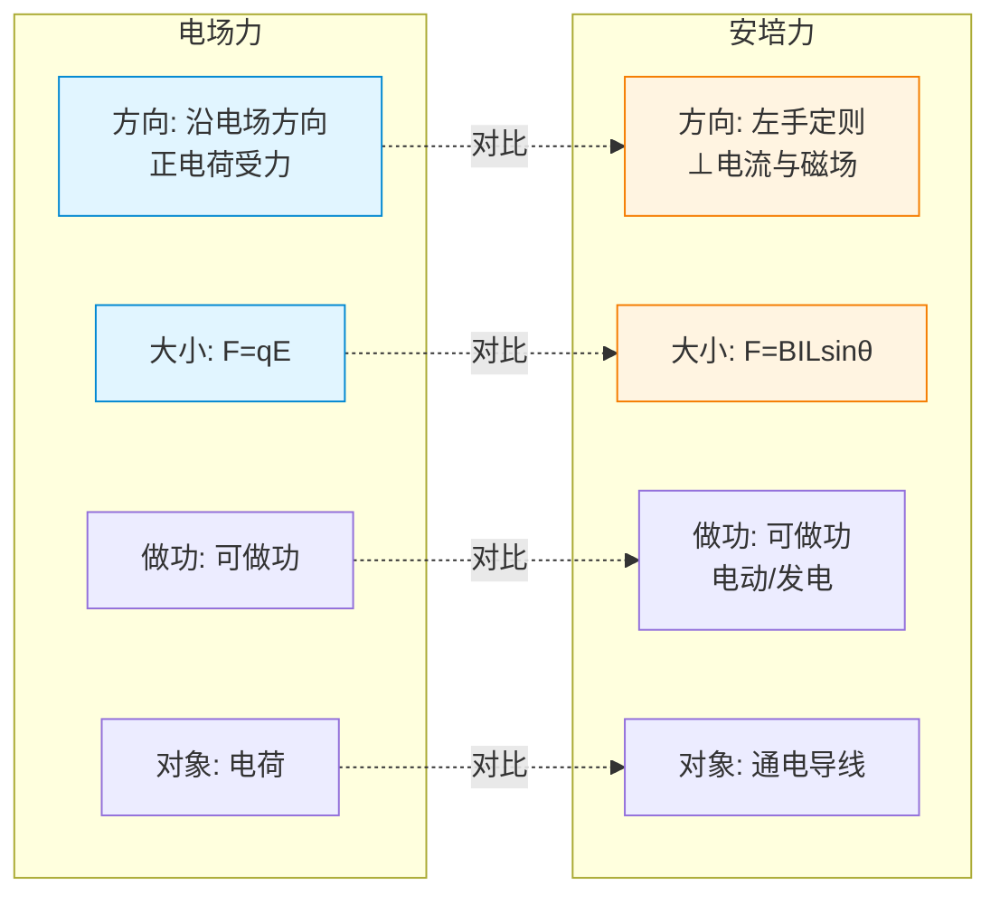

# 安培力

> [!abstract] 概览
> 安培力是磁场对==通电导线中定向移动的电荷==作用力的宏观表现，公式 $F = BIL\sin\theta$（$\theta$ 为电流方向与磁场方向的夹角），方向由==左手定则==判定。本节将系统介绍安培力的公式、方向判定、做功特点、典型应用（磁电式电流表）以及与力学问题的综合。它是连接 [[01-磁场与磁感线]] 与 [[03-洛伦兹力]] 的桥梁——安培力本质上是洛伦兹力的宏观表现。

## 核心概念

### 一、安培力的定义

**定义**：通电导线在磁场中受到的作用力称为==安培力==。它是磁场对运动电荷（形成电流的自由电荷）作用的宏观体现。

**物理意义**：安培力是磁场对电流作用的直接度量，它使"磁场"这一抽象概念通过"力"可被测量。

### 二、安培力的大小

**基本公式**（电流与磁场垂直时）：

$$F = BIL$$

其中：
- $B$ 为磁感应强度（单位：特斯拉 T）
- $I$ 为电流（单位：安培 A）
- $L$ 为导线在磁场中的有效长度（单位：米 m）

**一般情形**（电流方向与磁场方向成 $\theta$ 角）：

$$F = BIL\sin\theta$$

**讨论**：
1. 当 $\theta = 90°$（电流与磁场垂直）：$F = BIL$，安培力最大。
2. 当 $\theta = 0°$ 或 $180°$（电流与磁场平行/反平行）：$F = 0$，==导线不受安培力==。
3. 当 $0° < \theta < 90°$：$F$ 介于 $0$ 与 $BIL$ 之间。

> [!note] 公式的矢量理解
> 严格地，$\vec{F} = I\vec{L} \times \vec{B}$，$IL$ 是一个矢量，方向沿电流方向。所以安培力的大小 $F = BIL\sin\theta$，其中 $\theta$ 是电流方向与磁场方向的夹角。

### 三、安培力的方向——左手定则

**左手定则**（==重点==）：
1. 伸开==左手==，使拇指与其余四指在==同一平面内==，并且都跟手掌垂直。
2. 让==磁感线穿过掌心==（即磁场方向垂直进入手掌正面）。
3. 让==四指指向电流方向==。
4. 则==拇指所指方向==就是安培力的方向。

**关键点**：
- 安培力方向总是==垂直于电流方向==和==磁场方向==所决定的平面。
- 无论电流与磁场是否垂直，安培力都垂直于这两者决定的平面。
- 当电流与磁场不垂直时，可先分解磁场（保留与电流垂直的分量 $B_\perp = B\sin\theta$），再用左手定则。

> [!tip] 左手定则的记忆口诀
> **左手定则：四指电流，掌心磁场，拇指安培力。三者互相垂直，"力"垂直"电、磁"面。**
>
> 一句话记忆：==左手"四电拇力"，掌心穿磁场==。

### 四、安培力做功特点

**重要结论**：==安培力可以做功==。

**分析**：
- 安培力方向与电流方向垂直，但与==导线运动方向==不一定垂直。
- 当导线在安培力方向上发生位移时，安培力做正功（或负功）。
- 这与洛伦兹力==永不做功==（见 [[03-洛伦兹力]]）形成鲜明对比——因为安培力是洛伦兹力的==宏观分力==，是自由电荷沿导线方向运动的"附加效果"。

**安培力做功的能量转化**：
- 安培力做正功：电能转化为机械能（电动机原理）。
- 安培力做负功：机械能转化为电能（发电机原理，详见 [[04-电磁感应/02-法拉第电磁感应定律]]）。

### 五、磁感应强度 $B$ 的定义

**定义式**（采用安培力）：

$$B = \dfrac{F}{IL}$$

**条件**：导线与磁场==垂直==放置，$L$ 为导线在磁场中的有效长度。

**物理意义**：$B$ 反映磁场的强弱，数值上等于长 $1\,\text{m}$、通 $1\,\text{A}$ 电流的导线垂直磁场放置时所受的安培力。

**单位**：特斯拉（T），$1\,\text{T} = 1\,\dfrac{\text{N}}{\text{A}\cdot\text{m}}$。

> [!note] $B$ 是磁场本身性质
> $B$ 由磁场源决定（如永磁体、电流），与放入其中的导线无关。公式 $B = \dfrac{F}{IL}$ 是==测量方法==，不是决定式。这正如 $E = \dfrac{F}{q}$ 测电场强度一样。

### 六、磁电式电流表原理

**结构**：
- ==辐向磁场==：磁极与圆柱形铁芯之间的磁场方向始终沿半径方向（辐向），不论线圈转到什么位置，线圈所在处的磁场方向都垂直于线圈平面。
- 线圈：可绕轴转动的线圈，通过电流时受安培力作用产生力矩。
- 螺旋弹簧（游丝）：产生反力矩，平衡安培力力矩。
- 指针：随线圈转动指示电流大小。

**工作原理**：
1. 线圈通电流后，在辐向磁场中受安培力，产生偏转力矩 $M_1 = NBIl_1 l_2$（$N$ 为匝数，$l_1$ 为有效边长，$l_2$ 为力臂）。
2. 由于是辐向磁场，==不论线圈转到什么角度，安培力始终垂直于线圈==，所以偏转力矩 $M_1$ 大小不变（与转角无关）。
3. 螺旋弹簧产生反力矩 $M_2 = k\theta$（$\theta$ 为偏转角，$k$ 为弹簧劲度系数）。
4. 平衡时：$M_1 = M_2$，即 $NBIl_1 l_2 = k\theta$，所以 $\theta = \dfrac{NBl_1 l_2}{k} \cdot I$。
5. 因此偏转角 $\theta$ 与电流 $I$ 成==正比==，刻度==均匀==。

> [!tip] 辐向磁场的关键作用
> 普通匀强磁场中，安培力矩会随线圈位置变化（$\cos\theta$ 因子），导致刻度不均匀。辐向磁场使安培力方向始终垂直于线圈边，力矩恒定，从而保证==刻度均匀==。这是电流表设计的精髓。

## 推导与原理

### 一、安培力公式的微观推导

考虑一段长 $L$、横截面积 $S$、载流 $I$ 的导线，置于匀强磁场 $B$ 中（电流与磁场垂直）。

设导线内自由电荷数密度为 $n$，每个电荷电量为 $q$，定向移动速度为 $v$。

则导线内自由电荷总数：$N = nSL$。

每个电荷所受洛伦兹力：$f = qvB$（见 [[03-洛伦兹力]]）。

导线所受总力（宏观）：$F = Nf = nSL \cdot qvB$。

由电流定义：$I = nSqv$，代入得：

$$F = (nSqv) \cdot LB = BIL$$

==这就是安培力公式==，它揭示了安培力是洛伦兹力的宏观表现。

### 二、一般情形 $F = BIL\sin\theta$ 的推导

当电流方向与磁场方向成 $\theta$ 角时，将磁场 $B$ 分解为：
- 平行于电流的分量：$B_\parallel = B\cos\theta$，此分量对运动电荷无力作用（不产生洛伦兹力）。
- 垂直于电流的分量：$B_\perp = B\sin\theta$，此分量产生洛伦兹力 $f = qvB_\perp = qvB\sin\theta$。

故宏观安培力：

$$F = BIL\sin\theta$$

### 三、左手定则的矢量本质

安培力公式 $\vec{F} = I\vec{L} \times \vec{B}$ 是矢量叉积，所以 $\vec{F} \perp \vec{L}$ 且 $\vec{F} \perp \vec{B}$。左手定则就是这一矢量关系的形象化判定方法。

## 典型实例与类比

### 实例 1：电动机原理

通电线圈在磁场中受安培力作用而转动，将电能转化为机械能。换向器使线圈每转半周电流方向改变一次，保证线圈持续单向转动。

### 实例 2：两根平行通电导线的相互作用

- 同向电流：相互==吸引==（每根导线在对方电流产生的磁场中受力指向对方）。
- 反向电流：相互==排斥==。

这是安培力判定的经典应用，也是国际单位制中==安培（A）==的定义依据。

### 类比：安培力 vs 电场力

| 项目 | 电场力 | 安培力 |
| --- | --- | --- |
| 公式 | $F = qE$ | $F = BIL\sin\theta$ |
| 作用对象 | 电荷 | 通电导线 |
| 方向 | 沿电场方向（正电荷） | 垂直于电流与磁场 |
| 是否做功 | 可做功 | ==可做功== |

> [!tip] 记忆口诀
> **左手判力，右手判场；电、磁、力三者互相垂直。**
> 
> **B、I 决定 F 大小，左手定则定方向；垂直最有力，平行力为零。**

**图示：安培力 vs 电场力 对照**

## 例题

### 例 1：安培力大小与方向判定

**题目**：一根长 $L = 0.2\,\text{m}$ 的直导线，通有 $I = 2\,\text{A}$ 的电流，置于磁感应强度 $B = 0.5\,\text{T}$ 的匀强磁场中。求下列情况下导线所受安培力的大小和方向：
（1）电流方向与磁场方向垂直；
（2）电流方向与磁场方向成 $30°$ 角。

**分析**：
（1）垂直情形：直接用 $F = BIL$。
（2）一般情形：用 $F = BIL\sin\theta$。方向用左手定则判定，垂直于电流与磁场决定的平面。

**解答**：
（1）$F = BIL = 0.5 \times 2 \times 0.2 = 0.2\,\text{N}$，方向由左手定则判定，垂直于电流与磁场决定的平面。

（2）$F = BIL\sin 30° = 0.5 \times 2 \times 0.2 \times 0.5 = 0.1\,\text{N}$，方向垂直于电流与磁场决定的平面。

**点评**：注意一般情形下 $\sin\theta$ 不可遗漏。当电流与磁场平行时 $\sin 0° = 0$，安培力为零。

### 例 2：安培力与力学综合——导线平衡

**题目**：如图，两根相距 $d = 0.5\,\text{m}$ 的平行光滑导轨竖直放置，导轨间接有电动势 $E = 6\,\text{V}$、内阻 $r = 1\,\Omega$ 的电源。一质量 $m = 0.1\,\text{kg}$、电阻 $R = 2\,\Omega$、长 $L = 0.5\,\text{m}$ 的金属棒跨接在导轨上，整个装置处于垂直导轨平面、磁感应强度 $B = 1\,\text{T}$ 的匀强磁场中。求金属棒静止时通过的电流大小和方向（取 $g = 10\,\text{m/s}^2$）。

**分析**：
1. 金属棒受重力 $mg$（向下）和安培力 $F = BIL$（向上或向下，取决于电流方向与磁场方向）。
2. 由于磁场垂直导轨平面（设向里），若要安培力向上，电流方向应由左手定则判定。
3. 平衡条件：$BIL = mg$。

**解答**：
由平衡条件：$BIL = mg$，得
$$I = \dfrac{mg}{BL} = \dfrac{0.1 \times 10}{1 \times 0.5} = 2\,\text{A}$$

方向：磁场垂直导轨平面向里，重力向下，安培力需向上。由左手定则：磁场穿掌心（向里），拇指向上（安培力），则四指指向——电流方向为==水平向右==（具体取决于导轨方位）。

验证电源回路电流：$I = \dfrac{E}{R + r} = \dfrac{6}{2 + 1} = 2\,\text{A}$ ✓ 与平衡所需电流一致。

**点评**：本题为安培力与力学平衡的综合题。关键是判断安培力方向并利用平衡条件。注意回路电流需满足闭合电路欧姆定律。

### 例 3：安培力做功与加速

**题目**：两根相距 $L = 1\,\text{m}$ 的平行光滑导轨水平放置，处于竖直向下、磁感应强度 $B = 0.5\,\text{T}$ 的匀强磁场中。一质量 $m = 0.02\,\text{kg}$、电阻 $R = 1\,\Omega$ 的金属棒跨在导轨上，通有恒定电流 $I = 2\,\text{A}$（方向向右）。棒从静止开始运动，求：
（1）棒的加速度；
（2）棒运动 $t = 2\,\text{s}$ 时的速度和安培力所做的功。

**分析**：
1. 磁场竖直向下，电流水平向右，由左手定则安培力方向：磁场穿掌心向下，四指指电流向右，拇指指——==垂直纸面向外==（即沿棒运动方向）。
2. 棒在安培力作用下做匀加速直线运动。
3. 安培力做正功，等于棒动能增量。

**解答**：
（1）安培力大小：$F = BIL = 0.5 \times 2 \times 1 = 1\,\text{N}$。
加速度：$a = \dfrac{F}{m} = \dfrac{1}{0.02} = 50\,\text{m/s}^2$，方向沿棒运动方向。

（2）$t = 2\,\text{s}$ 时速度：$v = at = 50 \times 2 = 100\,\text{m/s}$。

位移：$s = \dfrac{1}{2}at^2 = \dfrac{1}{2} \times 50 \times 4 = 100\,\text{m}$。

安培力做功：$W = Fs = 1 \times 100 = 100\,\text{J}$。

验证（动能定理）：$W = \Delta E_k = \dfrac{1}{2}mv^2 = \dfrac{1}{2} \times 0.02 \times 100^2 = 100\,\text{J}$ ✓

**点评**：本题考查安培力做功与动力学结合。安培力做正功，电能转化为机械能（电动机原理）。注意使用动能定理可简化计算。

## 易错提醒

> [!warning] 易错点
> 1. **公式混淆**：垂直时 $F = BIL$，一般时 $F = BIL\sin\theta$。==$\theta$ 是电流方向与磁场方向的夹角==，不是与安培力的夹角。
> 2. **左右手不分**：判安培力用==左手==，判电流产生磁场用==右手==。这是高考最容易出错的点之一。
> 3. **方向判定错误**：安培力==总垂直==于电流与磁场决定的平面，不在该平面内。
> 4. **平行情形**：电流与磁场==平行==时安培力==为零==，这是常考的"陷阱"。
> 5. **导线长度**：$L$ 是==导线在磁场中==的有效长度，不是导线总长度。
> 6. **磁电式电流表刻度均匀**：原因是==辐向磁场==使力矩与转角无关，而不是"匀强磁场"。
> 7. **安培力做功**：==可以做功==，与洛伦兹力不做功不同。

> [!note] 概念辨析
> **左手定则 vs 右手螺旋定则**：
> - ==左手定则==：已知电流方向和磁场方向，判定==安培力方向==。"左手判力"。
> - ==右手螺旋定则==（安培定则）：已知电流方向，判定==电流产生的磁场方向==。"右手判场"。
> - 一句话：==左手力，右手场；左"果"右"因"==。
>
> **安培力 vs 洛伦兹力**：
> - 安培力是==宏观==表现，作用于通电导线；可做功。
> - 洛伦兹力是==微观==本质，作用于运动电荷；永不做功。

## 与其他知识关联

- 与 [[01-磁场与磁感线]] 的关系：本节使用磁感应强度 $B$ 这一磁场基本物理量，安培定则（右手）确定的磁场方向是左手定则判安培力的前提。
- 与 [[03-洛伦兹力]] 的关系：==安培力是洛伦兹力的宏观表现==，本节公式 $F = BIL$ 可由洛伦兹力公式 $f = qvB$ 推导。这是高考重点。
- 与 [[04-带电粒子在磁场中的运动]] 的关系：带电粒子在磁场中受洛伦兹力做圆周运动，是安培力微观机制的延伸。
- 与 [[04-电磁感应/02-法拉第电磁感应定律]] 的关系：导体切割磁感线产生感应电动势，回路电流受安培力——这是电磁感应综合题的核心。
- 与 [[01-静电场/02-电场与电场强度]] 的关系：电场力 $F = qE$ 与安培力 $F = BIL$ 类比，但电场力与电场方向一致，安培力与磁场方向垂直。
- 大学延伸：[[电磁学]] 中安培力由毕奥-萨伐尔定律和洛伦兹力公式严格导出；电动机原理在工程学中发展出交流电机、步进电机等多种形式。
- 跨学科：电动机是现代社会电能转化为机械能的核心装置；电流表（磁电式）是电工测量的基础仪器。

## 作者的话

> [!quote] 个人理解
> 安培力是高中物理中最容易"看似简单、实则出错"的内容。公式 $F = BIL$ 短得不能再短，但高考中相关题目却千变万化——力学综合、能量转化、电磁感应都能与之结合。
>
> 我的体会是：==先理清方向，再算大小==。许多同学拿到题立刻代入公式，结果方向弄反、符号出错。正确做法是：①画出导线受力图；②用左手定则确定安培力方向；③再代入公式算大小。这种"先定性后定量"的思路在物理学习中至关重要。
>
> ==磁电式电流表==是一个常被忽视的细节，但它是高考选择题的高频考点。理解"辐向磁场保证刻度均匀"这一设计思想，能让你对物理仪器的精妙有更深体会——物理不只是公式，更是工程智慧。
>
> 关于安培力做功与洛伦兹力不做功的"矛盾"，深究下去会发现：安培力做功实际上是洛伦兹力的一个分量做功，另一个分量做负功，==总功为零==。高考不考这一深层分析，但它揭示了能量守恒的内在一致性，值得课后思考。

---
*返回 [[00-电学总览]]*
