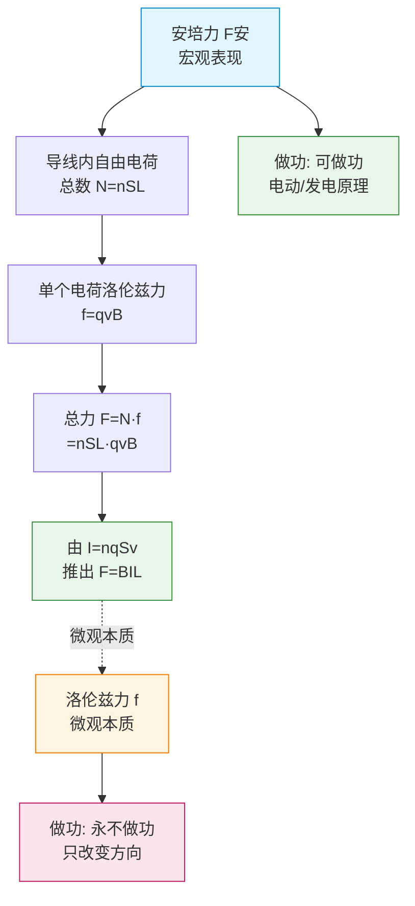

# 洛伦兹力

> [!abstract] 概览
> 洛伦兹力是磁场对==运动电荷==的作用力，公式 $f = qvB\sin\theta$，方向由左手定则判定（注意负电荷方向相反）。它是 [[02-安培力]] 的微观本质——安培力是洛伦兹力的宏观表现。本节还将系统讨论==洛伦兹力不做功==这一重要性质，并详细推导回旋加速器、质谱仪的工作原理，以及磁流体发电机、霍尔效应等拓展应用。这是磁场板块的==核心章节==，是 [[04-带电粒子在磁场中的运动]] 的理论基础。

## 核心概念

### 一、洛伦兹力的定义

**定义**：磁场对==运动电荷==的作用力称为洛伦兹力。由荷兰物理学家洛伦兹（H. A. Lorentz）首先提出。

**物理意义**：洛伦兹力是磁场对运动电荷的基本作用，是所有磁现象的"原子"级根源。安培力、磁体间的相互作用最终都可归结为洛伦兹力。

**存在条件**：
1. 电荷必须==运动==（$v \neq 0$）：静止电荷不受洛伦兹力。
2. 速度方向不能与磁场方向==平行==：当 $v \parallel B$ 时，$f = 0$。

### 二、洛伦兹力的大小

**基本公式**（速度与磁场垂直时）：

$$f = qvB$$

其中：
- $q$ 为电荷电量（单位：库仑 C）
- $v$ 为电荷速度（单位：m/s）
- $B$ 为磁感应强度（单位：T）

**一般情形**（速度方向与磁场方向成 $\theta$ 角）：

$$f = qvB\sin\theta$$

**讨论**：
1. $\theta = 90°$：$f = qvB$，最大。
2. $\theta = 0°$ 或 $180°$（$v \parallel B$）：$f = 0$。
3. $0° < \theta < 90°$：$f = qvB\sin\theta$。

> [!note] 与安培力公式的一致性
> 洛伦兹力公式 $f = qvB\sin\theta$ 与安培力公式 $F = BIL\sin\theta$ 结构相似，反映了二者的本质联系——安培力就是导线内所有自由电荷所受洛伦兹力的合力。

### 三、洛伦兹力的方向——左手定则

**左手定则**（==重点==，与安培力方向判定方法一致）：
1. 伸开==左手==，拇指与四指垂直并与掌面垂直。
2. 让==磁感线穿过掌心==。
3. 让==四指指向正电荷运动方向==。
4. 则==拇指所指方向==就是洛伦兹力方向。

**==负电荷的特殊处理==**（高考热点）：
- 对负电荷，四指应指向==速度的反方向==（即等效为正电荷反向运动）。
- 或者：先用左手定则判定"等效正电荷"的洛伦兹力方向，再取==反方向==即为负电荷的洛伦兹力方向。

> [!warning] 负电荷方向判定的两种等效方法
> 方法 1：四指指向==负电荷运动的反方向==，拇指方向即洛伦兹力方向。
> 方法 2：先按正电荷判定，再取==反向==。
> 两种方法结果一致，但==不要混淆==。建议选定一种使用。

**关键点**：
- 洛伦兹力方向总是==垂直于速度方向==和==磁场方向==所决定的平面。
- ==无论正负电荷==，洛伦兹力都垂直于 $v$ 和 $B$ 决定的平面。

### 四、洛伦兹力不做功（==重点==）

**重要结论**：==洛伦兹力对运动电荷永不做功==。

**证明**：
- 洛伦兹力方向 $\vec{f} \perp \vec{v}$（速度方向）。
- 功率 $P = \vec{f} \cdot \vec{v} = fv\cos 90° = 0$。
- 故 $W = \int P\,dt = 0$。

**物理意义**：
- 洛伦兹力只改变速度的==方向==，不改变速度的==大小==。
- 洛伦兹力不改变电荷的==动能==。
- 这与电场力（可做功改变动能）形成鲜明对比。

> [!tip] 洛伦兹力的"三不"
> ==不改变速度大小、不改变动能、不做功==。但可改变速度方向和动量方向。

### 五、洛伦兹力与安培力的关系（==高考重点==）

**关系**：==安培力是洛伦兹力的宏观表现==；洛伦兹力是安培力的微观本质。

**定量推导**：
设一段长 $L$、横截面积 $S$ 的导线，通有电流 $I$，置于匀强磁场 $B$ 中（电流与磁场垂直）。设导线内自由电荷数密度为 $n$，每个电荷电量为 $q$，定向移动速度为 $v$。

1. 导线内自由电荷总数：$N = nSL$。
2. 每个电荷所受洛伦兹力：$f = qvB$。
3. 总力（宏观）：$F = Nf = nSL \cdot qvB$。
4. 由电流微观定义：$I = nSqv$（每秒通过横截面的电量）。
5. 代入得：$F = (nSqv) \cdot LB = BIL$。

==这正是安培力公式 $F = BIL$==。所以安培力是导线内所有自由电荷所受洛伦兹力的合力。

> [!note] 看似矛盾的问题
> 如果安培力是洛伦兹力的宏观表现，而洛伦兹力不做功，为什么安培力可以做功？
> 
> 解答：当导线运动时，自由电荷同时参与==定向漂移==和==随导线运动==两种运动。洛伦兹力的总功为零（不做功），但它在两个方向上的==分量==分别做正功和负功，二者抵消。安培力做功实际上是其中一个分量做功的体现。==总洛伦兹力做功仍为零==，能量守恒。

**图示：安培力（宏观）↔ 洛伦兹力（微观）关系**

## 推导与原理

### 一、回旋加速器原理（==详细推导==）

**结构**：
- 两个 D 形金属盒（D1、D2），中间有窄缝。
- 垂直 D 形盒的匀强磁场 $B$（使粒子做圆周运动）。
- 两 D 形盒间加高频交变电压（在缝隙处加速粒子）。

**工作原理**：
1. 粒子从中心附近的离子源出发，在缝隙处被电场加速，进入一个 D 形盒。
2. 在 D 形盒内，==仅有磁场无电场==，粒子做匀速圆周运动。
3. 半周后回到缝隙，恰逢交变电压反向，再次被加速，进入另一 D 形盒。
4. 如此反复，粒子速度不断增大。

**关键结论**：

**周期公式**：粒子在磁场中做圆周运动，洛伦兹力提供向心力：
$$qvB = \dfrac{mv^2}{r} \Rightarrow r = \dfrac{mv}{qB}$$

周期：
$$T = \dfrac{2\pi r}{v} = \dfrac{2\pi m}{qB}$$

==关键==：周期 $T$ ==与速度 $v$ 无关==，只由 $m$、$q$、$B$ 决定。所以交变电压的频率 $f = \dfrac{1}{T} = \dfrac{qB}{2\pi m}$ 与粒子速度无关，可保持恒定——这就是回旋加速器能反复加速的核心原理。

**最大动能**：设 D 形盒最大半径为 $R$，则粒子最大速度：
$$v_{\max} = \dfrac{qBR}{m}$$

最大动能：
$$E_{k\max} = \dfrac{1}{2}mv_{\max}^2 = \dfrac{q^2B^2R^2}{2m}$$

==注意==：最大动能==与加速电压无关==，只由 $B$、$R$、$q/m$ 决定。要提高粒子能量，须增大 $B$ 或 $R$。

**加速次数**：每次加速获得能量 $qU$（$U$ 为加速电压），加速次数：
$$n = \dfrac{E_{k\max}}{qU} = \dfrac{qB^2R^2}{2mU}$$

**运动时间**：磁场中运动时间 $t_1 = n \cdot \dfrac{T}{2} = \dfrac{nT}{2}$；缝隙中加速时间极短可忽略。

> [!tip] 回旋加速器的"等时性"
> ==粒子在磁场中运动周期与速度无关==，这是回旋加速器能正常工作的物理基础。如果粒子速度接近光速，相对论效应使质量增大，周期变长，回旋加速器失效——这就需要同步加速器。

### 二、质谱仪原理（==详细推导==）

**结构**（经典质谱仪由三部分组成）：

**1. 离子源**：产生待测离子（假设质量为 $m$、电量为 $q$、初速度可忽略）。

**2. 加速电场**：经电势差 $U$ 加速。由动能定理：
$$qU = \dfrac{1}{2}mv^2 \Rightarrow v = \sqrt{\dfrac{2qU}{m}}$$

**3. 速度选择器**（部分质谱仪有）：互相垂直的电场 $E$ 和磁场 $B_1$。只有满足 $qE = qvB_1$ 即 $v = \dfrac{E}{B_1}$ 的粒子才能直线穿过。

**4. 偏转磁场**：进入磁感应强度为 $B_2$ 的匀强磁场，做半圆周运动后打在感光底片上。

由 $qvB_2 = \dfrac{mv^2}{r}$，得：
$$r = \dfrac{mv}{qB_2}$$

代入加速所得速度 $v = \sqrt{\dfrac{2qU}{m}}$：
$$r = \dfrac{m}{qB_2}\sqrt{\dfrac{2qU}{m}} = \dfrac{1}{B_2}\sqrt{\dfrac{2mU}{q}}$$

==关键结论==：
$$r = \dfrac{1}{B_2}\sqrt{\dfrac{2mU}{q}}$$

**质量分析**：
- 对同位素（$q$ 相同，$m$ 不同）：$r \propto \sqrt{m}$，不同质量粒子打在底片不同位置。
- 由底片上感光位置可测得 $r$，从而计算质量 $m = \dfrac{qB_2^2 r^2}{2U}$。

> [!example] 质谱仪的应用
> 质谱仪是化学分析和同位素分离的重要工具，可精确测量原子和分子质量，发现新元素和同位素。在医学、环境检测、考古学等领域都有广泛应用。

### 三、磁流体发电机原理（拓展）

**结构**：高温等离子体（高速电离气体）以速度 $v$ 进入相距 $d$ 的两平行金属板之间，板间有垂直于流速的匀强磁场 $B$。

**原理**：
1. 等离子体中的正、负离子进入磁场区域，受洛伦兹力作用偏转。
2. 由左手定则：正、负电荷受力方向相反，分别打向两极板。
3. 一极板积累正电荷，另一极板积累负电荷，板间形成电场 $E$。
4. 当电场力等于洛伦兹力时，离子不再偏转：$qE = qvB$，即 $E = vB$。
5. 板间电压（电动势）：$\varepsilon = Ed = vBd$。

> [!note] 磁流体发电机的特点
> 没有机械转动部件，直接将==等离子体的动能==转化为电能。效率高、污染小，是新型发电技术的重要研究方向。

### 四、霍尔效应原理（拓展）

**结构**：通有电流 $I$ 的导体（宽 $d$、厚 $h$）置于垂直磁场 $B$ 中。

**原理**：
1. 导体中定向移动的电荷（速度 $v$）受洛伦兹力偏转，在导体一侧积累。
2. 在垂直于电流和磁场的方向上形成横向电场 $E_H$。
3. 平衡时：$qE_H = qvB$，即 $E_H = vB$。
4. 横向电压（霍尔电压）：$U_H = E_H \cdot d = vBd$。
5. 由 $I = nqvdh$，代入得：$U_H = \dfrac{IB}{nqh}$。

**霍尔系数**：$R_H = \dfrac{1}{nq}$，所以 $U_H = R_H \cdot \dfrac{IB}{h}$。

**应用**：测量磁场、判断半导体载流子类型（N 型或 P 型）、霍尔传感器等。

## 典型实例与类比

### 实例 1：极光现象

太阳风中的高能带电粒子进入地磁场后，受洛伦兹力作用沿磁感线做螺旋运动，最终撞击地球大气分子激发发光——这就是极光。两极附近磁感线近乎竖直，粒子易进入大气，故极光多见于高纬度。

### 实例 2：显像管（CRT）电视

老式电视的显像管利用磁场偏转电子束，扫描屏幕上的荧光粉发光成像。调节偏转线圈电流即可控制电子束方向——洛伦兹力的实际应用。

### 实例 3：医用回旋加速器

医用回旋加速器产生放射性同位素（如 PET 扫描用的 ${}^{18}\text{F}$），是现代医学影像的重要设备。

### 类比：洛伦兹力 vs 电场力

| 项目 | 电场力 | 洛伦兹力 |
| --- | --- | --- |
| 公式 | $F = qE$ | $f = qvB\sin\theta$ |
| 存在条件 | 任何电荷 | ==运动电荷且 $v$ 不平行 $B$== |
| 方向 | 沿电场方向 | ==垂直于 $v$、$B$ 平面== |
| 做功 | ==可做功== | ==不做功== |
| 改变动能 | 可 | 不可 |

> [!tip] 记忆口诀
> **左手判洛伦兹力，正电同向负反指；磁场穿掌四指电，拇指指向力方向。**
> 
> **洛伦兹力三不：不改变速度大小、不改变动能、不做功。**
> 
> **回旋加速器：周期与速度无关，频率恒定；最大动能在磁场和半径。**

## 例题

### 例 1：洛伦兹力方向判定

**题目**：一个电子以速度 $v$ 沿 $+x$ 方向运动，进入方向沿 $+y$ 方向的匀强磁场 $B$ 中。求电子所受洛伦兹力方向。

**分析**：
1. 电子带负电，速度方向 $+x$，故四指应指向 $-x$ 方向（速度反方向）。
2. 磁场方向 $+y$，让磁场穿掌心。
3. 拇指指向 $-z$ 方向（即垂直纸面向里，若 $z$ 轴垂直纸面向外）。

**解答**：电子所受洛伦兹力方向为==$-z$ 方向==（垂直纸面向里，若 $+z$ 指向外）。

**点评**：负电荷方向判定是高考热点。务必记住：四指指向==负电荷运动的反方向==，或先判正电荷再取反。

### 例 2：回旋加速器计算

**题目**：一回旋加速器 D 形盒最大半径 $R = 0.5\,\text{m}$，磁感应强度 $B = 1.5\,\text{T}$，加速质子（$m = 1.67 \times 10^{-27}\,\text{kg}$，$q = 1.6 \times 10^{-19}\,\text{C}$）。求：
（1）加速电压频率；
（2）质子最大动能（用 eV 表示）。

**分析**：
1. 频率 $f = \dfrac{qB}{2\pi m}$。
2. 最大动能 $E_{k\max} = \dfrac{q^2 B^2 R^2}{2m}$。

**解答**：
（1）周期 $T = \dfrac{2\pi m}{qB} = \dfrac{2\pi \times 1.67 \times 10^{-27}}{1.6 \times 10^{-19} \times 1.5} \approx 4.38 \times 10^{-8}\,\text{s}$。

频率 $f = \dfrac{1}{T} \approx \dfrac{1}{4.38 \times 10^{-8}} \approx 2.28 \times 10^{7}\,\text{Hz} = 22.8\,\text{MHz}$。

（2）最大速度 $v_{\max} = \dfrac{qBR}{m} = \dfrac{1.6 \times 10^{-19} \times 1.5 \times 0.5}{1.67 \times 10^{-27}} \approx 7.19 \times 10^{7}\,\text{m/s}$。

最大动能：
$$E_{k\max} = \dfrac{1}{2}mv_{\max}^2 = \dfrac{1}{2} \times 1.67 \times 10^{-27} \times (7.19 \times 10^7)^2 \approx 4.31 \times 10^{-12}\,\text{J}$$

转换为 eV：$E_{k\max} = \dfrac{4.31 \times 10^{-12}}{1.6 \times 10^{-19}} \approx 2.69 \times 10^{7}\,\text{eV} = 26.9\,\text{MeV}$。

**点评**：回旋加速器计算中要注意单位换算，尤其是能量单位 J 与 eV 的转换（$1\,\text{eV} = 1.6 \times 10^{-19}\,\text{J}$）。

### 例 3：质谱仪计算

**题目**：一质谱仪加速电压 $U = 2000\,\text{V}$，偏转磁场 $B_2 = 0.1\,\text{T}$。一束带电量 $q = +e$ 的离子经加速后进入偏转磁场，打在感光底片上距入射点 $x = 0.1\,\text{m}$ 处。求离子的质量（$e = 1.6 \times 10^{-19}\,\text{C}$）。

**分析**：
1. $x$ 是粒子做半圆周运动的直径，故 $r = \dfrac{x}{2} = 0.05\,\text{m}$。
2. 由 $r = \dfrac{1}{B_2}\sqrt{\dfrac{2mU}{q}}$，解出 $m$。

**解答**：
由 $r = \dfrac{1}{B_2}\sqrt{\dfrac{2mU}{q}}$，两边平方：
$$r^2 = \dfrac{2mU}{qB_2^2}$$

解得：
$$m = \dfrac{qB_2^2 r^2}{2U} = \dfrac{1.6 \times 10^{-19} \times 0.1^2 \times 0.05^2}{2 \times 2000} = \dfrac{1.6 \times 10^{-19} \times 0.000025}{4000}$$

$$m = \dfrac{4 \times 10^{-24}}{4000} = 1 \times 10^{-27}\,\text{kg}$$

约为质子质量量级，可能是质子或氢离子。

**点评**：质谱仪计算的关键是==正确识别 $x$ 是直径还是半径==。题目中"距入射点 $x$"指粒子做半圆运动到达底片的距离，即直径，故 $r = x/2$。这是常见的"陷阱"。

## 易错提醒

> [!warning] 易错点
> 1. **静止电荷受洛伦兹力**：洛伦兹力==只对运动电荷==有作用，静止电荷不受力。
> 2. **$v \parallel B$ 时 $f = 0$**：速度与磁场平行时洛伦兹力为零，常考"陷阱"。
> 3. **负电荷方向判反**：用左手定则时，负电荷四指==指向速度反方向==，或先判正电荷再取反。
> 4. **误认为洛伦兹力做功**：==洛伦兹力永不做功==，不改变动能，只改变方向。
> 5. **回旋加速器周期公式**：周期 $T = \dfrac{2\pi m}{qB}$ ==与速度无关==，这是回旋加速器的工作基础。
> 6. **最大动能误解**：最大动能 $E_{k\max} = \dfrac{q^2 B^2 R^2}{2m}$ ==与加速电压无关==。
> 7. **质谱仪中"距离"含义**：底片上感光点到入射点的距离是==直径==而非半径。

> [!note] 概念辨析
> **洛伦兹力 vs 安培力**：
> - 洛伦兹力作用于==单个运动电荷==，安培力作用于==通电导线==。
> - 洛伦兹力==不做功==，安培力==可做功==（这是"矛盾"的表面，本质是分量做功）。
> - 安培力是洛伦兹力的宏观表现。
>
> **洛伦兹力 vs 电场力**：
> - 洛伦兹力垂直速度，电场力沿电场方向。
> - 洛伦兹力不做功，电场力可做功。
> - 洛伦兹力只改变方向，电场力可改变速度大小。

## 与其他知识关联

- 与 [[01-磁场与磁感线]] 的关系：洛伦兹力的方向判定依赖磁场方向的确定，右手螺旋定则确定的磁场方向是左手定则应用的前提。
- 与 [[02-安培力]] 的关系：==安培力是洛伦兹力的宏观表现==，本节从微观层面解释了安培力的本质。
- 与 [[04-带电粒子在磁场中的运动]] 的关系：本节建立的洛伦兹力公式是分析带电粒子圆周运动的基础，下一节将详细讨论圆心确定、临界问题等。
- 与 [[04-电磁感应/02-法拉第电磁感应定律]] 的关系：感应电动势的本质是洛伦兹力对导线内自由电荷的作用——动生电动势 $\varepsilon = BLv$ 可由洛伦兹力推导。
- 与 [[01-静电场/05-带电粒子在电场中的运动]] 的关系：电场中带电粒子做抛物线运动（电场力做功），磁场中做圆周运动（洛伦兹力不做功），对比学习。
- 大学延伸：[[电磁学]] 中洛伦兹力完整公式 $\vec{F} = q(\vec{E} + \vec{v} \times \vec{B})$ 包含电场和磁场两部分；相对论中洛伦兹力是四维力的三维分量；[[电动力学]] 给出电磁场的张量描述。
- 跨学科：粒子加速器（高能物理）、质谱仪（分析化学）、霍尔效应（凝聚态物理，量子霍尔效应获诺贝尔奖）、磁约束核聚变（能源研究）。

## 作者的话

> [!quote] 个人理解
> 洛伦兹力是高中物理中最"反直觉"的概念之一——它==垂直于速度==，因此不做功，只改变方向。这与我们日常经验中"力做功改变速度大小"的直觉相悖。但正是这一"反直觉"特性，使带电粒子能在磁场中做完美的圆周运动，造就了回旋加速器、质谱仪等精妙仪器。
>
> 学习本节，我认为关键有三点：
> 
> ① ==掌握负电荷的方向判定==。许多同学在选择题中因负电荷方向判反而丢分。建议用"等效正电荷反向"的方法，避免直接用四指指速度反方向时出错。
> 
> ② ==理解"不做功"的深层含义==。洛伦兹力不做功意味着粒子动能守恒，只改变动量方向。这是粒子做圆周运动的物理基础——半径公式 $r = \dfrac{mv}{qB}$ 中 $v$ 不变，所以圆周是稳定的。
> 
> ③ ==体会"周期与速度无关"的精妙==。回旋加速器之所以能反复加速，正是因为这一"巧合"——速度增加导致半径增大，但周期不变。这看似简单，却是劳伦斯发明回旋加速器的灵感所在，并因此获得诺贝尔奖。
>
> 关于安培力做功与洛伦兹力不做功的"矛盾"，深究发现：当导线运动时，自由电荷的实际速度是漂移速度和导线运动速度的合成，洛伦兹力沿导线方向的分量做负功（对应电能转化），垂直导线方向的分量做正功（对应机械能输出），==总功为零==。这一分析揭示了能量守恒的深层一致性，是物理之美的体现。
>
> 高考中本节内容常以选择题、计算题形式出现，重点是回旋加速器和质谱仪的计算。建议熟记周期公式 $T = \dfrac{2\pi m}{qB}$ 和质谱仪半径公式 $r = \dfrac{1}{B}\sqrt{\dfrac{2mU}{q}}$，并理解其物理意义。

---
*返回 [[00-电学总览]]*
