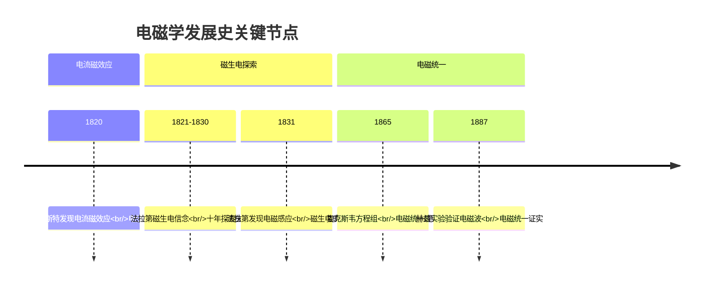

# 磁通量与电磁感应现象

> [!abstract] 概览
> 本节是整个 [[04-自感与互感|电磁感应]] 章节的起点。我们从"磁通量"这一描述磁场穿过某一面积的物理量入手，建立 $\Phi=BS\cos\theta$ 的一般表达式，理解磁通量虽是标量但可正可负的物理意义；进而回顾法拉第 1831 年发现电磁感应现象的历史过程，总结出产生感应电流的根本条件——穿过闭合回路的磁通量发生变化。磁通量变化量 $\Delta\Phi$ 是后续法拉第电磁感应定律 $E=n\dfrac{\Delta\Phi}{\Delta t}$ 的核心变量，必须扎实掌握。

## 核心概念

### 1. 磁通量的定义

**定义**：设在磁感应强度为 $B$ 的匀强磁场中，有一个与磁场方向垂直的平面，面积为 $S$，则磁感应强度 $B$ 与面积 $S$ 的乘积，叫做穿过这个面的磁通量，简称磁通。

**垂直情形公式**：
$$\Phi = B \cdot S$$

**一般情形公式**（面积法线方向与磁场方向夹角为 $\theta$）：
$$\Phi = B \cdot S \cdot \cos\theta$$

其中 $\theta$ 是==磁场方向与面积法线方向==之间的夹角（注意不是与面积本身的夹角）。当 $\theta=0$ 时退化为垂直情形；当 $\theta=90°$ 时 $\Phi=0$，磁感线与面平行，没有"穿过"。

### 2. 磁通量的物理意义

磁通量可以理解为"==穿过某一面积的磁感线条数=="。磁感线越密（$B$ 越大）、面积越大（$S$ 越大）、夹角越接近垂直（$\theta$ 越小），穿过的磁感线就越多，磁通量越大。

> [!note] 磁通量的几何直观
> 想象一束光线垂直照射窗户：光越强（$B$ 大）、窗户越大（$S$ 大），进入房间的光通量越多。如果窗户斜对光源（$\theta$ 增大），有效采光面积减小，进入的光通量按 $\cos\theta$ 减少。磁通量与"光通量"在数学结构上完全一致。

### 3. 磁通量的单位

国际单位制中：
- $B$ 的单位是特斯拉（T）
- $S$ 的单位是平方米（m²）
- $\Phi$ 的单位是==韦伯（Wb）==，简称"韦"

$$1\,\text{Wb} = 1\,\text{T}\cdot\text{m}^2$$

由 $\Phi=BS$ 可得 $B=\dfrac{\Phi}{S}$，所以磁感应强度 $B$ 又叫==磁通密度==，$1\,\text{T}=1\,\text{Wb/m}^2$。

### 4. 磁通量是标量，但有正负

磁通量是==标量==，不遵守平行四边形定则。但它有正负之分：正负不表示大小，而表示磁感线穿过平面的"方向"。

约定：若规定磁感线从平面某一侧穿向另一侧为正方向（如规定"自上而下穿过"为正），则反向穿过的磁通量为负。

> [!warning] 易错点：磁通量的正负不是方向
> 磁通量是标量，它的"正负"类似电流的"正负"，是一种代数符号，表示穿过方向与规定方向相同还是相反，==不是矢量的方向==。计算"穿过某面的总磁通量"时，应取穿过该面两侧磁感线代数和，而不是简单相加。

### 5. 磁通量的变化量 $\Delta\Phi$

$$\Delta\Phi = \Phi_2 - \Phi_1$$

磁通量变化量是后续法拉第电磁感应定律的核心。注意 $\Delta\Phi$ 可正可负，其符号反映磁通量是"增加"还是"减少"，与感应电动势的方向密切相关。

$\Delta\Phi$ 的三种典型来源：
1. **$B$ 变**：磁场强弱变化（如电磁铁电流变化、磁铁靠近远离）
2. **$S$ 变**：回路面积变化（如导轨上导体棒滑动、闭合线圈形变）
3. **$\theta$ 变**：回路与磁场夹角变化（如线圈在磁场中转动）

### 6. 电磁感应现象的发现

**法拉第（Michael Faraday，1791—1867）** 经过十年探索，于==1831 年==发现了电磁感应现象。他的关键实验包括：

- **实验一**：将条形磁铁插入/拔出闭合线圈，线圈中出现电流。
- **实验二**：两个线圈绕在同一铁芯上，一个线圈通电/断电瞬间，另一个线圈中出现电流。
- **实验三**：闭合导体回路的一部分在磁场中做切割磁感线运动，回路中出现电流。

法拉第把这种现象命名为"电磁感应"，并把产生的电流叫==感应电流==，对应的电动势叫==感应电动势==。

> [!quote] 历史小记
> 法拉第坚信"电与磁应当对称"——既然电流能产生磁场（奥斯特 1820 年发现），磁场也应能产生电流。他历经失败，最终意识到只有==变化的磁场==或==相对运动的回路==才能产生电流，而非"恒定的磁场"。这一思想转变是物理学的重大突破，直接催生了后来的发电机、变压器，奠定了第二次工业革命的基础。

**图示：电磁感应发现与电磁理论发展时间线**

### 7. 产生感应电流的条件

**核心条件**：穿过==闭合回路==的==磁通量发生变化==。

两个要素缺一不可：
1. 回路必须==闭合==（断路时只有感应电动势，无感应电流）。
2. 穿过回路的==磁通量必须变化==。

> [!tip] "闭合"与"磁通量变化"双条件
> 一段孤立导体棒在磁场中做切割磁感线运动，导体两端会积累电荷产生感应电动势，但由于回路不闭合，没有持续的感应电流。导体棒相当于一个"电源"。

## 推导与原理

### 磁通量一般表达式的推导

设面积为 $S$ 的平面，其法线方向 $\vec{n}$ 与匀强磁场 $\vec{B}$ 夹角为 $\theta$。取面在垂直于 $\vec{B}$ 方向上的投影面积 $S_\perp = S\cos\theta$，则穿过该面的磁感线条数等于穿过 $S_\perp$ 的条数：

$$\Phi = B \cdot S_\perp = B S \cos\theta$$

这给出了 $\Phi=BS\cos\theta$ 的一般表达式。也可写为矢量形式：

$$\Phi = \vec{B}\cdot\vec{S} = \vec{B}\cdot\vec{n}\,S$$

### 磁通量变化三种情形的代数表达

设回路初始磁通 $\Phi_1 = B_1 S_1 \cos\theta_1$，末态 $\Phi_2 = B_2 S_2 \cos\theta_2$，则：

- 仅 $B$ 变：$\Delta\Phi = \Delta B \cdot S\cos\theta$
- 仅 $S$ 变：$\Delta\Phi = B \cdot \Delta S\cos\theta$
- 仅 $\theta$ 变：$\Delta\Phi = BS(\cos\theta_2 - \cos\theta_1)$

实际题目常为多种变化同时发生，需具体分析。

### 电磁感应与能量守恒

从能量守恒角度看，感应电流的出现意味着电能的"凭空产生"，这必然要求外界对系统做功（如手推磁铁、外力拉导体棒）。感应电流的"方向"（楞次定律 [[03-楞次定律]]）总是使外界必须做正功，从而保证能量守恒。这一点在后续楞次定律中会深入展开。

## 典型实例与类比

### 类比：水车与水流

恒定不变的水流推不动静止的水车叶片——必须==流动==的水才能让水车转动。同理，==恒定的磁场==不能在闭合线圈中产生感应电流，只有==变化的磁通量==（"流动"的磁场）才能驱动电荷定向运动形成电流。这个类比帮助我们理解为什么法拉第早期实验失败：他用恒定强磁场试图"激发"电流，结果线圈毫无反应。

### 实例 1：条形磁铁插入线圈

把 N 极向下插入闭合线圈：穿过线圈的磁通量（向下）增大，线圈产生感应电流，其方向由楞次定律决定——感应电流的磁场要"阻碍"磁通量增加，因此感应磁场方向向上，由安培定则可推出线圈上方为 N 极，与磁铁 N 极相互排斥，结果表现为"阻碍磁铁向下运动"。

### 实例 2：金属框在匀强磁场中运动

一个矩形金属线框完全沉浸在匀强磁场中平动（不转、不出磁场）：穿过线框的磁通量始终不变（$B,S,\theta$ 都不变），所以==没有感应电流==。但若线框正在离开磁场（部分在磁场外），磁通量减小，则产生感应电流。

### 实例 3：地磁场中的飞机机翼

飞机水平飞行时，金属机翼切割地磁场磁感线，机翼两端产生感应电动势（机翼相当于"电源"），但由于未形成闭合回路，没有持续感应电流。

> [!tip] 记忆口诀
> **磁通量三要素：B、S、θ**；**变化三情形：B 变、S 变、θ 变**；**感应一条件：闭合 + 磁通变**。

## 例题

### 例 1：磁通量大小的比较

**题目**：一匀强磁场 $B=0.5\,\text{T}$，一个面积 $S=0.2\,\text{m}^2$ 的圆形线圈置于其中。求下列情况下的磁通量：
(1) 线圈平面与磁场垂直；
(2) 线圈平面与磁场夹角为 30°（注意：是"线圈平面"与磁场夹角）；
(3) 线圈平面与磁场平行。

**分析**：注意题目给的是"线圈平面与磁场"夹角 $\alpha$，而公式中 $\theta$ 是"==法线方向==与磁场"夹角。两者关系是 $\theta + \alpha = 90°$，所以 $\theta = 90° - \alpha$，$\cos\theta = \sin\alpha$。

**解答**：
- (1) 平面与磁场垂直 ⇒ 法线与磁场平行 ⇒ $\theta=0$：
  $$\Phi_1 = BS = 0.5\times 0.2 = 0.1\,\text{Wb}$$
- (2) 平面与磁场夹角 30° ⇒ $\theta=60°$：
  $$\Phi_2 = BS\cos 60° = 0.5\times 0.2\times 0.5 = 0.05\,\text{Wb}$$
- (3) 平面与磁场平行 ⇒ $\theta=90°$：
  $$\Phi_3 = BS\cos 90° = 0$$

**点评**：磁通量公式中的 $\theta$ 与题目中"平面与磁场夹角"互为余角，是高考常见陷阱。务必先确认是哪种夹角。

### 例 2：磁通量正负与代数和

**题目**：一个半径为 $r$ 的圆形线圈置于匀强磁场 $B$ 中，线圈平面与磁场垂直。先将线圈沿直径对折（面积减半），再绕对折边转过 180°（保持平面仍在原磁场区域）。比较对折前后穿过线圈的磁通量大小，并讨论转过 180° 后磁通量的变化。

**分析**：对折使面积由 $S=\pi r^2$ 变为 $S'=\dfrac{S}{2}$，且磁场仍垂直穿过，所以 $\Phi' = \dfrac{BS}{2} = \dfrac{\Phi_0}{2}$。

转过 180° 时，磁感线穿过线圈的方向反向，即磁通量由正变负（设原方向为正）：
$$\Phi_0 = +\dfrac{BS}{2},\quad \Phi_{\text{末}} = -\dfrac{BS}{2}$$

**解答**：
- 对折前后磁通量大小：$\Phi_0 = BS$，$\Phi' = \dfrac{BS}{2}$，==大小减半==。
- 转 180° 后磁通量：$\Phi_{\text{末}} = -\dfrac{BS}{2}$。
- 磁通量变化量：$\Delta\Phi = \Phi_{\text{末}} - \Phi_0 = -\dfrac{BS}{2} - \dfrac{BS}{2} = -BS$。

**点评**：本题关键在于理解磁通量的==正负表示穿过方向==，转过 180° 时不是"没变化"，而是"由正到负"，$\Delta\Phi$ 的绝对值甚至可以是 $2\Phi_0$！这种情形在 180° 翻转类问题中频繁出现，是高考压轴选择题的常见考法。

### 例 3：电磁感应条件判断

**题目**：如图所示，一闭合金属圆环放在匀强磁场中，下列哪种情况环中产生感应电流？
A. 环沿磁场方向平移
B. 环垂直于磁场方向平移（仍在磁场内）
C. 环以过圆心且垂直于环面的轴匀速转动
D. 环以过圆心的直径为轴匀速转动（磁场垂直于该直径）

**分析**：判断是否产生感应电流，关键是看磁通量是否变化。

- A：环平移，$B,S,\theta$ 均不变 ⇒ $\Phi$ 不变 ⇒ 无感应电流
- B：仍在匀强磁场内 ⇒ $\Phi$ 不变 ⇒ 无感应电流
- C：环面与磁场夹角不变（绕自身法线转动）⇒ $\Phi$ 不变 ⇒ 无感应电流
- D：环面与磁场夹角周期性变化 ⇒ $\theta$ 变 ⇒ $\Phi$ 变 ⇒ ==有感应电流==

**解答**：选 D。

**点评**：判断感应电流有无只需一招——==看 $\Phi$ 是否变化==。匀强磁场中"平动 + 不出磁场"通常 $\Phi$ 不变；绕"位于面内"的轴转动才会改变 $\theta$。

## 易错提醒

> [!warning] 易错点
> 1. **公式中 $\theta$ 的含义**：$\theta$ 是==法线方向==与磁场的夹角，不是平面与磁场的夹角，二者互余。
> 2. **$\Phi$ 的正负**：正负表示穿过方向，不是大小。比较"磁通大小"时要取绝对值。
> 3. **磁通量是标量**：不满足平行四边形定则，不能像力一样"分解"。多个面积相加时是代数和。
> 4. **磁通量变化 ≠ 磁通量大**：感应电流取决于 $\Delta\Phi/\Delta t$，与 $\Phi$ 本身大小无关。$\Phi$ 很大但不变也不会有感应电流。
> 5. **闭合回路才谈感应电流**：开路时只有感应电动势。导体切割磁感线运动时，导体棒相当于"电源"。

> [!note] 概念辨析
> **磁通量 $\Phi$** vs **磁通量变化量 $\Delta\Phi$**：
> - $\Phi$ 是状态量，描述"某一瞬间"穿过面的磁感线条数；
> - $\Delta\Phi$ 是过程量，描述"一段时间内"磁通量的改变；
> - 感应电动势 $E\propto\dfrac{\Delta\Phi}{\Delta t}$（变化率），不是 $\Phi$ 本身。
> 
> 这与运动学中"位移 $x$"、"位移变化 $\Delta x$"、"速度 $v=\dfrac{\Delta x}{\Delta t}$"的关系完全平行：磁通量相当于"位置"，磁通量变化率相当于"速度"。

## 与其他知识关联

- 与 [[01-磁通量与电磁感应现象]] 的关系：本节自身，是电磁感应章节的入门。
- 与 [[02-法拉第电磁感应定律]] 的关系：磁通量变化 $\Delta\Phi$ 是法拉第定律 $E=n\dfrac{\Delta\Phi}{\Delta t}$ 的核心变量，本节为其铺垫。
- 与 [[03-楞次定律]] 的关系：磁通量变化的方向（增/减）决定感应电流方向，楞次定律解决"方向"问题。
- 与 [[04-自感与互感]] 的关系：自感是"自身电流变化引起磁通量变化"，互感是"邻近回路磁通量变化"，本质都是磁通量变化。
- 与 [[05-电磁感应综合应用]] 的关系：导轨模型、能量转化都建立在"磁通量变化"这一基础条件上。
- 大学层面延伸：[[电磁学]] 中麦克斯韦方程组的 $\nabla\cdot\vec{B}=0$（磁高斯定律）保证磁感线闭合，$\nabla\times\vec{E}=-\dfrac{\partial\vec{B}}{\partial t}$（法拉第定律微分形式）描述变化磁场产生涡旋电场。
- 跨学科：化学电解中变化的电流可引起磁通量变化；生物电磁学中神经电活动产生微弱磁场，被脑磁图（MEG）检测。

## 作者的话

> [!quote] 个人理解
> 学习磁通量时，最容易"卡壳"的地方是 $\theta$ 的含义。我建议你养成一个习惯：看到磁通量公式，先在脑海中画一个"法线箭头"，再让这个箭头去和磁场方向比夹角。这样无论题目怎么拐弯——"平面与磁场夹 30°"还是"绕某轴转过 60°"——你都不会被绕进去。
> 
> 更深层地看，磁通量这个量是为后续"电磁感应"服务的。法拉第用整整十年才悟出"必须变化"这个道理，而今天我们一句"$\Phi$ 变化才有感应电流"就概括了。但==这句概括背后是物理思想的革命==：从"静态地看世界"转向"动态地看世界"，从"存在的量"转向"变化的量"。这种思维方式，在量子力学、相对论中都会再次出现。
> 
> 学习建议：把"磁通量变化的三种情形（$B$ 变、$S$ 变、$\theta$ 变）"做成一张速查表，遇到电磁感应题先问自己"是哪种变化？"——这一步走对了，后面法拉第定律和楞次定律的应用就水到渠成。

---
*返回 [[00-电学总览]]*
