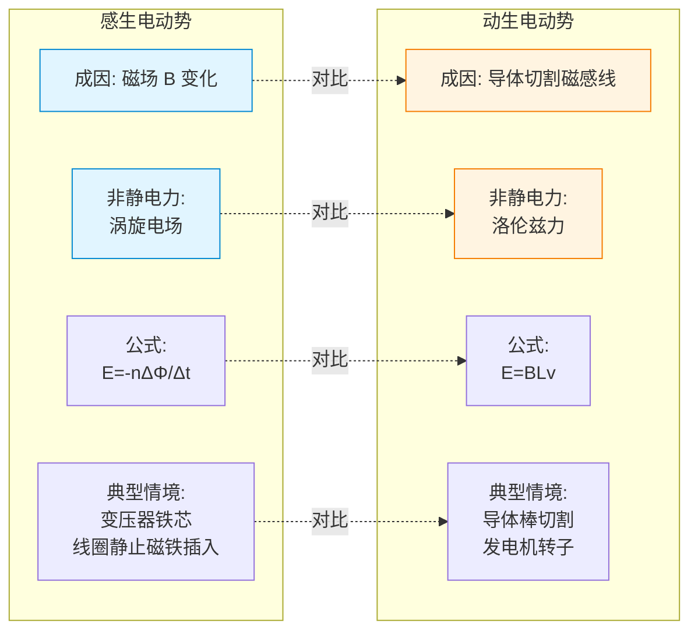

# 法拉第电磁感应定律

> [!abstract] 概览
> 法拉第电磁感应定律是电磁感应章节的"核心公式定律"，它把磁通量变化与感应电动势定量联系起来：$E=n\dfrac{\Delta\Phi}{\Delta t}$。本节在 [[01-磁通量与电磁感应现象]] 的基础上，区分平均电动势与瞬时电动势；并从导体切割磁感线推导出动生电动势公式 $E=BLv$ 与 $E=BLv\sin\theta$，以及转动切割 $E=\dfrac{1}{2}BL^2\omega$；最后从==麦克斯韦方程组==的角度剖析感生电动势与动生电动势的本质差异——前者源于变化磁场激发涡旋电场，后者源于洛伦兹力对载流子做功。理解这些是后续 [[05-电磁感应综合应用]] 中导轨模型推导的根基。

## 核心概念

### 1. 法拉第电磁感应定律的内容

**定律表述**：闭合电路中感应电动势的大小，与穿过这一电路的磁通量的变化率成正比。

**公式**：
$$E = n\,\dfrac{\Delta\Phi}{\Delta t}$$

其中：
- $E$ 为感应电动势（V）
- $n$ 为线圈匝数（单匝线圈 $n=1$）
- $\Delta\Phi$ 为磁通量变化量（Wb）
- $\Delta t$ 为变化所用时间（s）

> [!note] 物理意义
> 决定感应电动势大小的不是磁通量 $\Phi$ 本身，也不是磁通量变化 $\Delta\Phi$ 本身，而是==磁通量变化的快慢== $\dfrac{\Delta\Phi}{\Delta t}$。这与"加速度由速度变化率决定而非速度变化决定"的思想完全一致。磁通量大但变化慢，电动势很小；磁通量小但急剧变化，电动势可以很大。

### 2. 平均电动势与瞬时电动势

公式 $E=n\dfrac{\Delta\Phi}{\Delta t}$ 严格说给出的是==平均==感应电动势——它对应一段时间 $\Delta t$ 内磁通量变化的平均效果。

**瞬时电动势**：
$$E(t) = n\cdot\lim_{\Delta t\to 0}\dfrac{\Delta\Phi}{\Delta t} = n\,\dfrac{d\Phi}{dt}$$

在高中阶段，瞬时电动势通常通过导体切割公式 $E=BLv$ 求得（其中 $v$ 是瞬时速度），或对线圈转动情形用 $E=BS\omega\sin\omega t$ 描述。

> [!warning] 易错点：平均 vs 瞬时
> - 求通过导体横截面的电荷量 $q=I\Delta t=\dfrac{n\Delta\Phi}{R\Delta t}\cdot\Delta t=\dfrac{n\Delta\Phi}{R}$：用==平均==电动势。
> - 求某时刻的电流、安培力、功率：必须用==瞬时==电动势。
> - 求一段时间内产生的焦耳热：用==有效值==（恒定电流用平均电动势，正弦交流电用有效值，详见 [[01-交流电的产生与描述]]）。

### 3. 导体切割磁感线的感应电动势

**垂直情形**（导体棒速度方向与磁场垂直，且棒本身与速度、磁场都垂直）：
$$E = BLv$$

**一般情形**（速度方向与棒本身的夹角任意，但磁场仍垂直于"棒 + 速度"平面）：
$$E = BLv\sin\theta$$

其中 $\theta$ 是速度方向与导体棒方向的夹角；$L\sin\theta$ 是导体棒在垂直于速度方向上的"有效切割长度"。

更一般情形（磁场、棒、速度两两任意）需用矢量形式 $E=(\vec{v}\times\vec{B})\cdot\vec{L}$，高中阶段不要求。

### 4. 转动切割电动势

一根长为 $L$ 的导体棒绕一端以角速度 $\omega$ 在垂直于匀强磁场 $B$ 的平面内转动，产生的感应电动势：
$$E = \dfrac{1}{2}B L^2 \omega$$

**推导思路**：棒上各点线速度 $v(r)=\omega r$ 随距转动中心距离 $r$ 线性变化，取平均速度 $\bar{v}=\dfrac{0+\omega L}{2}=\dfrac{\omega L}{2}$，代入 $E=BL\bar{v}$ 即得 $E=\dfrac{1}{2}BL^2\omega$。

### 5. 感应电动势的方向

感应电动势是==标量==（不是矢量），但它在电路里有"正负"或"高低"端——这一点和电池的电动势类似。感应电动势的方向规定为==与感应电流方向一致==：在电源内部，由低电势指向高电势。

判断方向用 [[03-楞次定律]] 或右手定则。本节先关心大小。

### 6. 感生电动势 vs 动生电动势

| 类型 | 产生原因 | 物理本质 | 典型情境 |
|---|---|---|---|
| **感生电动势** | 磁场 $B$ 随时间变化 | 变化磁场激发==涡旋电场==，涡旋电场驱动电荷 | 线圈静止、磁铁插入；变压器铁芯 |
| **动生电动势** | 回路或部分导体运动 | 导体中载流子受==洛伦兹力==沿导体方向分力做功 | 导体棒切割磁感线；发电机转子 |

二者可以同时存在（既有磁场变化又有回路运动），总电动势为两者之代数和。

**图示：感生电动势 vs 动生电动势 对比**

## 推导与原理

### 1. 动生电动势的微观推导

设长为 $L$ 的导体棒在匀强磁场 $B$ 中以速度 $v$ 沿垂直于棒、也垂直于磁场的方向平动。棒内自由电子随棒一起运动，受洛伦兹力：

$$F_L = evB$$

方向沿棒指向一端。电子在该力作用下向一端积累，另一端因电子减少而显正电，于是棒内建立起反向电场 $E_{\text{内}}$。当电场力与洛伦兹力平衡时：

$$eE_{\text{内}} = evB\Rightarrow E_{\text{内}}=vB$$

棒两端电势差（即电动势）：
$$E = E_{\text{内}}\cdot L = BLv$$

这就是动生电动势公式。本质上，==洛伦兹力充当非静电力==，把电子从一端"搬"到另一端，建立电动势。

> [!note] 深入：洛伦兹力做功的悖论
> 课本说洛伦兹力对运动电荷不做功（因为 $\vec{F}\perp\vec{v}$）。但这里又说"洛伦兹力做功建立电动势"，岂不矛盾？解决：实际上起作用的是洛伦兹力的==沿棒分量==（来自电子相对棒的漂移运动），该分量对电子做正功；与之等大反向的另一分量（来自棒的整体运动）对电子做负功。两分量做功之和为零，但沿棒分量正是非静电力来源。可见"洛伦兹力总功为零"与"洛伦兹力某分量做正功"不矛盾。

### 2. 感生电动势的麦克斯韦方程组解释

麦克斯韦方程组的法拉第定律（微分形式）：
$$\nabla\times\vec{E} = -\,\dfrac{\partial\vec{B}}{\partial t}$$

积分形式（对任意闭合回路 $L$ 围成的曲面 $S$）：
$$\oint_L \vec{E}\cdot d\vec{l} = -\int_S \dfrac{\partial\vec{B}}{\partial t}\cdot d\vec{S}$$

左边是涡旋电场沿闭合回路的环量，即感生电动势；右边是磁通量变化率的负值。这就是 $E=-\dfrac{\Delta\Phi}{\Delta t}$ 的本质来源。

**关键点**：变化的磁场在空间激发的不是保守场（不是静电场），而是==有旋的电场==——涡旋电场。涡旋电场的电场线是闭合曲线，沿闭合回路可以持续推动电荷，从而产生感生电动势。这与动生电动势靠"洛伦兹力做功"形成本质区别：感生电动势的"非静电力"是涡旋电场力。

> [!example] 类比
> 静电场像"水位差"——电荷从高电势流向低电势，路径无关；涡旋电场像"水流漩涡"——电荷被漩涡带着转圈，沿闭合路径也能持续被推动。前者是保守场（环路积分为零），后者是非保守场（环路积分等于磁通量变化率）。

### 3. 转动切割的严格推导

取棒上距转轴 $r$ 处一小段 $dr$，其速度 $v=\omega r$，该段产生微元电动势 $dE=Bv\,dr=B\omega r\,dr$，对整棒积分：

$$E=\int_0^L B\omega r\,dr = B\omega\cdot\dfrac{L^2}{2}=\dfrac{1}{2}BL^2\omega$$

这与"取平均速度"的结果一致。

## 典型实例与类比

### 类比：水力发电与风车

- **动生电动势**类比"水流冲击水车叶片"：导体棒相当于叶片，磁场相当于水流方向，棒运动相当于叶片转动，水流（磁感线）被"切"过，叶片（导体）就被推动发电。
- **感生电动势**类比"潮汐升降带动水面整体起伏"：磁场本身在变化（潮汐在升降），即使导体不动，也会被"涌动"的水流（涡旋电场）推动。

### 实例 1：直导线在 U 形导轨上滑动

匀强磁场 $B$ 垂直于水平 U 形导轨平面，导体棒垂直跨在导轨上以速度 $v$ 匀速滑动，棒长 $L$（即在导轨间的长度）。则回路电动势：
$$E = BLv$$

若回路总电阻为 $R$，感应电流 $I=\dfrac{BLv}{R}$，棒所受安培力 $F_A=BIL=\dfrac{B^2L^2v}{R}$，方向与 $v$ 相反。外力等于安培力时棒匀速，外力功率 $P=Fv=\dfrac{B^2L^2v^2}{R}$，恰好等于回路焦耳热功率 $I^2R$——机械能全部转化为电能再全部转化为热能。

### 实例 2：变压器原副线圈

变压器铁芯中交变磁通 $\Phi(t)=\Phi_m\sin\omega t$ 同时穿过原线圈（$n_1$ 匝）和副线圈（$n_2$ 匝），两边感应电动势：
$$E_1=n_1\dfrac{d\Phi}{dt}=n_1\omega\Phi_m\cos\omega t,\quad E_2=n_2\dfrac{d\Phi}{dt}=n_2\omega\Phi_m\cos\omega t$$

所以 $\dfrac{E_1}{E_2}=\dfrac{n_1}{n_2}$，这就是变压器变压原理。这是典型的==感生电动势==应用。

### 实例 3：交流发电机

矩形线圈（$n$ 匝，面积 $S$）在匀强磁场 $B$ 中以角速度 $\omega$ 绕垂直于磁场的轴匀速转动，感应电动势：
$$E(t)=nBS\omega\sin\omega t$$

这就是正弦交流电的来源。详细分析见 [[01-交流电的产生与描述]]。

> [!tip] 记忆口诀
> **法拉第定律看变化率**：$E=n\dfrac{\Delta\Phi}{\Delta t}$；
> **切割磁感线看长度**：$E=BLv$；
> **转动切割看平方**：$E=\dfrac{1}{2}BL^2\omega$；
> **感生涡旋、动生洛伦兹**：本质两路别混淆。

## 例题

### 例 1：磁通量均匀变化的平均电动势

**题目**：一个 50 匝的圆形线圈，面积 $S=0.01\,\text{m}^2$，置于方向垂直于线圈平面的匀强磁场中。磁感应强度在 $0.1\,\text{s}$ 内由 $0.2\,\text{T}$ 均匀增加到 $0.6\,\text{T}$。求：
(1) 线圈中的平均感应电动势；
(2) 若线圈电阻 $R=10\,\Omega$，通过线圈横截面的电荷量。

**分析**：磁通量变化由 $B$ 变引起，$\Delta\Phi = \Delta B\cdot S$。

**解答**：
(1) 磁通量变化量：
$$\Delta\Phi = (B_2-B_1)S = (0.6-0.2)\times 0.01 = 4\times 10^{-3}\,\text{Wb}$$

平均电动势：
$$\bar{E} = n\dfrac{\Delta\Phi}{\Delta t}=50\times\dfrac{4\times 10^{-3}}{0.1}=2.0\,\text{V}$$

(2) 通过电荷量：
$$q=\bar{I}\Delta t=\dfrac{\bar{E}}{R}\Delta t=\dfrac{2.0}{10}\times 0.1=0.02\,\text{C}$$

或直接用公式 $q=\dfrac{n\Delta\Phi}{R}=\dfrac{50\times 4\times 10^{-3}}{10}=0.02\,\text{C}$。

**点评**：通过导体横截面的电荷量公式 $q=\dfrac{n\Delta\Phi}{R}$ 非常重要——它==与时间无关==，只与磁通量变化总量和回路电阻有关。这是因为 $\bar{E}\propto\dfrac{1}{\Delta t}$，而 $q=\bar{I}\Delta t$，$\Delta t$ 恰好抵消。

### 例 2：导体棒切割（垂直与倾斜两种情形）

**题目**：如图，匀强磁场 $B=0.4\,\text{T}$，导体棒长 $L=0.5\,\text{m}$，棒以 $v=2\,\text{m/s}$ 在导轨上滑动。
(1) 速度方向垂直于棒且与磁场垂直，求感应电动势；
(2) 棒仍垂直于磁场，但速度方向与棒成 $30°$ 角（在垂直于磁场的平面内），求感应电动势。

**分析**：
- 情形 (1)：标准 $E=BLv$。
- 情形 (2)：速度方向与棒成 $30°$，则垂直于棒的速度分量为 $v\sin 30°$，这就是有效切割速度；或者说"有效切割长度"为 $L\sin 30°$。两种理解等价。

**解答**：
(1) $$E_1=BLv=0.4\times 0.5\times 2=0.4\,\text{V}$$

(2) $$E_2=BLv\sin 30°=0.4\times 0.5\times 2\times 0.5=0.2\,\text{V}$$

**点评**："切割磁感线"的本质是导体棒在垂直于自身、垂直于磁场的方向上做有效运动。倾斜运动时，只有垂直于棒的速度分量起作用。

### 例 3：转动切割电动势与功率

**题目**：一根长 $L=0.4\,\text{m}$ 的金属棒，一端为转轴 $O$，在匀强磁场 $B=0.5\,\text{T}$ 中绕 $O$ 以角速度 $\omega=10\,\text{rad/s}$ 在垂直于磁场的平面内匀速转动。棒通过电刷接入外电路，外电路电阻 $R=2\,\Omega$，棒自身电阻 $r=0.5\,\Omega$。求：
(1) 棒中感应电动势；
(2) 通过棒的电流；
(3) 维持棒匀速转动所需外力功率。

**分析**：转动切割用 $E=\dfrac{1}{2}BL^2\omega$。棒相当于内阻 $r$ 的电源，与外电路 $R$ 串联。

**解答**：
(1) 感应电动势：
$$E=\dfrac{1}{2}BL^2\omega=\dfrac{1}{2}\times 0.5\times 0.4^2\times 10=0.4\,\text{V}$$

(2) 电流：
$$I=\dfrac{E}{R+r}=\dfrac{0.4}{2+0.5}=0.16\,\text{A}$$

(3) 外力功率等于电路总电功率（机械能→电能→热能）：
$$P_{\text{外}}=P_{\text{电}}=EI=0.4\times 0.16=0.064\,\text{W}=64\,\text{mW}$$

也可校验：$I^2(R+r)=0.16^2\times 2.5=0.064\,\text{W}$，吻合。

**点评**：转动切割问题中，棒等效为"电池"——电动势 $\dfrac{1}{2}BL^2\omega$，内阻为棒自身电阻。能量守恒在电磁感应中是终极校验工具。

## 易错提醒

> [!warning] 易错点
> 1. **匝数 $n$ 不能漏**：多匝线圈相当于 $n$ 个相同电池串联，电动势要乘 $n$。但求电荷量 $q=\dfrac{n\Delta\Phi}{R}$ 中 $n$ 在分子，$q$ 随 $n$ 增大；而外电路电流还与 $R$ 有关。
> 2. **$\Delta\Phi$ 要带正负号**：用公式 $E=n\dfrac{\Delta\Phi}{\Delta t}$ 求"大小"取绝对值；但若涉及方向，需保留符号，符号与楞次定律的方向判断对应。
> 3. **公式 $E=BLv$ 的适用条件**：必须满足"棒、速度、磁场两两垂直"或仅一个量偏垂直（用 $\sin\theta$ 修正）。高中阶段不要随意推广到三维任意情形。
> 4. **平均 ≠ 瞬时**：求瞬时电流、瞬时安培力必须用瞬时速度代入 $E=BLv$；求电荷量用平均电动势；求热量通常用有效值。
> 5. **感生电动势的"回路"不需要闭合**：即使回路断开，涡旋电场照样存在，导体两端会有电势差；只是没有持续电流。

> [!note] 概念辨析
> **感生电动势** vs **动生电动势**：
> - 感生：$\vec{B}$ 随时间变化，回路不动；非静电力是涡旋电场力（来自 $\nabla\times\vec{E}=-\dfrac{\partial\vec{B}}{\partial t}$）。
> - 动生：$\vec{B}$ 恒定，回路或部分导体运动；非静电力是洛伦兹力的沿棒分量。
> - 二者可以共存：既有磁场变化又有回路运动时，总电动势 $E=E_{\text{感生}}+E_{\text{动生}}$。
> 
> **平均电动势** vs **瞬时电动势**：
> - 平均：$E=n\dfrac{\Delta\Phi}{\Delta t}$，用于电荷量、能量按时间平均等问题。
> - 瞬时：$E=n\dfrac{d\Phi}{dt}$ 或 $E=BLv(t)$，用于某时刻的电流、安培力、功率。

## 与其他知识关联

- 与 [[01-磁通量与电磁感应现象]] 的关系：本节在其基础上把"感应条件"量化为电动势公式，$\Delta\Phi$ 是核心变量。
- 与 [[02-法拉第电磁感应定律]] 的关系：本节自身。
- 与 [[03-楞次定律]] 的关系：法拉第定律给出大小，楞次定律给出方向，二者结合是完整的电磁感应定律（负号 $E=-n\dfrac{\Delta\Phi}{\Delta t}$ 中的负号就是楞次定律的数学体现）。
- 与 [[04-自感与互感]] 的关系：自感电动势 $E_L=L\dfrac{dI}{dt}$ 是法拉第定律应用于"自身磁通"的特例；互感同理。
- 与 [[05-电磁感应综合应用]] 的关系：$E=BLv$ 是导轨模型的"种子公式"，单杆问题的一切推导都由此出发。
- 大学层面延伸：[[电磁学]] 中麦克斯韦方程组 $\nabla\times\vec{E}=-\dfrac{\partial\vec{B}}{\partial t}$ 给出感生电动势的本质；动生电动势可由洛伦兹变换下的电磁场关系严格推导。
- 跨学科：地球物理学中变化的地磁场在地下导体中产生感生电流（大地电磁测深）；化学中的电化学阻抗谱也用到类似电磁感应原理。

## 作者的话

> [!quote] 个人理解
> 法拉第电磁感应定律是高中物理中"最优雅"的定律之一——一句话 $E=n\dfrac{\Delta\Phi}{\Delta t}$ 概括了无数实验现象。但优雅背后藏着深刻的物理：==变化的磁场会"凭空"产生电场==，这打破了牛顿力学时代"力必须接触"的直觉，预示了场作为独立物理实体的地位。
> 
> 学习本节，我建议把握两条主线：
> 
> 第一条主线是==公式脉络==：从一般 $E=n\dfrac{\Delta\Phi}{\Delta t}$（法拉第定律）→ 特殊 $E=BLv$（切割情形）→ 进一步 $E=\dfrac{1}{2}BL^2\omega$（转动情形）。这是从一般到特殊的"具体化"过程，理解了"切割公式是法拉第定律的特例"，你就不会被一堆公式吓倒。
> 
> 第二条主线是==物理本质==：感生电动势靠涡旋电场，动生电动势靠洛伦兹力——两种"非静电力"，两条产生电动势的"通道"。在大学物理中你会看到，这两个看似不同的机制在相对论框架下其实是==同一个电磁场在不同参考系下的表现==——动生和感生可以通过参考系变换相互转化。这种"统一感"是物理学最迷人的地方。
> 
> 最后强调一个高考易错点：==求电荷量用平均电动势，求瞬时电流用瞬时电动势==。这一句话能在选择题中救你不止一次。

---
*返回 [[00-电学总览]]*
