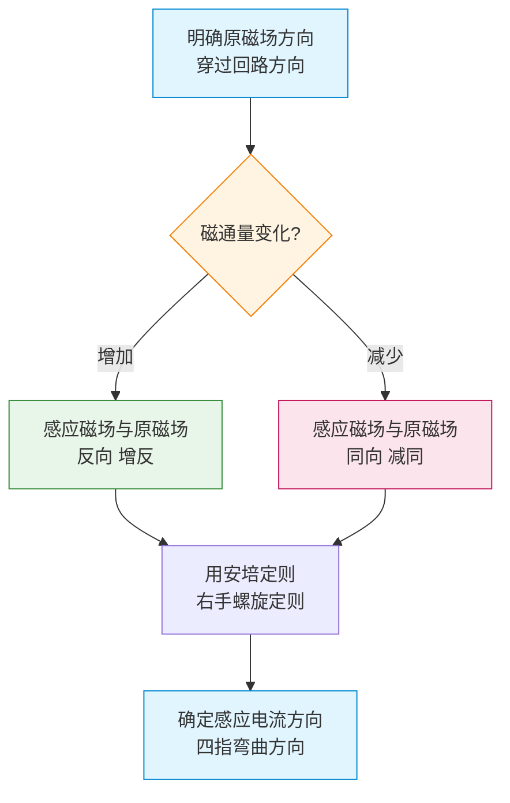

# 楞次定律

> [!abstract] 概览
> 楞次定律解决电磁感应中的"==方向问题=="——感应电流的方向究竟如何？1834 年俄国物理学家楞次（Lenz）在法拉第工作基础上总结出：感应电流的磁场总是要==阻碍==引起感应电流的磁通量的变化。本节将系统介绍楞次定律的内容、四步分析法和右手定则，并从能量守恒角度阐明"阻碍"的深层本质；同时归纳"阻碍"的三种表现形式（阻碍磁通变化、阻碍相对运动、阻碍自身电流变化），为后续 [[04-自感与互感]] 与 [[05-电磁感应综合应用]] 奠定方向判断的能力基础。

## 核心概念

### 1. 楞次定律的内容

**定律表述**：感应电流具有这样的方向，即感应电流的磁场总要==阻碍==引起感应电流的磁通量的变化。

数学上，法拉第电磁感应定律应写作：
$$E = -\,n\,\dfrac{\Delta\Phi}{\Delta t}$$

其中负号正是==楞次定律的数学体现==——它表明感应电动势（及感应电流）的方向总是使磁通量变化"被削弱"。

### 2. 楞次定律四步法

判断感应电流方向的标准流程：

1. **明确原磁场方向**：弄清引起磁通量变化的外界磁场（原磁场）穿过回路的方向。
2. **明确磁通量变化**：磁通量是"增加"还是"减少"？
3. **确定感应磁场方向**：根据"阻碍变化"原则——
   - 原磁通==增加== ⇒ 感应磁场方向与原磁场==相反==（抵消增加）；
   - 原磁通==减少== ⇒ 感应磁场方向与原磁场==相同==（补偿减少）。
4. **用安培定则确定感应电流方向**：右手握拳，大拇指指向感应磁场方向，四指弯曲方向即感应电流方向。

> [!tip] 记忆口诀
> **楞次定律四步走：一原二变三感四电**——
> 一、原磁场方向；
> 二、磁通量变化（增/减）；
> 三、感应磁场方向（增反减同）；
> 四、感应电流方向（安培定则）。

**图示：楞次定律四步法流程**

### 3. 右手定则（切割磁感线情形）

对于导体棒切割磁感线的情形，可用更简洁的==右手定则==直接判断感应电流方向：

> 伸开右手，使拇指与其余四个手指垂直，并且都与手掌在同一个平面内；让==磁感线从手心进入==，==拇指指向导体运动方向==，此时==四指所指方向==就是感应电流方向。

右手定则是楞次定律在"动生电动势"情形下的简化版，结果与四步法完全一致。

> [!warning] 易错点：左手定则 vs 右手定则
> - **左手定则**（电动机法则）：判断==安培力==方向（已知电流方向和磁场方向，求受力）。用于"电→力"。
> - **右手定则**（发电机法则）：判断==感应电流==方向（已知运动方向和磁场方向，求电流）。用于"动→电"。
> 
> 记法："左力右电"——左手判力，右手判电。混用必错！

### 4. 楞次定律的本质：能量守恒

楞次定律是==能量守恒定律==在电磁感应中的体现。考虑：

- 若感应电流的磁场"帮助"磁通量变化（即与变化方向一致），则感应电流会自我增强，磁通量变化更快，感应电流更大……如此循环，能量凭空产生，违反能量守恒。
- 楞次定律的"阻碍"使外界必须==做正功==才能完成磁通量变化：例如把磁铁 N 极插入线圈，线圈感应电流使其上方也显 N 极，排斥磁铁，外力必须克服排斥力做功——这部分功转化为电能（最终变为焦耳热）。能量守恒得以保证。

所以"阻碍"不是多余的麻烦，而是==能量转化的桥梁==：外界机械能通过克服"阻碍"做功，转化为电能。

### 5. "阻碍"的三种表现形式

| 表现形式 | 阻碍对象 | 典型情境 |
|---|---|---|
| **阻碍磁通量变化** | 磁通量 $\Phi$ 的增减 | 线圈感应磁场"增反减同" |
| **阻碍相对运动** | 磁体与回路的相对运动 | 磁铁插入线圈被"排斥"，拔出被"吸引" |
| **阻碍自身电流变化** | 线圈自身电流 $I$ 的变化 | 自感现象（详见 [[04-自感与互感]]） |

第三种表现形式（阻碍自身电流变化）就是==自感现象==的本质，下一节会详细展开。

> [!note] "阻碍"不是"阻止"
> 楞次定律的"阻碍"是指==削弱==磁通量变化的趋势，而非完全阻止。如果磁通量变化被完全阻止，感应电流消失，"阻碍"也就不存在了——这是自相矛盾。所以"阻碍"是==动态平衡==的过程：磁通量仍然变化，只是变化得"慢一些"或"难一些"，外界必须付出能量代价。

## 推导与原理

### 1. 从能量守恒推导楞次定律

假设感应电流方向"帮助"磁通量变化（与楞次定律反方向）。考虑磁铁靠近闭合线圈：
- 原磁通增加，"帮助方向"意味着感应磁场与原磁场同向，使总磁通增加更多；
- 总磁通增加更多 ⇒ 感应电流更大 ⇒ 感应磁场更强 ⇒ 磁通增加更快……
- 这导致能量不断"涌现"，违反能量守恒。

故感应电流方向必须"阻碍"磁通量变化，外力才能转化为电能。这从能量守恒必然推出楞次定律。

### 2. 右手定则与楞次定律的一致性

设导体棒在垂直纸面向里的匀强磁场中向右运动。回路 ABCD（A、D 为棒两端，棒为 AB 边）。回路磁通量（向里）==增加==。按楞次定律：
- 原磁场向里，磁通增加 ⇒ 感应磁场向外（抵消增加）；
- 由安培定则，感应磁场向外对应感应电流==逆时针==方向（俯视），即沿 A→B→C→D→A，棒中电流方向 A→B（向下）。

按右手定则：
- 磁感线从手心进入（手心朝里）；
- 拇指指向运动方向（向右）；
- 四指所指方向为感应电流方向，即从 A 指向 B（向下）。

两者结果一致。这说明==右手定则是楞次定律的特例==。

### 3. "阻碍相对运动"的数学说明

设条形磁铁 N 极以速度 $v$ 向下接近闭合线圈。按楞次定律：
- 线圈磁通（向下）增加 ⇒ 感应磁场向上 ⇒ 线圈上方为 N 极；
- N 极对 N 极相互排斥 ⇒ 磁铁受向上排斥力，==阻碍==磁铁向下运动。

反之，N 极拔出时磁通减少，感应磁场与原磁场同向（向下），线圈上方变 S 极，==吸引==磁铁，阻碍其远离。

这一对"近斥远吸"的力就是楞次定律"阻碍相对运动"的表现。在 [[05-电磁感应综合应用]] 的电磁阻尼、电磁驱动模型中起决定作用。

## 典型实例与类比

### 类比：固执的门卫

把"感应电流"想象成一个固执的门卫，他的职责是"维持现状"：
- 如果你想把人放进来（磁通量增加），他就把人推出去（感应磁场反向）；
- 如果你想把人赶出去（磁通量减少），他就把人拉回来（感应磁场同向）。
- 总之，他永远和你作对，但不会完全阻止你的行动——这就是"==阻碍不是阻止=="。

### 实例 1：条形磁铁穿过线圈

把条形磁铁 N 极向下从线圈上方插入：
1. 接近阶段：磁通向下增大，感应磁场向上，线圈上端 N 极，==排斥==磁铁；
2. 完全穿过瞬间：磁通最大，但变化率为零，无感应电流；
3. 离开阶段（在线圈下方继续下落）：磁通向下减少，感应磁场向下，线圈下端 N 极，==吸引==磁铁。

整个过程：磁铁"进得难，出得也难"，但==仍然进了又出==——这正是"阻碍不是阻止"的体现。机械能通过克服安培力做功转化为电能。

### 实例 2：导体棒在导轨上减速

水平导轨上，导体棒以初速度 $v_0$ 切割磁感线。按右手定则，棒中感应电流方向已知；按左手定则，棒所受安培力方向==与速度反向==——棒被减速。这就是楞次定律"阻碍相对运动"的体现，也是 [[05-电磁感应综合应用]] 中"单杆减速模型"的物理来源。

### 实例 3：自感中的"反电动势"

线圈通电瞬间，电流从零增大，自身磁通增大。按楞次定律（第三种表现），感应电动势"阻碍"电流增大，方向与外电压相反——这就是==通电自感==中的"反电动势"。同理，断电瞬间电流减小，感应电动势"阻碍"减小，方向与原电压同向，造成断电自感的高压火花（详见 [[04-自感与互感]]）。

> [!tip] 记忆口诀
> **近斥远吸是楞次**；
> **左力右电别混淆**；
> **增反减同找感磁**；
> **阻碍变化非阻止**。

## 例题

### 例 1：条形磁铁与圆环

**题目**：如图，一根条形磁铁沿竖直方向从静止开始向下穿过一个固定的水平闭合金属圆环。圆环平面位于磁铁正中央时穿过圆环的磁通量最大。试分析：
(1) 磁铁接近圆环阶段，圆环中感应电流方向（俯视）；
(2) 磁铁穿过圆环后远离阶段，圆环中感应电流方向（俯视）；
(3) 整个过程中圆环对磁铁的作用力方向。

**分析**：条形磁铁外部磁感线从 N 极出来回到 S 极。设磁铁 N 极向下。

**(1) 接近阶段**：磁铁在线圈上方，N 极发出的磁感线穿过圆环向下。磁铁接近 ⇒ 磁通向下增大。
- 原磁场向下，磁通增大 ⇒ 感应磁场==向上==；
- 由安培定则，俯视时感应电流==逆时针==方向。
- 圆环上端为 N 极，与磁铁 N 极排斥，阻碍磁铁下落。

**(2) 远离阶段**：磁铁已穿过圆环，S 极在下、N 极在上，磁感线仍向下穿过圆环但随磁铁远离而减弱。
- 原磁场向下，磁通减少 ⇒ 感应磁场==向下==；
- 由安培定则，俯视时感应电流==顺时针==方向。
- 圆环下端为 N 极，与磁铁 S 极吸引，阻碍磁铁远离。

**(3) 作用力**：接近阶段向上（斥力），远离阶段向上（引力）——==始终向上==，始终阻碍磁铁的运动。

**点评**：典型"近斥远吸"。注意磁铁穿过圆环中心瞬间 $\Phi$ 最大但 $\dfrac{d\Phi}{dt}=0$，感应电流瞬时为零；但磁铁有速度，会继续运动进入"远离阶段"。

### 例 2：导体棒切割（右手定则）

**题目**：匀强磁场 $B$ 垂直纸面向里，U 形导轨 ABCD 置于纸面内，导体棒 PQ 跨在导轨上向右以速度 $v$ 匀速滑动。求：
(1) 棒 PQ 中感应电流方向；
(2) 回路 ABCQP 中感应电流方向；
(3) 棒 PQ 所受安培力方向。

**分析**：用右手定则。

**(1)** 磁感线从手心进入（手心朝里），拇指指向运动方向（右），四指所指为电流方向——P 指向 Q（即向下）。

**(2)** 回路 ABCQP 中电流沿 Q→C→B→A→P→Q 方向，即==逆时针==（俯视纸面）。

**(3)** 用左手定则：磁场向里，电流 P→Q（向下），四指指向电流，让磁感线穿掌心，拇指指向安培力——向左。安培力方向与速度相反，==阻碍棒的运动==，符合楞次定律。

**点评**：右手定则给电流方向，左手定则给安培力方向，二者不能混用。本题中"安培力阻碍运动"是楞次定律"阻碍相对运动"的直接体现。

### 例 3：磁场变化时的方向判断

**题目**：一个圆形闭合线圈置于纸面内。线圈所在区域存在匀强磁场 $B(t)$，方向垂直纸面向外。$B$ 随时间 $t$ 的变化如图所示：在 $0\sim t_1$ 内 $B$ 线性增大；$t_1\sim t_2$ 内 $B$ 恒定；$t_2\sim t_3$ 内 $B$ 线性减小。判断各时段感应电流方向（俯视）。

**分析**：

- **$0\sim t_1$**：$B$ 向外增大 ⇒ 原磁通（向外）增加 ⇒ 感应磁场向==里==（抵消）⇒ 安培定则得感应电流==顺时针==（俯视）。
- **$t_1\sim t_2$**：$B$ 恒定 ⇒ 磁通不变 ⇒ ==无感应电流==。
- **$t_2\sim t_3$**：$B$ 向外减小 ⇒ 原磁通减少 ⇒ 感应磁场向==外==（补偿）⇒ 感应电流==逆时针==（俯视）。

**解答**：$0\sim t_1$ 顺时针；$t_1\sim t_2$ 无电流；$t_2\sim t_3$ 逆时针。

**点评**：磁场变化类问题用四步法最稳妥。注意 $B$ 恒定时段虽然 $B$ 不为零，但磁通不变就没有感应电流——再次提醒"感应电流取决于 $\dfrac{d\Phi}{dt}$，而非 $\Phi$ 本身"。

## 易错提醒

> [!warning] 易错点
> 1. **"增反减同"是核心**：磁通量增加，感应磁场与原磁场反向；磁通量减少，感应磁场与原磁场同向。这是楞次定律最简洁的表述。
> 2. **"阻碍"不是"阻止"**：感应电流只能削弱变化，不能消除变化。若变化被完全阻止，感应电流本身也就消失了。
> 3. **左手 vs 右手**：判电流方向用右手定则，判安培力方向用左手定则。"左力右电"是高中电磁学最重要的口诀之一。
> 4. **判断顺序不能颠倒**：四步法必须按"原磁场→磁通变化→感应磁场→感应电流"的顺序进行，跳步容易出错。
> 5. **磁通最大时感应电流可能为零**：当磁通达到极值（极大或极小）的瞬间，$\dfrac{d\Phi}{dt}=0$，无感应电流；反而磁通为零的瞬间（如线圈在磁场中转 90° 时），$\dfrac{d\Phi}{dt}$ 最大，感应电流最大。

> [!note] 概念辨析
> **楞次定律** vs **右手定则**：
> - 楞次定律：普遍适用，所有电磁感应情形（包括感生与动生）都能用。
> - 右手定则：仅适用于"导体切割磁感线"的动生情形，是楞次定律的简化版。
> - 两者结论一致，但右手定则更快捷。
> 
> **"阻碍磁通量变化"** vs **"阻碍相对运动"**：
> - 前者是楞次定律的直接表述，强调磁场层面；
> - 后者是前者的力学表现，强调力学层面；
> - 二者本质相同，只是从不同角度描述同一规律。

## 与其他知识关联

- 与 [[01-磁通量与电磁感应现象]] 的关系：磁通量的变化是楞次定律的"作用对象"，没有磁通变化就没有感应电流。
- 与 [[02-法拉第电磁感应定律]] 的关系：法拉第定律给大小，楞次定律给方向，二者合起来是完整的电磁感应定律（$E=-n\dfrac{\Delta\Phi}{\Delta t}$）。
- 与 [[03-楞次定律]] 的关系：本节自身。
- 与 [[04-自感与互感]] 的关系：自感现象"阻碍自身电流变化"是楞次定律的第三种表现；通电自感、断电自感都遵循楞次定律。
- 与 [[05-电磁感应综合应用]] 的关系：单杆"先加速后匀速"、电磁阻尼、电磁驱动等模型，方向判断都依赖楞次定律。
- 大学层面延伸：[[电磁学]] 中楞次定律是法拉第电磁感应定律中"负号"的物理意义，与麦克斯韦方程组中 $\nabla\times\vec{E}=-\dfrac{\partial\vec{B}}{\partial t}$ 的负号一致。
- 跨学科：化学电解中"反电动势"概念与楞次定律相关；生物电磁学中神经纤维动作电位的"反电动势"也遵循类似规律。

## 作者的话

> [!quote] 个人理解
> 楞次定律初学时容易让人困惑——"阻碍变化"听起来像一个抽象的规则，但其实它是==能量守恒的必然推论==。如果感应电流不阻碍而是帮助变化，能量就会凭空产生，宇宙将无法稳定存在。所以楞次定律不是一个"人为规定"，而是能量守恒在电磁领域的"投影"。
> 
> 学习楞次定律，我建议把握三层境界：
> 
> 第一层——**会用四步法**：这是基本要求，能做题就行。把"一原二变三感四电"刻进肌肉记忆。
> 
> 第二层——**会用右手定则**：在切割情形下，右手定则比四步法快得多，能为你节省宝贵的考试时间。但要记住右手定则的==适用范围==，不要在磁场变化类题目中误用。
> 
> 第三层——**理解"阻碍"的物理意义**：从能量守恒角度看楞次定律，你会发现"阻碍"是一种==善意==——它保证了能量转化的有序进行。世界正是因为有了"阻碍"，才不会陷入能量爆炸的混乱。这种从定律到哲学的升华，是物理学的魅力所在。
> 
> 最后给一个高考实战建议：在导轨模型、线圈转动、磁铁运动这三类问题中，先快速判断感应电流方向，再判断安培力方向——这一步走对了，整个题目的力学分析就有方向感，不会"南辕北辙"。

---
*返回 [[00-电学总览]]*
