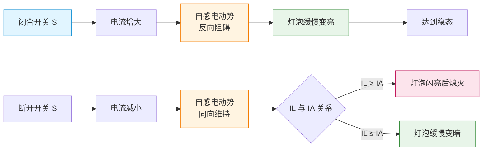

# 自感与互感

> [!abstract] 概览
> 自感与互感是 [[03-楞次定律]] 中"阻碍自身电流变化"和"邻近回路磁通量变化"两种表现的深化。本节讨论==自感现象==（通电自感、断电自感的实验电路与灯泡亮度变化）、自感电动势公式 $E_L=L\dfrac{\Delta I}{\Delta t}$ 与自感系数 $L$ 的决定因素；==互感现象==与互感系数，以及作为变压器雏形的能量传递原理；==涡流==的热效应与机械效应（电磁阻尼、电磁驱动），及其在电磁炉、镇流器、磁悬浮等实际装置中的应用。本节是 [[05-电磁感应综合应用]] 之前的"应用桥梁"，将电磁感应原理引向真实工程世界。

## 核心概念

### 1. 自感现象

**定义**：当一个线圈中的电流发生变化时，它所产生的磁场发生变化，使穿过线圈自身的磁通量发生变化，从而在线圈中产生感应电动势。这种==由于线圈自身电流变化而引起的电磁感应现象==，称为自感现象。产生的电动势叫==自感电动势==。

自感是法拉第电磁感应定律应用于"自身磁通"的特例。

### 2. 自感电动势公式

$$E_L = L\,\dfrac{\Delta I}{\Delta t}$$

其中：
- $E_L$ 为自感电动势（V）
- $L$ 为线圈的自感系数（H）
- $\dfrac{\Delta I}{\Delta t}$ 为电流变化率（A/s）

> [!note] 方向规律（楞次定律第三表现）
> 自感电动势总是==阻碍==线圈自身电流的变化：
> - 电流增大时，自感电动势方向与电流方向==相反==（"反电动势"）；
> - 电流减小时，自感电动势方向与电流方向==相同==（"同向电动势"，试图维持电流）。
> 
> 所以通电瞬间自感电动势"拖慢"电流增长，断电瞬间自感电动势"维持"电流短暂流动——这正是楞次定律"阻碍变化"的体现。

### 3. 自感系数 $L$

**单位**：亨利（H），$1\,\text{H}=1\,\text{V}\cdot\text{s/A}$。常用单位还有毫亨（mH）和微亨（μH）。

**决定因素**：自感系数由==线圈本身性质==决定，与电流大小无关：
- **匝数 $n$**：匝数越多，$L$ 越大（近似 $L\propto n^2$）；
- **线圈形状与尺寸**：截面积越大、长度越短，$L$ 越大；
- **铁芯**：插入铁芯后，磁导率大幅提高，$L$ 可增大数百至数千倍。

> [!example] 类比：水的"惯性"
> 自感系数 $L$ 类似水管中水柱的"惯性"——水柱越长越粗（$L$ 大），水流改变速度就越难。开启阀门时水流缓慢加速（通电自感）；关闭阀门时水柱有"水击"现象（断电自感高压火花）。电感元件在电路里扮演"电流惯性"的角色，与电容"电压惯性"形成对比。

### 4. 通电自感与断电自感实验电路

**典型电路**：电源 $E$、开关 $S$、灯泡 $A$、线圈 $L$（带铁芯）按以下方式连接：
- **通电自感电路**：灯泡 $A$ 与线圈 $L$ ==串联==后接入电源。闭合 $S$ 瞬间，由于线圈自感电动势阻碍电流增大，灯泡==缓慢变亮==（与无线圈对比，灯泡立刻就亮）。
- **断电自感电路**：灯泡 $A$ 与线圈 $L$ ==并联==。电路稳定后再断开 $S$，线圈产生自感电动势维持原电流方向，与灯泡形成闭合回路。灯泡==不会立刻熄灭==，可能出现以下情形：
  - 若 $I_L > I_A$（线圈稳态电流大于灯泡稳态电流），灯泡==闪亮一下再熄灭==；
  - 若 $I_L \le I_A$，灯泡==缓慢变暗==，不会闪亮。

> [!warning] 易错点：断电自感的"闪亮"条件
> 灯泡闪亮的必要条件是==线圈稳态电流大于灯泡稳态电流==，即 $I_L > I_A$。这通常要求线圈支路电阻远小于灯泡支路（$R_L \ll R_A$）。如果两支路电流相等，灯泡只是缓慢熄灭，不会闪亮。"闪亮"不是断电自感的必然现象，只是特定电路条件下的特例。

**图示：通电自感与断电自感流程对比**

### 5. 互感现象

**定义**：当一线圈中的电流发生变化时，它在邻近线圈中产生的磁场也变化，从而在邻近线圈中产生感应电动势。这种==一个回路电流变化引起另一回路产生感应电动势==的现象，称为互感现象。

**互感系数 $M$**：
$$E_2 = M\,\dfrac{\Delta I_1}{\Delta t}$$

$M$ 由两线圈的匝数、几何形状、相对位置和周围磁介质共同决定。两线圈靠近且共轴时 $M$ 大；远离或正交时 $M$ 小。插入铁芯可显著增大 $M$。

### 6. 变压器雏形

互感现象的最重要应用是==变压器==。原线圈（$n_1$ 匝）接交流电源，副线圈（$n_2$ 匝）接负载。交变电流在铁芯中产生交变磁通，同时穿过原副线圈，根据法拉第定律：
$$\dfrac{U_1}{U_2}=\dfrac{n_1}{n_2}$$

理想变压器忽略铜损、铁损和漏磁，能量守恒给出 $P_1=P_2$，即 $U_1 I_1=U_2 I_2$，故 $\dfrac{I_1}{I_2}=\dfrac{n_2}{n_1}$。详见 [[03-变压器]]。

### 7. 涡流

**定义**：块状金属处于变化磁场中或在非均匀磁场中运动时，金属内部会形成==闭合的感应电流==，这种电流呈涡旋状分布，称为涡流。

**两种效应**：
- **热效应**：涡流在金属内部流过时产生焦耳热。利用——电磁炉、高频感应炉（熔炼金属）；防止——变压器铁芯采用==硅钢片叠压==以增大电阻、减小涡流。
- **机械效应**：
  - **电磁阻尼**：金属在磁场中运动时，涡流受安培力阻碍运动。应用——电流计指针快速稳定、电气列车电磁制动。
  - **电磁驱动**：变化的磁场驱动金属圆盘转动。应用——感应电机（异步电动机）。

### 8. 镇流器原理

日光灯镇流器是一个带铁芯的电感线圈，工作分两阶段：
- **启动阶段**：启辉器断开瞬间，镇流器电流急剧减小，产生==高压自感电动势==（瞬时可达数百伏），击穿日光灯内气体，点亮灯管。
- **稳态阶段**：灯管点亮后，镇流器以==感抗==限制电流，使灯管电流稳定在额定值（交流电路中电感元件对电流有阻碍作用，详见 [[02-电感电容与交流电]]）。

> [!tip] 记忆口诀
> **自感阻碍自身变**：通电解、断电续；
> **互感传递两回路**：变压器是其用；
> **涡流热效阻与驱**：电磁炉、电磁闸。

## 推导与原理

### 1. 自感电动势公式的推导

设线圈通有电流 $I$，由毕奥-萨伐尔定律（或简单情形的安培环路定理）可知，线圈自身产生的磁通量 $\Phi$ 与电流 $I$ 成正比：
$$\Phi = L\,I$$

其中比例系数 $L$ 就是自感系数（对多匝线圈，磁链 $\Psi = n\Phi = LI$）。当电流变化 $\Delta I$ 时，磁链变化 $\Delta\Psi = L\Delta I$，由法拉第电磁感应定律：
$$E_L = \dfrac{\Delta\Psi}{\Delta t}=L\,\dfrac{\Delta I}{\Delta t}$$

注意：$L$ 与 $I$ 无关，仅由线圈本身性质决定。

### 2. 断电自感电路的能量分析

线圈稳态储能：通电时电流 $I_0$ 在线圈中建立了磁场，储能为
$$W_L = \dfrac{1}{2}LI_0^2$$

这就是==磁场能==的表达式（与电容电场能 $W_C=\dfrac{1}{2}CU^2$ 对照）。

断电瞬间，自感电动势维持电流 $i$ 继续在线圈-灯泡回路中流动，磁场能逐渐转化为灯泡和线圈电阻上的焦耳热：
$$\dfrac{1}{2}LI_0^2 = \int_0^\infty i^2(R_A + R_L)\,dt$$

若 $L$ 较大、$R_A+R_L$ 较小，能量在短时间内集中释放，灯泡出现"闪亮"现象。

### 3. 电磁阻尼的原理

金属板以速度 $v$ 切割磁感线，板内涡流 $i$ 受安培力 $F_A = BiL$，方向与运动方向相反，起阻碍作用。这部分机械能通过涡流焦耳热耗散：
$$P_{\text{阻尼}} = F_A \cdot v = i^2 R$$

机械能→电能→热能，形成能量耗散通道，使运动减速。这就是电磁阻尼的微观解释。

### 4. 电磁驱动的原理

将金属圆盘置于旋转磁场中（如旋转磁铁或交变电流产生的旋转磁场），盘内感应涡流受磁场力作用，带动圆盘同向旋转（但略慢于磁场，存在"转差"）。这是==异步电动机==的工作原理。本质上仍是楞次定律——感应电流"阻碍相对运动"，结果表现为磁场"拖着"圆盘转。

## 典型实例与类比

### 类比：飞轮与弹簧

- **电感 $L$** 类比飞轮的"转动惯量"：飞轮转动惯量越大，越难加速也越难减速；电感越大，电流越难增大也越难减小。电感是"电流惯性"。
- **电容 $C$** 类比弹簧的"压缩量"：弹簧越硬，充电越快；电容越大，充电越慢。电容是"电压惯性"。
- 二者组合形成 LC 振荡电路，类比飞轮-弹簧系统的简谐振动——能量在磁场能（飞轮动能）和电场能（弹簧势能）之间周期转换。详见 [[01-电磁振荡与电磁波]]。

### 实例 1：日光灯电路

日光灯由灯管、镇流器、启辉器三部分组成。开启日光灯时，启辉器先通电产生辉光放电，使双金属片受热闭合；闭合后启辉器停止放电冷却，双金属片弹开瞬间，镇流器电流骤减，产生高压自感电动势，与电源电压叠加后击穿灯管内气体，灯管点亮。点亮后镇流器以感抗限流。

### 实例 2：电磁炉

电磁炉内部线圈通以高频交流电（20~30 kHz），在锅底产生强交变磁场。铁磁性锅底内部产生强烈涡流，涡流焦耳热直接加热锅体——这就是"无明火"的电磁炉原理。==非铁磁性锅具==（铝、铜、玻璃）涡流弱，加热效率低，所以电磁炉必须用铁磁性锅。

### 实例 3：变压器铁芯的硅钢片

变压器铁芯如果用整块铁，涡流损耗严重。改进方法：将铁芯沿磁场方向切成薄片，片间涂绝缘漆叠压而成——==硅钢片叠压铁芯==。涡流被限制在每片内部，回路面积小、电阻大，涡流损耗大幅降低。同时硅钢材料本身电阻率较高，进一步抑制涡流。

### 实例 4：电气化铁路的电磁制动

某些高速列车的电制动系统利用电磁阻尼原理：列车车轮带动导体盘在磁场中转动，盘内涡流受安培力形成制动力矩，列车动能转化为电能再转化为热能耗散。无机械摩擦，制动平稳、寿命长。

> [!tip] 记忆口诀
> **自感系数看自身**：匝、形、铁芯定 $L$；
> **断电自感看电流**：$I_L$ 大于 $I_A$ 才闪亮；
> **涡流加热与阻尼**：硅钢叠片防损耗。

## 例题

### 例 1：断电自感电路分析

**题目**：如图所示电路，电源电动势 $E=6\,\text{V}$（内阻不计），灯泡 $A$ 的电阻 $R_A=10\,\Omega$，线圈 $L$ 的直流电阻 $R_L=1\,\Omega$，自感系数 $L=0.5\,\text{H}$。灯泡与线圈并联后接入电源。电路稳定后突然断开开关 $S$。求：
(1) 断开 $S$ 前灯泡和线圈中的电流；
(2) 断开 $S$ 瞬间灯泡中电流的大小和方向（与断开前相比）；
(3) 断开 $S$ 后短时间内灯泡的功率变化情况。

**分析**：
- 断开前：灯泡支路 $I_A = \dfrac{E}{R_A}=\dfrac{6}{10}=0.6\,\text{A}$；线圈支路 $I_L=\dfrac{E}{R_L}=\dfrac{6}{1}=6\,\text{A}$。
- 由于 $I_L \gg I_A$，断电自感时灯泡会==闪亮==。
- 断开 $S$ 后，线圈作为"电源"通过灯泡放电，回路电流方向取决于线圈原电流方向。线圈原电流从正极流入线圈，断电后自感电动势维持电流同向流动，因此通过灯泡的电流方向与原来灯泡电流方向相反。

**解答**：
(1) $I_A=0.6\,\text{A}$，$I_L=6\,\text{A}$。

(2) 断开瞬间，自感电动势维持线圈电流 $i_L$ 不突变，初始 $i_L(0^+)=I_L=6\,\text{A}$，这一电流通过灯泡形成回路。所以灯泡瞬间电流为 $6\,\text{A}$（==方向与原电流相反==）。

(3) 灯泡瞬间功率：
$$P_A(0^+) = i_L^2 R_A = 6^2\times 10 = 360\,\text{W}$$

而断开前灯泡功率 $P_A=I_A^2 R_A=0.6^2\times 10=3.6\,\text{W}$，瞬间功率放大 100 倍！随后电流按 $i(t)=I_L e^{-t/\tau}$ 衰减，时间常数 $\tau=\dfrac{L}{R_A+R_L}=\dfrac{0.5}{11}\approx 0.045\,\text{s}$，灯泡迅速变暗熄灭。

**点评**：本题体现了"闪亮"的物理本质——自感维持电流连续，瞬态电流由 $I_L$ 决定，可能远大于灯泡原电流。"$I_L>I_A$"是闪亮的必要条件。

### 例 2：互感与变压器雏形

**题目**：两个匝数分别为 $n_1=200$ 匝、$n_2=50$ 匝的线圈绕在同一闭合铁芯上。原线圈两端加 $U_1=220\,\text{V}$ 的正弦交流电压，忽略一切损耗，求副线圈开路时的电压 $U_2$。

**分析**：理想变压器电压比等于匝数比：
$$\dfrac{U_1}{U_2}=\dfrac{n_1}{n_2}$$

**解答**：
$$U_2 = U_1\cdot\dfrac{n_2}{n_1}=220\times\dfrac{50}{200}=55\,\text{V}$$

**点评**：副线圈开路时无电流，但电压仍按匝数比感应——这是典型的互感现象。注意 $n_2<n_1$ 时 $U_2<U_1$，这是降压变压器；反之 $n_2>n_1$ 为升压变压器。

### 例 3：电磁阻尼

**题目**：一个质量 $m=0.1\,\text{kg}$、电阻 $R=0.05\,\Omega$ 的金属圆环从高 $h=0.8\,\text{m}$ 处自由下落，进入方向水平、磁感应强度 $B=1\,\text{T}$ 的匀强磁场区域（磁场区域足够大）。环面始终保持水平。求环进入磁场后达到的最终速度（假设环已完全进入磁场前达到稳定）。

**分析**：环进入磁场时，磁通增大，感应电流阻碍磁通变化，安培力向上阻碍下落。当安培力等于重力时，环达到==收尾速度==。

设环周长为 $L$（环的圆周），环电阻 $R$ 已知。环以速度 $v$ 切割磁感线（等效为周长上每段都在切割），感应电动势 $E=BLv$，电流 $I=\dfrac{BLv}{R}$，安培力 $F_A=BIL=\dfrac{B^2L^2 v}{R}$。

稳定时 $F_A=mg$：
$$\dfrac{B^2 L^2 v}{R} = mg$$

题目未给环半径或周长，需用其他方法。但题目限定了 $R=0.05\,\Omega$，需补充环周长 $L$。事实上，环电阻与环周长相关：$R=\rho\dfrac{L}{S_{\text{截面}}}$，但题中未给截面与电阻率。

为简化，我们直接套用结论：本题意在考察"安培力=重力时收尾"的物理图像。若取环周长 $L=0.314\,\text{m}$（半径 $0.05\,\text{m}$）：
$$v=\dfrac{mgR}{B^2 L^2}=\dfrac{0.1\times 10\times 0.05}{1^2\times 0.314^2}\approx\dfrac{0.05}{0.0986}\approx 0.51\,\text{m/s}$$

**点评**：电磁阻尼的标志是==收尾速度==——安培力随速度增大而增大，当与重力平衡时速度达到稳定。这与空气阻力下的收尾速度模型完全平行。本题在高考中常以"环进入磁场匀速下落"出现，关键是判断安培力方向和大小。

## 易错提醒

> [!warning] 易错点
> 1. **自感系数 $L$ 与电流 $I$ 无关**：$L$ 只由线圈本身（匝数、形状、铁芯）决定，不能从 $L=\dfrac{\Phi}{I}$ 误以为"$L$ 随 $I$ 变化"。这个比例式只是 $L$ 的定义式，不是决定式。
> 2. **断电自感"闪亮"的条件**：必须 $I_L > I_A$（线圈稳态电流大于灯泡稳态电流）。若 $I_L \le I_A$，灯泡只是缓慢变暗，不会闪亮。
> 3. **自感电动势方向**：电流增大时反向（阻碍增大），电流减小时同向（阻碍减小）。"反向"和"同向"都是相对于电流方向而言。
> 4. **涡流的双面性**：既有热效应（电磁炉利用、变压器防止），也有机械效应（电磁阻尼、电磁驱动）。要看应用场景选择利用或防止。
> 5. **理想变压器条件**：忽略铜损、铁损、漏磁，且频率相同。这些条件在高考题中通常默认成立。

> [!note] 概念辨析
> **自感** vs **互感**：
> - 自感：一个线圈因==自身==电流变化而在==自身==产生感应电动势。
> - 互感：一个线圈电流变化在==另一==线圈中产生感应电动势。
> - 二者本质都是法拉第电磁感应定律的应用，区别在于磁通的"来源"。
> 
> **电场能** vs **磁场能**：
> - 电场能（电容）：$W_C=\dfrac{1}{2}CU^2=\dfrac{Q^2}{2C}$，储存在电容器中。
> - 磁场能（电感）：$W_L=\dfrac{1}{2}LI^2$，储存在线圈磁场中。
> - LC 振荡电路中二者周期性转换，类比弹簧振子的弹性势能与动能。

## 与其他知识关联

- 与 [[01-磁通量与电磁感应现象]] 的关系：自感是"自身磁通量变化"，互感是"邻近回路磁通量变化"，都属于磁通量变化引起感应电动势。
- 与 [[02-法拉第电磁感应定律]] 的关系：自感电动势 $E_L=L\dfrac{\Delta I}{\Delta t}$ 是法拉第定律 $E=n\dfrac{\Delta\Phi}{\Delta t}$ 应用于"磁链 $\Psi=LI$"的特例。
- 与 [[03-楞次定律]] 的关系：自感电动势"阻碍自身电流变化"是楞次定律的第三种表现；互感电动势方向也由楞次定律判定。
- 与 [[04-自感与互感]] 的关系：本节自身。
- 与 [[05-电磁感应综合应用]] 的关系：电磁阻尼、电磁驱动是综合应用中常见的力学-电学耦合模型。
- 大学层面延伸：[[电磁学]] 中自感、互感是电路暂态分析（RL、RLC 电路）的核心参数；麦克斯韦方程组从场方程角度统一描述。
- 跨学科：化学中 NMR（核磁共振）谱仪的线圈调谐利用自感与互感；生物电磁学中神经轴突的"电缆模型"也涉及类似电感-电容耦合。

## 作者的话

> [!quote] 个人理解
> 自感与互感把电磁感应从"实验室现象"推向了"工程世界"。变压器、镇流器、电磁炉、电气制动——这些日常和工业装置背后都是同一个原理：==变化的电流产生变化的磁场，变化的磁场又产生感应电动势==。
> 
> 学习本节时，我最想强调三个观念：
> 
> 第一，==电感是"电流惯性"==。这一点对理解交流电路至关重要。电感越大，电流越"懒"——不愿变化。日后学习 RL 电路的暂态过程、LC 振荡、交流电的感抗时，所有公式都围绕这一性质展开。
> 
> 第二，==能量观点是终极武器==。自感、互感、涡流、电磁阻尼的本质都可以从能量转化角度理解：电能 ↔ 磁场能 ↔ 机械能 ↔ 热能。当你纠结于"自感电动势方向到底朝哪"时，不妨问自己："能量要怎么转化才能守恒？"答案往往不言自明。
> 
> 第三，==应用场景决定"利用还是防止"==。涡流在电磁炉里是宝，在变压器里是祸；自感在镇流器里是宝，在断电瞬间的高压火花对某些电路是祸。工程设计的智慧就是"用其利，避其害"。
> 
> 最后一个建议：本节的实验电路（通断电自感、变压器雏形）一定要亲手画几遍，把电流方向、灯泡亮度变化、能量流向标清楚。这部分知识在高考选择题中常以"判断灯泡亮度变化"的形式出现，看似简单实则陷阱密布。

---
*返回 [[00-电学总览]]*
