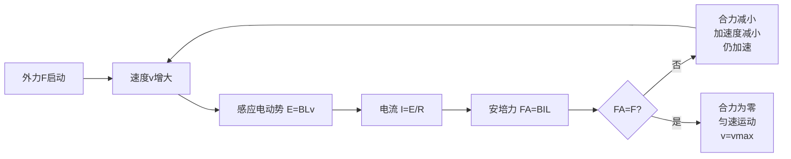

# 电磁感应综合应用

> [!abstract] 概览
> 本节是电磁感应章节的==压轴综合篇==，将前四节的概念、定律、原理融汇于"导轨模型"这一高考核心情境。我们梳理导轨模型的分类（单杆/双杆 × 有源/无源 × 水平/竖直/斜面），建立单杆问题的"受力→运动→能量"三段式分析框架，详细推导"先加速后匀速"的渐稳模型；讨论双杆问题中动量守恒的特殊情形；归纳电磁感应中的能量转化链条（机械能→电能→热能）与动量定理应用（安培力冲量 $I_{\text{安}}=BqL$）；最后介绍电磁阻尼、电磁驱动与磁悬浮列车的工程原理。本节是高考==压轴大题==的高频考点，必须熟练掌握。

## 核心概念

### 1. 导轨模型分类

按"杆的数量"、"电源有无"、"空间取向"三个维度分类：

| 维度 | 类型 | 特点 |
|---|---|---|
| 杆的数量 | 单杆 / 双杆 | 单杆只有一根导体棒；双杆有两根，常构成回路 |
| 电源 | 有源 / 无源 | 有源：电路含电池或外加电动势；无源：仅靠导体切割 |
| 空间取向 | 水平 / 竖直 / 斜面 | 影响重力是否做功、安培力方向 |

常见组合：
- **无源水平单杆**：杆初速度 $v_0$，安培力减速，动能转化为焦耳热。
- **有源水平单杆**：杆受恒定外力或电池驱动，先加速后匀速。
- **无源竖直单杆**：杆下落，安培力与重力抗衡，达到收尾速度。
- **无源双杆（水平）**：两杆初速度不同，安培力使二者速度趋同，动量守恒。
- **有源双杆**：含电池，分析较复杂，高考出现频率较低。

### 2. 单杆问题分析框架

**三段式分析**：

1. **受力分析**：杆受哪些力？（外力、安培力、摩擦力、重力等）安培力方向由楞次定律/右手定则+左手定则确定。
2. **运动分析**：根据合力判断运动性质（加速、减速、平衡）。若加速度 $a$ 随速度 $v$ 变化，需列出 $a(v)$ 关系，分析渐稳条件。
3. **能量分析**：追踪能量转化路径。机械能 → 电能 → 焦耳热；或化学能（电池）→ 电能 → 机械能 + 焦耳热。用能量守恒校验。

> [!note] 单杆问题的"金科玉律"
> 安培力总是与杆相对磁场运动方向相反（楞次定律"阻碍相对运动"）。所以：
> - 杆向右运动，安培力向左；
> - 杆下落，安培力向上；
> - 杆上滑，安培力沿斜面向下。
> 
> 安培力大小 $F_A = BIL = \dfrac{B^2 L^2 v}{R}$，方向由楞次定律判定。

### 3. 单杆"先加速后匀速"模型

**情境**：水平光滑导轨，匀强磁场 $B$ 垂直导轨平面，导体棒长 $L$、电阻 $r$，回路总电阻 $R$（含 $r$），棒受恒定水平外力 $F$ 从静止开始运动。

**推导**：

棒运动速度 $v$ 时，感应电动势 $E=BLv$，电流 $I=\dfrac{BLv}{R}$，安培力 $F_A=BIL=\dfrac{B^2L^2 v}{R}$，方向与运动反向。

由牛顿第二定律：
$$F - F_A = ma\quad\Rightarrow\quad F - \dfrac{B^2 L^2 v}{R} = m\dfrac{dv}{dt}$$

整理：
$$\dfrac{dv}{dt} = \dfrac{F}{m} - \dfrac{B^2 L^2}{mR}\,v$$

**分析**：
- 初时刻 $v=0$，加速度 $a_0=\dfrac{F}{m}$（最大）；
- 随 $v$ 增大，安培力增大，加速度减小；
- 当 $a=0$ 时达到==收尾速度==（最大速度）：
$$v_{\text{max}} = \dfrac{FR}{B^2 L^2}$$

此时外力功率 $Fv_{\text{max}}$ 全部转化为电路焦耳热功率 $I^2 R$。

**速度随时间演化**（解微分方程）：
$$v(t)=v_{\text{max}}\left(1-e^{-t/\tau}\right),\quad \tau=\dfrac{mR}{B^2L^2}$$

速度按指数趋于 $v_{\text{max}}$，时间常数 $\tau=\dfrac{mR}{B^2L^2}$ 反映达到稳态的快慢。

> [!tip] 收尾速度速记
> 平衡条件 $F=F_A$，代入 $F_A=\dfrac{B^2L^2 v}{R}$：
> $$v_{\text{max}}=\dfrac{FR}{B^2L^2}$$
> 记忆：==外力×电阻 / (B² L²)==。重力情形把 $F$ 换成 $mg$；斜面情形换成 $mg\sin\theta$。

### 4. 双杆问题与动量守恒

**情境**：水平光滑导轨，两根导体棒 $a$、$b$（质量 $m_1$、$m_2$，电阻 $r_1$、$r_2$）垂直跨在导轨上，匀强磁场 $B$ 垂直导轨平面。两棒初速度分别为 $v_{10}$、$v_{20}$（同向），求最终状态。

**分析**：两杆和导轨构成闭合回路，回路磁通取决于两杆位置之差。当两杆速度不同时，磁通变化，产生感应电流；感应电流对两杆的安培力方向==相反==——一杆减速，另一杆加速，最终两杆速度相同，磁通不变，感应电流消失。

**动量守恒**：水平光滑，无外力，安培力是两杆间的内力，==系统动量守恒==：
$$m_1 v_{10} + m_2 v_{20} = (m_1+m_2)v_{\text{共}}$$

$$v_{\text{共}} = \dfrac{m_1 v_{10}+m_2 v_{20}}{m_1+m_2}$$

**能量转化**：系统初动能 $-$ 末动能 = 焦耳热：
$$Q = \dfrac{1}{2}m_1 v_{10}^2 + \dfrac{1}{2}m_2 v_{20}^2 - \dfrac{1}{2}(m_1+m_2)v_{\text{共}}^2$$

这与"完全非弹性碰撞"完全平行——双杆问题在动量守恒条件下本质是==电磁学版的完全非弹性碰撞==。

### 5. 电磁感应中的动量定理

安培力冲量与通过回路的电荷量有重要关系：
$$I_{\text{安培力冲量}} = \int F_A\,dt = \int BIL\,dt = BL\int I\,dt = BLq$$

即：
$$\boxed{\,I_{\text{安}} = BLq\,}$$

其中 $q=\int I\,dt$ 是过程中通过回路的总电荷量。

结合 $q=\dfrac{n\Delta\Phi}{R}=\dfrac{\Delta\Phi}{R}$（单匝），可建立动量变化与磁通量变化的关系：
$$m\Delta v = BL\cdot\dfrac{\Delta\Phi}{R}$$

这是==动量—磁通量桥梁==，在单杆减速、双杆趋同等问题中极为有用，可避开复杂的微分方程。

### 6. 电磁感应中的能量转化链条

- 外力对杆做正功 → 杆机械能增加 + 电能产生；
- 安培力对杆做负功 → 杆机械能减少 → 转化为电能；
- 电流流过电阻 → 电能转化为焦耳热。

**关键公式**：
- 安培力做功：$W_A = -\int F_A\,dx$（负号表示阻碍运动）
- 电能产生：$W_{\text{电}} = -W_A$（安培力做负功的绝对值等于产生的电能）
- 焦耳热：$Q = \int I^2 R\,dt = W_{\text{电}}$（无其他耗散时）

### 7. 电磁阻尼与电磁驱动

- **电磁阻尼**：导体在磁场中运动时，感应电流的安培力阻碍运动，使导体减速。应用：电气制动、电流计阻尼。
- **电磁驱动**：变化磁场驱动导体运动，导体被磁场"拖着"转。应用：异步电动机、磁悬浮列车驱动。

### 8. 磁悬浮列车原理

磁悬浮列车利用电磁力实现==悬浮==与==驱动==：
- **悬浮**：车载电磁铁与轨道铝板间产生斥力（或吸引力），使车体脱离轨道。具体有常导吸力型（EMS）与超导斥力型（EDS）两种。
- **驱动**：轨道安装直线电机初级绕组，通以三相交流电形成"行波磁场"，磁场移动推动车载次级（反应板），实现无机械接触的直线驱动——本质是==展开的异步电动机==。
- **优势**：无机械摩擦、高速、低噪音；缺点：能耗大、造价高。

## 推导与原理

### 1. 单杆"先加速后匀速"的严格解

由 $m\dfrac{dv}{dt}=F-\dfrac{B^2L^2}{R}v$，分离变量：
$$\dfrac{dv}{F-kv}=\dfrac{dt}{m},\quad k=\dfrac{B^2L^2}{R}$$

积分：$-\dfrac{1}{k}\ln(F-kv)=\dfrac{t}{m}+C$。代入初值 $v(0)=0$：
$$\ln\dfrac{F-kv}{F}=-\dfrac{kt}{m}\Rightarrow F-kv=Fe^{-kt/m}$$

$$v(t)=\dfrac{F}{k}\left(1-e^{-kt/m}\right)=v_{\text{max}}\left(1-e^{-t/\tau}\right)$$

其中 $v_{\text{max}}=\dfrac{F}{k}=\dfrac{FR}{B^2L^2}$，$\tau=\dfrac{m}{k}=\dfrac{mR}{B^2L^2}$。

**能量校验**：稳态时外力功率 $P_{\text{外}}=Fv_{\text{max}}=\dfrac{F^2R}{B^2L^2}$，焦耳热功率 $P_{\text{热}}=I^2R=\left(\dfrac{BLv_{\text{max}}}{R}\right)^2 R=\dfrac{B^2L^2 v_{\text{max}}^2}{R}=\dfrac{F^2R}{B^2L^2}$，二者相等，能量守恒。

### 2. 动量定理在单杆减速中的应用

无外力水平单杆初速度 $v_0$，求减速到 $v$ 过程中通过回路的电荷量 $q$。

由动量定理（取运动方向为正）：
$$m(v-v_0) = -\int F_A\,dt = -BL\int I\,dt = -BLq$$

故：
$$q = \dfrac{m(v_0-v)}{BL}$$

又由 $q=\dfrac{\Delta\Phi}{R}=\dfrac{BL\Delta x}{R}$（$\Delta x$ 为杆位移），可得：
$$\Delta x = \dfrac{mR(v_0-v)}{B^2L^2}$$

整个过程动能损失全部转化为焦耳热：
$$Q=\dfrac{1}{2}mv_0^2-\dfrac{1}{2}mv^2$$

若杆最终停下（$v=0$），$Q=\dfrac{1}{2}mv_0^2$，全部动能转化为热。

### 3. 双杆动量守恒的成立条件

**条件**：水平光滑导轨 + 无外力 + 磁场对两杆的安培力等大反向（保证系统所受合外力为零）。

**注意**：若导轨有摩擦、有外力、或磁场区域不对称，动量不守恒。高考中默认光滑无外力时才能用动量守恒。

## 典型实例与类比

### 类比：水流与水车系统

- **单杆模型**类比"水流冲击水车"：水流（外力）推动水车（杆）转动，水车又反过来阻碍水流（安培力阻碍运动）；当水流推力等于水车反作用力时，水车匀速转动。
- **双杆模型**类比"两水车串联"：两水车通过水流耦合，速度趋同后水流停止，两水车一起匀速。

### 实例 1：电磁炮

电磁炮利用电磁力加速导体弹丸——本质是"有源单杆加速模型"。强大的脉冲电流通过导轨和弹丸，安培力推动弹丸加速到极高速度（可达数千米每秒）。这是电磁感应在军事上的尖端应用。

### 实例 2：电磁制动

高速列车在紧急制动时启用电磁制动——车轮带动金属盘在强磁场中转动，盘内涡流受安培力形成制动力矩。优点：无机械摩擦、寿命长、制动力可调。详见 [[04-自感与互感]] 中的涡流机械效应。

### 实例 3：磁悬浮列车

上海磁浮线采用常导吸力型悬浮：车载电磁铁从下方吸住 T 形导轨，通过反馈控制保持 8~10 mm 悬浮间隙；直线电机驱动列车最高运行 430 km/h。这是电磁驱动与电磁悬浮结合的典范。

> [!tip] 记忆口诀
> **单杆三段：受力、运动、能量**；
> **双杆动量守恒看条件**；
> **安培冲量 $BLq$，动量—磁通桥**；
> **机械→电→热，能量链条顺**。

## 例题

### 例 1：无源水平单杆减速（动量与能量）

**题目**：水平光滑平行导轨间距 $L=0.5\,\text{m}$，导轨左端接电阻 $R=2\,\Omega$，匀强磁场 $B=0.4\,\text{T}$ 垂直导轨平面。质量 $m=0.1\,\text{kg}$、电阻 $r=0.5\,\Omega$ 的导体棒跨在导轨上以初速度 $v_0=4\,\text{m/s}$ 向右运动。导轨电阻不计。求：
(1) 棒从开始到停止所通过的电荷量 $q$；
(2) 棒从开始到停止的位移 $x$；
(3) 整个过程产生的焦耳热 $Q$。

**分析**：回路总电阻 $R_{\text{总}}=R+r=2.5\,\Omega$。整个过程动量定理 + 电荷量公式联立。

**解答**：
(1) 由动量定理（运动方向为正，安培力反向）：
$$m(0-v_0) = -BLq\Rightarrow q=\dfrac{mv_0}{BL}=\dfrac{0.1\times 4}{0.4\times 0.5}=2\,\text{C}$$

(2) 由 $q=\dfrac{\Delta\Phi}{R_{\text{总}}}=\dfrac{BLx}{R_{\text{总}}}$：
$$x=\dfrac{qR_{\text{总}}}{BL}=\dfrac{2\times 2.5}{0.4\times 0.5}=25\,\text{m}$$

(3) 由能量守恒（动能全部转化为焦耳热）：
$$Q=\dfrac{1}{2}mv_0^2=\dfrac{1}{2}\times 0.1\times 4^2=0.8\,\text{J}$$

**点评**：本题展示了"动量—磁通桥梁"的威力——不需解微分方程即可求出 $q$ 与位移 $x$。能量守恒给焦耳热提供了独立校验。

### 例 2：有源水平单杆"先加速后匀速"

**题目**：水平光滑导轨间距 $L=1\,\text{m}$，匀强磁场 $B=0.5\,\text{T}$ 垂直导轨。质量 $m=0.2\,\text{kg}$、电阻 $r=1\,\Omega$ 的导体棒跨在导轨上，导轨电阻不计，外接电阻 $R=4\,\Omega$。棒受恒定水平外力 $F=0.5\,\text{N}$ 从静止开始运动。求：
(1) 棒的最大速度 $v_{\text{max}}$；
(2) 当棒速度 $v=2\,\text{m/s}$ 时棒的加速度 $a$；
(3) 棒达到最大速度后，单位时间内外力做功与电路焦耳热功率。

**分析**：标准"先加速后匀速"模型，回路总电阻 $R_{\text{总}}=5\,\Omega$。

**解答**：
(1) 最大速度时 $F=F_A=\dfrac{B^2L^2 v}{R_{\text{总}}}$：
$$v_{\text{max}}=\dfrac{FR_{\text{总}}}{B^2L^2}=\dfrac{0.5\times 5}{0.5^2\times 1^2}=\dfrac{2.5}{0.25}=10\,\text{m/s}$$

(2) $v=2\,\text{m/s}$ 时：
$$F_A=\dfrac{B^2L^2 v}{R_{\text{总}}}=\dfrac{0.25\times 2}{5}=0.1\,\text{N}$$
$$a=\dfrac{F-F_A}{m}=\dfrac{0.5-0.1}{0.2}=2\,\text{m/s}^2$$

(3) 稳态时外力功率：
$$P_{\text{外}}=Fv_{\text{max}}=0.5\times 10=5\,\text{W}$$

电流：
$$I=\dfrac{BLv_{\text{max}}}{R_{\text{总}}}=\dfrac{0.5\times 1\times 10}{5}=1\,\text{A}$$

焦耳热功率：
$$P_{\text{热}}=I^2 R_{\text{总}}=1^2\times 5=5\,\text{W}$$

二者相等，能量守恒。

**点评**：本题是"先加速后匀速"模型的标准考法。最大速度公式 $v_{\text{max}}=\dfrac{FR_{\text{总}}}{B^2L^2}$ 必须烂熟于心。稳态时外力做功全部转化为焦耳热——这是判断答案正确性的快速校验。

### 例 3：双杆动量守恒（完全非弹性碰撞等效）

**题目**：水平光滑平行导轨间距 $L=0.4\,\text{m}$，匀强磁场 $B=0.5\,\text{T}$ 垂直导轨。两根导体棒 $a$、$b$ 质量均为 $m=0.1\,\text{kg}$，电阻均为 $r=1\,\Omega$，跨在导轨上。初始 $a$ 棒以 $v_0=3\,\text{m/s}$ 向右运动，$b$ 棒静止。导轨足够长，导轨电阻不计。求：
(1) 两棒最终共同速度 $v_{\text{共}}$；
(2) 整个过程产生的焦耳热 $Q$；
(3) 通过每根棒横截面的电荷量 $q$。

**分析**：双杆光滑无外力，动量守恒。回路总电阻 $R_{\text{总}}=r_a+r_b=2\,\Omega$。

**解答**：
(1) 动量守恒：
$$mv_0+0=(m+m)v_{\text{共}}\Rightarrow v_{\text{共}}=\dfrac{v_0}{2}=1.5\,\text{m/s}$$

(2) 焦耳热 = 系统动能损失：
$$Q=\dfrac{1}{2}mv_0^2-\dfrac{1}{2}(2m)v_{\text{共}}^2=\dfrac{1}{2}\times 0.1\times 9-\dfrac{1}{2}\times 0.2\times 2.25=0.45-0.225=0.225\,\text{J}$$

(3) 以 $a$ 棒为研究对象，由动量定理：
$$m(v_{\text{共}}-v_0)=-BLq\Rightarrow q=\dfrac{m(v_0-v_{\text{共}})}{BL}=\dfrac{0.1\times(3-1.5)}{0.5\times 0.4}=0.75\,\text{C}$$

**点评**：双杆问题在动量守恒条件下等价于完全非弹性碰撞——末速度相同，动能损失最大，差额转化为焦耳热。这一类比能让问题瞬间简化。

### 例 4：斜面单杆（重力 + 安培力 + 动量定理）

**题目**：倾角 $\theta=30°$ 的光滑斜面导轨间距 $L=0.5\,\text{m}$，匀强磁场 $B=0.8\,\text{T}$ 垂直斜面方向向上。质量 $m=0.2\,\text{kg}$、电阻 $r=0.5\,\Omega$ 的导体棒跨在导轨上从静止释放，外接电阻 $R=1.5\,\Omega$。导轨电阻不计。求：
(1) 棒的最大速度 $v_{\text{max}}$；
(2) 棒达到最大速度时单位时间内电路产生的焦耳热；
(3) 速度由零增至 $v_{\text{max}}/2$ 过程中通过回路的电荷量 $q$ 与棒位移 $x$。

**分析**：沿斜面方向重力分量 $mg\sin\theta$ 推动，安培力阻碍。$R_{\text{总}}=R+r=2\,\Omega$。

**解答**：
(1) 稳态时沿斜面方向 $mg\sin\theta = F_A=\dfrac{B^2L^2 v}{R_{\text{总}}}$：
$$v_{\text{max}}=\dfrac{mg\sin\theta\cdot R_{\text{总}}}{B^2L^2}=\dfrac{0.2\times 10\times 0.5\times 2}{0.8^2\times 0.5^2}=\dfrac{2}{0.16}=12.5\,\text{m/s}$$

(2) 稳态时电流：
$$I=\dfrac{BLv_{\text{max}}}{R_{\text{总}}}=\dfrac{0.8\times 0.5\times 12.5}{2}=2.5\,\text{A}$$

焦耳热功率：
$$P=I^2 R_{\text{总}}=2.5^2\times 2=12.5\,\text{W}$$

校验：重力沿斜面分量功率 $mg\sin\theta\cdot v_{\text{max}}=0.2\times 10\times 0.5\times 12.5=12.5\,\text{W}$，吻合。

(3) 由动量定理（沿斜面方向）：
$$m\left(\dfrac{v_{\text{max}}}{2}-0\right) = mg\sin\theta\cdot t - BLq$$

但 $t$ 未知，需另用 $q=\dfrac{\Delta\Phi}{R_{\text{总}}}=\dfrac{BLx}{R_{\text{总}}}$ 与能量守恒联立。

设 $v=\dfrac{v_{\text{max}}}{2}=6.25\,\text{m/s}$，能量守恒：
$$mg\sin\theta\cdot x=\dfrac{1}{2}mv^2+Q_{\text{部分}}$$

但部分焦耳热 $Q_{\text{部分}}$ 不易直接求。

**改用动量—磁通桥梁**：从开始到 $v=\dfrac{v_{\text{max}}}{2}$，对棒应用动量定理：
$$m v = \int(mg\sin\theta - F_A)\,dt = mg\sin\theta\cdot t - BLq$$

仍含 $t$，不易求。

**最简方法**——直接用 $q=\dfrac{BLx}{R_{\text{总}}}$ 配合能量守恒：
$$mg\sin\theta\cdot x = \dfrac{1}{2}mv^2 + \int_0^t I^2 R_{\text{总}}\,dt$$

但 $\int I^2 R\,dt$ 仍难求。

实际上，高考斜面单杆问题通常只考到 (1)(2) 问——求最大速度和稳态功率即可。第 (3) 问需要在 $v$ 与 $t$ 的关系确定后才能精确求出 $q$，需要解微分方程。

我们给出近似法：因 $v(t)=v_{\text{max}}(1-e^{-t/\tau})$，$\tau=\dfrac{mR_{\text{总}}}{B^2L^2}=\dfrac{0.2\times 2}{0.64\times 0.25}=2.5\,\text{s}$。

设 $v=\dfrac{v_{\text{max}}}{2}$，则 $1-e^{-t/\tau}=\dfrac{1}{2}$，$t=\tau\ln 2\approx 2.5\times 0.693=1.73\,\text{s}$。

电荷量：
$$q=\int_0^t I\,dt=\int_0^t\dfrac{BLv(t)}{R_{\text{总}}}\,dt=\dfrac{BLv_{\text{max}}}{R_{\text{总}}}\int_0^t(1-e^{-t/\tau})\,dt$$

$$=\dfrac{BLv_{\text{max}}}{R_{\text{总}}}\left[t+\tau(e^{-t/\tau}-1)\right]$$

代入 $t=\tau\ln 2$：
$$q=\dfrac{BLv_{\text{max}}}{R_{\text{总}}}\cdot\tau\left[\ln 2 + \dfrac{1}{2}-1\right]=\dfrac{BLv_{\text{max}}\tau}{R_{\text{总}}}\left(\ln 2 - \dfrac{1}{2}\right)$$

$$=\dfrac{0.8\times 0.5\times 12.5\times 2.5}{2}\times(0.693-0.5)=6.25\times 0.193\approx 1.21\,\text{C}$$

位移：
$$x=\dfrac{qR_{\text{总}}}{BL}=\dfrac{1.21\times 2}{0.8\times 0.5}=6.05\,\text{m}$$

**点评**：斜面单杆是高考压轴大题的典型形态。第 (1)(2) 问相对常规，关键是熟练写出 $mg\sin\theta=F_A$ 的平衡条件；第 (3) 问需要解微分方程，超出高考常规要求，但理解 $v(t)$ 的指数增长规律对深入掌握模型非常有帮助。

## 易错提醒

> [!warning] 易错点
> 1. **回路总电阻 $R_{\text{总}}$ 要算对**：含电源、外接电阻、导体棒电阻、导轨电阻等所有串联部分。经常有同学只算外接电阻而忘了导体棒自身电阻。
> 2. **安培力方向**：始终与相对运动方向相反。判断用"右手定则（电流）→ 左手定则（安培力）"两步走。
> 3. **动量守恒条件**：双杆问题必须==水平光滑且无外力==才能用动量守恒。有摩擦、有外力、有重力分量（斜面）时动量不守恒。
> 4. **能量守恒与焦耳热**：焦耳热 $Q=\int I^2R\,dt$，不是 $I^2R\cdot t$（除非电流恒定）。在变电流情形下要用积分或动能定理间接求。
> 5. **$q=\dfrac{n\Delta\Phi}{R}$ 中 $R$ 是总电阻**：通过回路的电荷量与时间无关，但与回路总电阻有关。
> 6. **"先加速后匀速"≠"匀加速"**：单杆在恒定外力下加速度随速度增大而减小，不是匀加速；只有安培力为零的初始瞬间才有最大加速度 $F/m$。

> [!note] 概念辨析
> **动量守恒** vs **能量守恒** in 双杆问题：
> - 动量守恒：水平光滑无外力时成立，给出末速度 $v_{\text{共}}$；
> - 能量守恒：始终成立，给出焦耳热 $Q$ = 动能损失；
> - 二者联立可解双杆问题的两个核心物理量。
> 
> **平均电动势** vs **瞬时电动势** in 单杆问题：
> - 求电荷量 $q$、位移 $x$：用平均电动势 $\bar{E}=\dfrac{\Delta\Phi}{\Delta t}$，结合 $q=\dfrac{\Delta\Phi}{R}$；
> - 求瞬时电流、瞬时安培力、瞬时加速度：用瞬时电动势 $E=BLv$；
> - 求总焦耳热：用能量守恒或动能定理，避开变电流积分。

## 与其他知识关联

- 与 [[01-磁通量与电磁感应现象]] 的关系：导轨模型中磁通量变化（$S$ 变、$B$ 变）是感应电流产生的根源。
- 与 [[02-法拉第电磁感应定律]] 的关系：$E=BLv$ 是单杆电动势的核心公式；$E=n\dfrac{\Delta\Phi}{\Delta t}$ 用于求电荷量。
- 与 [[03-楞次定律]] 的关系：安培力方向、阻碍相对运动的本质都来自楞次定律。
- 与 [[04-自感与互感]] 的关系：电磁阻尼、电磁驱动是涡流机械效应的应用；变压器雏形是互感的工程实现。
- 与 [[05-电磁感应综合应用]] 的关系：本节自身，是电磁感应章节的总集成。
- 大学层面延伸：[[电磁学]] 中这些模型用 RL 电路暂态分析严格求解；直线电机理论是电机学的核心内容；磁悬浮技术涉及超导与电磁场综合。
- 跨学科：化学中电化学传感器利用电磁感应原理测量离子浓度变化；生物电磁学中神经纤维动作电位的传导模型与电缆方程相关。

## 作者的话

> [!quote] 个人理解
> 电磁感应综合应用是高中物理的"集大成"章节——它把力学、电学、能量、动量全部串联起来。一个导轨模型可以同时考查牛顿第二定律、动能定理、动量守恒、能量守恒、楞次定律、法拉第定律——这是它"难"的根本原因，也是它"美"的所在。
> 
> 学习本节，我建议遵循"==三步内化法=="：
> 
> 第一步，==记住两个核心公式==：
> - $E=BLv$（瞬时电动势）
> - $v_{\text{max}}=\dfrac{FR}{B^2L^2}$（收尾速度，重力情形把 $F$ 换成 $mg$ 或 $mg\sin\theta$）
> 
> 这两个公式覆盖 80% 的单杆问题。
> 
> 第二步，==掌握两条桥梁==：
> - 动量—磁通桥梁：$BLq = m\Delta v$（连接动量变化与电荷量）
> - 能量—热量桥梁：$Q = \Delta E_k + W_{\text{其他}}$（动能损失 + 其他力做功 = 焦耳热）
> 
> 这两条桥梁覆盖 90% 的双杆问题和能量问题。
> 
> 第三步，==建立三种模型直觉==：
> - "先加速后匀速"：外力推动下杆渐近稳态，指数规律 $v(t)=v_{\text{max}}(1-e^{-t/\tau})$；
> - "双杆趋同"：等效完全非弹性碰撞，动量守恒 + 动能损失 = 焦耳热；
> - "重力收尾"：竖直或斜面情形，安培力与重力分量平衡时达到收尾速度。
> 
> 这三种模型覆盖 95% 的高考压轴题。
> 
> 最后一个==实战心得==：电磁感应大题步骤多、公式多，容易"写到一半卡住"。我的建议是==分步列式，每步标明物理量含义==，即使最后结果算不出，前面的方程式也能拿到大部分分数。高考评分是按步骤给分的，不要因为最后一步算不出就放弃整道题。
> 
> 电磁感应章节学到这里，你已经走过了高中物理最难的一段路。回头看看：从磁通量概念出发，到法拉第定律、楞次定律、自感互感、再到导轨模型——这条知识脉络完整地呈现了物理学"==从现象到定律，从定律到应用=="的发展路径。这不仅是物理知识的学习，更是物理思维的训练。祝你高考电磁感应大题满分！

---
*返回 [[00-电学总览]]*
