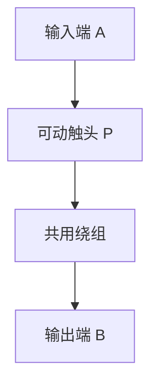

# 变压器

> [!abstract] 概览
> 变压器是利用电磁感应（互感原理）改变交流电压的装置，由==原线圈==（初级线圈）、==副线圈==（次级线圈）和==铁芯==三部分组成。理想变压器满足三条假设：无漏磁、无铜损、无铁损，从而有 $U_1:U_2=n_1:n_2$（变压原理）、$P_1=P_2$（功率守恒），由此推得 $I_1:I_2=n_2:n_1$（变流原理）。理解变压器最关键的是"==因果关系=="——原线圈电压 $U_1$ 决定副线圈电压 $U_2$（输入决定输出），副线圈电流 $I_2$ 决定原线圈电流 $I_1$（输出决定输入）。多副线圈满足 $P_1=P_2+P_3+\cdots$。变压器是 [[04-远距离输电]] 实现高压输电的核心元件，电压互感器、电流互感器、自耦变压器是其重要应用。

## 核心概念

### 构造

- **原线圈（初级）**：与交流电源相连，匝数 $n_1$，输入电压 $U_1$，输入电流 $I_1$。
- **副线圈（次级）**：与负载相连，匝数 $n_2$，输出电压 $U_2$，输出电流 $I_2$。
- **铁芯**：用涂有绝缘漆的硅钢片叠成，提供闭合磁路，使磁感线几乎全部集中在铁芯中。

### 理想变压器的基本假设

| 假设 | 含义 | 后果 |
| :---: | :---: | :---: |
| 无漏磁 | 所有磁感线全部通过原副线圈 | $\Phi_1=\Phi_2$，每匝电动势相同 |
| 无铜损 | 线圈电阻为零 | 不产生焦耳热损耗 |
| 无铁损 | 铁芯无涡流、无磁滞损耗 | 铁芯不发热 |

**理想变压器功率关系**：$P_1=P_2$（输入功率等于输出功率）。

### 变压原理

由互感原理（见 [[04-电磁感应/04-自感与互感]]）：原线圈中交变电流在铁芯中产生交变磁通，该磁通同时穿过原副线圈，每匝产生的感应电动势相同。

$$\frac{U_1}{U_2} = \frac{n_1}{n_2}$$

- $n_1 > n_2$：降压变压器
- $n_1 < n_2$：升压变压器

### 变流原理

由功率守恒 $P_1=P_2$，即 $U_1 I_1 = U_2 I_2$，得：

$$\frac{I_1}{I_2} = \frac{n_2}{n_1} = \frac{U_2}{U_1}$$

==电流比是电压比的倒数==。

### 多副线圈情形

设原线圈匝数 $n_1$，副线圈有多个，匝数分别为 $n_2, n_3, \ldots$，则：

- 电压关系：$\dfrac{U_1}{n_1} = \dfrac{U_2}{n_2} = \dfrac{U_3}{n_3} = \cdots$（每个副线圈电压仍由匝数决定）
- 功率关系：$P_1 = P_2 + P_3 + \cdots$，即 $U_1 I_1 = U_2 I_2 + U_3 I_3 + \cdots$
- 电流关系：不能简单写 $I_1:I_2:n_3$，要用功率守恒解出 $I_1$。

### 因果关系（重点）

> [!important] 变压器的"因果链"
> **输入端决定输出端电压**：$U_1$（输入电压）→ 决定 $U_2$（输出电压，$U_2=\dfrac{n_2}{n_1}U_1$）。
> 
> **输出端决定输入端电流**：$I_2$（由负载 $R$ 决定，$I_2=\dfrac{U_2}{R}$）→ 决定 $I_1$（$I_1=\dfrac{n_2}{n_1}I_2$）。
> 
> 即：电压"从前往后传"，电流"从后往前要"。

这条因果链是理解变压器所有"动态分析"题的钥匙——负载变化时，先看 $I_2$ 怎么变，再看 $I_1$ 怎么变；电源电压变化时，先看 $U_2$ 怎么变，再看 $I_2$ 和 $I_1$。

## 推导与原理

### 变压原理的推导

设原线圈接交流电源 $u_1=U_{1m}\sin(\omega t)$，原线圈交变电流在铁芯中产生交变磁通 $\Phi=\Phi_m\sin(\omega t+\varphi)$。理想情况下无漏磁，$\Phi$ 同时穿过原、副线圈每匝。

由法拉第电磁感应定律：

$$e_1 = -n_1 \frac{d\Phi}{dt}, \quad e_2 = -n_2 \frac{d\Phi}{dt}$$

两式相除：

$$\frac{e_1}{e_2} = \frac{n_1}{n_2}$$

理想变压器无内阻、无损耗，端电压等于感应电动势：$u_1=e_1$，$u_2=e_2$，故：

$$\frac{U_1}{U_2} = \frac{n_1}{n_2}$$

其中 $U_1$、$U_2$ 为有效值。$\square$

### 变流原理的推导

理想变压器无任何能量损耗（无铜损、无铁损、无漏磁），由能量守恒：

$$P_\text{输入} = P_\text{输出} \Rightarrow U_1 I_1 = U_2 I_2$$

代入 $U_1 = \dfrac{n_1}{n_2}U_2$：

$$\frac{n_1}{n_2} U_2 \cdot I_1 = U_2 I_2 \Rightarrow \frac{I_1}{I_2} = \frac{n_2}{n_1}$$

可见匝数多的一侧电流小，匝数少的一侧电流大——这正好对应"高压侧电流小、低压侧电流大"。$\square$

### 多副线圈功率关系推导

若有 $k$ 个副线圈，由能量守恒：

$$P_1 = P_2 + P_3 + \cdots + P_k$$

即：

$$U_1 I_1 = \sum_{i=2}^{k} U_i I_i$$

注意：此时 $\dfrac{I_1}{I_2}=\dfrac{n_2}{n_1}$ **不再成立**！必须用功率守恒方程解 $I_1$。

> [!warning] 易错提示
> 多副线圈情形下，电压比仍满足 $\dfrac{U_i}{n_i}=\dfrac{U_1}{n_1}$，但电流比不能用简单的反比关系。许多同学在此栽跟头。

## 典型实例与类比

### 生活实例

- **手机充电器**：内部含高频变压器，把 220 V 交流降到几伏再整流为直流。手机充电器要求轻便，故采用高频（几十 kHz）以减小变压器体积——频率越高，相同磁通所需的匝数越少。
- **电力变压器**：变电站里常见的大型油浸式变压器，把 10 kV 配电电压升到 110 kV、220 kV、500 kV 甚至 1000 kV 用于远距离输电（见 [[04-远距离输电]]）。
- **微波炉变压器**：把 220 V 升到 2000 V 左右供磁控管使用，是常见的"升压变压器"实例。
- **电蚊拍、电击灭蝇灯**：内部用升压变压器把几伏电池电压升到上千伏，产生电击效果。

### 类比

- **齿轮传动**：变压器类比齿轮组——主动轮（原线圈）齿数 $n_1$，从动轮（副线圈）齿数 $n_2$。$n_1>n_2$ 相当于"小齿轮带动大齿轮"，转速（电压）降低但扭矩（电流）增大——反之亦然。电压与电流的"反比关系"对应力与速度的"反比关系"。
- **水管变径**：粗水管（高压低流）经"变径"接细水管（低压高流），流量守恒类比功率守恒。

### 应用：互感器

**电压互感器（PT）**：把高压变成低压供测量。原线圈并联在高压线路中（$n_1$ 匝很多），副线圈接电压表（$n_2$ 匝很少）。变比 $K=\dfrac{U_1}{U_2}=\dfrac{n_1}{n_2}$。副线圈额定电压通常为 100 V。

**电流互感器（CT）**：把大电流变成小电流供测量。原线圈串联在被测线路中（$n_1$ 匝很少，常为 1 匝即"穿心式"），副线圈接电流表（$n_2$ 匝很多）。变比 $K=\dfrac{I_1}{I_2}=\dfrac{n_2}{n_1}$。副线圈额定电流通常为 5 A 或 1 A。

> [!warning] 互感器安全
> 电压互感器副线圈==严禁短路==（否则原线圈被短路）；电流互感器副线圈==严禁开路==（否则原线圈大电流产生的磁通无法被副线圈抵消，铁芯饱和过热，并在副线圈两端产生高压击穿绝缘）。两者副线圈与铁芯都要接地以保证人身安全。

### 自耦变压器

**自耦变压器**：原副线圈共用一部分绕组，结构上只有一个线圈带中间抽头。

特点：
- 可连续调压（滑动触头）：调压器是典型自耦变压器
- 比双绕组变压器省铜、效率高
- 缺点：原副线圈不隔离，副线圈故障会直接影响原线圈，安全性较差
- 在 [[04-远距离输电]] 的大型电力系统中，自耦变压器用于 500 kV 与 220 kV 等超高压电网间联络

### 变压器与分压电路比较

| 比较项 | 变压器 | 滑动变阻器分压 |
| :---: | :---: | :---: |
| 工作原理 | 电磁感应（互感） | 电阻分压（欧姆定律） |
| 适用电流 | 仅交流 | 交流、直流均可 |
| 能量损耗 | 理想情况无损耗 | 滑动电阻上消耗电能 |
| 输出电压范围 | $0 \sim \dfrac{n_2}{n_1}U_1$ | $0 \sim U_1$ |
| 大功率适用 | 适合 | 不适合（发热严重） |

> [!tip] 记忆口诀
> 匝数决定电压比，原压决定副压出；
> 功率守恒是核心，输出电流要输入；
> 因果关系要分清，U1 决 U2，I2 决 I1；
> 多副线圈功率和，电压比仍用匝数；
> 互感器接法不一样，电压并联流串联。

## 例题

### 例 1：理想变压器基本计算

**题目**：一理想变压器原线圈 $n_1=1100$ 匝，接 $U_1=220\text{ V}$ 交流电源；副线圈 $n_2=50$ 匝，接 $R=5\,\Omega$ 的负载电阻。求：
（1）副线圈电压 $U_2$、电流 $I_2$；
（2）原线圈电流 $I_1$；
（3）输入功率 $P_1$ 与输出功率 $P_2$。

**分析**：用变压比、变流比、功率守恒依次求解。

**解答**：
（1）$\dfrac{U_1}{U_2}=\dfrac{n_1}{n_2}\Rightarrow U_2=\dfrac{n_2}{n_1}U_1=\dfrac{50}{1100}\times 220=10\text{ V}$

$$I_2=\frac{U_2}{R}=\frac{10}{5}=2\text{ A}$$

（2）$\dfrac{I_1}{I_2}=\dfrac{n_2}{n_1}\Rightarrow I_1=\dfrac{n_2}{n_1}I_2=\dfrac{50}{1100}\times 2=\dfrac{1}{11}\approx 0.091\text{ A}$

（3）$P_1=U_1 I_1=220\times \dfrac{1}{11}=20\text{ W}$；$P_2=U_2 I_2=10\times 2=20\text{ W}$。验证 $P_1=P_2$，符合功率守恒。

**点评**：理想变压器题目"四步走"——匝数比、电压比、电流比、功率守恒。计算时留意单位与有效值。

### 例 2：多副线圈功率分析

**题目**：一理想变压器有两组副线圈，原线圈 $n_1=1000$ 匝，接 $U_1=220\text{ V}$。副线圈 $n_2=50$ 匝接 $R_2=10\,\Omega$，副线圈 $n_3=100$ 匝接 $R_3=20\,\Omega$。求原线圈电流 $I_1$ 与变压器输入功率 $P_1$。

**分析**：先用电压比求 $U_2$、$U_3$，再分别求 $I_2$、$I_3$，最后用 $P_1=P_2+P_3$ 求 $I_1$。

**解答**：
$$U_2=\frac{n_2}{n_1}U_1=\frac{50}{1000}\times 220=11\text{ V},\quad U_3=\frac{n_3}{n_1}U_1=\frac{100}{1000}\times 220=22\text{ V}$$

$$I_2=\frac{U_2}{R_2}=\frac{11}{10}=1.1\text{ A},\quad I_3=\frac{U_3}{R_3}=\frac{22}{20}=1.1\text{ A}$$

$$P_2=U_2 I_2=11\times 1.1=12.1\text{ W},\quad P_3=U_3 I_3=22\times 1.1=24.2\text{ W}$$

$$P_1=P_2+P_3=36.3\text{ W},\quad I_1=\frac{P_1}{U_1}=\frac{36.3}{220}\approx 0.165\text{ A}$$

**点评**：多副线圈不能用 $I_1:I_2:n_3$ 的反比公式！必须用功率守恒。本题也可注意到 $R_2=10\,\Omega$ 与 $R_3=20\,\Omega$ 中 $I_2=I_3=1.1\text{ A}$ 巧合，但 $P_3=2P_2$ 体现"高电压副线圈承担大功率"。

### 例 3：动态分析——负载变化

**题目**：理想变压器原线圈接电压恒定的交流电源，副线圈接可变电阻 $R$。当 $R$ 阻值减小时，分析以下各量的变化：$U_2$、$I_2$、$P_2$、$I_1$、$P_1$。

**分析**：紧扣因果链——$U_1$ 不变则 $U_2$ 不变；$R$ 减小则 $I_2$ 增大；$I_2$ 增大则 $P_2$ 增大；$P_2$ 增大则 $P_1$ 增大；$P_1$ 增大且 $U_1$ 不变则 $I_1$ 增大。

**解答**：
- $U_1$ 恒定 → $U_2=\dfrac{n_2}{n_1}U_1$ ==不变==
- $R$ 减小 → $I_2=\dfrac{U_2}{R}$ ==增大==
- $P_2=U_2 I_2$ → ==增大==
- $P_1=P_2$ → ==增大==
- $I_1=\dfrac{P_1}{U_1}$（或 $I_1=\dfrac{n_2}{n_1}I_2$）→ ==增大==

**点评**：动态分析是高考热点。常用思路：先确定不变的量（输入电压 $U_1$、匝数比），再顺着"输入→输出→输出电流→输入电流"的因果链一步步推。注意区分"电压由输入决定"与"电流由输出决定"。

## 易错提醒

> [!warning] 易错点
> 1. **变压器只对交流工作**：直流电无法产生交变磁通，副线圈无电压输出。把直流电接入变压器原线圈，瞬间有变化磁通（产生感应电动势），稳态后副线圈输出为零；原线圈在稳态下相当于"短路"（仅有铜阻），可能烧毁。
> 2. **因果倒置**：误以为 $I_1$ 决定 $I_2$——实际是负载决定 $I_2$，$I_2$ 反向决定 $I_1$。
> 3. **多副线圈乱用电流比**：只有单一副线圈才有 $I_1:I_2=n_2:n_1$；多副线圈必须用功率守恒。
> 4. **理想 vs 实际**：实际变压器有漏磁、铜损、铁损，效率小于 100%；高考除非说明"理想"，否则要考虑损耗（一般仍按理想处理）。
> 5. **副线圈开路**：副线圈断开（无负载）时 $I_2=0$，$P_2=0$，则 $I_1\approx 0$（仅励磁电流），但 $U_2$ 仍由匝数比决定——并非"无电流就无电压"。
> 6. **互感器接法**：电压互感器原边并联、副边短路危险；电流互感器原边串联、副边开路危险。

> [!note] 概念辨析
> - 与 [[01-交流电的产生与描述]] 的关系：变压器的输入输出电压、电流均用有效值；变压器只对交流工作，因为只有变化的磁通才能产生互感电动势。
> - 与 [[02-电感电容与交流电]] 的关系：变压器原线圈本身是一个电感，但铁芯的存在使它"集中磁通"，从而高效地实现互感；理想变压器不消耗有功功率。
> - 与 [[04-远距离输电]] 的关系：变压器是远距离高压输电的关键元件——升压变压器提升电压以减少线路损耗，降压变压器把电压降到用户安全等级。
> - 与 [[04-电磁感应/04-自感与互感]] 的关系：变压器原理本质是互感现象；铁芯的作用是增强耦合系数使漏磁趋近于零。
> - 大学层面延伸：[[电磁学]] 中将引入实际变压器等效电路（漏感、激磁电感、铁损电阻等），分析非理想特性。
> - 跨学科：电力系统（变压器并列运行、有载调压）、电力电子（高频开关电源变压器）、磁路设计（铁芯材料选型）。

## 作者的话

> [!quote] 个人理解
> 变压器最容易被忽视的是"==因果关系=="。许多同学觉得 $U_1 I_1 = U_2 I_2$ 是一个等式，两边对称，那"谁决定谁"不就无所谓了吗？错了。物理上输入电压是"主动施加"的——你把 220 V 电源接上去，原线圈就被强制加上了 220 V；而输出电流是"被动消耗"的——负载需要多少电流，副线圈就被迫供给多少，副线圈再通过磁耦合"反过来要求"原线圈提供相应的电流。
>
> 这种"输入决定电压，输出决定电流"的非对称性，是变压器动态分析的灵魂。一旦理解了这一点，所有"负载变化引起 $I_1$ 变化"的题都能秒解。
>
> 学习建议：把因果链画成流程图，写在草稿纸上——$U_1\to U_2\to I_2\to P_2\to P_1\to I_1$。每次遇到动态分析题，沿这条链依次判断"谁变谁不变"，几乎不会出错。
>
> 扩展思考：变压器原线圈在副线圈开路时是否消耗电能？理想情况下，副线圈开路时 $I_2=0$，$P_2=0$，故 $P_1=0$，原线圈电流为零——但实际变压器即使空载也有微小"励磁电流"建立磁通，消耗少量电能。这就是"理想"与"实际"的差距。

---
*返回 [[00-电学总览]]*
