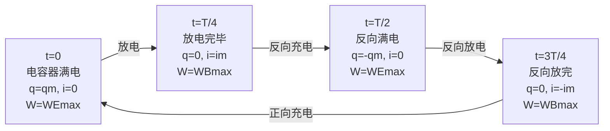

# 电磁振荡与电磁波

> [!abstract] 概览
> 本节是电磁学的"高潮章节"——将电场与磁场统一为一个动态整体。LC 振荡电路中，电容器贮存的电场能与电感线圈贮存的磁场能相互转换，形成周期性振荡，振荡周期 $T=2\pi\sqrt{LC}$。麦克斯韦敏锐地洞察到"变化的磁场产生电场、变化的电场产生磁场"两大原理，预言电磁波的存在并以光速传播；赫兹用实验证实了这一预言。电磁波是横波，传播不需介质，可被调制（调幅/调频/调相）发射、调谐接收、解调还原。本节是 [[02-电磁波谱]] 与 [[03-传感器]] 的理论基础，也是大学 [[电磁学]] 中麦克斯韦方程组的入门。

## 核心概念

### 一、LC 振荡电路

**定义**：由电感线圈 $L$ 和电容器 $C$ 组成的电路，能在没有外加电源的情况下产生周期性变化的振荡电流，称为 LC 振荡电路。

**物理图景**：先给电容器充电，电容器贮存电场能；放电时，电流通过电感线圈，电感线圈贮存磁场能；电流变化又反过来对电容器反向充电；如此循环往复，电场能 $\leftrightarrow$ 磁场能不断转换。

**能量转换对应关系**（==重点==）：

| 物理量 | 电容器极板 | 电感线圈 |
| :---: | :---: | :---: |
| 贮存的能量 | 电场能 $W_E=\dfrac{q^2}{2C}$ | 磁场能 $W_B=\dfrac{Li^2}{2}$ |
| 关联变量 | 电量 $q$、电压 $u$ | 电流 $i$ |
| 能量最大时刻 | $q$ 最大（满充电） | $i$ 最大（放电完毕瞬间） |
| 能量为零时刻 | $q=0$（放电完毕） | $i=0$（充电完毕瞬间） |

> [!note] 关键辨析
> 电场能贮存在==电容器==中，由电量 $q$ 决定；磁场能贮存在==电感线圈==中，由电流 $i$ 决定。$q$ 最大时 $i$ 为零，$i$ 最大时 $q$ 为零——两者此消彼长，总量守恒（不计损耗时）$W_E+W_B=\text{常数}$。这与单摆的"势能↔动能"高度类似。

### 二、振荡周期与频率

**周期公式**（==必背==）：

$$T = 2\pi\sqrt{LC}$$

$$f = \dfrac{1}{T} = \dfrac{1}{2\pi\sqrt{LC}}$$

其中 $L$ 为电感（单位 H），$C$ 为电容（单位 F）。

**关键性质**：周期只由 $L$、$C$ 决定，与充电电量、振荡幅度==无关==——这是"固有频率"的本质。类比单摆周期只由摆长 $l$ 和 $g$ 决定，与振幅无关。

### 三、麦克斯韦电磁场理论

两大支柱（==核心==）：

1. **变化的磁场产生电场**：磁场随时间变化时，在其周围空间激发涡旋电场。这是 [[04-电磁感应/02-法拉第电磁感应定律]] 的本质。
2. **变化的电场产生磁场**：电场随时间变化时，在其周围空间激发磁场——这一条是麦克斯韦的独创，是位移电流假说的物理基础。

**"变化"二字的层次**（==易错==）：

| 磁场变化情况 | 产生的电场 |
| :---: | :---: |
| 不变化（恒定） | 不产生电场 |
| 均匀变化（$\dfrac{dB}{dt}$ 为常数） | 产生==稳恒==电场 |
| 非均匀变化（如周期性变化） | 产生==变化==的电场 |

电场变化情况同理。只有"非均匀变化"才能产生相互激发、自持传播的电磁波。

> [!tip] 记忆口诀
> "场变生场，均匀生稳，非匀生变，变变生波。"——均匀变化产生稳态场，非均匀变化产生变化场，相互非均匀变化才能形成电磁波。

### 四、电磁波的产生

**开放电路**：LC 振荡电路虽能产生振荡电流，但电场和磁场主要集中在电容器和线圈内部，辐射效率极低。将电容器的极板"打开"——减小正对面积、增大间距、甚至以天线代替极板，使电场散布到广阔空间，电磁波才能有效辐射。

**产生条件**：
1. 高频振荡（频率越高辐射越强）
2. 开放电路（场分布到空间）

### 五、电磁波的特点

1. **横波**：电场 $E$、磁场 $B$、传播方向 $v$ 两两垂直，构成右手螺旋关系。$E$ 与 $B$ 同相位。
2. **传播不需介质**：电磁波可在真空中传播，不像机械波需要弹性介质。
3. **光速传播**：真空中 $c=3\times 10^8\text{ m/s}$，介质中 $v=c/n$。
4. **携带能量与动量**：电磁辐射具有能量（如阳光温暖大地）与动量（光压）。
5. **满足 $c=\lambda f$**：频率与波长成反比。
6. **能发生反射、折射、干涉、衍射、偏振**等波的一切现象。

### 六、赫兹实验

**装置**：感应圈给发射器（两个金属球间隙）供电，间隙产生火花放电，辐射电磁波；远处接收器（环形铜线留有间隙）调到相同长度时，间隙也产生火花。

**意义**：首次实验证实麦克斯韦的预言——电磁波真实存在、以有限速度传播、能发生反射、折射、干涉、偏振。从此"光是一种电磁波"得到实验支撑。

### 七、电磁波的发射与接收

**发射——调制**：将低频的"信号"（声音、图像）"搭载"到高频载波上。

| 调制方式 | 英文 | 操作 |
| :---: | :---: | :---: |
| 调幅 AM | Amplitude Modulation | 载波==振幅==随信号变化 |
| 调频 FM | Frequency Modulation | 载波==频率==随信号变化 |
| 调相 PM | Phase Modulation | 载波==相位==随信号变化 |

**接收**：
- **调谐**：使接收电路的固有频率等于所需电磁波频率（发生电谐振），从众多信号中"选出"目标电台。公式 $f=\dfrac{1}{2\pi\sqrt{LC}}$，常通过调节 $C$（可变电容器）实现。
- **解调**：从接收到的已调波中还原出原始信号（检波是调幅波的解调）。

### 八、无线电波的传播方式

| 方式 | 适用波段 | 特点 |
| :---: | :---: | :---: |
| 地波 | 中长波 | 沿地表绕射，稳定但衰减快 |
| 天波 | 短波 | 经电离层反射实现远距离，受昼夜季节影响 |
| 空间波 | 微波/超短波 | 视距传播，直线传，需中继或卫星 |

## 推导与原理

### 一、LC 振荡周期推导

设某时刻电容器极板电量为 $q$，回路电流为 $i$。对回路应用基尔霍夫电压定律（不计电阻）：

$$u_C + u_L = 0$$

即：

$$\dfrac{q}{C} + L\dfrac{di}{dt} = 0$$

又 $\dfrac{dq}{dt}=-i$（放电时 $q$ 减小），故 $i=-\dfrac{dq}{dt}$，$\dfrac{di}{dt}=-\dfrac{d^2q}{dt^2}$。代入：

$$\dfrac{q}{C} - L\dfrac{d^2q}{dt^2} = 0 \Rightarrow \dfrac{d^2q}{dt^2} + \dfrac{1}{LC}q = 0$$

这是简谐运动方程，角频率 $\omega=\dfrac{1}{\sqrt{LC}}$，故：

$$\boxed{T = \dfrac{2\pi}{\omega} = 2\pi\sqrt{LC}}$$

### 二、电磁波的传播速度

由麦克斯韦方程组可推出真空中电磁波速度：

$$c = \dfrac{1}{\sqrt{\mu_0 \varepsilon_0}} \approx 3\times 10^8\text{ m/s}$$

其中 $\mu_0$ 为真空磁导率，$\varepsilon_0$ 为真空介电常数。==这一速度恰好等于光速==——麦克斯韦据此断言"光是一种电磁波"。

### 三、LC 振荡能量转换图

## 典型实例与类比

> [!example] 生活实例
> 1. **收音机选台**：旋转旋钮改变可变电容器的电容 $C$，使接收回路固有频率 $f=\dfrac{1}{2\pi\sqrt{LC}}$ 等于目标电台的载波频率——这就是调谐。
> 2. **手机通信**：手机信号是微波，频率约 900 MHz～2.4 GHz，通过空间波直线传播，基站负责中继转发。
> 3. **微波炉**：利用 2.45 GHz 微波使食物中水分子高频振动产生热量——这是电磁波携带能量的直接证据。
> 4. **无线电广播**：中波（AM）用调幅、地波天波并用；调频广播（FM）用调频、空间波传播，音质更好但覆盖范围小。

**类比**：
- LC 振荡 ↔ 单摆：电容器极板"高电位"对应摆球"高位置"；电流对应摆球速度；电场能↔势能、磁场能↔动能。
- 电磁波传播 ↔ 喷泉涟漪：源处扰动让水面波动外传，但水分子只在原地附近振动——电磁场中的"扰动"以波的形式外传，能量随之传播。

## 例题

### 例 1：LC 振荡周期与能量转换

**题目**：某 LC 振荡电路中 $L=2.5\text{ mH}$，$C=4\text{ μF}$。求振荡周期 $T$ 与频率 $f$；并求 $t=0$ 时电容器满电 $q_m=Cu_m$，则 $t=\dfrac{T}{4}$ 时回路中电流达到最大值，此时电场能 $W_E$ 与磁场能 $W_B$ 各为多少？（不计损耗）

**分析**：直接套周期公式。能量守恒：满电时全部为电场能 $W=\dfrac{q_m^2}{2C}=\dfrac{Cu_m^2}{2}$；$t=T/4$ 放电完毕，全部转为磁场能。

**解答**：

$$T = 2\pi\sqrt{LC} = 2\pi\sqrt{2.5\times 10^{-3}\times 4\times 10^{-6}} = 2\pi\times 10^{-4}\text{ s} \approx 6.28\times 10^{-4}\text{ s}$$

$$f = \dfrac{1}{T} \approx 1.59\times 10^3\text{ Hz} = 1.59\text{ kHz}$$

$t=\dfrac{T}{4}$ 时 $q=0$，$W_E=0$；$i=i_m$，$W_B=\dfrac{Li_m^2}{2}=\dfrac{q_m^2}{2C}$（能量守恒）。

**点评**：周期公式必背；"电容器满电时电场能最大"与"放电完毕时磁场能最大"对应清晰即可。

### 例 2：麦克斯韦理论辨析

**题目**：下列关于变化的场产生场的说法正确的是（  ）。
A. 恒定磁场周围存在电场
B. 均匀变化的磁场产生稳定的涡旋电场
C. 均匀变化的电场产生均匀变化的磁场
D. 非均匀变化的磁场产生稳恒电场

**分析**：关键是"变化方式"决定"产生什么场"。恒定磁场不产生电场；均匀变化磁场产生==稳恒==电场；均匀变化电场产生==稳恒==磁场（不是均匀变化的磁场）；非均匀变化磁场产生==变化==的电场。

**解答**：选 B。

A 错：恒定磁场不产生电场。C 错：均匀变化电场产生稳恒磁场，稳恒磁场不再产生电场。D 错：非均匀变化产生的是变化的电场。

**点评**：把"变化层级"画成树状：恒定→（无）；均匀变化→稳恒；非均匀变化→变化。只有"非均匀↔非均匀"相互激发才能形成电磁波。

### 例 3：电磁波调谐

**题目**：收音机调谐电路中线圈电感 $L=300\text{ μH}$，欲接收频率 $f=1.0\text{ MHz}$ 的电台，求可变电容器应调到的电容 $C$。

**分析**：调谐即令回路固有频率等于电台频率，由 $f=\dfrac{1}{2\pi\sqrt{LC}}$ 求 $C$。

**解答**：

$$C = \dfrac{1}{4\pi^2 L f^2} = \dfrac{1}{4\pi^2 \times 300\times 10^{-6}\times (1.0\times 10^6)^2}$$

$$C \approx \dfrac{1}{4\times 9.87\times 300\times 10^{-6}\times 10^{12}} \approx 8.45\times 10^{-11}\text{ F} \approx 84.5\text{ pF}$$

**点评**：调谐电路"选台"的本质是改变 $LC$ 乘积使固有频率匹配，这是 LC 振荡周期公式的典型应用。

## 易错提醒

> [!warning] 易错点
> 1. **能量对应不清**：电场能对应电容器（$q$ 大电场能大），磁场能对应电感线圈（$i$ 大磁场能大）；$q$ 与 $i$ 此消彼长。
> 2. **周期公式记反**：$T=2\pi\sqrt{LC}$，不是 $\sqrt{LC}$ 也不是 $2\pi LC$；单位 $L$ 用 H，$C$ 用 F。
> 3. **变化层级混淆**：均匀变化产生稳恒场；非均匀变化才产生变化场。"变化"二字不能丢。
> 4. **调制 vs 调谐**：发射端"调制"是搭载信号；接收端"调谐"是选台；"解调"是还原信号——三者顺序别混。
> 5. **电磁波 vs 机械波**：电磁波不需介质、真空可传；机械波必须介质、真空不能传。但两者都满足 $v=\lambda f$、都能干涉衍射。
> 6. **稳恒电场 vs 静电场**：稳恒电场由均匀变化磁场产生，是有旋（涡旋）场；静电场由静止电荷产生，是无旋场——二者本质不同。

> [!note] 概念辨析
> - **电场 vs 磁场**：电场由电荷产生（或由变化磁场激发），对电荷施力；磁场由运动电荷（或变化电场）产生，对运动电荷施力。
> - **涡旋电场 vs 静电场**：前者由变化磁场激发，电场线闭合，做功与路径有关；后者由电荷激发，电场线起止于电荷，做功与路径无关。
> - **位移电流 vs 传导电流**：位移电流由变化电场产生，不涉及电荷定向移动；传导电流由电荷定向移动产生。两者都能产生磁场——这正是麦克斯韦的洞见。

## 与其他知识关联

- 与 [[02-电磁波谱]] 的关系：电磁波按波长（频率）排列即得到电磁波谱，本节讨论电磁波的"共性"，波谱讨论"个性"。
- 与 [[03-传感器]] 的关系：传感器的电学量输出常以电磁波形式无线传输（如 RFID、Wi-Fi 传感器）。
- 与 [[04-电磁感应/01-磁通量与电磁感应现象]] 的关系：电磁波理论建立在电磁感应基础上，"变化的磁场产生电场"正是法拉第定律的本质。
- 与 [[04-电磁感应/04-自感与互感]] 的关系：LC 振荡中的电感线圈即自感元件，自感电动势 $e=-L\dfrac{di}{dt}$ 是振荡得以持续的内部"反作用"。
- 与 [[05-交变电流/01-交流电的产生与描述]] 的关系：LC 振荡产生的是高频交流电；交流电理论中的角频率 $\omega$ 与振荡角频率 $\omega=\dfrac{1}{\sqrt{LC}}$ 一脉相承。
- 与 [[03-磁场/03-洛伦兹力]] 的关系：电磁波中的磁场对运动电荷施以洛伦兹力，是无线电波与带电粒子相互作用的微观基础。
- 与 [[01-静电场/04-电容器与电容]] 的关系：LC 振荡电路中的电容器就是平板电容器，$C=\dfrac{\varepsilon S}{d}$ 决定其容量，进而影响周期 $T$。
- 大学层面延伸：[[电磁学]] 中的麦克斯韦方程组（四个方程统一电场磁场）、[[物理光学]] 中光的电磁说、[[量子电动力学]] 中电磁相互作用的量子化。
- 跨学科：与化学（光谱分析）、信息技术（无线通信）、天文学（射电望远镜）的联系。

## 作者的话

> [!quote] 个人理解
> 学电磁波，最难跨越的坎是"变化的电场产生磁场"这一条。学生容易接受"变化的磁场产生电场"——毕竟法拉第已经做了实验；但"变化的电场产生磁场"似乎缺少直观对应。麦克斯韦的天才正在于此：他从对称性出发断言——既然变化的磁场能产生电场，那么变化的电场也应能产生磁场。这一对称性思考加上位移电流假说，使麦克斯韦方程组自洽，并自然导出电磁波以光速传播。
>
> 学习建议：把"LC 振荡→开放电路→电磁波→调制发射→调谐接收→解调还原"这条主线画成流程图。把"变化层级"画成树状图，区分恒定/均匀/非均匀。周期公式 $T=2\pi\sqrt{LC}$ 必须熟记，并体会它与单摆周期 $T=2\pi\sqrt{l/g}$ 形式上的统一——都是二阶线性微分方程的解。
>
> 扩展思考：如果宇宙中没有电荷（即无源情况），麦克斯韦方程组是否还存在解？答案是"有"——自由电磁波。这提示我们，电磁场是物质存在的一种独立形式，不必依附于电荷。

---
*返回 [[00-电学总览]]*
