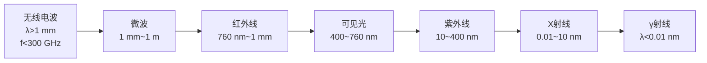

# 电磁波谱

> [!abstract] 概览
> 电磁波按波长（或频率）依次排列形成电磁波谱。从波长最长、频率最低的无线电波，到波长最短、频率最高的 γ 射线，七个波段——无线电波、微波、红外线、可见光、紫外线、X 射线、γ 射线——本质上都是电磁波，都满足 $c=\lambda f$，仅在频率（波长）上不同。各波段的产生机理呈现"尺度递进"：从电路振荡（宏观）→原子外层电子（原子尺度）→原子内层电子→原子核（核尺度）。本节承接 [[01-电磁振荡与电磁波]]，并为 [[03-传感器]]（红外、光电传感）提供物理基础。

## 核心概念

### 一、电磁波谱总览

按波长由长到短（频率由低到高）排列：

> [!tip] 记忆口诀
> "电磁波谱顺序记：==无微红可紫 X γ=="——无线电波、微波、红外线、可见光、紫外线、X 射线、γ 射线。波长依次变短，频率依次升高，能量依次增大。

### 二、各波段产生机理（尺度递进）

| 波段 | 产生机理 | 物理尺度 |
| :---: | :---: | :---: |
| 无线电波 | ==LC 振荡电路==中自由电子的周期性运动 | 宏观电路 |
| 微波 | 速调管、磁控管等微波器件中电子的受激振荡 | 宏观器件 |
| 红外线 | 原子的==外层电子==跃迁、分子振动转动能级 | 原子外层 |
| 可见光 | 原子的==外层电子==跃迁 | 原子外层 |
| 紫外线 | 原子的==外层电子==跃迁（能量更高） | 原子外层 |
| X 射线 | 原子的==内层电子==受高速电子撞击后跃迁 | 原子内层 |
| γ 射线 | ==原子核衰变==或核反应 | 原子核 |

> [!note] 尺度递进
> 产生机理从"==电路==→==原子外层==→==原子内层==→==原子核=="逐级深入微观，对应频率从低到高、能量从小到大。这一递进关系是高考高频考点。

### 三、各波段特性与应用

#### 1. 无线电波（λ > 1 mm）

- **特性**：波长长、频率低、衍射强、能量低
- **应用**：无线电广播（中波 AM、调频 FM）、电视、电报、导航、移动通信
- **传播**：地波（中长波）、天波（短波经电离层反射）、空间波（超短波/微波直射）

#### 2. 微波（λ：1 mm ~ 1 m）

- **特性**：频率高、信息容量大、能穿透电离层、被水分子吸收
- **应用**：
  - ==微波炉==：2.45 GHz 微波使水分子共振发热（电磁波能量直接转化为内能）
  - ==雷达==：利用微波直线传播、反射测定目标位置（$s=\dfrac{ct}{2}$）
  - 卫星通信：穿透电离层实现地星通信
  - Wi-Fi、蓝牙、5G

#### 3. 红外线（λ：760 nm ~ 1 mm）

- **特性**：热效应显著、穿透云雾能力强、不可见
- **应用**：
  - ==红外热像仪==：检测物体温度分布（夜视、医学测温、工业探伤）
  - 红外遥控（电视、空调遥控器）
  - 红外摄影、红外夜视仪
  - 红外加热（烤箱、取暖器）

#### 4. 可见光（λ：400 ~ 760 nm）

- **特性**：人眼可感知、能引发视觉化学反应
- **七色光谱**（波长由长到短）：==红橙黄绿青蓝紫==

| 颜色 | 大致波长范围 |
| :---: | :---: |
| 红 | 620~760 nm |
| 橙 | 590~620 nm |
| 黄 | 570~590 nm |
| 绿 | 500~570 nm |
| 青 | 460~500 nm |
| 蓝 | 430~460 nm |
| 紫 | 400~430 nm |

- **应用**：照明、光纤通信（激光在光纤中全反射传播）、摄影、显示技术

> [!note] 可见光 vs 不可见光
> "可见"与"不可见"只是==人眼视网膜的生理响应范围==决定的，物理本质并无不同。红外、紫外、X、γ 与可见光同是电磁波，只是频率不同。

#### 5. 紫外线（λ：10 ~ 400 nm）

- **特性**：化学效应强、荧光效应、杀菌消毒
- **应用**：
  - ==杀菌消毒==：破坏微生物 DNA 结构（医用、饮水处理）
  - ==荧光效应==：验钞机、荧光灯、紫外探伤
  - 促进合成维生素 D（适量日晒）
- **注意**：过强紫外线灼伤皮肤、引发白内障——防晒与臭氧层保护的重要意义

#### 6. X 射线（λ：0.01 ~ 10 nm）

- **特性**：穿透能力强、能使底片感光、使气体电离
- **应用**：
  - ==医学影像==：X 光透视、CT 断层扫描
  - 工业探伤（金属内部缺陷检测）
  - 晶体衍射（X 射线衍射分析物质结构）
- **注意**：过量照射损伤细胞，需铅板防护

#### 7. γ 射线（λ < 0.01 nm）

- **特性**：穿透能力极强、电离能力极强、能量极高
- **应用**：
  - ==医学治疗==：γ 刀手术（聚焦 γ 射线破坏肿瘤）
  - 医学器械灭菌
  - 工业探伤（厚壁金属检测）
  - 科学研究（放射性同位素示踪）
- **注意**：危害最大，需厚重铅或混凝土防护

### 四、各波段频率与波长关系

所有电磁波在真空中传播速度相同 $c=3\times 10^8\text{ m/s}$，满足：

$$c = \lambda f$$

故频率 $f$ 与波长 $\lambda$ 成反比：频率越高，波长越短，光子能量 $E=hf$ 越大（$h$ 为普朗克常量）。

> [!note] 三者关系
> $c$ 不变 → $\lambda \uparrow$ 则 $f \downarrow$；$\lambda \downarrow$ 则 $f \uparrow$。从无线电波到 γ 射线：波长减小、频率升高、能量增大、穿透力增强（一般而言）。

## 推导与原理

### 一、$c=\lambda f$ 的来源

电磁波是横波，电场 $E$ 与磁场 $B$ 同步以速度 $c$ 向前传播。在一个周期 $T$ 内，波传播的距离即为一个波长 $\lambda$：

$$\lambda = cT \Rightarrow c = \dfrac{\lambda}{T} = \lambda f$$

### 二、光子能量（拓展）

由普朗克能量子假说，电磁波的能量是量子化的，每个光子能量：

$$E = hf = \dfrac{hc}{\lambda}$$

其中 $h=6.63\times 10^{-34}\text{ J·s}$。故 γ 射线光子能量远大于无线电波光子——这解释了 γ 射线强杀伤力与无线电波安全性的本质。

## 典型实例与类比

> [!example] 生活实例
> 1. **微波炉加热**：2.45 GHz 微波频率与水分子振动频率接近，水分子剧烈共振产生热量。==不能用金属容器==（金属反射微波，可能烧毁磁控管）；玻璃、陶瓷可透过微波用于盛放食物。
> 2. **红外测温仪**：人体温度不同，红外辐射强度与频率分布不同（维恩位移定律），传感器接收红外强度反推温度。
> 3. **验钞机紫光**：紫外光激发纸币荧光油墨发光，肉眼可见荧光——这是荧光效应的典型应用。
> 4. **医院 X 光片**：骨骼密度大吸收 X 射线多，底片上呈白色；软组织吸收少呈黑色——利用穿透差异成像。
> 5. **γ 刀**：多束 γ 射线从不同方向聚焦于肿瘤位置，每束强度弱不足以伤及正常组织，但聚焦点剂量足以杀死癌细胞。

**类比**：电磁波谱如同"==同一条河的不同段落=="——源头处宽阔缓慢（无线电波），中游急流（可见光），下游咆哮入海（γ 射线），本质都是"水"（电磁场），只是"势能"（频率）不同。

## 例题

### 例 1：电磁波谱识别

**题目**：下列关于电磁波的产生机理说法正确的是（  ）。
A. 红外线由原子内层电子跃迁产生
B. X 射线由原子核衰变产生
C. 紫外线由原子外层电子跃迁产生
D. γ 射线由 LC 振荡电路产生

**分析**：记忆各波段产生机理的"尺度递进"：无线电波→LC 振荡；红外、可见、紫外→原子外层电子；X 射线→原子内层电子；γ 射线→原子核衰变。

**解答**：选 C。

A 错：红外线由原子外层电子跃迁产生。B 错：X 射线由原子内层电子跃迁产生。D 错：γ 射线由原子核衰变产生。

**点评**：尺度递进是核心考点——电路→外层→内层→核，对应频率从低到高。

### 例 2：波长频率换算

**题目**：某电台广播频率 $f=1.5\text{ MHz}$，求其波长 $\lambda$，并判断属于哪个波段。

**分析**：由 $c=\lambda f$ 求 $\lambda$，再按波段范围判断。

**解答**：

$$\lambda = \dfrac{c}{f} = \dfrac{3\times 10^8}{1.5\times 10^6} = 200\text{ m}$$

波长 200 m 在中波范围（波长 1 m ~ 1 km 量级），属于==无线电波==中的中短波段。

**点评**：$c=\lambda f$ 是基本运算；判断波段须熟记各波段大致波长范围。中波适合地波+天波传播，覆盖范围广，常用于中波广播。

## 易错提醒

> [!warning] 易错点
> 1. **波段顺序颠倒**：波长由长到短为"无微红可紫 X γ"，频率由低到高也是此序。波长长则频率低，不要搞反。
> 2. **产生机理混淆**：X 射线是==内层电子==、γ 射线是==原子核==——区分关键。
> 3. **可见光波长范围**：400~760 nm（有些教材用 400~770 nm），红光波长最长、紫光最短。
> 4. **c=λf 中的单位**：$\lambda$ 用 m，$f$ 用 Hz，$c=3\times 10^8$ m/s；换算 nm 时注意 $1\text{ nm}=10^{-9}\text{ m}$。
> 5. **微波 vs 无线电波**：微波属于无线电波的一种，但常单列——因其穿透电离层、与水分子作用等独特性质。
> 6. **荧光 vs 红外热像**：紫外激发荧光（光致发光）；红外热像不需外加光源，靠物体自身辐射。两者机理不同。

> [!note] 概念辨析
> - **可见光 vs 不可见光**：可见与否由人眼响应决定，物理本质相同。
> - **X 射线 vs γ 射线**：产生机理不同（内层电子 vs 原子核），但部分频段重叠，区分看来源。
> - **红外线 vs 微波**：红外线由原子外层电子跃迁产生，微波由宏观器件产生；两者频段相邻。
> - **紫外线 vs X 射线**：紫外线由外层电子跃迁，X 射线由内层电子跃迁——分界在"原子外层 vs 内层"。

## 与其他知识关联

- 与 [[01-电磁振荡与电磁波]] 的关系：本节讨论各波段"个性"，电磁波"共性"（横波、$c=\lambda f$、不需介质）见该节。
- 与 [[03-传感器]] 的关系：红外传感器、光电传感器、紫外火焰传感器等都基于本节各波段的物理特性。
- 与 [[04-电磁感应/01-磁通量与电磁感应现象]] 的关系：电磁波本质是变化电磁场的传播，建立在电磁感应理论之上。
- 与 [[01-静电场/02-电场与电场强度]] 的关系：电磁波中的电场分量遵循电场的基本性质。
- 与 [[03-磁场/01-磁场与磁感线]] 的关系：电磁波中的磁场分量遵循磁场的基本性质。
- 大学层面延伸：[[物理光学]] 中光的电磁说、光谱学；[[量子力学]] 中光子能量 $E=hf$、光电效应；[[原子物理]] 中原子能级与光谱发射。
- 跨学科：化学光谱分析（原子吸收/发射光谱）、生物医学影像（X 光、CT、PET）、信息技术（光纤通信、无线网络）。

## 作者的话

> [!quote] 个人理解
> 电磁波谱最迷人的地方在于"==统一中的多样性=="——七种波段看似天差地别（无线电波温吞、X 射线致命），但本质都是电磁场在空间的波动传播，只是频率不同。麦克斯韦方程组的伟大正在于此：一个方程组涵盖了从广播到伽马刀的所有现象。
>
> 学习建议：用一张大表横向对比七个波段——波长范围、产生机理、特性、典型应用，把"尺度递进"作为记忆主轴。注意 X 射线与 γ 射线频段有重叠，区分看==来源==而非纯粹波长。
>
> 扩展思考：人眼只能看到 400~760 nm 这一小段，蜜蜂能看到紫外，蛇类有红外感知——所谓"可见光"只是演化赋予我们的"窗口"。在更广阔的电磁波谱面前，人类的视觉只是沧海一粟。

---
*返回 [[00-电学总览]]*
