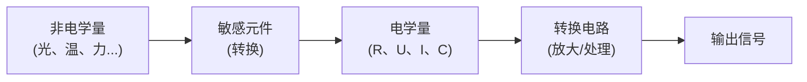

# 传感器

> [!abstract] 概览
> 传感器是将被测的==非电学量==（如光照、温度、压力、位移、磁场等）按一定规律转换为==电学量==（电压、电流、电阻、电容等）的器件或装置，是现代测量、控制与信息系统的"感觉器官"。本节系统介绍光敏电阻、热敏电阻（NTC/PTC）、霍尔元件、电容传感器、应变片等常见元件的原理与特性，并串联自动门、电饭锅、电子秤等生活实例。传感器是 [[01-电磁振荡与电磁波]]、[[02-电磁波谱]] 与 [[03-磁场/03-洛伦兹力]]、[[01-静电场/04-电容器与电容]] 等知识的综合应用，也是高考实验题的高频考点。

## 核心概念

### 一、传感器的定义与基本原理

**定义**：传感器是能感受规定的被测量，并按一定规律将其转换为电学量（或易于处理的电信号）输出的器件。

**基本原理**：利用物质的某种物理效应、化学效应或生物效应，使元件的某一电学参数随被测量变化。

**核心环节**：

> [!note] 关键
> 传感器的核心是"==敏感元件=="——它对某一非电学量敏感，并将其转换为电学量。所谓"敏感"就是电阻、电容、电压等电学参数随该量显著变化。

### 二、常见传感器元件

#### 1. 光敏电阻

**材料**：通常用半导体硫化镉（CdS）制成。

**原理**：光照越强，半导体中自由载流子（电子-空穴对）越多，导电能力增强，电阻==减小==。

**特性**（==易错==）：

| 光照 | 电阻 $R$ |
| :---: | :---: |
| 增强 | ==减小== |
| 减弱 | ==增大== |

> [!warning] 易错点
> 光敏电阻阻值随光强==增大而减小==！很多同学直觉认为"光照强=电阻大"，这是错的。口诀："光照强、电阻==小=="。

**应用**：自动照明路灯（天黑电阻大→电路断开灯灭的反向控制）、相机测光、火灾报警器（烟尘遮光触发报警）、光电计数器。

#### 2. 热敏电阻

##### NTC（负温度系数）热敏电阻

**材料**：常为金属氧化物半导体。

**原理**：温度升高，半导体中载流子浓度增大，电阻==减小==。

**特性**：

| 温度 | NTC 电阻 $R$ |
| :---: | :---: |
| 升高 | ==减小== |
| 降低 | ==增大== |

##### PTC（正温度系数）热敏电阻

**材料**：常为掺杂钛酸钡陶瓷。

**原理**：在居里温度以下呈半导体性；超过居里温度后电阻随温度升高而==急剧增大==（相变机理）。

**特性**：

| 温度 | PTC 电阻 $R$ |
| :---: | :---: |
| 升高（居里点以下） | 略减小 |
| 升高（居里点以上） | ==急剧增大== |

> [!warning] 易错点
> - NTC：温度升、电阻==减==（"==N=="egative 反向变化）
> - PTC：温度升、电阻==增==（"==P==ositive" 同向变化）
> - 口诀："N 反 P 同"。

**应用**：
- NTC：电子温度计、电饭锅温控、空调温控、冰箱温控
- PTC：电热毯恒温、电机过热保护、彩电消磁（自限温元件）

#### 3. 霍尔元件

**材料**：半导体薄片（如砷化镓、硅）。

**原理**：基于==霍尔效应==。当通有电流 $I$ 的导体置于磁场 $B$ 中，且磁场方向与电流方向垂直时，在垂直于电流与磁场的方向上会产生横向电压——霍尔电压 $U_H$。

**公式**：

$$U_H = \dfrac{IB}{nqd} = K \cdot I \cdot B$$

其中 $K=\dfrac{1}{nqd}$ 称为霍尔灵敏度，$n$ 为载流子浓度，$q$ 为载流子电荷，$d$ 为薄片厚度。

**特性**：霍尔电压 $U_H$ 与 $I$、$B$ 成正比，方向由左手定则判定。

**应用**：磁场测量（高斯计）、电流测量（霍尔电流传感器）、汽车点火、无刷电机、手机陀螺仪辅助、位移传感器。

#### 4. 电容传感器

**原理**：利用电容器电容 $C=\dfrac{\varepsilon S}{d}$ 随某一参数变化，将被测量转换为电容变化。

**三种基本类型**：

| 类型 | 变化量 | 应用 |
| :---: | :---: | :---: |
| 变极距型 | 极板距离 $d$ | 测微小位移、压力（话筒） |
| 变面积型 | 正对面积 $S$ | 测角位移、液位 |
| 变介电常数型 | 介电常数 $\varepsilon$ | 测液位、湿度、料位 |

> [!example] 实例：电容式话筒
> 声波使膜片（动极板）振动，改变极板间距 $d$，电容 $C$ 变化，电路中产生与声波同步变化的电流信号——实现声→电转换。

#### 5. 应变片

**原理**：金属导体或半导体受力形变时，其电阻 $R=\rho\dfrac{L}{S}$ 随之变化（长度 $L$、横截面积 $S$ 改变）。

**公式**：$\dfrac{\Delta R}{R} = K\cdot \varepsilon$（$\varepsilon$ 为应变，$K$ 为灵敏度）

**应用**：电子秤、桥梁应变监测、机械应力测试。

### 三、传感器应用实例

| 应用 | 传感器类型 | 工作原理 |
| :---: | :---: | :--- |
| ==自动门== | 红外/微波雷达 | 检测人体红外或反射波，触发开门 |
| ==电饭锅== | NTC 热敏/磁性温控 | 温度达限值电阻骤变，切断加热 |
| ==火灾报警器== | 光敏/烟雾/温度 | 烟雾遮光或温升触发报警 |
| ==电子秤== | 应变片 | 重力使弹性体形变，应变片电阻变化 |
| ==机械鼠标== | 光电传感器 | 滚轮带动光盘遮挡光路，计数位移 |
| ==手机陀螺仪== | MEMS 电容/振动 | 角速度引起电容变化 |
| ==空调== | NTC 热敏 | 实时测温反馈控制 |
| ==数码相机== | CCD/CMOS | 光强转换为电信号成像 |

## 推导与原理

### 一、霍尔效应的推导（==重点==）

设霍尔片为长 $a$、宽 $b$、厚 $d$ 的导体，载流子为电子（电量为 $-e$），载流子浓度为 $n$。沿 $x$ 方向通电流 $I$，沿 $z$ 方向加磁场 $B$。

**步骤 1：电流微观表达**

电流 $I$ 与载流子漂移速度 $v$ 的关系：

$$I = nqvd \cdot b$$

（其中 $ndb$ 为单位长度载流子数×截面积 $bd$，乘 $v$ 得单位时间通过截面的电量）

**步骤 2：洛伦兹力偏转**

电子以速度 $v$ 在磁场 $B$ 中运动，受洛伦兹力：

$$f_L = evB$$

方向由左手定则（注意负电荷方向相反）——使电子向一侧偏转积累。

**步骤 3：电场力平衡**

电子在一侧积累形成横向电场 $E_H$，对后续电子施电场力 $f_E = eE_H$。当 $f_L = f_E$ 时达到动态平衡：

$$evB = eE_H \Rightarrow E_H = vB$$

**步骤 4：霍尔电压**

横向电场在宽度 $b$ 上形成霍尔电压：

$$U_H = E_H \cdot b = vBb$$

代入 $v = \dfrac{I}{nqdb}$：

$$U_H = \dfrac{IB}{nqd}$$

记 $K = \dfrac{1}{nqd}$（霍尔灵敏度），则：

$$\boxed{U_H = KIB}$$

> [!note] 推导关键
> 霍尔效应本质是==洛伦兹力==与==电场力==平衡。半导体载流子浓度 $n$ 小，故霍尔电压大、灵敏度高——这是霍尔元件多用半导体的原因。

### 二、光敏电阻分压电路分析

光敏电阻 $R_G$ 与定值电阻 $R_0$ 串联接到电源 $E$，输出电压 $U_{out}$ 取自 $R_0$ 两端：

$$U_{out} = \dfrac{R_0}{R_0 + R_G}E$$

光照增强 → $R_G$ 减小 → $\dfrac{R_0}{R_0+R_G}$ 增大 → $U_{out}$ 增大。

故==光照增强时输出电压增大==（输出取自定值电阻时）。若取自光敏电阻两端，则结论相反——这是高考实验题高频陷阱。

## 典型实例与类比

> [!example] 生活实例
> 1. **路灯自动控制**：光敏电阻白天阻值小，继电器吸合，灯灭；夜晚阻值大，继电器断开，灯亮。
> 2. **电饭锅保温**：NTC 热敏电阻监测锅底温度，达 70℃ 保温挡切断加热，温度下降后再通电——"双金属片"或磁性温控也是常见形式。
> 3. **电子秤**：称重时弹性体形变，应变片电阻变化，电桥电路输出电压与重力成正比。
> 4. **鼠标滚轮**：滚轮带动栅格光盘，光电传感器计数栅格遮光次数，转换为位移。
> 5. **汽车霍尔转速表**：齿轮转动经过霍尔元件，每次齿经过都使磁场变化，霍尔电压脉冲计数得转速。

**类比**：传感器是机器的"==五官=="——光敏电阻是"眼睛"、热敏电阻是"皮肤"、电容话筒是"耳朵"、应变片是"触觉"、霍尔元件是"方向感"——它们把外界信息"翻译"成机器能理解的电信号。

## 例题

### 例 1：霍尔元件计算

**题目**：霍尔元件灵敏度 $K=20\text{ mV/(A·T)}$，通以电流 $I=5\text{ mA}$，置于磁感应强度 $B=0.4\text{ T}$ 的匀强磁场中，$I$ 与 $B$ 垂直。求霍尔电压 $U_H$。

**分析**：直接套霍尔电压公式 $U_H = KIB$，注意单位换算。

**解答**：

$$U_H = KIB = 20\times 10^{-3}\times 5\times 10^{-3}\times 0.4 = 4.0\times 10^{-5}\text{ V} = 40\text{ μV}$$

**点评**：霍尔电压通常很小，需经放大电路处理。注意 $K$ 的单位 mV/(A·T) 须化为 V/(A·T)。

### 例 2：光敏电阻分压电路

**题目**：如图电路，光敏电阻 $R_G$ 与定值电阻 $R_0=10\text{ kΩ}$ 串联接 $E=6\text{ V}$ 电源，输出电压取自 $R_0$ 两端。已知 $R_G$ 在光照时阻值为 $2\text{ kΩ}$，遮光时为 $50\text{ kΩ}$。求光照与遮光两种状态下的输出电压 $U_{out}$，并判断该电路可用于"有光报警"还是"无光报警"。

**分析**：分压公式 $U_{out}=\dfrac{R_0}{R_0+R_G}E$，光照时 $R_G$ 减小，$U_{out}$ 增大。

**解答**：

光照时：

$$U_{out,1} = \dfrac{10}{10+2}\times 6 = 5.0\text{ V}$$

遮光时：

$$U_{out,2} = \dfrac{10}{10+50}\times 6 = 1.0\text{ V}$$

光照时 $U_{out}$ 大于遮光时——若以 $U_{out}$ 高于某阈值触发报警，则该电路为"==有光报警=="。

**点评**：分压电路输出电压取自哪个元件是关键——取自定值电阻，光照增强 $U$ 升高；取自光敏电阻，光照增强 $U$ 降低。

### 例 3：热敏电阻温控电路

**题目**：NTC 热敏电阻 $R_T$ 与继电器线圈（阻值 $R_J=200\text{ Ω}$）串联接 $12\text{ V}$ 电源，继电器吸合电流为 $30\text{ mA}$。已知 $R_T$ 随温度变化关系 $R_T=R_0 e^{-k(T-T_0)}$，$R_0=500\text{ Ω}$（$T_0=20℃$），$k=0.04/℃$。求触发吸合的温度 $T$。

**分析**：吸合时回路电流 $I=30\text{ mA}$，由欧姆定律求总电阻，再求 $R_T$，最后反解温度。

**解答**：

吸合时总电阻：

$$R_{\text{总}} = \dfrac{U}{I} = \dfrac{12}{0.03} = 400\text{ Ω}$$

热敏电阻阻值：

$$R_T = R_{\text{总}} - R_J = 400 - 200 = 200\text{ Ω}$$

由 $R_T = R_0 e^{-k(T-T_0)}$：

$$200 = 500 e^{-0.04(T-20)}$$

$$e^{-0.04(T-20)} = 0.4 \Rightarrow -0.04(T-20) = \ln 0.4$$

$$T = 20 - \dfrac{\ln 0.4}{0.04} \approx 20 + 22.9 = 42.9\text{ ℃}$$

**点评**：NTC 阻值随温度升高而减小，温度达约 43℃ 时电流达到吸合阈值——这是电饭锅、热水器温控的基本原理。==NTC 阻值减小→电流增大→触发动作==，逻辑清晰。

## 易错提醒

> [!warning] 易错点
> 1. **光敏电阻方向**：光强增大→电阻==减小==（不是增大）。
> 2. **NTC vs PTC**：NTC 温升阻减（"N 反"），PTC 温升阻增（"P 同"）。
> 3. **霍尔电压方向**：由左手定则判定，注意载流子正负（半导体有 P 型、N 型之分，方向相反）。
> 4. **分压电路输出端**：取自定值电阻还是传感器电阻，结论==相反==——审题要仔细。
> 5. **电容传感器三种类型**：变极距、变面积、变介电常数——对应不同被测量，不要混。
> 6. **传感器不是电源**：传感器输出的是电信号（电压、电流），但能量来自外部电源，传感器本身只起"转换"作用。

> [!note] 概念辨析
> - **NTC vs PTC**：N 反 P 同——记忆载温度系数符号即可。
> - **光敏电阻 vs 光电二极管**：光敏电阻是无源器件，阻值随光变；光电二极管是有源器件，光照产生电动势（光伏效应）。
> - **霍尔元件 vs 磁敏电阻**：霍尔元件输出电压与 $B$ 成正比；磁敏电阻阻值随 $B$ 变化——输出量不同。
> - **电容传感器 vs 应变片**：前者改变 $C$，后者改变 $R$——电学量不同。

## 与其他知识关联

- 与 [[01-电磁振荡与电磁波]] 的关系：传感器输出的电信号常通过电磁波无线传输（物联网、智能传感网络）。
- 与 [[02-电磁波谱]] 的关系：红外传感器、紫外火焰传感器、光电传感器等都基于各波段电磁波的特性。
- 与 [[03-磁场/03-洛伦兹力]] 的关系：霍尔元件的核心物理基础是洛伦兹力——霍尔电压推导用到 $f=qvB$。
- 与 [[01-静电场/04-电容器与电容]] 的关系：电容传感器直接应用 $C=\dfrac{\varepsilon S}{d}$，三种类型对应三个变量的改变。
- 与 [[02-恒定电流/02-电阻与电阻定律]] 的关系：电阻传感器（光敏、热敏、应变片）的原理基于电阻定律 $R=\rho\dfrac{L}{S}$。
- 与 [[02-恒定电流/04-串并联电路]] 的关系：传感器分压、电桥电路是典型的串并联分析。
- 与 [[02-恒定电流/05-闭合电路欧姆定律]] 的关系：传感器电路分析必须用闭合电路欧姆定律求电流电压。
- 与 [[05-交变电流/02-电感电容与交流电]] 的关系：电容传感器在交流电路中表现为容抗，可被检测。
- 大学层面延伸：[[电磁学]] 中霍尔效应的量子化（量子霍尔效应）、[[半导体物理]] 中半导体器件原理、[[传感器技术]] 中各类传感器系统。
- 跨学科：与生物医学（植入式传感器、可穿戴设备）、信息技术（物联网、智能家居）、汽车工程（车载传感器）的密切联系。

## 作者的话

> [!quote] 个人理解
> 传感器最妙的地方在于"==小元件、大应用=="——一颗几毫米的霍尔芯片，让无刷电机安静运转；一片不起眼的光敏电阻，让路灯在天黑时自动点亮。它是物理学"理论落地"的典型——把电场、磁场、电磁感应、电阻定律这些"抽象概念"封装成可以触摸、可以购买的器件。
>
> 学习建议：把每种传感器画成"输入量→敏感元件→输出量"的方框图。重点掌握"变化方向"——光敏电阻光强阻减、NTC 温升阻减、PTC 温升阻增——这是高考选择题与实验题的高频陷阱。霍尔效应务必亲手推一遍，理解"洛伦兹力↔电场力平衡"这一核心物理图像。
>
> 扩展思考：现代传感器已远超传统"敏感元件+电桥"的范畴——MEMS（微机电系统）把传感器做进芯片，智能手机里集成了几十个传感器（加速度计、陀螺仪、磁力计、距离、光线、指纹、心率……）。传感器是物联网的"神经末梢"，也是人工智能感知世界的"眼睛"。理解传感器原理，就是理解智能时代的物理基础。

---
*返回 [[00-电学总览]]*
