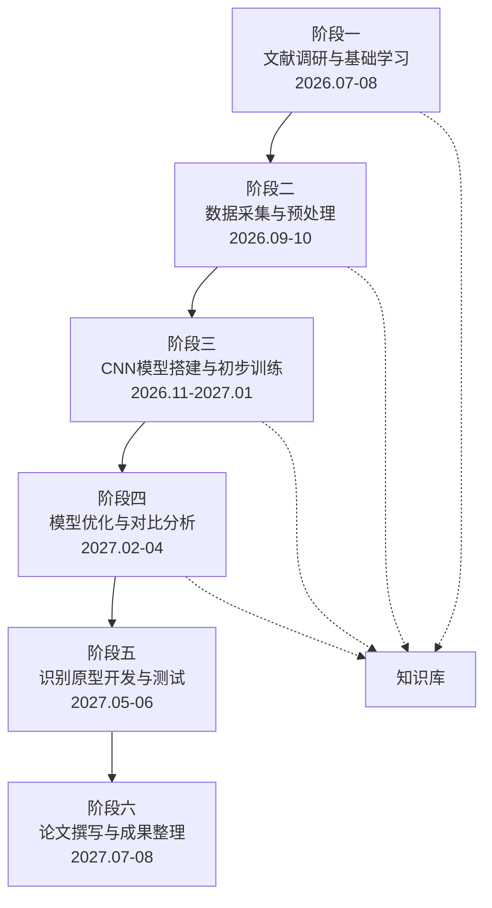

# 项目总览

> [!abstract] 课题信息
> **课题名称**：基于卷积神经网络与数学建模的校园垃圾分类图像识别研究
> **相关学科**：数学（数学建模、概率统计）+ 信息技术（Python、机器学习）
> **指导教师**：周欣
> **执行周期**：2026.07.01 ~ 2027.08.31（14 个月）
> **执行方式**：个人独立完成

## 整体流程图

## 阶段导航

| 阶段 | 时间 | 核心任务 | 笔记 |
|------|------|---------|------|
| 第一阶段 | 2026.07 ~ 2026.08 | 文献调研与基础知识学习 | [[01-文献调研与基础学习]] |
| 第二阶段 | 2026.09 ~ 2026.10 | 数据采集与预处理 | [[02-数据采集与预处理]] |
| 第三阶段 | 2026.11 ~ 2027.01 | CNN模型搭建与初步训练 | [[03-CNN模型搭建与初步训练]] |
| 第四阶段 | 2027.02 ~ 2027.04 | 模型优化与对比分析 | [[04-模型优化与对比分析]] |
| 第五阶段 | 2027.05 ~ 2027.06 | 识别原型开发与测试 | [[05-识别原型开发与测试]] |
| 第六阶段 | 2027.07 ~ 2027.08 | 论文撰写与成果整理 | [[06-论文撰写与成果整理]] |

## 知识库

系统性学习笔记，贯穿全周期：

- [[CNN核心概念]] — 卷积、池化、全连接、激活函数、BatchNorm、Dropout
- [[数学基础]] — 卷积运算、梯度下降、反向传播、交叉熵损失、矩阵运算
- [[PyTorch学习路径]] — Tensor、DataLoader、nn.Module、训练循环、模型保存
- [[传统机器学习方法]] — SVM、KNN、决策树，用于对比分析

## 资源

- [[论文清单]] — 经典论文 + arxiv 链接 + 阅读状态
- [[数据集清单]] — TrashNet + 自建校园数据集

## 追踪

- [[进度追踪]] — 各阶段任务完成度、实验记录索引、问题记录

## 模板

- [[实验记录模板]] — 每次实验的标准记录格式
- [[周报模板]] — 每周进度总结模板

## 附件

- [[课题实施方案表]] — 开题报告原文

---

> [!tip] 使用提示
> 在 Obsidian 中打开此 vault 文件夹，使用 `Ctrl/Cmd + E` 切换编辑/阅读视图。
> 使用 `Ctrl/Cmd + O` 快速搜索和跳转笔记。
> 所有 `[[双向链接]]` 可点击跳转，图谱视图可展示知识网络。